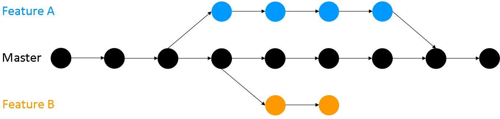

# Version Control

## General thoughts

*Thoughts here and throughout will be in italics*

*Maybe make the principle why you should use this as "Version control removes risk." It's a neat four-word takeaway. Follow up, maybe "Using version control keeps every version of your project stored and safe, so if future changes break you code irretrievably, or something is deleted that you later need it's the matter of seconds to retrieve your past versions. It also keeps your working directory neat..."*

*Should emphasise that version control is also useful when working alone, not just in collaborations*

*Talk about how to get past versions.*

*How should I combine high level explanation of what version control CAN do vs step by step of HOW to do it in git and github? Meshing it together seems like I'm trying to explain too many things at once, and git isn't the only version control software out there. However completly separating the
all the why and all the how means a person who's reading about version control can't follow easily, they'd have to scroll a lot from what is a commit to how do you make one. Hmmm.*    

*Need to mention git status, git diff, and git log somewhere. Might be worth having a summarising table with commands and what they do.*

*Should at least mention version control software other than git.*

*For [creative commons](https://tldrlegal.com/license/creative-commons-attribution-4.0-international-(cc-by-4) you can do whatever but you must give credit to the original author of the work, including a URI or hyperlink to the work, this Public license and a copyright notice.*

------

## *Structure*

- *What is version control*
  - *Should keep this high level, include the diagram, go over the very basics of branches and merging
- *Why you should use version control*
  - *First paragraph, core benefits focusing on how it helps the USER, convince people this is something they should invest time in to help thier research in the long term. Keeps versions safe and recoverable, keeps things tidy, enables collaboration
  - *How it benefits science, reproducibility etc. Maybe not that relevant here, maybe more open source's thing?*
- *How to use version control for your own project and how to use it well*
  - *Say this is split into how to do it and how to do it well. In terms of how to do it we're going to give the actual commands to do all this in git because widely used, but the info on good practise, i.e. how to do it well, is still relevant even if you're using other VC software like mercurial.
  - Set up a repo, git init. Don't talk about putting it online yet.
  - Say how to make a commit
    - Best practice for committing, e.g. keep bitesized
    - Best practise for commit messages. e.g. make them meaningful.
  - Say how to make branches
    - Best practise for branches, i.e. make changes on them, keep master clean.
  - How to merge
    - Resolving merge conflicts
- How to use version control to collaborate. Say should understand how to use it for your own project before trying to understand how to do it with other people, if reading this section need to read (or already understand) previous one.
  - Divide into if it's your project people are collaborating on, and collaborating on someone else's?


## What is version control

*Should definitely have a diagram, couldn't find one I liked so I made this one. We could replace it with a better one later*



*Should explain the concept of branches and merging here while I've got the diagram, but leave the details (e.g merge conflicts, what makes a good commit message) for later.*

From [here](https://git-scm.com/book/en/v2/Getting-Started-About-Version-Controls) **Creative Commons Attribution-NonCommercial-ShareAlike 3.0 Unported License**

What is “version control”, and why should you care? Version control is a system that records changes to a file or set of files over time so that you can recall specific versions later. It is typically applied to managing changing in code, though in reality you can do this with nearly any type of file on a computer.
People working on data science may have a large array of files (code, data, figures, notes) that they update
but want to keep every version. Version control allows you to do this and to revert files you select back to a previous state, revert the entire project back to a previous state, compare changes over time, see who last modified something that might be causing a problem, who introduced an issue and when, and more. Using a version control system also generally means that if you screw things up or lose files, you can easily recover. In addition, you get all this for very little overhead.

Many people’s version-control method of choice is to copy files into another directory, or to save copies manually e.g. my_code_.py my_code_2.py my_code_2a.py, my_code_2b.py etc. This approach is very common because it is so simple, but it is also incredibly error prone. It is easy to forget what differnt files contain, or to copy over files you don’t mean to.


## Why would you use version control?


From [here](https://guide.esciencecenter.nl/best_practices/version_control.html). **Creative Commons Attribution 4.0 International License**

- **Reproducibility** By using version control, you never lose previous versions of the software. This also gives you a log of changes and allows you to understand what happened.
- **Backup** Version control is usually pushed to an external a shared server, which immediately provides a backup.
- **Easier to collaborate** Version control makes it easier for different people to work on the same code simultaneously, while everyone still has a well defined version of the software (in contrast to a google-docs or shared file system type of system). Moreover, version control hosting websites such as Github provide way to communicate in a more structed way, such as in code reviews, about commits and about issues.
- **Integration** Version control software and host makes it more easy to integrate with other software that support modern software development, such as testing (continuous integration ,automatically run tests, build documentation, check code style, integration with bug-tracker, code review infrastructure, comment on code).

--------

From [here](http://crlionline.net/node/198). **No license but active, could reach out**

If you are not ready for this yet, you will be at some time - when you have felt the horror of loosing days if not weeks of work. But versioning is useful for less dramatic purposes as well, not only for backup. For instance, to help you understand why in the past you made certain changes, why you did a certain analysis in the way you did it. Or you simply want to undo a change in your analysis. Or because you want to keep an audit trail of your analysis. Or to share it with others.

You yourself understand what the saved file does, even weeks or months later;
Others can easier understand what you did. This is helpful should you want to share your analysis (not only your data), and/or make it auditable--more generally, reproducible, which is good scientific practice.
This has the additional benefit that you need to understand for yourself what it is you just did.

When you restore from a backup, you are going back in time: I want to restore the last version, or to yesterday's (last week's) version. When you restore from a versioning system, you go back to a decision: I want to restore my former version, or an alternative version (a different branch),  because that one turns out to be the better solution or approach. Backup is a special case of versioning.

There are numerous tools for versioning, and the best know one is git and its web-based version, Github. (They are not really strongly different, in that you can use GitHub as the remote repository for your local git repository).

-----

From [here](http://who-t.blogspot.com/2009/12/on-commit-messages.html). **Creative Commons
Attribution License (http://creativecommons.org/licenses/by/2.0)**

*Other useful stuff in this paper, could use their into as part of the book's intro*

All scientists use version control in one form or another at various stages of their research projects, from the data collection all the way to manuscript preparation. This process is often informal and haphazard, where multiple revisions of papers, code, and datasets are saved as duplicate copies with uninformative file names (e.g. draft 1.doc, draft 2.doc). As authors receive new data and feedback from peers and collaborators, maintaining those versions and merging changes can result in an unmanageable proliferation of files. One solution to these problems would be to use a formal Version Control System (VCS), which have long been used in the software industry to manage code. A key feature common to all types of VCS is that ability save versions of files during development along with informative
comments which are referred to as commit messages. Every change and accompanying notes are stored independent of the files, which obviates the need for duplicate copies. Commits serve as checkpoints where individual files or an entire project can be safely reverted to when necessary. Most traditional VCS are centralized which means that they require a connection to a central server which maintains the master copy. Users with appropriate privileges can check out copies, make changes, and upload them back to the server.

When data are analyzed programmatically using software such as R and Python, code files start out small and often become more complex over time. Somewhere along the process, inadvertent errors such as misplaced subscripts and incorrectly applied functions can lead to serious errors down the line. When such errors are discovered well into a project, comparing versions of statistical scripts can provide a way to quickly trace the source of the problem and recover from them.

Similarly, figures that are published in a paper often undergo multiple revisions before resulting in a final version that gets published. Without version control, one would have to deal with multiple copies and use imperfect information such as file creation dates to determine the sequence in which they were generated. Without additional information, figuring out why certain versions were created (e.g. in response to comments from coauthors) also becomes more difficult. When figures are managed with Git, the commit messages (e.g. “Updated figure in response to Ethan’s comments regarding use of normalized data.”) provide an unambiguous way to track various versions.

------

From [here](https://homes.cs.washington.edu/~mernst/advice/version-control.html) **No license reached out 13/12/18**

A version control system serves the following purposes, among others.

- Version control enables multiple people to simultaneously work on a single project. Each person edits his or her own copy of the files and chooses when to share those changes with the rest of the team. Thus, temporary or partial edits by one person do not interfere with another person's work.
- Version control gives access to historical versions of your project. This is insurance against computer crashes, data lossage, or code being broken in the course of future changes. If you make a mistake, you can roll back to a previous version. You can reproduce and understand a bug report on a past version of your software. You can also undo specific edits without losing all the work that was done in the meanwhile. For any part of a file, you can determine when, why, and by whom it was ever edited.

### Commits

From [here](http://who-t.blogspot.com/2009/12/on-commit-messages.html). **No License, but blog still active, reached out 11/12/18**

A commit should contain exactly one logical change. A logical change includes adding a new feature, fixing a specific bug, etc. If it's not possible to describe the high level change in a few words, it is most likely too complex for a single commit. It's almost always better to err on the side of too many commits than too few.

Don't do:

- Per-file commits. More often than not a logical change affects more than one file and it should not be split up into two commits.
- Two changes in one commit. Something like "Fixed bug 2345 and renamed all foo to bar". Unless bug 2345 required the renaming you should split these into two commits. If you or a collaborator want to come back to a commit containing multiple changes to modify it or reuse only some of the changes it contains then problems quickly arise. Picking bad commits apart into useful chunks extremely time-consuming and frustrating since it doesn't actually add any value to the project.
- Whitespace changes together with code changes. Needle in a haystack is a fun game, but not when you're looking at commits. It's a great way to introduce bugs, though because almost no-one will spot the bug hidden in hundreds of lines that got reindented for fun and profit.
- Code drops, i.e. commits with hundreds of lines of code which dump in a new feature while at the same time rewriting half the existing infrastructure to support this feature. As a result, those hundreds of lines of code need to be reviewed every time a bug is discovered that is somehow related to that area of code.
It's easier and less time consuming to first rework the infrastructure one piece at a time, then plug the new feature on top. As a side-effect, if a project relies on code dumps too often it's discouraging outside developers. Would you like to contribute to a project where the time spent filtering the signal from the noise outweighs the actual contribution to the code?

----

From [here](https://githowto.com/undoing_committed_changes). **creative commons Attribution-NonCommercial-ShareAlike 4.0 International**

To cancel the commit, we need to create a commit that deletes the changes saved by unwanted commit.

RUN:
```
git revert HEAD
```

-------

From [here](https://homes.cs.washington.edu/~mernst/advice/version-control.html) **No license, reached out 13/12/18**

#### Good practise for commits

- **Each commit should have a single purpose and should completely implement that purpose.** This makes it easier to locate the changes related to some particular feature or bug fix, to see them all in one place, to undo them, to determine the changes that are responsible for buggy behavior, etc. The utility of the version control history is compromised if one commit contains code that serves multiple purposes, or if code for a particular purpose is spread across multiple different commits.
- **Avoid indiscriminate commits** As a rule, do not commit without supplying specific files to commit. If you supply no file names, then every change will be committed. You may have changes you did not intend to make permanent (such as temporary debugging changes).
- **Don't commit generated files** Version control is intended for files that people edit. Generated files should not be committed to version control, as a rule, you should only commit the source files from which the files are generated.
Generated files are not necessary in version control; each user can re-generate them from the source files.
Further, generated files are prone to conflicts. They may contain a timestamp or in some other way depend on the system configuration. It is a waste of human time to resolve such uninteresting conflicts.
Generated files can bloat the version control history (the size of the database that is stored in the repository). A small change to a source file may result in a rather different generated file. Eventually, this affects performance of the version control system.


### Commit messages

From [here](https://guide.esciencecenter.nl/best_practices/version_control.html). **Creative Commons Attribution 4.0 International License**

Commit messages are the way for other developers to understand changes in the codebase. In case of using GitHub flow model, commit messages can be very short but pull request comments should explain all the changes. It is very important to explain the why behind implementation choices.

-----

From [here](http://who-t.blogspot.com/2009/12/on-commit-messages.html). **No License, but blog still active, could reach out**

Any software project is a collaborative project. It has at least two developers, the original developer and the original developer a few weeks or months later when the train of thought has long left the station. This later self needs to re-establish the context of a particular piece of code each time a new bug occurs or a new feature needs to be implemented. Re-establishing the context of a piece of code is wasteful. We can't avoid it completely, so our efforts should go to reducing it to as small as possible.

A good commit message should answer three questions about a patch:

- **Why is it necessary?** It may fix a bug, it may add a feature, it may improve performance, reliability, stability, or just be a change for the sake of correctness.
- **How does it address the issue?** For short obvious patches this part can be omitted, but it should be a high level description of what the approach was.
- **What effects does the patch have?** (In addition to the obvious ones, this may include benchmarks, side effects, etc.)

These three questions establish the context for the actual code changes, put reviewers and others into the frame of mind to look at the diff and check if the approach chosen was correct. A good commit message also helps maintainers to decide if a given patch is suitable for stable branches or inclusion in a distribution.

A patch without these questions answered is mostly useless. The burden for such a patch is on each and every reviewer to find out what the patch does and how it fixes a given issue. Given a large number of reviewers and a sufficiently complex patch, this means many man-hours get wasted just because the original developer did not write a good commit message. Worse, if the maintainers of the project enforce SCM discipline, they will reject the patch and the developer needs to spend time again to rewrite the patch, reviewers spend time reviewing it again, etc. The time wasted quickly multiplies and given that a commit message only takes a few minutes to write, it is simply not economically viable to omit them or do them badly.

Don't describe the code, describe the intent and the approach. And keep the log in a present tense.


-----
By [Thom Holwerda](http://www.osnews.com/story/19266/WTFs_m). **Says anyone can do whatever, attribution nice but not compulsory**

*Maybe include this somewhere else but have it somewhere*


## Branches

*Think we should go over deleting branches before we go over merging. Deleting's quicker and easier to explain.*

From [here](https://opensource.com/article/18/5/git-branching) **Creative Commons license**
The main reasons for having branches are:

- If you are creating a new feature for your project, there's a reasonable chance that adding it could break your working code. This would be very bad for active users of your project, even if the only active user is you. It's better to start with a prototype, which you would want to design roughly in a different branch and see how it works, before you decide whether to add the feature to the master branch.
- Another, probably more important, reason is version control systems are regularly used for collaboration. If everyone starts programming on top of the master branch, it will cause a lot of confusion. Some people may write faulty/buggy code or simply the kind of code/feature others may not want in the project. Using branches allows you to contributions to be verified and reviewed before being added to the main project.

-------

From [here](https://github.com/Kunena/Kunena-Forum/wiki/Create-a-new-branch-with-git-and-manage-branches) **GNU GENERAL PUBLIC LICENSE Version 3**

Create the branch on your local machine and switch in this branch :
```
$ git checkout -b [name_of_your_new_branch]
```

Change working branch :
```
$ git checkout [name_of_your_new_branch]
```

Push the branch on github :
```
$ git push origin [name_of_your_new_branch]
```

You can see all branches created by using :
```
$ git branch
```

Add a new remote for your branch :
```
$ git remote add [name_of_your_remote] [name_of_your_new_branch]
```

Push changes from your commit into your branch :
```
$ git push [name_of_your_new_remote] [url]
```

Update your branch when the original branch from official repository has been updated :
```
$ git fetch [name_of_your_remote]
```

Delete a branch on your local filesystem :
```
$ git branch -d [name_of_your_new_branch]
```

To force the deletion of local branch on your filesystem :
```
$ git branch -D [name_of_your_new_branch]
```

Delete the branch on github :
```
$ git push origin :[name_of_your_new_branch]
```

-------


## Merging

From [here](https://githowto.com/merging). **creative commons Attribution-NonCommercial-ShareAlike 4.0 International**

Merging brings changes from two branches into one. Let us go back to the style branch and merge it with master.

RUN:
```
git checkout style
git merge master
git hist --all
```

RESULT:
```
$ git checkout style
Switched to branch 'style'
$ git merge master
Merge made by recursive.
 README |    1 +
 1 files changed, 1 insertions(+), 0 deletions(-)
 create mode 100644 README
$ git hist --all
*   5813a3f 2011-03-09 | Merge branch 'master' into style (HEAD, style) [Alexander Shvets]
|\  
| * 6c0f848 2011-03-09 | Added README (master) [Alexander Shvets]
* | 07a2a46 2011-03-09 | Updated index.html [Alexander Shvets]
* | 649d26c 2011-03-09 | Hello uses style.css [Alexander Shvets]
* | 1f3cbd2 2011-03-09 | Added css stylesheet [Alexander Shvets]
|/  
* 8029c07 2011-03-09 | Added index.html. [Alexander Shvets]
* 567948a 2011-03-09 | Moved hello.html to lib [Alexander Shvets]
* 6a78635 2011-03-09 | Add an author/email comment [Alexander Shvets]
* fa3c141 2011-03-09 | Added HTML header (v1) [Alexander Shvets]
* 8c32287 2011-03-09 | Added standard HTML page tags (v1-beta) [Alexander Shvets]
* 43628f7 2011-03-09 | Added h1 tag [Alexander Shvets]
* 911e8c9 2011-03-09 | First Commit [Alexander Shvets]
```

------

From [here](https://homes.cs.washington.edu/~mernst/advice/version-control.html) **No license, reached out 13/12/18**

Incorporate others' changes frequently
Work with the most up-to-date version of the files as possible.

When two people make conflicting edits simultaneously, then manual intervention is required to resolve the conflict. But if someone else has already completed a change before you even start to edit, it is a huge waste of time to create, then manually resolve, conflicts. You would have avoided the conflicts if your working copy had already contained the other person's changes before you started to edit.

Share your changes frequently
Once you have committed the changes for a complete, logical unit of work, you should share those changes with your colleagues as soon as possible. So long as your changes do not destabilize the system, do not hold the changes locally while you make unrelated changes. The reason is the same as the reason for incorporating others' changes frequently.

Coordinate with your co-workers to avoid conflicts as best as you can.


### Merge conflicts

From [here](https://homes.cs.washington.edu/~mernst/advice/version-control.html) **No license, reached out 13/12/18**

A version control system lets multiple users simultaneously edit their own copies of a project. Usually, the version control system is able to merge simultaneous changes by two different users: for each line, the final version is the original version if neither user edited it, or is the edited version if one of the users edited it. A conflict occurs when two different users make simultaneous, different changes to the same line of a file. In this case, the version control system cannot automatically decide which of the two edits to use (or a combination of them, or neither!). Manual intervention is required to resolve the conflict.

"Simultaneous" changes do not necessarily happen at the exact same moment of time. Change 1 and Change 2 are considered simultaneous if:

- User A makes Change 1 before User A does an update that brings Change 2 into User A's working copy, and
- User B makes Change 2 before User B does an update that brings Change 1 into User B's working copy.


------

From [here](https://githowto.com/resolving_conflicts). **creative commons Attribution-NonCommercial-ShareAlike 4.0 International**

RUN:

```
git checkout style
git merge master
```

RESULT:
```
$ git checkout style
Switched to branch 'style'
$ git merge master
Auto-merging lib/hello.html
CONFLICT (content): Merge conflict in lib/hello.html
Automatic merge failed; fix conflicts and then commit the result.
```
If you open the lib/hello.html you will see:

FILE: LIB/HELLO.HTML
```
<!-- Author: Alexander Shvets (alex@githowto.com) -->
<html>
  <head>
<<<<<<< HEAD
    <link type="text/css" rel="stylesheet" media="all" href="style.css" />
=======
    <!-- no style -->
>>>>>>> master
  </head>
  <body>
    <h1>Hello,World! Life is great!</h1>
  </body>
</html>
```
The first section is the version of the current branch (style) head. The second section is the version of master branch.

02 Resolution of the conflict

You need to resolve the conflict manually. Make changes to lib/hello.html to achieve the following result.

FILE: LIB/HELLO.HTML
```
<!-- Author: Alexander Shvets (alex@githowto.com) -->
<html>
  <head>
    <link type="text/css" rel="stylesheet" media="all" href="style.css" />
  </head>
  <body>
    <h1>Hello, World! Life is great!</h1>
  </body>
</html>
```
03 Make a commit of conflict resolution

RUN:
```
git add lib/hello.html
git commit -m "Merged master fixed conflict."
```

RESULT:
```
$ git add lib/hello.html
$ git commit -m "Merged master fixed conflict."
Recorded resolution for 'lib/hello.html'.
[style 645c4e6] Merged master fixed conflict.
```

------

From [here](http://genomewiki.ucsc.edu/index.php/Resolving_merge_conflicts_in_Git) **["You are granted a limited license to copy anything from this site"](http://genomewiki.ucsc.edu/index.php/Genomewiki:General_disclaimer)**

#### Two ways git merge/git pull can fail
There are 2 ways in which git merge (or a git pull, which is a git fetch and then a git merge) can fail:

1.  Git can fail to start the merge
This occurs because git knows there are changes in either your working directory or staging area that could be written over by the files that you are merging in. If this happens, there are no merge conflicts in individual files. You need to modify or stash the files it lists and then try to do a git pull again. The error messages are as follows:

```
error: Entry '<fileName>' not uptodate. Cannot merge. (Changes in working directory)
```
or
```
error: Entry '<fileName>' would be overwritten by merge. Cannot merge. (Changes in staging area)
```

2. Git can fail during the merge
This occurs because you have committed changes that are in conflict with someone else's committed changes. Git will do its best to merge the files and will leave things for you to resolve manually in the files it lists. The error message is as follows:

```
CONFLICT (content): Merge conflict in <fileName>
Automatic merge failed; fix conflicts and then commit the result.
```

#### Common questions for when git fails during the merge

How do I know which files have conflicts in them?
If your merge failed to even start, there will be no conflicts in files. If git finds conflicts during the merge, it will list all files that have conflicts after the error message. You can also check on which files have merge conflicts by doing a 'git status'.

Example:

```
   Changes to be committed:
     (use "git reset HEAD <file>..." to unstage)

  	modified:   <Some file>

   Changed but not updated:
     (use "git add <file>..." to update what will be committed)
     (use "git checkout -- <file>..." to discard changes in working directory)

  	unmerged:   <file>

```
"Changes to be committed": All committed changes to files that are not affected by the conflict are staged.

"Changed but not updated ... unmerged": All files that have conflicts that must be resolved before repository will be back to working order.

How do I find conflicts within the file itself?
Conflicts are marked in a file with clear line breaks:

```
 <<<<<<< HEAD:mergetest
 This is my third line
 =======
 This is a fourth line I am adding
 >>>>>>> 4e2b407f501b68f8588aa645acafffa0224b9b78:mergetest
```
```<<<<<<<```: Indicates the start of the lines that had a merge conflict. The first set of lines are the lines from the file that you were trying to merge the changes into.

```=======```: Indicates the break point used for comparison. Breaks up changes that user has committed (above) to changes coming from merge (below) to visually see the differences.

```>>>>>>>```: Indicates the end of the lines that had a merge conflict.

How do I resolve a merge conflict in a file?
You resolve a conflict by editing the file to manually merge the parts of the file that git had trouble merging. This may mean discarding either your changes or someone else's or doing a mix of the two. You will also need to delete the '<<<<<<<', '=======', and '>>>>>>>' in the file.

What do I do after I've resolved conflicts in all affected files?
git add the file(s), git commit and git push (Push only for branches tracked.)

(Note added by Chin - need to commit everything, not just the resolved conflict file.)

#### Tools to help you resolve both types of merge conflicts
The following git tools below can help you resolve both simple and more complicated git merges.

General tools
```
git diff
```

git diff: a command that helps find differences between states of a repository/files. Useful in predicting and preventing merge conflicts.

git diff origin/master <fileName>: Find the differences between the current index (HEAD) of fileName and what is in the central repository (origin/msater)

```
diff --git a/mergetest b/mergetest
index 9be56b9..0aeffac 100644
--- a/mergetest
+++ b/mergetest
@@ -1,3 +1,4 @@
 hello
+I am also editing this line
 This is a test
-This is my third line
+This is a fourth line I am adding
```
Changes coming from origin/master are marked with +, while changes that are in your local repository (HEAD) are marked with -. This syntax does not notify which lines are added are deleted but just which lines originate in which state of the file.

git diff FETCH_HEAD <fileName>: Will provide the same output as above except is limited to the index of the last fetch that the user did. This may not be latest revision in the central repository.

```
git status
```
git status: a command provides an overview of all files that have been modified and are in conflict at the time of the merge.

Example:
```
    Changes to be committed:
      (use "git reset HEAD <file>..." to unstage)

   	modified:   <Some file>

    Changed but not updated:
      (use "git add <file>..." to update what will be committed)
      (use "git checkout -- <file>..." to discard changes in working directory)

   	unmerged:   <file>

```
"Changes to be committed": All changes to files that are not affected by the conflict are staged.
"Changed but not updated ... unmerged": All files that have conflicts that must be resolved before repository will be back to working order.
Tools specifically for when git refuses to start merge

```
git stash
```
IMPORTANT: Do not use git stash if git went through with the merge and there were merge conflicts! Only use git stash if git refused to merge because it foresees there being conflicts.

git stash: stashes away any changes in your staging area and working directory. This command is useful in saving all changes not ready to be committed and the user wants to have an updated repository.

git stash save "<Save Message>": Save changes to files in working directory and staging area that git is aware of

```
 git stash save "Saved changes for stash example"
 Saved working directory and index state "On master: Saved changes for stash example"
 HEAD is now at 4e2b407 Added second file for example.
```
git stash pop: Removes the most recent stash or any stash specified and applies changes as a merge. If merge fails the stash is not removed from the list and must be removed manually.

```
git checkout
```
git checkout <fileName>: Can be used to trash changes in the working directory so as to allow a git pull.

```
git reset --mixed
```
git reset --mixed: Can be used to unstage files so as to allow a git pull.

#### Tools specifically for when git conflicts arise during a merge
```
git reset
```
git reset --hard: reset repository in order to back out of merge conflict situation. git reset, particularly with the --hard option can be used to back out of merge conflict (click here for more information).

IMPORTANT: Do not use any other options other than --hard for reset when resolving a situation where git failed during the merge, as they will leave conflict line markers in file and you can end up committing files with conflict markers still present.

#### Scenarios

Git refuses to start a merge/pull

Error Messages:

```
error: Entry '<fileName>' not uptodate. Cannot merge. (Changes in working directory)
error: Entry '<fileName>' would be overwritten by merge. Cannot merge. (Changes staged, but not commited)
```
Steps toward Resolution:

- git stash save "<Message that describes what is being Saved>" (Stashes away any changes in your staging area and working directory in a separate index.) OR git checkout <file> (throws out your changes so that you can do a merge)
- git status (Verify all changes are staged)
- git pull or git merge (Bring in changes from central repository or another branch)
- Only if did a 'git stash' in step 1: git stash pop (Will repopulate your changes into your working directory, may have to resolve merge conflicts)

#### Git is unable to resolve a merge/pull

Error Message:

```
CONFLICT (content): Merge conflict in <fileName>
Automatic merge failed; fix conflicts and then commit the result.
```

Steps toward Resolution:

- git status (Shows all files that are in conflict as unmerged changed in working directory.)
- Resolve merge conflicts
- git add <files>
- git commit -m "<Informative commit message>"

#### A GitHub test repository to experiment with conflicts
You can experiment with resolving a git conflict with this repository: https://github.com/brianleetest/testGit/blob/master/README.md

You will need a GitHub account and be added as a collaborator to push your changes.
Create two separate directories, gitClone and gitCloneLeader in two different terminals and locations. The leader can be the first to push changes (requires being a collaborator).
Do the first "Group Member" steps up until WAIT in the gitClone directory.
Then do all of the "Group Leader" steps in the gitCloneLeader directory (push required to cause conflict).
Continue the "Group Member" steps (first git pull since cloning the repository and editing the file).

## Forks

## Git

*I think this section should go over the command line nitty-gritty. The explanation of what branches are etc should all be done before that because that's common to all VC, this section is git specific, and command line specific*

*There's a how too [here](https://tonysyu.github.io/source-control-for-scientists-and-soloists.html#.XA6Q3mj7RPY). Basic but something to build on.* **No License, but github still active, could reach out**

*Very detailed how to [here](https://git-scm.com/book/en/v2/Git-Basics-Getting-a-Git-Repository#ch02-git-basics-chapter).* **Creative Commons Attribution-NonCommercial-ShareAlike 3.0 Unported License.**

*Very lightweight guide [here](http://rogerdudler.github.io/git-guide/)* **No license, no activity on github past year**


## Github

*I think this section should go over how to do this in the browser/gui nitty-gritty. Again, the explanation of what branches are etc should all be done before.*

*Detailed guide of how to use github [here](https://product.hubspot.com/blog/git-and-github-tutorial-for-beginners)* **No visible license could try reaching out**
