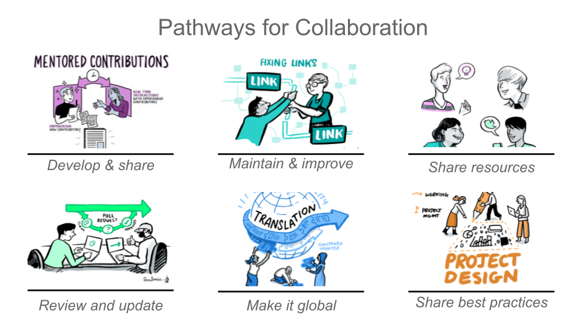

# _The Turing Way_

>_此 README.md 文件还提供荷兰语 (README-Dutch)、法语 (README-French.md)、德语 (README-German.md)、印度尼西亚语 (README-Indonesian)、意大利语 (README-Italian)、韩语 (README-Korean)、葡萄牙语 (README-Portuguese) 和西班牙语 (README-Spanish)（按字母顺序列出）。_

*总共贡献者:*

<!-- ALL-CONTRIBUTORS-BADGE:START - Do not remove or modify this section -->

<!-- ALL-CONTRIBUTORS-BADGE:END -->

| 资料 | 链接 |
| :--- | :--- |
| **项目** |  [![](https://img.shields.io/static/v1?label=TuringWay&message=I%20want%20to%20contribute!&color=yellow&logo=data%3Aimage%2Fpng%3Bbase64%2CiVBORw0KGgoAAAANSUhEUgAAABAAAAAQCAYAAAAf8%2F9hAAACYklEQVQ4jXXTy09TQRTH8f5VPhI1xoVxYURNAFcmRleaGDdGXQlKAYkLUARNfICoScGKpTyE3t5bkKD2AUQepUXB0gcgLTalD9rema8LKRVrT3I2k%2Fl95kwyY6BMfQiFqHaoVDlUBoJBZJl9hn8XRsIhqh0abd55tnWdrBA8WfBSpakMhUqhXUCJhKl2aLR65%2FEtLeGc%2BYoy5aHf46bX7cThctK%2BAw2HQkVAW41wzqHRMjNNRteR%2BQzGjg5udZtQ47FiO50gdLZ1nVbvPNUOFSUSxnB4sJ%2F0TjCTTjHk%2BoJl%2BRtqPEaL6zMH79Rw0dyDVVURqRgyn0EkN8jkshwZGsBQodgQyQ2kyDPsce859drjdqLRKE0D%2FZhHR5F6DpHc2B3%2FjF3BcFqxARIpBXXmt9ii67vAYDhIr8fNx0UfE3OzzC0sIHIpxNYqSPEHqFBsiFQMkU3h8vs5%2FvABTeNje6BCj%2FxcwzLlIZHYROq5v4EoIr2JyCbJ57Kobjd3u7o41v4I68pyCfTGrhSvUKHYAJD5bcTWGjKbJJdO4A8E6JyexP4rWgK8Vkb2AjK7hcxnmZybxfF9kff%2BhZJQofvXwhg7O4vAfU2l79ME79xOrjY3c9ZYVzZs8nvZf6%2BRQCRCTgiODg1iCK6vc6WtjZM1tzlRW8sNa99%2Fx64fH%2BNAQz0un49nfh%2BVmspAcKX4lKWUbMbjXOg2cf3Vy%2BLIoRWqekxc7nhB6%2FQ0lZqKJRBAyjKfKZFIcKixgVPPn3LTamFfUyPne7qp1Oz0Bn4g5d7vVAIUamJ2FqPZzCW7gvlHabBQvwE2XnlAiFRrOwAAAABJRU5ErkJggg%3D%3D)](https://github.com/alan-turing-institute/the-turing-way/blob/main/CONTRIBUTING.md) |
| **新闻** |      |
| **聊天** |    |
| **构建** |     |
| **引用** |   |

*欢迎来到The Turing Way项目 GitHub 存储库。 这里是开发、审查和维护项目所有组件的地方。*

_The Turing Way_ 是一本关于可重复的、合乎道德的和协作的数据科学的手册。我们参与并支持由不同贡献者组成的社区，使数据科学对每个人都是可访问的、可理解的和有效的。 我们的目标是提供学术界、工业界和公共部门的研究人员和数据科学家在项目开始时所需的所有信息，以确保项目结束后易于复制。

.

*The Turing Way是一本书、一个社区和一个全球合作。*

我们鼓励所有的利益相关者，包括学生、研究人员、软件工程师、项目负责人和融资团队，使用The Turing Way来了解他们在数据科学中的角色和可重复性责任。
您可以线上阅读这本书 [在线版本](https://the-turing-way.netlify.app), 按照我们的贡献指南所述为项目做出贡献 [贡献指南](https://github.com/alan-turing-institute/the-turing-way/blob/main/CONTRIBUTING.md) and 并重新使用所有材料 ([（见许可证）](https://github.com/alan-turing-institute/the-turing-way/blob/main/LICENSE.md)).

*The Turing Way 线上书籍的截图 ([use this image in a presentation](https://drive.google.com/file/d/1wJR664YECSc8b_RSHeyVjDlHs-Ls9lkc/view?usp=sharing))*

始于2019年，_The Turing Way_是一本固执己见的数据科学指南，后来扩展为一系列关于可重复研究、项目设计、沟通、协作和伦理研究的指南。每个指南都提供了关于一系列主题的章节，涵盖了最佳实践、指导和建议。这些章节是由来自不同的背景、生活经历和领域知识的学生、研究人员、教育工作者、社区领袖、政策制定者和专业人士共同撰写的。

***我们的服务器目标是使可重复性变得“太简单到不能不做”***

**目录:**

- [关于项目](#about-the-project)
- [团队](#the-team)
- [贡献](#contributing)
- [引用  _The Turing Way_](#citing-the-turing-way)
- [联系我们](#get-in-touch)
- [贡献者](#contributors)

🎧 如果您喜欢用音频来介绍该项目的话，我们的团队成员Rachael在波尔图[开放科学博览会2019](https://www.opensciencefair.eu/)上做了演示，她的演示由[Orion播客](https://orionopenscience.podbean.com/e/the-fair-is-in-town-figshare-the-turing-way-and-open-science-quest-at-the-osfair2019/)进行录制.
_The Turing Way_ 的概述从第5:13分钟开始。

### 关于项目

可重复性研究对于确保科学工作的可信性是必要的。 资助者和出版商开始要求出版物包含访问基础数据和分析代码的权限。其目的是确保所有的结果都能被独立验证，并在未来的工作中得到巩固。说起来容易做起来难。共享这些研究成果意味着理解数据管理、图书馆学、软件开发和持续集成技术：这些技能并没有被广泛教授，也不是学术研究人员和数据科学家所期望的。 由于这些活动通常不被教授，我们认识到，需求的负担以及新技能的获取可能会吓到刚接触这些的人。
_The Turing Way_ 是一本手册，帮助学生、他们的导师、融资者以及期刊编辑确保可再生数据科学“太简单到不能不做”，即使对从未以这种方式工作过的人来说也是如此。 它将包括关于版本控制、分析测试以及与未来用户进行公开透明沟通的培训材料，并以Turing研究所的案例研究和研讨会为基础。这个项目是公开开发的，欢迎在我们的GitHub存储库中提出任何问题、评论和建议： <https://github.com/alan-turing-institute/the-turing-way>.

### 团队

_The Turing Way_ 是一个开放式协作和社区主导的项目。
每个为本书做出贡献的人，无论贡献大小，在这个项目中都被视为贡献者和社区成员。项目的长期贡献者被认为是核心贡献者群体的一部分，他们在项目中承担着各种领导角色。

该项目由联合首席调查员 **Kirstie Whitaker** (创始人) 和 **Malvika Sharan**进行协调, 并由[The Alan Turing Institute](https://www.turing.ac.uk/).进行主持。
**Anne Lee Steele**自2022年3月起担任The Turing Way的社区经理

你可以阅读 [_The Turing Way_ 的致谢过程](https://the-turing-way.netlify.app/community-handbook/acknowledgement/acknowledgement-members.html#community-members-contributors-and-co-authors) 和 [贡献记录](https://the-turing-way.netlify.app/afterword/contributors-record.html) 来了解我们如何认可您的工作以及如何在项目中突出我们的贡献者。
请参阅 [贡献者表](#contributors) 来了解我们所有贡献者的GitHub简介。

### 贡献

:construction: 这个资源库一直在开发中，我们鼓励**每个人**帮助我们建立对许多人有用的东西。 :construction:

每个加入项目的人都应该遵守我们的 [行为准则](CODE_OF_CONDUCT.md) ，并查看我们的 [贡献指南](CONTRIBUTING.md) ，了解更多关于如何开始的信息。
我们希望能够满足我们的贡献者的需求。
因此，我们根据你的兴趣、有效性或技能要求，为你的贡献提供多个切入点。

*贡献包括开发和分享新的章节；维护和改进现有的章节；分享 _The Turing Way_ 资源；审查和更新以前开发的材料；翻译其章节，以帮助该项目在全球范围内使用，并分享研究的最佳实践。*

社区成员有机会学习新技能，分享他们的想法和与他人合作。 当他们为 _The Turing Way_ 或其他开源项目做出贡献时，他们也会在项目中获得指导机会，并被鼓励指导项目的新参与者。

我们创建了一个[推广包](https://github.com/alan-turing-institute/the-turing-way/tree/main/communications/promotion-pack)帮助您在您的网络中介绍和分享 _The Turing Way_ 。

### Citing _The Turing Way_

我们通过项目的Zenodo归档使用DOI：[10.5281/zenodo.3233853](https://doi.org/10.5281/zenodo.3233853)发布了 _The Turing Way_ 的最新版本。这个DOI是一个"[概念DOI](https://help.zenodo.org)"，意味着它将永远解析到最新版本。
如果你需要引用一个特定的版本，你可以在上面的Zenodo页面上找到这些DOI。
DOI允许我们对资源库进行归档，它们对于确保学术出版物对研究进行追踪。

引用应该是这样看:
> The Turing Way Community. (2021, November 10). The Turing Way: A handbook for reproducible, ethical and collaborative research. Zenodo. [http://doi.org/10.5281/zenodo.3233853](http://doi.org/10.5281/zenodo.3233853)

要查看我们为不同版本发布的工作流，并提出改进建议，请前往 [发布工作流文档。](./release-workflow.md).

您可以将人们可读取的链接 共享到书中的某个页面，例如 <https://the-turing-way.netlify.app/reproducible-research/overview/overview-definitions.html>，但请注意该项目正在开发中，因此这些链接可能会不断更新。
您可能需要包含一个网络存档链接，例如 <https://web.archive.org/web/20191030093753/https://the-turing-way.netlify.com/reproducibility/03/definitions.html> 以确保不是失效链接！

我们非常感谢您在您的工作中对The Turing Way项目所做的任何参考，我们希望它是有用的。 如果您有任何问题，请[联系我们](#get-in-touch).

### 引用 _The Turing Way_ 插图

_The Turing Way_ 插图由[Scriberia](https://www.scriberia.co.uk/)的艺术家进行创作，作为[_The Turing Way_ book dashes](https://github.com/alan-turing-institute/the-turing-way/tree/main/workshops/book-dash)书冲入市场的一部分，分别于 2019 年 5 月 17 日在曼彻斯特、2019 年 5 月 28 日和 2020 年 2 月 21 日在伦敦以及 2020 年 11 月 27 日和 2021 年 5 月 28 日在网上发布。它们描绘了各种 手册中的内容、社区中的协同努力以及 _The Turing Way_ 项目的总体情况。 在 CC-BY 许可下，可在 Zenodo ([https://doi.org/10.5281/zenodo.3332807)](https://doi.org/10.5281/zenodo.3332807)上获得这些插图。

当使用任何照片时，请包括以下属性：

> 本图片由Scriberia为The Turing Way创作，在CC-BY许可下使用

Zenodo的最新版本可以引用如下：

> The Turing Way Community, & Scriberia. (2021, May 29). Illustrations from the Turing Way book dashes. Zenodo. https://doi.org/10.5281/zenodo.4906004

我们在这个GitHub资源库中的[欢迎机器人](https://github.com/apps/welcome)对新成员投稿的回复中使用了一些这样的插图。

### 联系我们

#### 邮箱
你可以通过给[theturingway@gmail.com](mailto:theturingway@gmail.com)发送电邮与*The Turing Way* 团队取得联系。

你也可以联系**Anne Lee Steele** ([asteele@turing.ac.uk](mailto:asteele@turing.ac.uk)), **Malvika Sharan** ([msharan@turing.ac.uk](mailto:msharan@turing.ac.uk))或者 **Kirstie Whitaker** ([kwhitaker@turing.ac.uk](mailto:kwhitaker@turing.ac.uk)).

#### 聊天

使用这个[邀请链接](https://join.slack.com/t/theturingway/shared_invite/zt-fn608gvb-h_ZSpoA29cCdUwR~TIqpBw)与他人练习并在Slack上讨论你的想法。

我们也有一个Gitter聊天室（如果你更喜欢开放源替代的聊天方案）。
我们很乐意你在<https://gitter.im/alan-turing-institute/the-turing-way>上打个招呼方式。

这聊天室也可以通过[#alan-turing-institute_the-turing-way:gitter.im](https://matrix.to/#/#alan-turing-institute_the-turing-way:gitter.im)的[Matrix](https://matrix.org)帐户加入。

#### 接收更新消息

我们有一个*tinyletter*列表，每月会发送项目更新。

订阅地址：<https://tinyletter.com/TuringWay>.

你也可以在Twitter上关注我们([@turingway](https://twitter.com/turingway)).

## 贡献者

感谢这些了不起的人 ([emoji key](https://allcontributors.org/docs/en/emoji-key)):

[贡献者](https://github.com/alan-turing-institute/the-turing-way#contributors)

这个项目使用[all-contributors](https://github.com/all-contributors/all-contributors)的规格.
欢迎所有的贡献！
