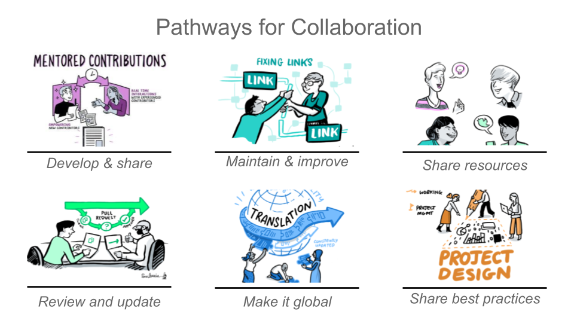

# _The Turing Way_

>_E archivo README-Papiamento.md aki tambe ta disponibel na Aleman ([README-German.md](README-German.md)), Koreano ([README-Korean](README-Korean.md)), Frances ([README-French.md](README-French.md)), Indones ([README-Indonesian](README-Indonesian.md)), Ingles ([README](../README.md)), Italiano ([README-Italian](README-Italian.md)), Hulandes ([README-Dutch](README-Dutch.md)), Spaño ([README-Spanish](README-Spanish.md)) y Portugues ([README-Portuguese](README-Portuguese.md)) (ordena alfabeticamente)._

*Colaboradornan total:*

| Informacion | Enlace |
| :--- | :--- |
| **Proyecto** |  [![](https://img.shields.io/static/v1?label=TuringWay&message=I%20want%20to%20contribute!&color=yellow&logo=data%3Aimage%2Fpng%3Bbase64%2CiVBORw0KGgoAAAANSUhEUgAAABAAAAAQCAYAAAAf8%2F9hAAACYklEQVQ4jXXTy09TQRTH8f5VPhI1xoVxYURNAFcmRleaGDdGXQlKAYkLUARNfICoScGKpTyE3t5bkKD2AUQepUXB0gcgLTalD9rema8LKRVrT3I2k%2Fl95kwyY6BMfQiFqHaoVDlUBoJBZJl9hn8XRsIhqh0abd55tnWdrBA8WfBSpakMhUqhXUCJhKl2aLR65%2FEtLeGc%2BYoy5aHf46bX7cThctK%2BAw2HQkVAW41wzqHRMjNNRteR%2BQzGjg5udZtQ47FiO50gdLZ1nVbvPNUOFSUSxnB4sJ%2F0TjCTTjHk%2BoJl%2BRtqPEaL6zMH79Rw0dyDVVURqRgyn0EkN8jkshwZGsBQodgQyQ2kyDPsce859drjdqLRKE0D%2FZhHR5F6DpHc2B3%2FjF3BcFqxARIpBXXmt9ii67vAYDhIr8fNx0UfE3OzzC0sIHIpxNYqSPEHqFBsiFQMkU3h8vs5%2FvABTeNje6BCj%2FxcwzLlIZHYROq5v4EoIr2JyCbJ57Kobjd3u7o41v4I68pyCfTGrhSvUKHYAJD5bcTWGjKbJJdO4A8E6JyexP4rWgK8Vkb2AjK7hcxnmZybxfF9kff%2BhZJQofvXwhg7O4vAfU2l79ME79xOrjY3c9ZYVzZs8nvZf6%2BRQCRCTgiODg1iCK6vc6WtjZM1tzlRW8sNa99%2Fx64fH%2BNAQz0un49nfh%2BVmspAcKX4lKWUbMbjXOg2cf3Vy%2BLIoRWqekxc7nhB6%2FQ0lZqKJRBAyjKfKZFIcKixgVPPn3LTamFfUyPne7qp1Oz0Bn4g5d7vVAIUamJ2FqPZzCW7gvlHabBQvwE2XnlAiFRrOwAAAABJRU5ErkJggg%3D%3D)](https://github.com/the-turing-way/the-turing-way/blob/main/CONTRIBUTING.md) |
| **Noticia** |      |
| **Chat** |    |
| **Construi** |     |
| **Site** |   |

*Bonbini na e repositorio di GitHub di e proyecto The Turing Way. 
Aki ta tur componente di e proyecto ta wordo desaroya, revisa y mantene.*

_The Turing Way_ ta un guia practico pa data science reproducibel, etico y colaborativo.
Nos ta support un comunidad diverso di colaboradornan pa logra un data science accesibel, comprensibel y efectivo pa tur hende.
Nos meta ta pa provee tur informacion cu investigador y data scientist den academia, industria y sector publico mester na cuminsamento di nan proyectonan pa asegura cu nan ta facil cu esey pa reproduci na final.

.

*The Turing Way ta un buki, un comunidad y un colaboracion global.*

Tur partido interesa, incluyendo studiante, investigador, ingeniero di software, y lider di proyecto, ta invita pa uza The Turing Way pa compronde nan rol y nan responsabilidad den reproducibilidad di data science.
Bo por lesa e buki [online](https://github.com/the-turing-way/the-turing-way), contribui na e proyecto manera ta splica den nos [guia pa contribui na e proyecto](https://github.com/the-turing-way/the-turing-way/blob/main/CONTRIBUTING.md) y re-utilisa tur material ([mira e Licencia](https://github.com/the-turing-way/the-turing-way/blob/main/LICENSE.md)).

*Screenshot di e buki online di The Turing Way ([uza e imagen aki den un presentacion](https://drive.google.com/file/d/1wJR664YECSc8b_RSHeyVjDlHs-Ls9lkc/view?usp=sharing))*

The Turing Way a cuminsa na 2019 como un guia chikito di data science, y for di esaki a expande bira a un manual hopi mas completo forma di varios guia cu ta cubri varios tema: Investigacion Reproducibel, Diseño di Proyecto, Comunicacion, Colaboracion y Investigacion Etico.
Cada guia ta ofrece capitulo riba un variedad di tema cu ta trata bon practica y recomendacion.
E capitulonan aki a wordo co-skirbi pa personanan pa colaborador, studiante, investigador, docente, lider comunitario, politico y profesional di diferente background, experencia biba y conocemento di materia.

***Nos meta ta pa haci reproducibilidad "demasiado facil pa no hacie".***

**Tabla di contenido:**

- [Tocante e proyecto](#tocante-e-proyecto)
- [E ekipo](#e-ekipo)
- [Contribui](#contribui)
- [Site _The Turing Way_](#site-the-turing-way)
- [Tuma contacto cu nos](#tuma-contacto-cu-nos)
- [Colaboradornan](#Colaboradornan)

🎧 Si bo ta prefera un introduccion di audio di e proyecto (na Ingles) Rachael, un colaborador di e proyecto a presenta na [Open Science Fair 2019](https://www.opensciencefair.eu/) na Porto y su presentacion a wordo graba door di [Podcast Orion](https://orionopenscience.podbean.com/e/the-fair-is-in-town-figshare-the-turing-way-and-open-science-quest-at-the-osfair2019/).
E descripcion general di _The Turing Way_ ta cuminsa na minuut 5:13.

### Tocante e proyecto

Investigacion reproducibel ta necesario pa garantisa cu bo por confia den trabou cientifico.
Esnan cu ta financia y edit trabounan cientifico ta cuminsa exigi cu publicacionnan tin cu inclui acceso na e data uza y e codigo cu cua nan a haci e analisis.
E meta ta pa garantisa cu tur resultadonan por wordo verifica di forma independiente y por sirbi como base pa trabou futuro.
Tin biaha esaki ta mas facil pa bisa cu pa haci.
Comparti e resultadonan di investigacion aki ta nifica compronde maneho di data, biblioteconomi, desaroyo di software y technicanan di integracion continuo: habilidadnan cu no ta duna lesnan di dje ni ta spera di investigador academico y data scientist.
Mirando cu e actividadnan aki no ta duna lesnan di dje, nos ta reconoce cu e carga di e exsigencianan y haya  habilidadnan nobo por ta intimidante pa personanan cu ta nobo den e mundo aki.
*The Turing Way* ta un manual pa yuda esnan cu ta studia, supervisa, financia y edit trabounan cientifico pa garantisa cu data science reproducibel ta "demasiado facil pa no haci'e" inclui pa personanan cu nunca prome a traha di e manera aki.
Lo inclui material di entrenamento riba control di version, testing di analisis y comunicacion habri y transparente cu futuro usuario, y lo base riba estudionan di caso y workshop di Instituto Turing.
E proyecto aki ta desaroya di manera habri y tur y cualkier pregunta, comentario y recomendacion ta bon bini den nos repositorio di GitHub: <https://github.com/the-turing-way/the-turing-way>.

### E ekipo

_The Turing Way_ ta un proyecto di colaboracion habri y impulsa door di comunidad.
Tur esnan cu ta colabora den e buki aki, indiferente di con chikito of grandi cu nan contribucion ta, ta reconoce den e proyecto aki como colaborador y miembro di comunidad.
E colaboradornan di largo duracion ta considera parti di e grupo di colaborador principal, cua ta asumi rol di lider den e proyecto.

E proyecto ta coordina door di lider investigador **Kirstie Whitaker** (fundador) y **Malvika Sharan** (desaroyador di comunidad) y ta hospeda na [The Alan Turing Institute](https://www.turing.ac.uk/).

Bo por lesa con ta haci [e proceso di reconosemento como parti di _The Turing Way_](https://book.the-turing-way.org/community-handbook/acknowledgement/acknowledgement-members.html#community-members-contributors-and-co-authors) y e [Registro di Colaboradornan](https://book.the-turing-way.org/afterword/contributors-record.html) pa conoce con ta haci e reconocimento di trabou y nos Colaboradornan destaca.
Por fabor bishita e [Panel di Colaboradornan](#Colaboradornan) pa mira e profil di GitHub di tur nos colaboradornan.

### Contribui

:construction: E repositorio aki ta un trabou den progreso continuo y **tur hende** ta invita pa yuda nos construi algo cu ta util pa otro hendenan. :construction:

Ta spera cu tur personanan cu kier uni na e proyecto sigui nos [código di conducta](../CODE_OF_CONDUCT.md) y cu bishita nos [guia pa contribui na e proyecto](../CONTRIBUTING.md) pa mas informacion tocante con pa cuminsa.
Nos kier conoce nos colaboradornan ken nan ta.
Pa esey, nos ta provee varios punto di entrada pa bo por colabora basa riba bo interes, disponibilidad of habilidadnan.

E contribucionnan ta inclui e desaroyo y difucion di nobo capitulonan; mantencion y mehora capitulonan exsistente; comparti recurso di _The Turing Way_; revisa y actualisa material desaroya anteriormente; traduci e capitulonan pa yuda haci e proyecto aki accesibel di forma global, y comparti e miho practicanan den investigacion.

E miembronan di comunidad tin oportunidad pa siña habilidadnan nobo, comparti nan ideanan y colabora entre nan mes.
Nan tambe tin oportunidad di mentoria den e proyecto mientras nan ta haci nan contribucionnan den The Turing Way of otro proyectonan di codigo habri y ta invita pa guia nobo participante den e proyecto.

Nos a crea un [pakete di promocion](https://github.com/the-turing-way/the-turing-way/tree/main/communications/promotion-pack) pa yuda bo presenta y comparti The Turing Way den bo red.

### Sita _The Turing Way_

Bo por haci referencia na _The Turing Way_ pa medio di e archivo Zenodo di e proyecto uzando DOI: [10.5281/zenodo.3233853](https://doi.org/10.5281/zenodo.3233853).
DOI ta permiti nos archiva e repositorio y ta realmente valioso pa garantisa cu e trabou ta rastrea den publicacionnan academico.

E sitacion lo tin un aspecto paresido na esaki (na Ingles):

> The Turing Way Community, Becky Arnold, Louise Bowler, Sarah Gibson, Patricia Herterich, Rosie Higman, … Kirstie Whitaker. (2019, March 25). The Turing Way: A Handbook for Reproducible Data Science (Version v0.0.4). Zenodo. <http://doi.org/10.5281/zenodo.3233986>

Tambe bo por comparti e URL cu hende por lesa na un pagina di e buki, por ehempel, <https://book.the-turing-way.org/reproducibility/03/definitions.html>, pero conta cu e proyecto ta den desaroyo y, pues, e enlacenan aki por cambia cu tempo.
Por ta cu bo kier inclui un enlace di archivo web manera: <https://web.archive.org/web/20191030093753/https://book.the-turing-way.org/reproducibility/03/definitions.html> pa asegura cu bo no termina cu enlace kibra na tur banda.

Nos ta agradece realmente cualke referencia cu bo haci na e proyecto _The Turing Way_ y ta spera cu ta di utilidad.
Si bo tin cualkier pregunta por fabor [tuma contacto cu nos](#tuma-contacto-cu-nos).

### Cita e ilustracionnan di _The Turing Way_

  

E ilustracionnan di _The Turing Way_ a wordo crea dor di artista di [Scriberia](https://www.scriberia.co.uk/) como parti di [_The Turing Way_ book dashes](https://github.com/the-turing-way/the-turing-way/tree/main/workshops/book-dash) na Manchester dia 17 di mei 2019, na London dia 28 di mei 2019 y dia 21 di februari 2020.
Nan ta representa un variedad di contenido di e manual, di e esfuersonan di colaboracion den comunidad y di e proyecto _The Turing Way_ en general.
E ilustracionnan aki ta disponibel na Zenodo ([https://zenodo.org/record/13882307)](https://zenodo.org/record/13882307) bou un licencia CC-BY.

Ora bo uza cualkier di e imagennan, por fabor inclui e atribucion aki:
> E imagen aki a wordo crea dor di Scriberia pa comunidad The Turing Way y ta wordo uza bou un licencia CC-BY.

E ultimo version di Zenodo por wordo cita como:
> The Turing Way Community, & Scriberia. (2024). Illustrations from the Turing Way book dashes. Zenodo. http://doi.org/10.5281/zenodo.13882307

Nos a uza algun di e ilustracionnan aki den e responsnan di e contribucionnan di personanan cu ta integra den e comunidad aki den e [Bot di bon bini](https://github.com/apps/welcome) di e repositorio di GitHub aki.

### Tuma contacto cu nos

#### Email

Bo por tuma contacto cu e ekipo di *The Turing Way* mandando un email na [theturingway@gmail.com](mailto:theturingway@gmail.com) of [turingway@turing.ac.uk](mailto:turingway@turing.ac.uk).

#### Chat

Conecta cu otro hende y comparti bo ideanan riba Slack uzando [e enlace di invitacion aki](https://join.slack.com/t/theturingway/shared_invite/zt-2v7euwuo7-BYstHdKuTNd1ce0puDtBxA).

#### Ricibi actualisacion

Tambe nos tin un lista di mail na cua nos ta manda actualisacionnan mensual di e proyecto.
Subscribe riba <https://buttondown.com/turingway>.

Tambe bo por sigui nos na [Mastodon](https://fosstodon.org/@turingway), [Bluesky](https://bsky.app/profile/turingway.bsky.social) y [Linkedin](https://www.linkedin.com/company/the-turing-way/).

## Colaboradornan

Danki na e personanan aki ([emoji key](https://allcontributors.org/docs/en/emoji-key)):

[Lista di personanan cu a colabora](https://github.com/the-turing-way/the-turing-way#contributors)

E proyecto aki ta sigui e spesificacion [all-contributors](https://github.com/all-contributors/all-contributors).
Contribucion di tur tipo ta bon bini!
