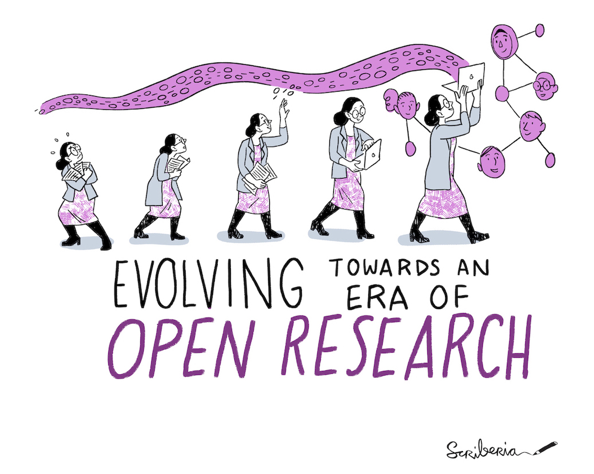

# _The Turing Way_

>_Este archivo README-Spanish.md también está disponible en alemán ([README-German.md](README-German.md)), coreano ([README-Korean](README-Korean.md)), francés ([README-French.md](README-French.md)), indonesio ([README-Indonesian](README-Indonesian.md)), inglés ([README](../README.md)), italiano ([README-Italian](README-Italian.md)), holandés ([README-Dutch](README-Dutch.md)) y portugués ([README-Portuguese](README-Portuguese.md)) (ordenados alfabéticamente)._

*Colaboradores totales:*

| Información | Enlaces |
| :--- | :--- |
| **Proyecto** |  [![](https://img.shields.io/static/v1?label=TuringWay&message=I%20want%20to%20contribute!&color=yellow&logo=data%3Aimage%2Fpng%3Bbase64%2CiVBORw0KGgoAAAANSUhEUgAAABAAAAAQCAYAAAAf8%2F9hAAACYklEQVQ4jXXTy09TQRTH8f5VPhI1xoVxYURNAFcmRleaGDdGXQlKAYkLUARNfICoScGKpTyE3t5bkKD2AUQepUXB0gcgLTalD9rema8LKRVrT3I2k%2Fl95kwyY6BMfQiFqHaoVDlUBoJBZJl9hn8XRsIhqh0abd55tnWdrBA8WfBSpakMhUqhXUCJhKl2aLR65%2FEtLeGc%2BYoy5aHf46bX7cThctK%2BAw2HQkVAW41wzqHRMjNNRteR%2BQzGjg5udZtQ47FiO50gdLZ1nVbvPNUOFSUSxnB4sJ%2F0TjCTTjHk%2BoJl%2BRtqPEaL6zMH79Rw0dyDVVURqRgyn0EkN8jkshwZGsBQodgQyQ2kyDPsce859drjdqLRKE0D%2FZhHR5F6DpHc2B3%2FjF3BcFqxARIpBXXmt9ii67vAYDhIr8fNx0UfE3OzzC0sIHIpxNYqSPEHqFBsiFQMkU3h8vs5%2FvABTeNje6BCj%2FxcwzLlIZHYROq5v4EoIr2JyCbJ57Kobjd3u7o41v4I68pyCfTGrhSvUKHYAJD5bcTWGjKbJJdO4A8E6JyexP4rWgK8Vkb2AjK7hcxnmZybxfF9kff%2BhZJQofvXwhg7O4vAfU2l79ME79xOrjY3c9ZYVzZs8nvZf6%2BRQCRCTgiODg1iCK6vc6WtjZM1tzlRW8sNa99%2Fx64fH%2BNAQz0un49nfh%2BVmspAcKX4lKWUbMbjXOg2cf3Vy%2BLIoRWqekxc7nhB6%2FQ0lZqKJRBAyjKfKZFIcKixgVPPn3LTamFfUyPne7qp1Oz0Bn4g5d7vVAIUamJ2FqPZzCW7gvlHabBQvwE2XnlAiFRrOwAAAABJRU5ErkJggg%3D%3D)](https://github.com/the-turing-way/the-turing-way/blob/main/CONTRIBUTING.md) |
| **Noticias** |      |
| **Chat** |    |
| **Compilación** |     |
| **Cita** |   |

*Bienvenidos al repositorio de Github del proyecto The Turing Way. Aquí es donde se desarrollan, se revisan y se mantienen todos los componentes del proyecto.*

_The Turing Way_ es una guía práctica para la ciencia de datos reproducible, ética y colaborativa.
Apoyamos una comunidad diversa de colaboradores para conseguir una ciencia de datos accesible, comprensible y efectiva para todos.
Nuestro objetivo es proporcionar toda la información que los investigadores y científicos de datos en la academia, la industria y el sector público necesitan al inicio de sus proyectos para asegurar que sean fáciles de reproducir al final.

.

*The Turing Way es un libro, una comunidad y una colaboración global.*

Todas las partes interesadas, incluyendo estudiantes, investigadores/as, ingenieros/as de software, líderes de proyectos y equipos fundadores, están invitados/as a usar The Turing Way para entender sus roles y sus responsabilidades en la reproducibilidad de la ciencia de datos.
Puede leer el libro [online](https://github.com/the-turing-way/the-turing-way), contribuir al proyecto tal como se describe en nuestras [guías para contribuir al proyecto](https://github.com/the-turing-way/the-turing-way/blob/main/CONTRIBUTING.md) y reutilizar todos los materiales ([ver la Licencia](https://github.com/the-turing-way/the-turing-way/blob/main/LICENSE.md)).

*Captura de pantalla del libro en línea de The Turing Way ([usar esta imagen en una presentación](https://drive.google.com/file/d/1wJR664YECSc8b_RSHeyVjDlHs-Ls9lkc/view?usp=sharing))*

The Turing Way comenzó en 2019 como una pequeña guía de ciencia de datos, y desde entonces se ha expandido hasta formar manual mucho más completo formado por múltiples guías que abarcan varios temas: Investigación Reproducible, Diseño de Proyectos, Comunicación, Colaboración e Investigación Ética.
Cada guía ofrece capítulos sobre una variedad de temas que cubren buenas prácticas y recomendaciones.
Estos capítulos han sido co-escritos por personas que colaboran y que son estudiantes, investigadores/as, docentes, líderes comunitarios, políticos/as y profesionales de diversos orígenes, experiencias vividas y conocimiento del dominio.

***Nuestro objetivo es hacer que la reproducibilidad sea "demasiado fácil como para no hacerla".***

**Tabla de contenidos:**

- [Acerca del proyecto](#acerca-del-proyecto)
- [El Equipo](#el-equipo)
- [Contribuir](#contribuir)
- [Citando _The Turing Way_](#citando-the-turing-way)
- [Contáctanos](#contáctanos)
- [Colaboradores](#colaboradores)

🎧 Si prefieres una introducción de audio al proyecto (en inglés) Rachel, una colaboradora del proyecto presentó en el [Open Science Fair 2019](https://www.opensciencefair.eu/) en Oporto y su presentación fue grabada por el [Podcast Orion](https://orionopenscience.podbean.com/e/the-fair-is-in-town-figshare-the-turing-way-and-open-science-quest-at-the-osfair2019/).
la descripción general del _The Turing Way_ comienza en el minuto 5:13. 

### Acerca del Proyecto

La investigación reproducible es necesaria para garantizar que se pueda confiar en el trabajo científico.
Quienes financian y editan trabajos científicos están comenzando a exigir que las publicaciones incluyan acceso a los datos utilizados y al código con el que se ha realizado el análisis.
El objetivo es garantizar que todos los resultados puedan verificarse de forma independiente y puedan servir como base para trabajos futuros.
Esto a veces es más fácil decirlo que hacerlo.
Compartir estos resultados de investigación significa comprender la gestión de datos, bibliotecología, el desarrollo de software y las técnicas de integración continua: habilidades que no se enseñan ni se esperan de los investigadores académicos y científicos de datos.
Como estas actividades no se enseñan comúnmente, reconocemos que la carga de los requisitos y la adquisición de nuevas habilidades puede ser intimidante para las personas que son nuevas en este mundo.
*The Turing Way* es un manual para ayudar a quienes estudian, supervisan, financian y editan trabajos científicos a garantizar que la ciencia de datos reproducible sea "demasiado fácil como para no hacerla" incluso para personas que nunca antes han trabajado de esta manera.
Incluirá material de capacitación sobre control de versiones, testeo de análisis y comunicación abierta y transparente con futuras personas usuarias, y se basará en los estudios de caso y talleres del Instituto Turing.
Este proyecto se desarrolla de manera abierta y todas y cada una de tus preguntas, comentarios y recomendaciones son bienvenidos en nuestro repositorio de github: <https://github.com/the-turing-way/the-turing-way>.

### El equipo

_The Turing Way_ es un proyecto de colaboración abierta e impulsado por la comunidad.
Todos los que colaboran en este libro, independientemente de lo pequeñas o grande que sean sus contribuciones, están reconocidos en este proyecto como colaboradores y miembros de la comunidad. 
Los colaboradores de larga duración se consideran parte del grupo de colaboradores principal, el cual asume roles de liderazgo en el proyecto.

El proyecto está coordinado por la líder investigadora **Kirstie Whitaker** (fundadora) y **Malvika Sharan** (desarrolladora de la comunidad) y alojado en [The Alan Turing Institute](https://www.turing.ac.uk/).

Puedes leer cómo se realiza [el proceso de reconocimiento como parte de _The Turing Way_ ](https://book.the-turing-way.org/community-handbook/acknowledgement/acknowledgement-members.html#community-members-contributors-and-co-authors) y el [Registro de Colaboradores](https://book.the-turing-way.org/afterword/contributors-record.html) para conocer cómo se realiza el reconocimiento del trabajo y nuestros colaboradores destacados.
Por favor visita el [Panel de Colaboradores](#colaboradores) para ver el perfil de Github de todos nuestros colaboradores.

### Contribuir

:construction: Este repositorio es un trabajo en progreso contínuo y **todas las personas** están invitadas a ayudarnos a construir algo que sea útil para los demás. :construction:

Se espera que todas las personas que deseen unirse al proyecto sigan nuestro [código de conducta](../CODE_OF_CONDUCT.md) y que visiten nuestras [guías para contribuir al proyecto](../CONTRIBUTING.md) para más información sobre cómo empezar.
Queremos conocer a nuestros colaboradores allá donde estén.
Por lo tanto, proporcionamos múltiples puntos de entrada para que puedas colaborar basados en tus intereses, disponibilidad o habilidades.

Las contribuciones incluyen el desarrollo y difusión de nuevos capítulos; matenimiento y mejora de capítulos existentes; compartir recursos de _The Turing Way_; revisar y actualizar materiales anteriormente desarrollados; traducir los capítulos para ayudar a hacer este proyecto accesible de forma global, y compartir las mejores prácticas en la investigación.

Los miembros comunitarios tienen oportunidades de aprender nuevas habilidades, compartir sus ideas y colaborar entre ellos.
También tienen oportunidades de tutoría en el proyecto a medida que hacen sus contribuciones en The Turing Way u otros proyectos de código abierto y están invitadas a asesorar a nuevos participantes en el proyecto.

Hemos creado un [paquete de promoción](https://github.com/the-turing-way/the-turing-way/tree/main/communications/promotion-pack) para ayudarle a presentar y compartir The Turing Way en su red.

### Citando _The Turing Way_

Puedes hacer referencia a _The Turing Way_ a través del archivo Zenodo del proyecto usando DOI: [10.5281/zenodo.3233853](https://doi.org/10.5281/zenodo.3233853).
Los DOI nos permiten archivar el repositorio y son realmente valiosos para garantizar que el trabajo se rastree en las publicaciones académicas.

La cita tendrá un aspecto similar a este (en inglés):

> The Turing Way Community, Becky Arnold, Louise Bowler, Sarah Gibson, Patricia Herterich, Rosie Higman, … Kirstie Whitaker. (2019, March 25). The Turing Way: A Handbook for Reproducible Data Science (Version v0.0.4). Zenodo. <http://doi.org/10.5281/zenodo.3233986>

También puedes compartir la URL legible por humanos a una página del libro, por ejemplo, <https://book.the-turing-way.org/reproducibility/03/definitions.html>, pero ten en cuenta que el proyecto está en desarrollo y, por lo tanto, estos vínculos pueden cambiar con el tiempo.
Es posible que desees incluir un enlace de archivo web como: <https://web.archive.org/web/20191030093753/https://book.the-turing-way.org/reproducibility/03/definitions.html> para asegurarte de no terminar con enlaces rotos en todas partes.

Realmente agradecemos cualquier referencia que hagas al proyecto _The Turing Way_ y esperamos que sea de utilidad.
Si tienes alguna pregunta por favor [contáctanos](#get-in-touch).

### Citando las ilustraciones de _The Turing Way_

  

Las ilustraciones del _The Turing Way_ se han creado por artistas de [Scriberia](https://www.scriberia.co.uk/) como parte de [_The Turing Way_ book dashes](https://github.com/the-turing-way/the-turing-way/tree/main/workshops/book-dash) en Manchester el 17 de mayo de 2019, en Londres el 28 de mayo de 2019 y el 21 de febrero de 2020.
Las mismas representan una variedad de contenidos del manual, de los esfuerzos de colaboración en la comunidad y del proyecto _The Turing Way_ en general.
Estas ilustraciones están disponibles en Zenodo ([https://zenodo.org/record/3695300)](https://zenodo.org/record/3695300) bajo una licencia CC-BY.

Cuando utilices cualquiera de las imágenes, por favor incluye la siguiente atribución:
> Esta imagen fue creada por Scriberia para la comunidad The Turing Way y se usa bajo una licencia CC-BY.

La última versión de Zenodo se puede citar como:
> The Turing Way Community, & Scriberia. (2020, March 3). Illustrations from the Turing Way book dashes. Zenodo. http://doi.org/10.5281/zenodo.3695300

Hemos utilizado algunas de estas ilustraciones en las respuestas a las contribuciones de personas que se integran a esta comunidad en el [Bot de bienvenida](https://github.com/apps/welcome) de este repositorio de GitHub.

### Contáctanos

#### Email

Puedes ponerte en contacto con nuestra administradora de la comunidad **Malvika Sharan** por correo electrónico a [msharan@turing.ac.uk](mailto:msharan@turing.ac.uk).
Alternativamente, puedes comunicarte con la investigadora principal **Kirstie Whitaker** por correo electrónico a [kwhitaker@turing.ac.uk](mailto:kwhitaker@turing.ac.uk).

#### Chat

Conectar con otros y compartir tus ideas en Slack usando [este enlace de invitación](https://join.slack.com/t/theturingway/shared_invite/zt-fn608gvb-h_ZSpoA29cCdUwR~TIqpBw).

Tenemos una sala de chat de Gitter (si prefieres una alternativa de código abierto para el chat) y nos encantaría que pasaras a saludar a <https://gitter.im/the-turing-way/the-turing-way>.
Este foro también está sincronizado con [Matrix](https://matrix.org) en [#the-turing-way:matrix.org](https://riot.im/app/#/room/#the-turing-way:matrix.org) y puedes unirte a nosotros allí si lo prefieres.

#### Recibir Actualizaciones

También tenemos una lista de correos a la que enviamos actualizaciones mensuales del proyecto.
Subscríbete en <https://tinyletter.com/TuringWay>.

También puedes seguirnos en nuestro Twitter ([@turingway](https://twitter.com/turingway)).

## Colaboradores

Gracias a estas personas maravillosas ([emoji key](https://allcontributors.org/docs/en/emoji-key)):

[Lista de personas que han colaborado](https://github.com/the-turing-way/the-turing-way#contributors)

Este proyecto sigue la especificación [all-contributors](https://github.com/all-contributors/all-contributors).
¡Contribuciones de todo tipo son bienvenidas!
