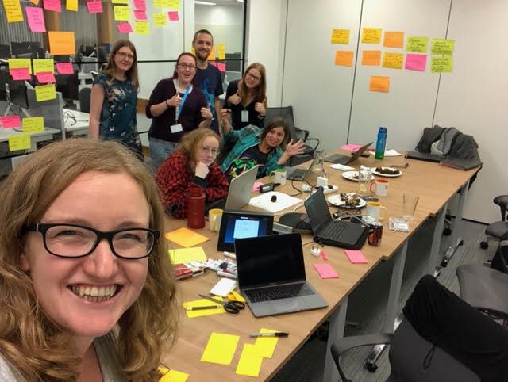

# The Turing Way

[![](https://img.shields.io/static/v1?label=TuringWay&message=I%20want%20to%20contribute!&color=yellow&logo=data%3Aimage%2Fpng%3Bbase64%2CiVBORw0KGgoAAAANSUhEUgAAABAAAAAQCAYAAAAf8%2F9hAAACYklEQVQ4jXXTy09TQRTH8f5VPhI1xoVxYURNAFcmRleaGDdGXQlKAYkLUARNfICoScGKpTyE3t5bkKD2AUQepUXB0gcgLTalD9rema8LKRVrT3I2k%2Fl95kwyY6BMfQiFqHaoVDlUBoJBZJl9hn8XRsIhqh0abd55tnWdrBA8WfBSpakMhUqhXUCJhKl2aLR65%2FEtLeGc%2BYoy5aHf46bX7cThctK%2BAw2HQkVAW41wzqHRMjNNRteR%2BQzGjg5udZtQ47FiO50gdLZ1nVbvPNUOFSUSxnB4sJ%2F0TjCTTjHk%2BoJl%2BRtqPEaL6zMH79Rw0dyDVVURqRgyn0EkN8jkshwZGsBQodgQyQ2kyDPsce859drjdqLRKE0D%2FZhHR5F6DpHc2B3%2FjF3BcFqxARIpBXXmt9ii67vAYDhIr8fNx0UfE3OzzC0sIHIpxNYqSPEHqFBsiFQMkU3h8vs5%2FvABTeNje6BCj%2FxcwzLlIZHYROq5v4EoIr2JyCbJ57Kobjd3u7o41v4I68pyCfTGrhSvUKHYAJD5bcTWGjKbJJdO4A8E6JyexP4rWgK8Vkb2AjK7hcxnmZybxfF9kff%2BhZJQofvXwhg7O4vAfU2l79ME79xOrjY3c9ZYVzZs8nvZf6%2BRQCRCTgiODg1iCK6vc6WtjZM1tzlRW8sNa99%2Fx64fH%2BNAQz0un49nfh%2BVmspAcKX4lKWUbMbjXOg2cf3Vy%2BLIoRWqekxc7nhB6%2FQ0lZqKJRBAyjKfKZFIcKixgVPPn3LTamFfUyPne7qp1Oz0Bn4g5d7vVAIUamJ2FqPZzCW7gvlHabBQvwE2XnlAiFRrOwAAAABJRU5ErkJggg%3D%3D)](https://github.com/alan-turing-institute/the-turing-way/blob/master/CONTRIBUTING.md)
<!-- ALL-CONTRIBUTORS-BADGE:START - Do not remove or modify this section -->

<!-- ALL-CONTRIBUTORS-BADGE:END -->

| Test | Status |
| :--- | :--- |
| Netlify build |  |
| No Latin Phrases |  |
| No Large Files |  |
| No "_Lorem Ipsum_"s |  |

_The Turing Way_ is a lightly opinionated guide to reproducible data science.
You can read it here: <https://the-turing-way.netlify.com>
You're currently viewing the project GitHub repository where all of the bits that make up the guide live, and where the process of writing/building the guide happens.

Our goal is to provide all the information that researchers need at the start of their projects to ensure that they are easy to reproduce at the end.

This also means making sure PhD students, postdocs, PIs and funding teams know which parts of the "responsibility of reproducibility" they can affect, and what they should do to nudge data science to being more efficient, effective and understandable.

Table of contents:

- [About the project](#about-the-project)
- [The team](#the-team)
- [Contributing](#contributing)
- [Citing _The Turing Way_](#citing-the-turing-way)
- [Get in touch](#get-in-touch)
- [Contributors](#contributors)

🎧 If you prefer an audio introduction to the project, our team member Rachael presented at the [Open Science Fair 2019](https://www.opensciencefair.eu/) in Porto and her demo was recorded by the [Orion podcast](https://orionopenscience.podbean.com/e/the-fair-is-in-town-figshare-the-turing-way-and-open-science-quest-at-the-osfair2019/).
_The Turing Way_ overview starts at minute 5:13.

### About the project

Reproducible research is necessary to ensure that scientific work can be trusted.
Funders and publishers are beginning to require that publications include access to the underlying data and the analysis code.
The goal is to ensure that all results can be independently verified and built upon in future work.
This is sometimes easier said than done.
Sharing these research outputs means understanding data management, library sciences, software development, and continuous integration techniques: skills that are not widely taught or expected of academic researchers and data scientists. As these activities are not commonly taught, we recognise that the burden of requirement and new skill acquisition can be intimidating to individuals who are new to this world.
*The Turing Way* is a handbook to support students, their supervisors, funders and journal editors in ensuring that reproducible data science is "too easy not to do" even for people who have never worked in this way before.
It will include training material on version control, analysis testing, and open and transparent communication with future users, and build on Turing Institute case studies and workshops.
This project is openly developed and any and all questions, comments and recommendations are welcome at our github repository: <https://github.com/alan-turing-institute/the-turing-way>.

### The team

This is (part of) the project team planning work at the Turing Institute.
For more on how to contact us, see the [ways of working document](ways_of_working.md).

### Contributing

:construction: This repository is always a work in progress and **everyone** is encouraged to help us build something that is useful to the many. :construction:

Everyone is asked to follow our [code of conduct](CODE_OF_CONDUCT.md) and to checkout our [contributing guidelines](CONTRIBUTING.md) for more information on how to get started.

If you are not familiar or confident contributing on GitHub, you can also contribute a case study and your tips and tricks via our [Google submission form](https://goo.gl/forms/akFqZEIy2kxAjfZW2).

### Citing _The Turing Way_

You can reference _The Turing Way_ through the project's Zenodo archive using DOI: [10.5281/zenodo.3233853](https://doi.org/10.5281/zenodo.3233853).
DOIs allow us to archive the repository and they are really valuable to ensure that the work is tracked in academic publications.

The citation will look something like:

> The Turing Way Community, Becky Arnold, Louise Bowler, Sarah Gibson, Patricia Herterich, Rosie Higman, … Kirstie Whitaker. (2019, March 25). The Turing Way: A Handbook for Reproducible Data Science (Version v0.0.4). Zenodo. <http://doi.org/10.5281/zenodo.3233986>

You can also share the human-readable URL to a page in the book, for example: <https://the-turing-way.netlify.com/reproducibility/03/definitions.html>, but be aware that the project is under development and therefore these links may change over time.
You might want to include a web archive link such as: <https://web.archive.org/web/20191030093753/https://the-turing-way.netlify.com/reproducibility/03/definitions.html> to make sure that you don't end up with broken links everywhere!

We really appreciate any references that you make to _The Turing Way_ project in your and we hope it is useful.
If you have any questions please [get in touch](#get-in-touch).

### Citing _The Turing Way_ illustrations

_The Turing Way_ illustrations are created by artists from [Scriberia](https://www.scriberia.co.uk/) as part of [_The Turing Way_ book dashes](https://github.com/alan-turing-institute/the-turing-way/tree/master/workshops/book-dash) in Manchester on 17 May 2019, and London on 28 May 2019 and 21 February 2020. 
They depict a variety of content from the handbook, collaborative efforts in the community and _The Turing Way_ project in general. 
These illustrations are available on Zenodo ([https://zenodo.org/record/3695300)](https://zenodo.org/record/3695300) under a CC-BY license.

When using any of the images, please include the following attribution:
> This image was created by Scriberia for The Turing Way community and is used under a CC-BY licence.

The latest version from Zenodo can be cited as:
> The Turing Way Community, & Scriberia. (2020, March 3). Illustrations from the Turing Way book dashes. Zenodo. http://doi.org/10.5281/zenodo.3695300

We have used a few of these illustrations in the [Welcome Bot](https://github.com/apps/welcome)'s responses to new members' contributions in this GitHub repository.

### Get in touch

We have a gitter chat room and we'd love for you to swing by to say hello at <https://gitter.im/alan-turing-institute/the-turing-way>.
That room is also synchronised with [Matrix](https://matrix.org) at [#the-turing-way:matrix.org](https://riot.im/app/#/room/#the-turing-way:matrix.org) and you're welcome to join us there if you prefer.

We also have a tiny letter mailing list to which we send monthly project updates.
Subscribe at <https://tinyletter.com/TuringWay>.

You can contact our community manager **Malvika Sharan** by email at [msharan@turing.ac.uk](mailto:msharan@turing.ac.uk).
Alternatively, you can contact the lead investigator **Kirstie Whitaker** by email at [kwhitaker@turing.ac.uk](mailto:kwhitaker@turing.ac.uk).

## Contributors

Thanks goes to these wonderful people ([emoji key](https://github.com/all-contributors/all-contributors#emoji-key)):

<!-- ALL-CONTRIBUTORS-LIST:START - Do not remove or modify this section -->
<!-- prettier-ignore-start -->
<!-- markdownlint-disable -->
<table>
  <tr>
    <td align="center"><a href="https://rainsworth.github.io"> <b>Rachael Ainsworth</b></a> <a href="https://github.com/alan-turing-institute/the-turing-way/commits?author=rainsworth" title="Documentation">📖</a> <a href="#eventOrganizing-rainsworth" title="Event Organizing">📋</a> <a href="#ideas-rainsworth" title="Ideas, Planning, & Feedback">🤔</a> <a href="#question-rainsworth" title="Answering Questions">💬</a> <a href="https://github.com/alan-turing-institute/the-turing-way/pulls?q=is%3Apr+reviewed-by%3Arainsworth" title="Reviewed Pull Requests">👀</a> <a href="#talk-rainsworth" title="Talks">📢</a></td>
    <td align="center"><a href="http://www.tarekallamjr.com"> <b>Tarek Allam</b></a> <a href="#infra-tallamjr" title="Infrastructure (Hosting, Build-Tools, etc)">🚇</a> <a href="https://github.com/alan-turing-institute/the-turing-way/commits?author=tallamjr" title="Documentation">📖</a></td>
    <td align="center"><a href="http://www.bitsandchips.me"> <b>Tania Allard</b></a> <a href="#ideas-trallard" title="Ideas, Planning, & Feedback">🤔</a> <a href="#question-trallard" title="Answering Questions">💬</a></td>
    <td align="center"><a href="http://www.imperial.ac.uk/quantum-photovoltaics"> <b>Diego Alonso Alvarez</b></a> <a href="#ideas-dalonsoa" title="Ideas, Planning, & Feedback">🤔</a> <a href="https://github.com/alan-turing-institute/the-turing-way/pulls?q=is%3Apr+reviewed-by%3Adalonsoa" title="Reviewed Pull Requests">👀</a></td>
    <td align="center"><a href="https://github.com/bouweandela"> <b>Bouwe Andela</b></a> <a href="#content-bouweandela" title="Content">🖋</a></td>
    <td align="center"><a href="https://github.com/KristijanArmeni"> <b>Kristijan Armeni</b></a> <a href="https://github.com/alan-turing-institute/the-turing-way/issues?q=author%3AKristijanArmeni" title="Bug reports">🐛</a></td>
    <td align="center"><a href="https://github.com/r-j-arnold"> <b>Becky Arnold</b></a> <a href="#question-r-j-arnold" title="Answering Questions">💬</a> <a href="https://github.com/alan-turing-institute/the-turing-way/commits?author=r-j-arnold" title="Code">💻</a> <a href="https://github.com/alan-turing-institute/the-turing-way/commits?author=r-j-arnold" title="Documentation">📖</a> <a href="#ideas-r-j-arnold" title="Ideas, Planning, & Feedback">🤔</a> <a href="https://github.com/alan-turing-institute/the-turing-way/pulls?q=is%3Apr+reviewed-by%3Ar-j-arnold" title="Reviewed Pull Requests">👀</a></td>
  </tr>
  <tr>
    <td align="center"><a href="https://dblana.github.io/"> <b>Dimitra Blana</b></a> <a href="https://github.com/alan-turing-institute/the-turing-way/pulls?q=is%3Apr+reviewed-by%3Adblana" title="Reviewed Pull Requests">👀</a> <a href="#content-dblana" title="Content">🖋</a></td>
    <td align="center"><a href="https://github.com/LouiseABowler"> <b>Louise Bowler</b></a> <a href="#question-LouiseABowler" title="Answering Questions">💬</a> <a href="https://github.com/alan-turing-institute/the-turing-way/commits?author=LouiseABowler" title="Code">💻</a> <a href="https://github.com/alan-turing-institute/the-turing-way/commits?author=LouiseABowler" title="Documentation">📖</a> <a href="#example-LouiseABowler" title="Examples">💡</a> <a href="#ideas-LouiseABowler" title="Ideas, Planning, & Feedback">🤔</a> <a href="#eventOrganizing-LouiseABowler" title="Event Organizing">📋</a> <a href="https://github.com/alan-turing-institute/the-turing-way/pulls?q=is%3Apr+reviewed-by%3ALouiseABowler" title="Reviewed Pull Requests">👀</a></td>
    <td align="center"><a href="http://informationcake.com"> <b>Alex Clarke</b></a> <a href="https://github.com/alan-turing-institute/the-turing-way/commits?author=informationcake" title="Documentation">📖</a></td>
    <td align="center"><a href="http://erambler.co.uk/"> <b>Jez Cope</b></a> <a href="https://github.com/alan-turing-institute/the-turing-way/commits?author=jezcope" title="Documentation">📖</a></td>
    <td align="center"><a href="https://github.com/edaub"> <b>Eric Daub</b></a> <a href="https://github.com/alan-turing-institute/the-turing-way/commits?author=edaub" title="Documentation">📖</a></td>
    <td align="center"><a href="http://sdruskat.net"> <b>Stephan Druskat</b></a> <a href="https://github.com/alan-turing-institute/the-turing-way/commits?author=sdruskat" title="Documentation">📖</a> <a href="#content-sdruskat" title="Content">🖋</a></td>
    <td align="center"><a href="http://emdupre.me"> <b>Elizabeth DuPre</b></a> <a href="#infra-emdupre" title="Infrastructure (Hosting, Build-Tools, etc)">🚇</a> <a href="#question-emdupre" title="Answering Questions">💬</a> <a href="https://github.com/alan-turing-institute/the-turing-way/pulls?q=is%3Apr+reviewed-by%3Aemdupre" title="Reviewed Pull Requests">👀</a></td>
  </tr>
  <tr>
    <td align="center"><a href="http://damtp.cam.ac.uk/user/eglen"> <b>Stephen Eglen</b></a> <a href="https://github.com/alan-turing-institute/the-turing-way/pulls?q=is%3Apr+reviewed-by%3Asje30" title="Reviewed Pull Requests">👀</a></td>
    <td align="center"><a href="https://github.com/joe-fennell"> <b>Joe Fennell</b></a> <a href="https://github.com/alan-turing-institute/the-turing-way/commits?author=joe-fennell" title="Documentation">📖</a></td>
    <td align="center"><a href="https://github.com/oforrest"> <b>Oliver Forrest</b></a> <a href="https://github.com/alan-turing-institute/the-turing-way/commits?author=oforrest" title="Documentation">📖</a> <a href="#ideas-oforrest" title="Ideas, Planning, & Feedback">🤔</a></td>
    <td align="center"><a href="https://github.com/pgadige"> <b>Pooja Gadige</b></a> <a href="https://github.com/alan-turing-institute/the-turing-way/commits?author=pgadige" title="Documentation">📖</a></td>
    <td align="center"><a href="https://github.com/jmgate"> <b>Jason Gates</b></a> <a href="https://github.com/alan-turing-institute/the-turing-way/commits?author=jmgate" title="Documentation">📖</a> <a href="https://github.com/alan-turing-institute/the-turing-way/pulls?q=is%3Apr+reviewed-by%3Ajmgate" title="Reviewed Pull Requests">👀</a></td>
    <td align="center"><a href="https://github.com/sgibson91"> <b>Sarah Gibson</b></a> <a href="#question-sgibson91" title="Answering Questions">💬</a> <a href="https://github.com/alan-turing-institute/the-turing-way/commits?author=sgibson91" title="Code">💻</a> <a href="https://github.com/alan-turing-institute/the-turing-way/commits?author=sgibson91" title="Documentation">📖</a> <a href="#tool-sgibson91" title="Tools">🔧</a> <a href="https://github.com/alan-turing-institute/the-turing-way/pulls?q=is%3Apr+reviewed-by%3Asgibson91" title="Reviewed Pull Requests">👀</a> <a href="#talk-sgibson91" title="Talks">📢</a> <a href="#ideas-sgibson91" title="Ideas, Planning, & Feedback">🤔</a> <a href="#tutorial-sgibson91" title="Tutorials">✅</a></td>
    <td align="center"><a href="https://github.com/OscartGiles"> <b>Oscar Giles</b></a> <a href="https://github.com/alan-turing-institute/the-turing-way/commits?author=OscartGiles" title="Documentation">📖</a></td>
  </tr>
  <tr>
    <td align="center"><a href="https://github.com/rjjgilham"> <b>Richard Gilham</b></a> <a href="https://github.com/alan-turing-institute/the-turing-way/commits?author=rjjgilham" title="Documentation">📖</a> <a href="#ideas-rjjgilham" title="Ideas, Planning, & Feedback">🤔</a></td>
    <td align="center"><a href="https://github.com/cassgvp"> <b>Cassandra Gould van Praag</b></a> <a href="#ideas-cassgvp" title="Ideas, Planning, & Feedback">🤔</a> <a href="https://github.com/alan-turing-institute/the-turing-way/commits?author=cassgvp" title="Documentation">📖</a></td>
    <td align="center"><a href="https://www.mrc-bsu.cam.ac.uk/people/in-alphabetical-order/a-to-g/michael-grayling/"> <b>Michael Grayling</b></a> <a href="https://github.com/alan-turing-institute/the-turing-way/commits?author=mjg211" title="Documentation">📖</a></td>
    <td align="center"><a href="https://github.com/nlharris"> <b>Nomi Harris</b></a> <a href="https://github.com/alan-turing-institute/the-turing-way/pulls?q=is%3Apr+reviewed-by%3Anlharris" title="Reviewed Pull Requests">👀</a></td>
    <td align="center"><a href="http://csd.utexas.edu/research/hamilton-lab"> <b>Liberty Hamilton</b></a> <a href="https://github.com/alan-turing-institute/the-turing-way/issues?q=author%3Alibertyh" title="Bug reports">🐛</a></td>
    <td align="center"><a href="https://github.com/betatim"> <b>Tim Head</b></a> <a href="#question-betatim" title="Answering Questions">💬</a> <a href="#ideas-betatim" title="Ideas, Planning, & Feedback">🤔</a></td>
    <td align="center"><a href="https://github.com/pherterich"> <b>Patricia Herterich</b></a> <a href="#question-pherterich" title="Answering Questions">💬</a> <a href="https://github.com/alan-turing-institute/the-turing-way/commits?author=pherterich" title="Documentation">📖</a> <a href="https://github.com/alan-turing-institute/the-turing-way/pulls?q=is%3Apr+reviewed-by%3Apherterich" title="Reviewed Pull Requests">👀</a> <a href="#ideas-pherterich" title="Ideas, Planning, & Feedback">🤔</a> <a href="#content-pherterich" title="Content">🖋</a></td>
  </tr>
  <tr>
    <td align="center"><a href="https://github.com/rosiehigman"> <b>Rosie Higman</b></a> <a href="#question-rosiehigman" title="Answering Questions">💬</a> <a href="#eventOrganizing-rosiehigman" title="Event Organizing">📋</a> <a href="https://github.com/alan-turing-institute/the-turing-way/pulls?q=is%3Apr+reviewed-by%3Arosiehigman" title="Reviewed Pull Requests">👀</a> <a href="#ideas-rosiehigman" title="Ideas, Planning, & Feedback">🤔</a></td>
    <td align="center"><a href="https://ianhinder.net"> <b>Ian Hinder</b></a> <a href="https://github.com/alan-turing-institute/the-turing-way/commits?author=ianhinder" title="Documentation">📖</a></td>
    <td align="center"><a href="http://www.hoang.co.uk/hieu"> <b>Hieu Hoang</b></a> <a href="#ideas-hieuhoang" title="Ideas, Planning, & Feedback">🤔</a></td>
    <td align="center"><a href="http://spot.colorado.edu/~daho1668/"> <b>Dan Hobley</b></a> <a href="https://github.com/alan-turing-institute/the-turing-way/commits?author=SiccarPoint" title="Documentation">📖</a></td>
    <td align="center"><a href="http://chrisholdgraf.com"> <b>Chris Holdgraf</b></a> <a href="#question-choldgraf" title="Answering Questions">💬</a> <a href="#ideas-choldgraf" title="Ideas, Planning, & Feedback">🤔</a></td>
    <td align="center"><a href="https://github.com/wjchulme"> <b>Will Hulme</b></a> <a href="https://github.com/alan-turing-institute/the-turing-way/commits?author=wjchulme" title="Documentation">📖</a></td>
    <td align="center"><a href="https://www.linkedin.com/in/james-kent-24666468/"> <b>James Kent</b></a> <a href="https://github.com/alan-turing-institute/the-turing-way/issues?q=author%3Ajdkent" title="Bug reports">🐛</a></td>
  </tr>
  <tr>
    <td align="center"><a href="http://gkiar.github.io"> <b>Greg Kiar</b></a> <a href="https://github.com/alan-turing-institute/the-turing-way/commits?author=gkiar" title="Documentation">📖</a> <a href="https://github.com/alan-turing-institute/the-turing-way/pulls?q=is%3Apr+reviewed-by%3Agkiar" title="Reviewed Pull Requests">👀</a></td>
    <td align="center"><a href="https://github.com/taunsquared"> <b>Danbee Kim</b></a> <a href="https://github.com/alan-turing-institute/the-turing-way/commits?author=taunsquared" title="Documentation">📖</a></td>
    <td align="center"><a href="https://www.annakrystalli.me/"> <b>Anna Krystalli</b></a> <a href="#question-annakrystalli" title="Answering Questions">💬</a> <a href="#example-annakrystalli" title="Examples">💡</a> <a href="https://github.com/alan-turing-institute/the-turing-way/pulls?q=is%3Apr+reviewed-by%3Aannakrystalli" title="Reviewed Pull Requests">👀</a> <a href="#ideas-annakrystalli" title="Ideas, Planning, & Feedback">🤔</a></td>
    <td align="center"><a href="https://kkmann.github.io/"> <b>Kevin Kunzmann</b></a> <a href="https://github.com/alan-turing-institute/the-turing-way/commits?author=kkmann" title="Documentation">📖</a> <a href="#ideas-kkmann" title="Ideas, Planning, & Feedback">🤔</a></td>
    <td align="center"><a href="https://github.com/mkuzak"> <b>Mateusz Kuzak</b></a> <a href="https://github.com/alan-turing-institute/the-turing-way/issues?q=author%3Amkuzak" title="Bug reports">🐛</a> <a href="#eventOrganizing-mkuzak" title="Event Organizing">📋</a> <a href="#ideas-mkuzak" title="Ideas, Planning, & Feedback">🤔</a> <a href="https://github.com/alan-turing-institute/the-turing-way/pulls?q=is%3Apr+reviewed-by%3Amkuzak" title="Reviewed Pull Requests">👀</a> <a href="#content-mkuzak" title="Content">🖋</a></td>
    <td align="center"><a href="https://erictleung.com"> <b>Eric Leung</b></a> <a href="https://github.com/alan-turing-institute/the-turing-way/issues?q=author%3Aerictleung" title="Bug reports">🐛</a></td>
    <td align="center"><a href="https://github.com/ClareLiggins"> <b>Clare Liggins</b></a> <a href="https://github.com/alan-turing-institute/the-turing-way/commits?author=ClareLiggins" title="Documentation">📖</a></td>
  </tr>
  <tr>
    <td align="center"><a href="https://github.com/longr"> <b>Robin Long</b></a> <a href="https://github.com/alan-turing-institute/the-turing-way/commits?author=longr" title="Documentation">📖</a></td>
    <td align="center"><a href="http://christopherlovell.co.uk"> <b>Christopher Lovell</b></a> <a href="#infra-christopherlovell" title="Infrastructure (Hosting, Build-Tools, etc)">🚇</a></td>
    <td align="center"><a href="https://github.com/FrancesMadden"> <b>Frances Madden</b></a> <a href="#content-FrancesMadden" title="Content">🖋</a></td>
    <td align="center"><a href="http://emalliaraki.com"> <b>Eirini Malliaraki</b></a> <a href="https://github.com/alan-turing-institute/the-turing-way/commits?author=rockita" title="Documentation">📖</a></td>
    <td align="center"><a href="https://github.com/effigies"> <b>Chris Markiewicz</b></a> <a href="#ideas-effigies" title="Ideas, Planning, & Feedback">🤔</a></td>
    <td align="center"><a href="https://github.com/c-martinez"> <b>Carlos Martinez</b></a> <a href="https://github.com/alan-turing-institute/the-turing-way/issues?q=author%3Ac-martinez" title="Bug reports">🐛</a> <a href="https://github.com/alan-turing-institute/the-turing-way/pulls?q=is%3Apr+reviewed-by%3Ac-martinez" title="Reviewed Pull Requests">👀</a> <a href="#content-c-martinez" title="Content">🖋</a></td>
    <td align="center"><a href="https://github.com/orchid00"> <b>Paula Andrea Martinez</b></a> <a href="#ideas-orchid00" title="Ideas, Planning, & Feedback">🤔</a> <a href="https://github.com/alan-turing-institute/the-turing-way/pulls?q=is%3Apr+reviewed-by%3Aorchid00" title="Reviewed Pull Requests">👀</a></td>
  </tr>
  <tr>
    <td align="center"><a href="https://github.com/masonlr"> <b>Lachlan Mason</b></a> <a href="#ideas-masonlr" title="Ideas, Planning, & Feedback">🤔</a> <a href="https://github.com/alan-turing-institute/the-turing-way/commits?author=masonlr" title="Documentation">📖</a> <a href="https://github.com/alan-turing-institute/the-turing-way/commits?author=masonlr" title="Code">💻</a></td>
    <td align="center"><a href="http://rohitmidha23.github.io"> <b>Rohit Midha</b></a> <a href="https://github.com/alan-turing-institute/the-turing-way/commits?author=RohitMidha23" title="Documentation">📖</a></td>
    <td align="center"><a href="https://github.com/jmoldon"> <b>Javier Moldon</b></a> <a href="https://github.com/alan-turing-institute/the-turing-way/commits?author=jmoldon" title="Documentation">📖</a></td>
    <td align="center"><a href="https://github.com/AlfAWolf140"> <b>Beth Montague-Hellen</b></a> <a href="https://github.com/alan-turing-institute/the-turing-way/commits?author=AlfAWolf140" title="Documentation">📖</a></td>
    <td align="center"><a href="http://alexmorley.me"> <b>Alexander Morley</b></a> <a href="#question-alexmorley" title="Answering Questions">💬</a> <a href="https://github.com/alan-turing-institute/the-turing-way/pulls?q=is%3Apr+reviewed-by%3Aalexmorley" title="Reviewed Pull Requests">👀</a> <a href="#ideas-alexmorley" title="Ideas, Planning, & Feedback">🤔</a> <a href="https://github.com/alan-turing-institute/the-turing-way/commits?author=alexmorley" title="Tests">⚠️</a></td>
    <td align="center"><a href="http://www.jamesmyatt.co.uk/"> <b>James Myatt</b></a> <a href="https://github.com/alan-turing-institute/the-turing-way/commits?author=jamesmyatt" title="Documentation">📖</a></td>
    <td align="center"><a href="https://github.com/OliJimbo"> <b>Oliver Clark</b></a> <a href="https://github.com/alan-turing-institute/the-turing-way/commits?author=OliJimbo" title="Documentation">📖</a></td>
  </tr>
  <tr>
    <td align="center"><a href="https://github.com/martintoreilly"> <b>Martin O'Reilly</b></a> <a href="#question-martintoreilly" title="Answering Questions">💬</a> <a href="#tool-martintoreilly" title="Tools">🔧</a> <a href="#ideas-martintoreilly" title="Ideas, Planning, & Feedback">🤔</a></td>
    <td align="center"><a href="https://github.com/jspickering"> <b>Jade Pickering</b></a> <a href="https://github.com/alan-turing-institute/the-turing-way/commits?author=jspickering" title="Documentation">📖</a></td>
    <td align="center"><a href="https://github.com/crangelsmith"> <b>Camila Rangel Smith</b></a> <a href="https://github.com/alan-turing-institute/the-turing-way/commits?author=crangelsmith" title="Documentation">📖</a></td>
    <td align="center"><a href="https://github.com/RostiReadioff"> <b>Rosti Readioff</b></a> <a href="https://github.com/alan-turing-institute/the-turing-way/commits?author=RostiReadioff" title="Documentation">📖</a></td>
    <td align="center"><a href="https://github.com/jemrobinson"> <b>James Robinson</b></a> <a href="#ideas-jemrobinson" title="Ideas, Planning, & Feedback">🤔</a> <a href="https://github.com/alan-turing-institute/the-turing-way/commits?author=jemrobinson" title="Code">💻</a></td>
    <td align="center"><a href="https://pabrod.github.io/"> <b>Pablo Rodríguez-Sánchez</b></a> <a href="#content-PabRod" title="Content">🖋</a></td>
    <td align="center"><a href="https://sansonegroup.eng.ox.ac.uk/"> <b>Susanna-Assunta Sansone</b></a> <a href="https://github.com/alan-turing-institute/the-turing-way/commits?author=SusannaSansone" title="Documentation">📖</a></td>
  </tr>
  <tr>
    <td align="center"><a href="http://www.saral.it"> <b>Ali Seyhun Saral</b></a> <a href="https://github.com/alan-turing-institute/the-turing-way/commits?author=seyhunsaral" title="Documentation">📖</a></td>
    <td align="center"><a href="https://github.com/illushka"> <b>Chanuki Illushka Seresinhe</b></a> <a href="https://github.com/alan-turing-institute/the-turing-way/commits?author=illushka" title="Documentation">📖</a></td>
    <td align="center"><a href="https://github.com/nadiasoliman"> <b>Nadia Soliman</b></a> <a href="https://github.com/alan-turing-institute/the-turing-way/commits?author=nadiasoliman" title="Documentation">📖</a></td>
    <td align="center"><a href="https://scholar.google.co.uk/citations?user=o0cD2JgAAAAJ&hl=en"> <b>Andrew Stewart</b></a> <a href="#tutorial-ajstewartlang" title="Tutorials">✅</a></td>
    <td align="center"><a href="https://github.com/Biostew"> <b>Sarah Stewart</b></a> <a href="https://github.com/alan-turing-institute/the-turing-way/commits?author=BioStew" title="Documentation">📖</a></td>
    <td align="center"><a href="https://github.com/ots22"> <b>Oliver Strickson</b></a> <a href="#question-ots22" title="Answering Questions">💬</a> <a href="https://github.com/alan-turing-institute/the-turing-way/commits?author=ots22" title="Documentation">📖</a></td>
    <td align="center"><a href="https://github.com/NatalieThurlby"> <b>Natalie Thurlby</b></a> <a href="https://github.com/alan-turing-institute/the-turing-way/commits?author=NatalieThurlby" title="Code">💻</a> <a href="https://github.com/alan-turing-institute/the-turing-way/commits?author=NatalieThurlby" title="Tests">⚠️</a></td>
  </tr>
  <tr>
    <td align="center"><a href="http://gertjan.dev"> <b>Gertjan van den Burg</b></a> <a href="https://github.com/alan-turing-institute/the-turing-way/commits?author=GjjvdBurg" title="Documentation">📖</a> <a href="#ideas-GjjvdBurg" title="Ideas, Planning, & Feedback">🤔</a> <a href="#question-GjjvdBurg" title="Answering Questions">💬</a></td>
    <td align="center"><a href="https://github.com/sverhoeven"> <b>Stefan Verhoeven</b></a> <a href="#content-sverhoeven" title="Content">🖋</a></td>
    <td align="center"><a href="https://whitakerlab.github.io"> <b>Kirstie Whitaker</b></a> <a href="#question-KirstieJane" title="Answering Questions">💬</a> <a href="https://github.com/alan-turing-institute/the-turing-way/commits?author=KirstieJane" title="Documentation">📖</a> <a href="#design-KirstieJane" title="Design">🎨</a> <a href="#eventOrganizing-KirstieJane" title="Event Organizing">📋</a> <a href="#fundingFinding-KirstieJane" title="Funding Finding">🔍</a> <a href="#ideas-KirstieJane" title="Ideas, Planning, & Feedback">🤔</a> <a href="https://github.com/alan-turing-institute/the-turing-way/pulls?q=is%3Apr+reviewed-by%3AKirstieJane" title="Reviewed Pull Requests">👀</a> <a href="#talk-KirstieJane" title="Talks">📢</a></td>
    <td align="center"><a href="https://github.com/tonyyzy"> <b>Tony Yang</b></a> <a href="https://github.com/alan-turing-institute/the-turing-way/commits?author=tonyyzy" title="Documentation">📖</a> <a href="#translation-tonyyzy" title="Translation">🌍</a> <a href="#infra-tonyyzy" title="Infrastructure (Hosting, Build-Tools, etc)">🚇</a></td>
    <td align="center"><a href="http://yo-yehudi.com"> <b>Yo Yehudi</b></a> <a href="https://github.com/alan-turing-institute/the-turing-way/commits?author=yochannah" title="Documentation">📖</a> <a href="https://github.com/alan-turing-institute/the-turing-way/pulls?q=is%3Apr+reviewed-by%3Ayochannah" title="Reviewed Pull Requests">👀</a></td>
    <td align="center"><a href="https://github.com/eirini-zormpa"> <b>Eirini Zormpa</b></a> <a href="https://github.com/alan-turing-institute/the-turing-way/issues?q=author%3Aeirini-zormpa" title="Bug reports">🐛</a> <a href="https://github.com/alan-turing-institute/the-turing-way/pulls?q=is%3Apr+reviewed-by%3Aeirini-zormpa" title="Reviewed Pull Requests">👀</a></td>
    <td align="center"><a href="https://github.com/malvikasharan"> <b>Malvika Sharan</b></a> <a href="https://github.com/alan-turing-institute/the-turing-way/commits?author=malvikasharan" title="Documentation">📖</a> <a href="#eventOrganizing-malvikasharan" title="Event Organizing">📋</a> <a href="#ideas-malvikasharan" title="Ideas, Planning, & Feedback">🤔</a> <a href="#projectManagement-malvikasharan" title="Project Management">📆</a> <a href="https://github.com/alan-turing-institute/the-turing-way/pulls?q=is%3Apr+reviewed-by%3Amalvikasharan" title="Reviewed Pull Requests">👀</a></td>
  </tr>
  <tr>
    <td align="center"><a href="https://github.com/JimMadge"> <b>Jim Madge</b></a> <a href="#content-JimMadge" title="Content">🖋</a></td>
    <td align="center"><a href="https://federiconanni.com/"> <b>Federico Nanni</b></a> <a href="https://github.com/alan-turing-institute/the-turing-way/issues?q=author%3Afedenanni" title="Bug reports">🐛</a> <a href="#content-fedenanni" title="Content">🖋</a></td>
    <td align="center"><a href="http://evelinag.com"> <b>Evelina Gabasova</b></a> <a href="https://github.com/alan-turing-institute/the-turing-way/issues?q=author%3Aevelinag" title="Bug reports">🐛</a> <a href="#content-evelinag" title="Content">🖋</a></td>
    <td align="center"><a href="https://github.com/nbarlowATI"> <b>Nick Barlow</b></a> <a href="https://github.com/alan-turing-institute/the-turing-way/issues?q=author%3AnbarlowATI" title="Bug reports">🐛</a> <a href="#content-nbarlowATI" title="Content">🖋</a></td>
    <td align="center"><a href="https://github.com/radka-j"> <b>Radka Jersakova</b></a> <a href="https://github.com/alan-turing-institute/the-turing-way/issues?q=author%3Aradka-j" title="Bug reports">🐛</a> <a href="#content-radka-j" title="Content">🖋</a></td>
    <td align="center"><a href="https://github.com/nathanbegbie"> <b>Nathan Begbie</b></a> <a href="https://github.com/alan-turing-institute/the-turing-way/issues?q=author%3Anathanbegbie" title="Bug reports">🐛</a> <a href="#ideas-nathanbegbie" title="Ideas, Planning, & Feedback">🤔</a></td>
    <td align="center"><a href="https://github.com/EstherPlomp"> <b>Esther Plomp</b></a> <a href="https://github.com/alan-turing-institute/the-turing-way/issues?q=author%3AEstherPlomp" title="Bug reports">🐛</a> <a href="#ideas-EstherPlomp" title="Ideas, Planning, & Feedback">🤔</a> <a href="#content-EstherPlomp" title="Content">🖋</a></td>
  </tr>
  <tr>
    <td align="center"><a href="https://github.com/annahadji"> <b>Anna Hadjitofi</b></a> <a href="#content-annahadji" title="Content">🖋</a> <a href="#translation-annahadji" title="Translation">🌍</a> <a href="#tutorial-annahadji" title="Tutorials">✅</a></td>
    <td align="center"><a href="https://github.com/m-rivera"> <b>Miguel Rivera</b></a> <a href="https://github.com/alan-turing-institute/the-turing-way/issues?q=author%3Am-rivera" title="Bug reports">🐛</a></td>
    <td align="center"><a href="http://barbaravreede.com"> <b>Barbara Vreede</b></a> <a href="#content-bvreede" title="Content">🖋</a></td>
    <td align="center"><a href="https://twitter.com/HeidiBaya"> <b>Heidi Seibold</b></a> <a href="#ideas-HeidiSeibold" title="Ideas, Planning, & Feedback">🤔</a> <a href="#content-HeidiSeibold" title="Content">🖋</a></td>
    <td align="center"><a href="https://mbjoseph.github.io"> <b>Max Joseph</b></a> <a href="https://github.com/alan-turing-institute/the-turing-way/pulls?q=is%3Apr+reviewed-by%3Ambjoseph" title="Reviewed Pull Requests">👀</a></td>
    <td align="center"><a href="http://martinagvilas.github.io"> <b>Martina G. Vilas</b></a> <a href="#infra-martinagvilas" title="Infrastructure (Hosting, Build-Tools, etc)">🚇</a></td>
    <td align="center"><a href="https://github.com/LauraCarter"> <b>Laura Carter</b></a> <a href="https://github.com/alan-turing-institute/the-turing-way/pulls?q=is%3Apr+reviewed-by%3ALauraCarter" title="Reviewed Pull Requests">👀</a> <a href="https://github.com/alan-turing-institute/the-turing-way/issues?q=author%3ALauraCarter" title="Bug reports">🐛</a></td>
  </tr>
  <tr>
    <td align="center"><a href="https://github.com/vdda"> <b>Victoria Dominguez del Angel</b></a> <a href="https://github.com/alan-turing-institute/the-turing-way/issues?q=author%3Avdda" title="Bug reports">🐛</a></td>
    <td align="center"><a href="https://github.com/kir0ul"> <b>Andrea Pierré</b></a> <a href="https://github.com/alan-turing-institute/the-turing-way/issues?q=author%3Akir0ul" title="Bug reports">🐛</a></td>
    <td align="center"><a href="https://labrary.online"> <b>Graham Lee</b></a> <a href="https://github.com/alan-turing-institute/the-turing-way/issues?q=author%3Aiamleeg" title="Bug reports">🐛</a> <a href="https://github.com/alan-turing-institute/the-turing-way/pulls?q=is%3Apr+reviewed-by%3Aiamleeg" title="Reviewed Pull Requests">👀</a></td>
    <td align="center"><a href="https://www.linkedin.com/in/aniltuncel/"> <b>Mustafa Anil Tuncel</b></a> <a href="https://github.com/alan-turing-institute/the-turing-way/issues?q=author%3Aanilbey" title="Bug reports">🐛</a></td>
    <td align="center"><a href="https://www.imperial.ac.uk/ict/rcs"> <b>Mark Woodbridge</b></a> <a href="#ideas-mwoodbri" title="Ideas, Planning, & Feedback">🤔</a> <a href="#content-mwoodbri" title="Content">🖋</a></td>
    <td align="center"><a href="https://github.com/chadsgilbert"> <b>Chad Gilbert</b></a> <a href="https://github.com/alan-turing-institute/the-turing-way/issues?q=author%3Achadsgilbert" title="Bug reports">🐛</a></td>
    <td align="center"><a href="http://francescooper.net"> <b>Frances Cooper</b></a> <a href="#content-fmcooper" title="Content">🖋</a></td>
  </tr>
  <tr>
    <td align="center"><a href="https://github.com/JoannaLeng"> <b>Joanna Leng</b></a> <a href="#content-JoannaLeng" title="Content">🖋</a></td>
    <td align="center"><a href="http://users.aber.ac.uk/cos"> <b>Colin Sauze</b></a> <a href="#ideas-colinsauze" title="Ideas, Planning, & Feedback">🤔</a></td>
    <td align="center"><a href="https://github.com/Chrisisour"> <b>Christina Hitrova</b></a> <a href="#ideas-Chrisisour" title="Ideas, Planning, & Feedback">🤔</a></td>
    <td align="center"><a href="https://github.com/kessonovitch"> <b>Kesson Magid</b></a> <a href="#ideas-kessonovitch" title="Ideas, Planning, & Feedback">🤔</a></td>
    <td align="center"><a href="https://github.com/ArielleBL"> <b>Arielle Bennett-Lovell</b></a> <a href="#ideas-ArielleBL" title="Ideas, Planning, & Feedback">🤔</a></td>
    <td align="center"><a href="https://github.com/kdixey"> <b>Katherine Dixey</b></a> <a href="#ideas-kdixey" title="Ideas, Planning, & Feedback">🤔</a></td>
    <td align="center"><a href="https://orcid.org/0000-0002-6595-0969"> <b>Nicolás Alessandroni</b></a> <a href="#ideas-nalessandroni" title="Ideas, Planning, & Feedback">🤔</a></td>
  </tr>
  <tr>
    <td align="center"><a href="https://alexwlchan.net"> <b>Alex Chan</b></a> <a href="#ideas-alexwlchan" title="Ideas, Planning, & Feedback">🤔</a></td>
    <td align="center"><a href="http://www.software.ac.uk"> <b>Neil Chue Hong</b></a> <a href="#ideas-npch" title="Ideas, Planning, & Feedback">🤔</a></td>
    <td align="center"><a href="http://trotts.io"> <b>Cameron Trotter</b></a> <a href="#ideas-Trotts" title="Ideas, Planning, & Feedback">🤔</a></td>
    <td align="center"><a href="https://github.com/vladoxNCL"> <b>Carlos Vladimiro González Zelaya</b></a> <a href="#ideas-vladoxNCL" title="Ideas, Planning, & Feedback">🤔</a></td>
    <td align="center"><a href="https://ppintosilva.com"> <b>Pedro Pinto da Silva</b></a> <a href="#ideas-ppintosilva" title="Ideas, Planning, & Feedback">🤔</a></td>
    <td align="center"><a href="https://www.turing.ac.uk/people/doctoral-students/sedar-olmez"> <b>Sedar Olmez</b></a> <a href="#ideas-SedarOlmez94" title="Ideas, Planning, & Feedback">🤔</a></td>
    <td align="center"><a href="https://github.com/rosesisk"> <b>Rose Sisk</b></a> <a href="#ideas-rosesisk" title="Ideas, Planning, & Feedback">🤔</a></td>
  </tr>
  <tr>
    <td align="center"><a href="https://mednche.github.io"> <b>Natacha Chenevoy</b></a> <a href="#ideas-mednche" title="Ideas, Planning, & Feedback">🤔</a></td>
    <td align="center"><a href="https://github.com/paulbaniqued"> <b>Paul Dominick Baniqued</b></a> <a href="#ideas-paulbaniqued" title="Ideas, Planning, & Feedback">🤔</a></td>
    <td align="center"><a href="https://github.com/GeorgiaA"> <b>Georgia Atkinson</b></a> <a href="#ideas-GeorgiaA" title="Ideas, Planning, & Feedback">🤔</a></td>
    <td align="center"><a href="https://github.com/davehedgehog"> <b>Tess Gough</b></a> <a href="#ideas-davehedgehog" title="Ideas, Planning, & Feedback">🤔</a></td>
    <td align="center"><a href="https://annabelelizabethwhipp.github.io/homepage"> <b>Annabel Elizabeth Whipp</b></a> <a href="#ideas-annabelelizabethwhipp" title="Ideas, Planning, & Feedback">🤔</a></td>
    <td align="center"><a href="https://github.com/sianbladon"> <b>Sian Bladon</b></a> <a href="#ideas-sianbladon" title="Ideas, Planning, & Feedback">🤔</a></td>
    <td align="center"><a href="https://github.com/watson-c"> <b>Charlotte Watson</b></a> <a href="#ideas-watson-c" title="Ideas, Planning, & Feedback">🤔</a></td>
  </tr>
  <tr>
    <td align="center"><a href="http://philipdarke.com"> <b>Philip Darke</b></a> <a href="#ideas-philipdarke" title="Ideas, Planning, & Feedback">🤔</a></td>
    <td align="center"><a href="https://github.com/sparkler0323"> <b>Sparkler</b></a> <a href="#translation-sparkler0323" title="Translation">🌍</a></td>
    <td align="center"><a href="https://github.com/minnieho1115"> <b>Yini</b></a> <a href="#translation-minnieho1115" title="Translation">🌍</a></td>
    <td align="center"><a href="http://www.adina-wagner.com"> <b>Adina Wagner</b></a> <a href="#content-adswa" title="Content">🖋</a></td>
    <td align="center"><a href="https://github.com/GeorgianaElena"> <b>Georgiana Elena</b></a> <a href="https://github.com/alan-turing-institute/the-turing-way/pulls?q=is%3Apr+reviewed-by%3AGeorgianaElena" title="Reviewed Pull Requests">👀</a></td>
    <td align="center"><a href="http://www.glerean.com"> <b>Enrico Glerean</b></a> <a href="https://github.com/alan-turing-institute/the-turing-way/issues?q=author%3Aeglerean" title="Bug reports">🐛</a></td>
    <td align="center"><a href="https://wiebketoussaint.com"> <b>Wiebke Toussaint</b></a> <a href="https://github.com/alan-turing-institute/the-turing-way/issues?q=author%3Awiebket" title="Bug reports">🐛</a></td>
  </tr>
  <tr>
    <td align="center"><a href="http://dannygarside.co.uk"> <b>Danny Garside</b></a> <a href="https://github.com/alan-turing-institute/the-turing-way/issues?q=author%3Ada5nsy" title="Bug reports">🐛</a></td>
    <td align="center"><a href="http://growupboron.github.io"> <b>Shankho Boron Ghosh</b></a> <a href="https://github.com/alan-turing-institute/the-turing-way/issues?q=author%3Agrowupboron" title="Bug reports">🐛</a></td>
    <td align="center"><a href="http://www.twinreality.blog"> <b>Yash Varshney</b></a> <a href="https://github.com/alan-turing-institute/the-turing-way/issues?q=author%3AYash-Varshney" title="Bug reports">🐛</a></td>
    <td align="center"><a href="https://github.com/IIITM-Jay"> <b>Jay Dev Jha</b></a> <a href="https://github.com/alan-turing-institute/the-turing-way/issues?q=author%3AIIITM-Jay" title="Bug reports">🐛</a></td>
    <td align="center"><a href="https://twitter.com/jermdemo"> <b>Jeremy Leipzig</b></a> <a href="https://github.com/alan-turing-institute/the-turing-way/issues?q=author%3Aleipzig" title="Bug reports">🐛</a></td>
  </tr>
</table>

<!-- markdownlint-enable -->
<!-- prettier-ignore-end -->
<!-- ALL-CONTRIBUTORS-LIST:END -->

This project follows the [all-contributors](https://github.com/all-contributors/all-contributors) specification.
Contributions of any kind welcome!
