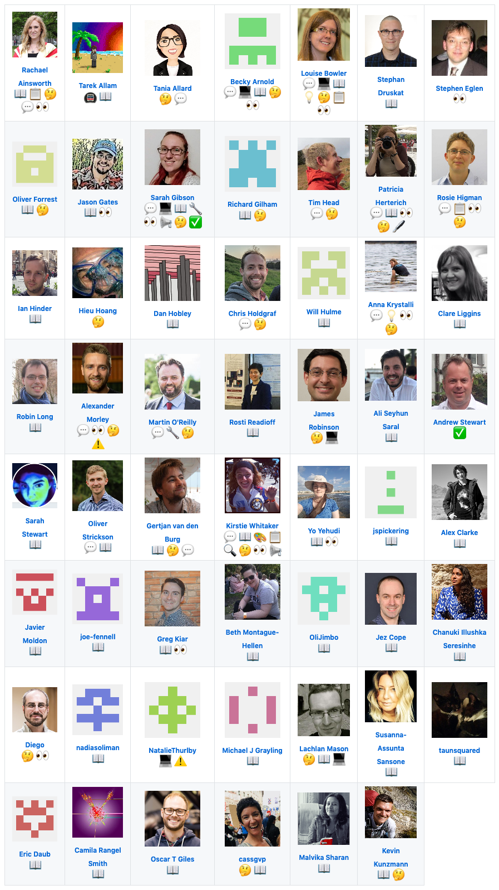

# Welcome to the Turing Way

The Turing Way is a lightly opinionated guide to reproducible data science.

Our goal is to provide all the information that researchers need at the start of their projects to ensure that they are easy to reproduce at the end.

This also means making sure PhD students, postdocs, PIs, and funding teams know which parts of the "responsibility of reproducibility" they can affect, and what they should do to nudge data science to being more efficient, effective, and understandable.

### A bit more background

Reproducible research is necessary to ensure that scientific work can be trusted.
Funders and publishers are beginning to require that publications include access to the underlying data and the analysis code.
The goal is to ensure that all results can be independently verified and built upon in future work.
This is sometimes easier said than done.
Sharing these research outputs means understanding data management, library sciences, sofware development, and continuous integration techniques: skills that are not widely taught or expected of academic researchers and data scientists.

*The Turing Way* is a handbook to support students, their supervisors, funders, and journal editors in ensuring that reproducible data science is "too easy not to do".
It will include training material on version control, analysis testing, open and transparent communication with future users, and build on Turing Institute case studies and workshops.

The project also demonstrates open and transparent project management and communication with future users, as it is openly developed at our GitHub repository: https://github.com/alan-turing-institute/the-turing-way. 
Any and all questions, comments and recommendations are welcome. 
All resources for the *[Boost your research reproducibility with Binder](https://github.com/alan-turing-institute/the-turing-way/tree/master/workshops/boost-research-reproducibility-binder)* and *[Build your own BinderHub](https://github.com/alan-turing-institute/the-turing-way/tree/master/workshops/build-a-binderhub)* workshops we have delivered, as well as how to organise a [Book Dash](https://github.com/alan-turing-institute/the-turing-way/tree/master/workshops/book-dash) (a one day book sprint), are also openly available and will soon be submitted to the [Journal of Open Source Education](https://jose.theoj.org/) (JOSE) to maximise the impact of the outputs of *The Turing Way*.

### The book itself

The book that you are reading is a [jupyter book](https://github.com/jupyter/jupyter-book/).
Jupyter books render markdown documents and jupyter notebooks as static html web pages.
They are easy to read and navigate...but also easy to edit and extend!

### Contributing to The Turing Way

*The Turing Way* is an open project, and follows [Mozilla's Open Leadership Framework](https://mozilla.github.io/open-leadership-framework/framework/#what-is-open) principles on openness:
- Understanding: You make the work accessible and clear.
- Sharing: You make the work easy to adapt, reproduce, and spread.
- Participation & inclusion: You build shared ownership and agency with contributors through accountability, equity, and transparency to make the work inviting, relevant, safe, and sustainable for all.

We strive to make this project welcoming and inviting to everyone - any and all contributions are welcome, no matter how small! 
**Please read and follow the project [Contributing Guidelines](https://github.com/alan-turing-institute/the-turing-way/blob/master/CONTRIBUTING.md).** 
If you find them confusing, difficult to follow or think that information needs to be added, please let us know! 
This will help us improve the contributing experience for everyone going forward.

### The Turing Way Community

The Turing Way is built by an incredible team.....and you!

The lead investigator for this project is [Dr Kirstie Whitaker](https://whitakerlab.github.io/about).
She is a research fellow at the [Alan Turing Institute](http://turing.ac.uk) and senior research associate in the [Department of Psychiatry](https://www.psychiatry.cam.ac.uk) at the University of Cambridge.

Our core contributors are, in alphabetical order:

* [Rachael Ainsworth](https://github.com/alan-turing-institute/the-turing-way/blob/master/contributors.md#rachael-ainsworth)
* [Becky Arnold](https://github.com/alan-turing-institute/the-turing-way/blob/master/contributors.md#becky-arnold)
* [Louise Bowler](https://github.com/alan-turing-institute/the-turing-way/blob/master/contributors.md#louise-bowler)
* [Sarah Gibson](https://github.com/alan-turing-institute/the-turing-way/blob/master/contributors.md#sarah-gibson)
* [Patricia Herterich](https://github.com/alan-turing-institute/the-turing-way/blob/master/contributors.md#patricia-herterich)
* [Rosie Higman](https://github.com/alan-turing-institute/the-turing-way/blob/master/contributors.md#rosie-higman)
* [Anna Krystalli](https://github.com/alan-turing-institute/the-turing-way/blob/master/contributors.md#anna-krystalli)
* [Alexander Morley](https://github.com/alan-turing-institute/the-turing-way/blob/master/contributors.md#alexander-morley)
* [Martin O'Reilly](https://github.com/alan-turing-institute/the-turing-way/blob/master/contributors.md#martin-oreilly)

The Turing Way follows the [all-contributors](https://github.com/kentcdodds/all-contributors#emoji-key) specification, so we welcome and recognise all contributions from documentation to testing to writing chapters. 
You can see all of our incredible contributors in our [README](https://github.com/alan-turing-institute/the-turing-way#contributors) file, and screengrabbed below.

Check out our [contributing guidelines](https://github.com/alan-turing-institute/the-turing-way/blob/master/CONTRIBUTING.md) on how you can join this fantastic group and help us build the most useful book we can!
