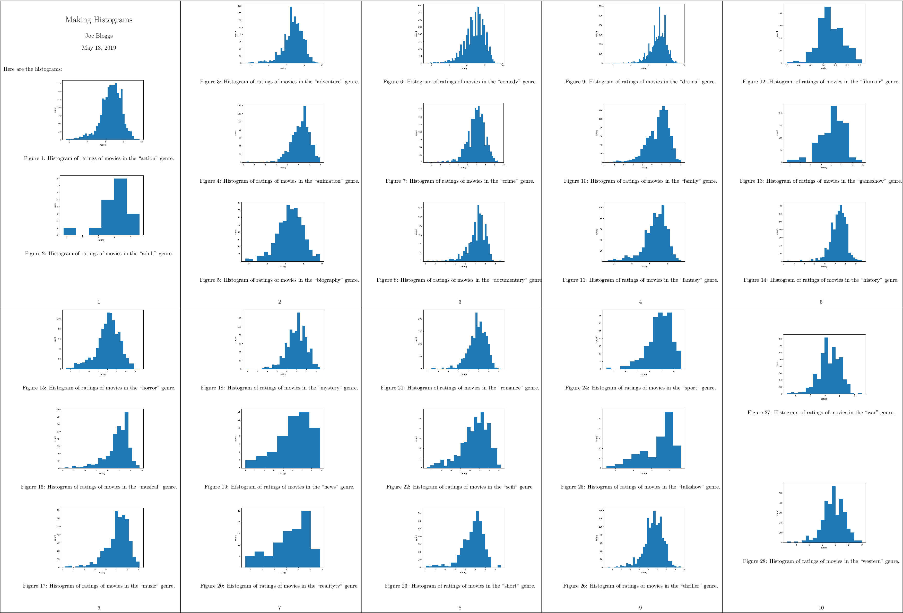

# Reproducibility with Make

## Prerequisites / recommended skill level

| Prerequisite | Importance | Notes |
| ------------ | ---------- | ----- |
| [Experience with the command line](https://programminghistorian.org/en/lessons/intro-to-bash) | Necessary | |
| [Version control](/version_control/version_control) | Helpful | Experience using git is useful to follow along with examples |

Recommended skill level: intermediate

## Table of contents

- [Summary](#summary)
- [An Introduction to Make](#an-introduction-to-make)
  - [What is Make](#what-is-make)
  - [Why use Make for Reproducible Research?](#why-use-make-for-reproducible-research)
- [Learn Make by Example](#learn-make-by-example)
  - [Setting up](#setting-up)
  - [Makefile no. 1 (The Basics)](#makefile-no-1-the-basics)
  - [Makefile no. 2 (all and clean)](#makefile-no-2-all-and-clean)
  - [Makefile no. 3 (Phony Targets)](#makefile-no-3-phony-targets)
  - [Makefile no. 4 (Automatic Variables and Pattern Rules)](#makefile-no-4-automatic-variables-and-pattern-rules)
  - [Makefile no. 5 (Wildcards and Path Substitution)](#makefile-no-5-wildcards-and-path-substitution)
  - [Debugging Makefiles](#debugging-makefiles)
- [A Real Reproducible Paper using Make](#a-real-reproducible-paper-using-make)
- [Including numerical results and tables](#including-numerical-results-and-tables)
- [Further Reading](#further-reading)
  - [Manual](#manual)
  - [Discussions](#discussions)
  - [Blogs](#blogs)
  - [Tools](#tools)
  - [Alternatives to Make](#alternatives-to-make)
- [Glossary](#glossary)
- [Appendix](#appendix)
  - [Directed Acyclic Graph](#directed-acyclic-graph)
  - [Installing Make](#installing-make)
  - [Advanced: Generating Rules using Call](#advanced-generating-rules-using-call)


## Summary

A data science or research project can be seen as a tree of dependencies: the 
report depends on the figures and tables, and these in turn depend on the data 
and the analysis scripts used to process this data (illustrated in the figure 
below).  Make is a tool for creating output files from their dependencies 
through pre-specified rules.  It is possible to combine these two ideas to 
create a reproducible project with Make.  In this chapter we give an 
introduction to Make and provide a tutorial on how Make can be used for a data 
analysis pipeline.  We also describe a real-world reproducible research 
project that uses Make to go from the raw input data to the experiments all 
the way to the pdf file of the paper!


<small style="margin: 5pt auto; text-align: center; display: block;">A 
schematic for a research project that uses LaTeX.</small>

## An Introduction to Make

### What is Make

Make is a build automation tool. It uses a configuration file called a 
Makefile that contains the *rules* for what to build. Make builds *targets* 
using *recipes*.  Targets can optionally have *prerequisites*.  Prerequisites 
can be files on your computer or other targets. Make determines what to build 
based on the dependency tree of the targets and prerequisites (technically, 
this is a [directed acyclic graph](#directed-acyclic-graph)).  It uses the 
*modification time* of prerequisites to update targets only when needed.

### Why use Make for Reproducibility?

There are several reasons why Make is a good tool to use for reproducibility:

1. Make is easy to learn
1. Make is available on many platforms
1. Make is flexible
1. Many people are already familiar with Make
1. Makefiles reduce cognitive load because as long as the common Make targets 
   ``all`` and ``clean`` are present (explained below), you can be up and 
   running without having to read lengthy instructions. This is especially 
   useful when you work on someone else's project or on one that you haven't 
   used in a long time.
1. Makefiles are human-readable and machine-readable text files. So instead of 
   writing instructions to a human for how to build a report or output, you 
   can provide a Makefile with instructions that can be read by a human *and* 
   executed by a computer.
1. Because Makefiles are text files they are easy to share and keep in version 
   control.
1. Using Make doesn't exclude using other tools such as Travis and Docker.

With a clever Makefile, you can share a complete analysis (code, data, and
computational workflows) and let collaborators or the readers of your paper
recompute your results.
By using tools such as LaTeX, you can even generate a complete manuscript that
includes freshly computed figures and results!
This can increase the trust in the research output that you generate, it can
make your research more accessible, and it can make collaborating easier.
This chapter can show you how to get started.

## Learn Make by Example

One of the things that might scare people off from using Make is that existing 
Makefiles can seem daunting and it may seem difficult to tailor to your own 
needs.  In this hands-on tutorial we will iteratively construct a Makefile for 
a real data analysis project. The idea is to explain different features of 
Make by iterating through several versions of a Makefile for this project. 
Hopefully the experience that you gain from this tutorial allows you to create 
Makefiles for your own projects.

We will create a ``Makefile`` for a data analysis pipeline. The task is as 
follows:

> **Task: Given some datasets, create a summary report (in pdf) that contains 
> the histograms of these datasets.**

(Of course this data task is very simple to focus on how to use Make.)

*Throughout the tutorial code blocks that start with a dollar sign (``$``) are 
intended to be typed in the terminal.*

### Setting up

We have created a basic repository for this task, that already contains 
everything that we need (*except the Makefile of course!*). To start, clone 
the base repository using git:

```bash
$ git clone https://github.com/alan-turing-institute/IntroToMake
```

This basic repository contains all the code that we'll need in this tutorial, 
and should have this content:

```text
.
├── data/
│   ├── input_file_1.csv
│   └── input_file_2.csv
├── LICENSE
├── output/
├── README.md
├── report/
│   └── report.tex
└── scripts/
    └── generate_histogram.py
```

- **data**: directory with two datasets that we're going to analyse
- **report**: the input directory for the report
- **scripts**: directory for the analysis script
- **output**: output directory for the figures and the report

You'll notice that there are two datasets in the **data** directory 
(``input_file_1.csv`` and ``input_file_2.csv``) and that there is already a 
basic Python script in **scripts** and a basic report LaTeX file in 
**report**.

If you want to follow along, ensure that you have the ``matplotlib`` and 
``numpy`` packages installed:

```bash
$ pip install matplotlib numpy
```

You will also need a working version of ``pdflatex`` and, of course, ``make``. 
For installation instructions for Make, see [the installation instructions 
below](#installing-make).

### Makefile no. 1 (The Basics)

Let's create our first Makefile. In the terminal, move into the 
``IntroToMake`` repository that you just cloned:

```bash
$ cd IntroToMake
```

Using your favourite editor, create a file called ``Makefile`` with the 
following contents:

```makefile
# Makefile for analysis report

output/figure_1.png: data/input_file_1.csv scripts/generate_histogram.py
	python scripts/generate_histogram.py -i data/input_file_1.csv -o output/figure_1.png

output/figure_2.png: data/input_file_2.csv scripts/generate_histogram.py
	python scripts/generate_histogram.py -i data/input_file_2.csv -o output/figure_2.png

output/report.pdf: report/report.tex output/figure_1.png output/figure_2.png
	cd report/ && pdflatex report.tex && mv report.pdf ../output/report.pdf
```
The indentation in each of the recipes are ***tabs***, Makefiles do not accept 
indentation with spaces.

You should now be able to type:

```bash
$ make output/report.pdf
```

If everything worked correctly, the two figures will be created and pdf report 
will be built.

Let's go through the Makefile in a bit more detail. We have three rules, two 
for the figures and one for the report. Let's look at the rule for 
``output/figure_1.png`` first. This rule has the target 
``output/figure_1.png`` that has two prerequisites: ``data/input_file_1.csv`` 
and ``scripts/generate_histogram.py``. By giving the output file these 
prerequisites it will be updated if either of these files changes. This is one 
of the reasons why Make was created: to update output files when source files 
change.

You'll notice that the recipe line calls Python with the script name and uses 
command line flags (``-i`` and ``-o``) to mark the input and output of the 
script. This isn't a requirement for using Make, but it makes it easy to see 
which file is an input to the script and which is an output.

The rule for the PDF report is very similar, but it has three prerequisites 
(the LaTeX source and both figures). Notice that the recipe changes the 
working directory before calling LaTeX and also moves the generated PDF to the 
output directory. We're doing this to keep the LaTeX intermediate files in the 
report directory. However, it's important to distinguish the above rule from 
the following:

```makefile
# don't do this
output/report.pdf: report/report.tex output/figure_1.png output/figure_2.png
	cd report/
	pdflatex report.tex
	mv report.pdf ../output/report.pdf
```

This rule places the three commands on separate lines. However, **Make 
executes each line independently** in a separate subshell, so changing the 
working directory in the first line has no effect on the second, and a failure 
in the second line won't stop the third line from being executed. Therefore, 
we combine the three commands in a single recipe above.

This is what the dependency tree looks like for this Makefile:


<small style="margin: 5pt auto; text-align: center; display: block;">The 
dependency graph for our first Makefile, created using 
[makefile2graph](#tools). Notice the similarity to the figure at the 
top!</small>


### Makefile no. 2 (all and clean)

In our first Makefile we have the basic rules in place. We could stick with 
this if we wanted to, but there are a few improvements we can make:

1. We now have to explicitly call ``make output/report.pdf`` if we want to 
   make the report.

2. We have no way to clean up and start fresh.

Let's remedy this by adding two new targets: ``all`` and ``clean``. In your 
editor, change the Makefile contents to add the ``all`` and ``clean`` rules as 
follows:

```makefile
# Makefile for analysis report

all: output/report.pdf

output/figure_1.png: data/input_file_1.csv scripts/generate_histogram.py
	python scripts/generate_histogram.py -i data/input_file_1.csv -o output/figure_1.png

output/figure_2.png: data/input_file_2.csv scripts/generate_histogram.py
	python scripts/generate_histogram.py -i data/input_file_2.csv -o output/figure_2.png

output/report.pdf: report/report.tex output/figure_1.png output/figure_2.png
	cd report/ && pdflatex report.tex && mv report.pdf ../output/report.pdf

clean:
	rm -f output/report.pdf
	rm -f output/figure_*.png
```

Note that we've added the ``all`` target to the top of the file. We do this 
because Make executes the *first* target when no explicit target is given.  So 
you can now type ``make`` on the command line and it would do the same as 
``make all``.  Also, note that we've only added the report as the prerequisite 
of ``all`` because that's our desired output and the other rules help to build 
that output. If you have multiple outputs, you could add these as further 
prerequisites to the ``all`` target. Calling the main target ``all`` is a 
convention of Makefiles that many people follow.

The ``clean`` rule is typically at the bottom, but that's more style than 
requirement. Note that we use the ``-f`` flag to ``rm`` to make sure it 
doesn't complain when there is no file to remove.

You can try out the new Makefile by running:

```bash
$ make clean
$ make
```

Make should remove the output and intermediate files after the first command, 
and generate them again after the second.

### Makefile no. 3 (Phony Targets)

Typically, ``all`` and ``clean`` are defined as so-called [Phony 
Targets](https://www.gnu.org/software/make/manual/make.html#Phony-Targets). 
These are targets that don't actually create an output file. Such targets will 
always be run if they come up in a dependency, but will no longer be run if a 
directory/file is ever created that is called ``all`` or ``clean``. We 
therefore add a line at the top of the Makefile to define these two as phony 
targets:

```makefile
# Makefile for analysis report

.PHONY: all clean

all: output/report.pdf

output/figure_1.png: data/input_file_1.csv scripts/generate_histogram.py
	python scripts/generate_histogram.py -i data/input_file_1.csv -o output/figure_1.png

output/figure_2.png: data/input_file_2.csv scripts/generate_histogram.py
	python scripts/generate_histogram.py -i data/input_file_2.csv -o output/figure_2.png

output/report.pdf: report/report.tex output/figure_1.png output/figure_2.png
	cd report/ && pdflatex report.tex && mv report.pdf ../output/report.pdf

clean:
	rm -f output/report.pdf
	rm -f output/figure_*.pdf
```

Phony targets are also useful when you want to use Make recursively. In that 
case you would specify the subdirectories as phony targets. You can read more 
about [phony targets in the 
documentation](https://www.gnu.org/software/make/manual/make.html#Phony-Targets), 
but for now it's enough to know that ``all`` and ``clean`` are typically 
declared as phony.

> Sidenote: another target that's typically phony is **test**, in case you 
> have a directory of tests called **test** and want to have a target to run 
> them that's also called **test**.

### Makefile no. 4 (Automatic Variables and Pattern Rules)

There's nothing wrong with the Makefile we have now, but it's somewhat verbose 
because we've declared all the targets explicitly using separate rules. We can 
simplify this by using [Automatic 
Variables](https://www.gnu.org/software/make/manual/html_node/Automatic-Variables.html) 
and [Pattern 
Rules](https://www.gnu.org/software/make/manual/html_node/Pattern-Rules.html#Pattern-Rules). 

<a name="automatic_var">

**Automatic Variables.** With automatic variables we can use the names of the 
prerequisites and targets in the recipe. Here's how we would do that for the 
figure rules:

```makefile
# Makefile for analysis report

.PHONY: all clean

all: output/report.pdf

output/figure_1.png: data/input_file_1.csv scripts/generate_histogram.py
	python scripts/generate_histogram.py -i $< -o $@

output/figure_2.png: data/input_file_2.csv scripts/generate_histogram.py
	python scripts/generate_histogram.py -i $< -o $@

output/report.pdf: report/report.tex output/figure_1.png output/figure_2.png
	cd report/ && pdflatex report.tex && mv report.pdf ../output/report.pdf

clean:
	rm -f output/report.pdf
	rm -f output/figure_*.pdf
```

We've replaced the input and output filenames in the recipes respectively by 
``$<``, which denotes the *first* prerequisite and ``$@`` which denotes the 
*target*. You can remember ``$<`` because it's like an arrow that points to 
the beginning (*first* prerequisite), and you can remember ``$@`` (dollar 
*at*) [as the target you're aiming 
*at*](https://jameshfisher.com/2016/12/07/makefile-automatic-variables/).

There are more automatic variables that you could use, see [the 
documentation](https://www.gnu.org/software/make/manual/html_node/Automatic-Variables.html).

<a name="pattern_rules">

**Pattern Rules.** Notice that the recipes for the figures have become 
identical!  Because we don't like to repeat ourselves, we can combine the two 
rules into a single rule by using *pattern rules*. Pattern rules allow you to 
use the ``%`` symbol as a wildcard and combine the two rules into one:

```makefile
# Makefile for analysis report

.PHONY: all clean

all: output/report.pdf

output/figure_%.png: data/input_file_%.csv scripts/generate_histogram.py
	python scripts/generate_histogram.py -i $< -o $@

output/report.pdf: report/report.tex output/figure_1.png output/figure_2.png
	cd report/ && pdflatex report.tex && mv report.pdf ../output/report.pdf

clean:
	rm -f output/report.pdf
	rm -f output/figure_*.pdf
```

The ``%`` symbol is now a wildcard that (in our case) takes the value ``1`` or 
``2`` based on the input files in the ``data`` directory. You can check that 
everything still works by running ``make clean`` followed by ``make``.

An advantage of this is that if you now want to add another dataset, say 
``input_file_3``, then you would only need to add that to the rule for the 
report!


### Makefile no. 5 (Wildcards and Path Substitution)

When Makefiles get more complex, you may want to use more advanced features 
such as building outputs for all the files in an input directory. While 
pattern rules will get you a long way, Make also has features for wildcards 
and string or path manipulation for when pattern rules are insufficient.

While previously our input files were numbered, we'll now switch to a scenario 
where they have more meaningful names. Let's switch over to the ``big_data`` 
branch:

```bash
$ git stash                     # stash the state of your working directory
$ git checkout big_data         # checkout the big_data branch
```

The directory structure now looks like this:

```text
├── data/
│   ├── action.csv
│   ├── ...
│   ├── input_file_1.csv
│   ├── input_file_2.csv
│   ├── ...
│   └── western.csv
├── LICENSE
├── output/
├── README.md
├── report/
│   └── report.tex
└── scripts/
    └── generate_histogram.py
```

As you can see, the **data** directory now contains additional input files 
that are named more meaningfully (the data are IMBD movie ratings by genre). 
Also, the **report.tex** file has been updated to work with the expected 
figures.

We'll adapt our Makefile to create a figure in the output directory called 
``histogram_{genre}.png`` for each ``{genre}.csv`` file, while excluding the 
``input_file_{N}.csv`` files.

> Sidenote: if we were to remove the ``input_file_{N}.csv`` files, pattern 
> rules would be sufficient here. This highlights that sometimes your 
> directory structure and Makefile should be developed hand in hand.

Before changing the Makefile, run

```bash
$ make clean
```
to remove the output files.

We'll show the full Makefile first, and then describe the different lines in 
more detail. The complete file is:

```makefile
# Makefile for analysis report
#

ALL_CSV = $(wildcard data/*.csv)
INPUT_CSV = $(wildcard data/input_file_*.csv)
DATA = $(filter-out $(INPUT_CSV),$(ALL_CSV))
FIGURES = $(patsubst data/%.csv,output/figure_%.png,$(DATA))

.PHONY: all clean

all: output/report.pdf

$(FIGURES): output/figure_%.png: data/%.csv scripts/generate_histogram.py
	python scripts/generate_histogram.py -i $< -o $@

output/report.pdf: report/report.tex $(FIGURES)
	cd report/ && pdflatex report.tex && mv report.pdf ../$@

clean:
	rm -f output/report.pdf
	rm -f $(FIGURES)
```

First, we use the ``wildcard`` function to create a variable that lists all 
the CSV files in the data directory and one that lists only the old 
``input_file_{N}.csv`` files:

```makefile
ALL_CSV = $(wildcard data/*.csv)
INPUT_CSV = $(wildcard data/input_file_*.csv)
```

A code convention for Makefiles is to use all capitals for variable names and 
define them at the top of the file.

Next, we create a variable to list only the data files that we're interested 
in by filtering out the ``INPUT_CSV`` from ``ALL_CSV``:

```makefile
DATA = $(filter-out $(INPUT_CSV),$(ALL_CSV))
```

This line uses the 
[``filter-out``](https://www.gnu.org/software/make/manual/make.html#index-filter_002dout) 
function to remove items in the ``INPUT_CSV`` variable from the ``ALL_CSV`` 
variable.  Note that we use both the ``$( ... )`` syntax for functions and 
variables. Finally, we'll use the ``DATA`` variable to create a ``FIGURES`` 
variable with the desired output:

```makefile
FIGURES = $(patsubst data/%.csv,output/figure_%.png,$(DATA))
```

Here we've used the 
[``patsubst``](https://www.gnu.org/software/make/manual/make.html#index-patsubst-1) 
function to transform the input in the ``DATA`` variable (that follows the 
``data/{genre}.csv`` pattern) to the desired output filenames (using the 
``output/figure_{genre}.png`` pattern). Notice that the ``%`` character marks 
the part of the filename that will be the same in both the input and output.

Now we use these variables for the figure generation rule as follows:

```makefile
$(FIGURES): output/figure_%.png: data/%.csv scripts/generate_histogram.py
	python scripts/generate_histogram.py -i $< -o $@
```

This rule again applies a pattern: it takes a list of targets (``$(FIGURES)``) 
that all follow a given pattern (``output/figure_%.png``) and based on that 
creates a prerequisite (``data/%.csv``). Such a pattern rule is slightly 
different from the one we saw before because it uses two ``:`` symbols. It is 
called a [static pattern 
rule](https://www.gnu.org/software/make/manual/make.html#Static-Pattern).

Of course we have to update the ``report.pdf`` rule as well:

```makefile
output/report.pdf: report/report.tex $(FIGURES)
	cd report/ && pdflatex report.tex && mv report.pdf ../$@
```

and the ``clean`` rule:

```makefile
clean:
	rm -f output/report.pdf
	rm -f $(FIGURES)
```

If you run this Makefile, it will need to build 28 figures. You may want to 
use the ``-j`` flag to ``make`` to build these targets **in parallel!**

```bash
$ make -j 4
```

The ability to build targets in parallel is quite useful when your project has 
many dependencies!

The resulting PDF file should now look like this:

<small 
style="margin: 5pt auto; text-align: center; display: block;">A compressed 
view of the report with histograms for all genres.</small>

### Debugging Makefiles

When writing a Makefile, it can sometimes be useful to be able to see the 
values of variables to catch mistakes or bugs in the Makefile. To facilitate 
this, Make contains two commands: ``info`` and ``error``, and there is a debug 
mode to Make.

With the ``info`` command you can print the current value of a variable to 
stdout, while Make is processing the file. For instance, in the Makefile above 
you could add:

```makefile
$(info $$DATA = $(DATA))
```

This will print ``DATA = data/action.csv ... data/western.csv``. 

With the ``error`` command you can stop the execution of Make at a certain 
point in the Makefile. This is useful when you want to print the value of a 
variable and not run Make any further:

```makefile
$(error $$DATA = $(DATA))
```

Finally, you can also debug the Makefile by running Make with the debug flag: 
``make -d``. This will print all the rules (including built-in ones) that Make 
tries for each of the targets, and whether or not a rule needs to be run.

If you only want to print the rules that Make will run and not actually run 
them, you can use ``make -n``. These last two options can also be combined, so 
that you see the debug output and Make doesn't run anything: ``make -dn``.

## A Real Reproducible Paper using Make

In the tutorial above we used IMDB movie ratings for different genres as 
example data. This data was obtained from a dataset [shared on 
Kaggle](https://www.kaggle.com/orgesleka/imdbmovies#imdb.csv) as a CSV file. 
The file looks like this:

```text
fn,tid,title,wordsInTitle,url,imdbRating,ratingCount,duration,year,type,nrOfWins,nrOfNominations,nrOfPhotos,nrOfNewsArticles,nrOfUserReviews,nrOfGenre,Action,Adult,Adventure,Animation,Biography,Comedy,Crime,Documentary,Drama,Family,Fantasy,FilmNoir,GameShow,History,Horror,Music,Musical,Mystery,News,RealityTV,Romance,SciFi,Short,Sport,TalkShow,Thriller,War,Western
titles01/tt0012349,tt0012349,Der Vagabund und das Kind (1921),der vagabund und das kind,http://www.imdb.com/title/tt0012349/,8.4,40550,3240,1921,video.movie,1,0,19,96,85,3,0,0,0,0,0,1,0,0,1,1,0,0,0,0,0,0,0,0,0,0,0,0,0,0,0,0,0,0
titles01/tt0015864,tt0015864,Goldrausch (1925),goldrausch,http://www.imdb.com/title/tt0015864/,8.3,45319,5700,1925,video.movie,2,1,35,110,122,3,0,0,1,0,0,1,0,0,0,1,0,0,0,0,0,0,0,0,0,0,0,0,0,0,0,0,0,0
titles01/tt0017136,tt0017136,Metropolis (1927),metropolis,http://www.imdb.com/title/tt0017136/,8.4,81007,9180,1927,video.movie,3,4,67,428,376,2,0,0,0,0,0,0,0,0,1,0,0,0,0,0,0,0,0,0,0,0,0,1,0,0,0,0,0,0
titles01/tt0017925,tt0017925,Der General (1926),der general,http://www.imdb.com/title/tt0017925/,8.3,37521,6420,1926,video.movie,1,1,53,123,219,3,1,0,1,0,0,1,0,0,0,0,0,0,0,0,0,0,0,0,0,0,0,0,0,0,0,0,0,0
```

While on the surface this looks like a regular CSV file, when you try to open 
it with the Python CSV library, or Pandas, or R's ``read_csv``, or even 
``readr:read_csv``, the data is not loaded correctly. This happens because the 
CSV file uses an escape character ``\`` for movie names that have commas in 
them and the CSV readers don't automatically detect this variation in the CSV 
format.  It turns out that this is quite a common issue for data scientists: 
CSV files are often messy and use an uncommon *dialect*: such as strange delimiters and
uncommon quote characters.  Collectively, data scientists waste quite 
some time on these data wrangling issues where manual intervention is needed. 
But this problem is also not that easy to solve: to a computer a CSV file is 
simply a long string of characters and every dialect will give you *some* 
table, so how do we determine the dialect accurately in general?

Recently, researchers from the Alan Turing Institute have presented a method 
that achieves 97% accuracy on a large corpus of CSV files, with an improvement 
of 21% over existing approaches on non-standard CSV files. This research was 
made reproducible through the use of Make and is available through an online 
repository: 
[https://github.com/alan-turing-institute/CSV_Wrangling](https://github.com/alan-turing-institute/CSV_Wrangling).

Below we will briefly describe what the Makefile for such a project looks 
like.  For the complete file, please see the repository. The Makefile consists 
of several sections:

1. Data collection: because the data is collected from public sources, the 
   repository contains a Python script that allows anyone to download the data 
   through a simple ``make data`` command.

2. All the figures, tables, and constants used in the paper are generated 
   based on the results from the experiments. To make it easy to recreate all 
   results of a certain type, ``.PHONY`` targets are included that depend on 
   all results of that type (so you could run ``make figures``). The rules for 
   these outputs follow the same pattern as those for the figures in the 
   tutorial above.  Tables are created as LaTeX files so they can be directly 
   included in the LaTeX source for the manuscript.

3. The rules for the detection results follow a specific signature:

   ```makefile
   $(OUT_DETECT)/out_sniffer_%.json: $(OUT_PREPROCESS)/all_files_%.txt
   	python $(SCRIPT_DIR)/run_detector.py sniffer $(DETECTOR_OPTS) $< $@
   ```

   The ``%`` symbol is used to create outputs for both sources of CSV files 
   with a single rule (see [Pattern Rules](#pattern_rules)) and the rule uses 
   [automatic variables](#automatic_var) to extract the input and output 
   filenames.

4. Some of the cleaning rules will remove output files that take a while to 
   create.  Therefore, these depend on a special ``check_clean`` target that 
   asks the user to confirm before proceeding:

   ```makefile
   check_clean:
   	@echo -n "Are you sure? [y/N]" && read ans && [ $$ans == y ]
   ```

It is important to emphasize that this file was not created in one go, but was 
constructed iteratively. The Makefile started as a way to run several dialect 
detection methods on a collection of input files and gradually grew to include 
the creation of figures and tables from the result files. Thus the advice for 
using Make for reproducibility is to *start small and start early*.

The published Makefile in the repository does not contain the paper, but this 
*is* included in the internal Makefile and follows the same structure as the 
``report.pdf`` file in the tutorial above. This proved especially useful for 
collaboration as only a single repository needed to be shared that contains 
the code, the results, and the manuscript.

## Including numerical results and tables

At this point you may be thinking "That's so cool that I can now include figures
into my manuscripts! But how exactly does this work for numerical results?"

The reproducible paper linked above shows one way of doing it:
After the results are computed, they are written out in the form of a LaTeX
table.
Here is how one of these tables looks like right after it was computed:

```latex
\begin{tabular}{lrrr|rrrr}
Property & HypoParsr & Sniffer & Suitability & Pattern & Type & No Tie & Full\\
\hline
Delimiter & 87.48 & 86.82 & 65.41 & 92.61 & 88.33 & 91.38 & \textbf{94.92}\\
Quotechar & 82.90 & 92.36 & 44.60 & 95.23 & 90.10 & 93.80 & \textbf{97.36}\\
Escapechar & 87.96 & 94.37 & 74.85 & 97.95 & 96.26 & 95.44 & \textbf{99.25}\\
Overall & 80.60 & 85.45 & 38.19 & 90.99 & 83.61 & 90.61 & \textbf{93.75}\\
\hline
\end{tabular}
```

To include this table into your manuscript, you can use LaTeX's `\input{}`
function. If the file with the table is called `mytable.tex`, this command
can insert it into your manuscript:

```latex
\begin{table}
\input{mytable}
\end{table}
```

An alternative is to make use of variables.
Instead of creating a table in a separate file, you can write a table skeleton
and populate it with variables.
The results you compute are associated with the variables, and once your
manuscript is compiled, variables are exchanged for real numerical results.
Here is how such a table looks like in your manuscript:

```latex
\begin{table}
    \begin{tabular*}{ccc}
        \textbf{Variable} & \textbf{Mean}   & \textbf{Std. deviation} \
        \hline
        Variable 1        & \var1mean       & \var1std                \
        Variable 2        & \var2mean       & \var2std                \
    \end{tabular*}
\end{table}
```

Ỳou may notice that `\var1mean` is no standard LaTeX command: It is a variable
that you can define yourself!
How is this done?
Have your script print the results you compute within a `\newcommand{}{}`
definition into a file, for example like this (simplified Python example):

```python
# this loops to data vectors of two variables (data1, data2), compute the
# mean and standard deviation, and print the results together with the
# variable name ('var1', 'var2')
for name, data in (['var1', data1], ['var2', data2]):
    mean = np.mean(data)
    std = np.mean(data)
    print('\\newcommand{\\%s }{ %f }' % (name + 'mean', mean))
    print('\\newcommand{\\%s }{ %f }' % (name + 'std', std))
```

Let's say the mean of the first dataset is 9.2, the definition would look like
this: `\newcommand{\var1mean}{9.2}`.
Note that this example uses Python, but you can use any language or method you
are familiar with to print definitions like this.
With this definition, LaTeX exchanges the table cell with `\var1mean` with the
numeric result from the computation.
You can capture the definitions and write them to a file using redirection with
`>`.
In this example, we write it to a file called `results_def.tex`

```makefile
results_def.tex: code/make_summary_stats.py
	python code/make_summary_stats.py > results_def.tex
```

As an alternative to `>`, you could also redirect the results using the Unix
[pipe](https://en.wikipedia.org/wiki/Pipeline_(Unix)) and the
[tee](https://en.wikipedia.org/wiki/Tee_(command)) command
(`python code/make_summary_stats.py | tee results_def.tex`).
This will not only redirect the output of the script to a file, but also print
them into your terminal.
This helpful trick can help you observe whether everything works as expected
during the execution of your script.

Finally, use the `input{}` command to include the new variables in your
manuscript and the variables in the tables:

```latex
\begin{document}
\input{results_def.tex}
```

The examples shown here are simplistic, but with a bit of thinking, you can
make sure to include results into your manuscript just as they are computed.
This helps you (no mistakes copying results to tables, yay!) and makes your
research more accessible and reproducible.


## Further Reading

### Manual

- [The Official Make Reference 
  manual](https://www.gnu.org/software/make/manual/make.html).

### Discussions

- [Discussion on Make on 
  HackerNews](https://news.ycombinator.com/item?id=15041986).

- [Recursive Make Considered 
  Harmful](http://aegis.sourceforge.net/auug97.pdf). This is a well-known 
  paper on why you shouldn't use nested makefiles. To summarise: if you do 
  this Make can't see the entire DAG and that leads to problems.

- [Non-Recursive Make Considered 
  Harmful](https://www.microsoft.com/en-us/research/wp-content/uploads/2016/03/hadrian.pdf): 
  This is a research paper describing the failings of Make for large and 
  complex builds.

### Blogs

Of course we are not the first to suggest the use of Make for reproducibility! 
The blog posts cited below were found after the above tutorial was written, 
but can add further information and examples.

- [Reproducibility is 
  hard](https://kbroman.wordpress.com/tag/reproducible-research/). Discusses 
  making a research project reproducible using Make.

- [GNU Make for Reproducible Data Analysis](http://zmjones.com/make/). Argues 
  for using Make for reproducible analysis in a similar vein as we do above.

- [Reproducible Bioinformatics Pipelines using 
  Make](http://byronjsmith.com/make-bml/). A quite extensive tutorial on using 
  Make for data analysis.

- [Automatic Data-analysis 
  Pipelines](http://stat545.com/automation04_make-activity.html). A similar 
  tutorial that uses R for the analysis.

- [Writing a reproducible Paper](http://handbook.datalad.org/en/latest/usecases/reproducible-paper.html#automation-with-existing-tools).
  A similar tutorial with Python using variables to populate tables in the
  manuscript.

### Tools

- Plot the DAG of the Makefile with 
  [makefile2graph](https://github.com/lindenb/makefile2graph).

### Alternatives to Make

There are [many alternatives to 
Make](https://en.wikipedia.org/wiki/List_of_build_automation_software). Below 
are some that caught our eye and that might be worth a look.

- [SnakeMake](https://snakemake.readthedocs.io/en/stable/). A Python3-based 
  alternative to Make. Snakemake supports multiple wildcards in filenames, 
  supports Python code in rules, and can run workflows on workstations, 
  clusters, the grid, and in the cloud without modification. 

- [Tup](http://gittup.org/tup/index.html). A fast build system that processes 
  prerequisites bottom-up instead of Make's top-down. The speed looks 
  impressive and the paper describing it is interesting, but for small 
  projects Make's speed will not be a bottleneck. The Tupfile syntax is not 
  compatible with that of Makefiles.

- [Bazel](https://www.bazel.build). An open-source version of Google's Blaze 
  build system.

- [Buck](https://buckbuild.com/). Facebook's build system.

## Glossary

**Makefile:** a text file that contains the configuration for the build

**Rule:** an element of the Makefile that defines something that must be 
built, usually consists of *targets*, *recipes*, and optionally, 
*prerequisites*.

**Target:** the outcome of a *rule* in a Makefile. It is usually a file. If it 
is not a file, it's a *phony* target.

**Recipe:** one or more shell commands that are executed by Make. Usually 
these commands update the *target* of the *rule*.

**Prerequisite:** the prerequisite(s) of a rule correspond to files or other 
targets in the Makefile that must be up to date before the rule is run.

**Phony:** a phony target is one that doesn't correspond to a file on the 
filesystem. A target is marked as phony by making it a prerequisite of the 
``.PHONY`` target.

**Pattern:** A pattern rule is a rule that contains exactly one ``%`` 
character in the target, which can be used to match a part of a filename.

## Appendix

### Directed Acyclic Graph

A Directed Acyclic Graph (DAG) is a *graph* of nodes and edges that is:

1. *directed*: edges have a direction and you can only walk the graph in that 
   direction
2. *acyclic*: does not contain cycles: A can't depend on B when B depends on A.

The latter property is of course quite handy for a build system. More 
information on DAGs can be found on 
[Wikipedia](https://en.wikipedia.org/wiki/Directed_acyclic_graph).

### Installing Make

First, check if you have GNU Make installed already. In a terminal type:

```bash
$ make
```

If you get ``make: command not found`` (or similar), you don't have Make. If 
you get ``make: *** No targets specified and no makefile found.  Stop.`` you 
do have Make.

We'll be using **GNU Make** in this tutorial. Verify that this is what you 
have by typing:

```bash
$ make --version
```

If you don't have GNU Make but have the BSD version, some things might not 
work as expected and we recommend installing GNU Make.

To install GNU Make, please follow these instructions:

- **Linux**: Use your package manager to install Make. For instance on Arch 
  Linux:

  ```bash
  $ sudo pacman -S make
  ```

  Ubuntu:
  ```bash
  $ sudo apt-get install build-essential
  ```

- **MacOS**: If you have [Homebrew](https://brew.sh/) installed, it's simply:

  ```bash
  $ brew install make
  ```

  If you have a builtin Make implementation, please ensure that it's GNU Make 
  by checking ``make --version``.

### Advanced: Generating Rules using Call

*This section continues the tutorial above and demonstrates a feature of Make 
for automatic generation of rules.*

In a data science pipeline, it may be quite common to apply multiple scripts 
to the same data (for instance when you're comparing methods or testing 
different parameters). In that case, it can become tedious to write a separate 
rule for each script when only the script name changes. To simplify this 
process, we can let Make expand a so-called [*canned* 
recipe](https://www.gnu.org/software/make/manual/make.html#Canned-Recipes).

To follow along, switch to the ``canned`` branch:

```bash
$ make clean
$ git stash --all        # note the '--all' flag so we also stash the Makefile
$ git checkout canned
```

On this branch you'll notice that there is a new script in the **scripts** 
directory called ``generate_qqplot.py``. This script works similarly to the 
``generate_histogram.py`` script (it has the same command line syntax), but it 
generates a [QQ-plot](https://en.wikipedia.org/wiki/Q%E2%80%93Q_plot). The 
**report.tex** file has also been updated to incorporate these plots.

After switching to the ``canned`` branch there will be a Makefile in the 
repository that contains a separate rule for generating the QQ-plots. This 
Makefile looks like this:

```makefile
# Makefile for analysis report
#

ALL_CSV = $(wildcard data/*.csv)
DATA = $(filter-out $(wildcard data/input_file_*.csv),$(ALL_CSV))
HISTOGRAMS = $(patsubst data/%.csv,output/figure_%.png,$(DATA))
QQPLOTS = $(patsubst data/%.csv,output/qqplot_%.png,$(DATA))

.PHONY: all clean

all: output/report.pdf

$(HISTOGRAMS): output/histogram_%.png: data/%.csv scripts/generate_histogram.py
	python scripts/generate_histogram.py -i $< -o $@

$(QQPLOTS): output/qqplot_%.png: data/%.csv scripts/generate_qqplot.py
	python scripts/generate_qqplot.py -i $< -o $@

output/report.pdf: report/report.tex $(FIGURES)
	cd report/ && pdflatex report.tex && mv report.pdf ../$@

clean:
	rm -f output/report.pdf
	rm -f $(HISTOGRAMS) $(QQPLOTS)
```

You'll notice that the rules for histograms and QQ-plots are very similar.

As the number of scripts that you want to run on your data grows, this may 
lead to a large number of rules in the Makefile that are almost exactly the 
same. We can simplify this by creating a [*canned 
recipe*](https://www.gnu.org/software/make/manual/html_node/Canned-Recipes.html) 
that takes both the name of the script and the name of the genre as input:

```makefile
define run-script-on-data
output/$(1)_$(2).png: data/$(2).csv scripts/generate_$(1).py
	python scripts/generate_$(1).py -i $$< -o $$@
endef
```

Note that in this recipe we use ``$(1)`` for either ``histogram`` or 
``qqplot`` and ``$(2)`` for the genre. These correspond to the expected 
function arguments to the ``run-script-on-data`` canned recipe. Also, notice 
that we use ``$$<`` and ``$$@`` in the actual recipe, with two ``$`` symbols 
for escaping. To actually create all the targets, we need a line that calls 
this canned recipe.  In our case, we use a double for loop over the genres and 
the scripts:

```makefile
$(foreach genre,$(GENRES),\
	$(foreach script,$(SCRIPTS),\
		$(eval $(call run-script-on-data,$(script),$(genre))) \
	) \
)
```

In these lines the ``\`` character is used for continuing long lines.

The full Makefile then becomes:

```makefile
# Makefile for analysis report
#

ALL_CSV = $(wildcard data/*.csv)
DATA = $(filter-out $(wildcard data/input_file_*.csv),$(ALL_CSV))
HISTOGRAMS = $(patsubst %,output/histogram_%.png,$(GENRES))
QQPLOTS = $(patsubst %,output/qqplot_%.png,$(GENRES))

GENRES = $(patsubst data/%.csv,%,$(DATA))
SCRIPTS = histogram qqplot

.PHONY: all clean

all: output/report.pdf

define run-script-on-data
output/$(1)_$(2).png: data/$(2).csv scripts/generate_$(1).py
	python scripts/generate_$(1).py -i $$< -o $$@
endef

$(foreach genre,$(GENRES),\
	$(foreach script,$(SCRIPTS),\
		$(eval $(call run-script-on-data,$(script),$(genre)))\
	)\
)

output/report.pdf: report/report.tex $(HISTOGRAMS) $(QQPLOTS)
	cd report/ && pdflatex report.tex && mv report.pdf ../$@

clean:
	rm -f output/report.pdf
	rm -f $(HISTOGRAMS) $(QQPLOTS)
```

Note that we've added a ``SCRIPTS`` variable with the ``histogram`` and 
``qqplot`` names. If we were to add another script that follows the same 
pattern as these two, we would only need to add it to the ``SCRIPTS`` 
variable.

To build all of this, run

```bash
$ make -j 4
```
