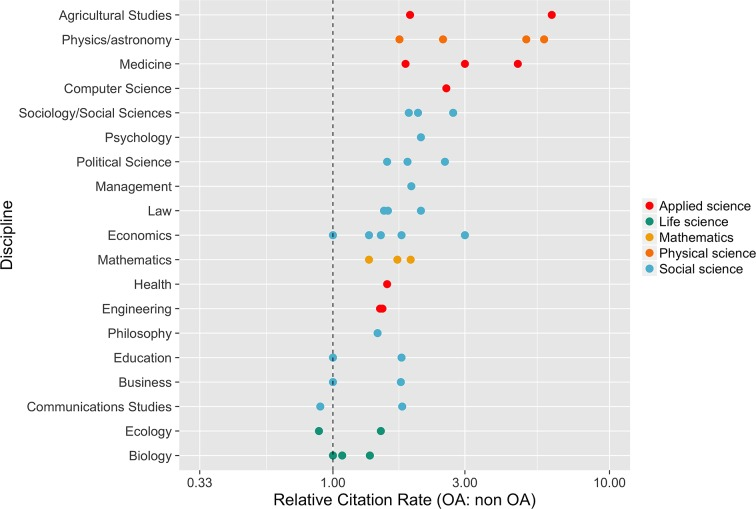

# Open research

## Prerequisites / recommended skill level

| Prerequisite | Importance | Notes |
| -------------|----------|------|
| [Experience with version control](/version_control/version_control) | Helpful | Experience with GitHub is particularly useful |

Recommended skill level: low.

## Summary

Open research aims to transform research by making it more reproducible, transparent, re-usable, collaborative, accountable, and accessible to society. It pushes for change in the way that research is carried out and disseminated by digital tools. One definition of open research, [as given by the Organisation for Economic Co-operation and Development (OECD)](https://www.fct.pt/dsi/docs/Making_Open_Science_a_Reality.pdf "Making Open Science a Reality, OECD Science, Technology and Industry Policy Papers No. 25"), is the practice of making "the primary outputs of publicly funded research results – publications and the research data – publicly accessible in digital format with no or minimal restriction." In order to achieve this openness in research, each element of the research process should:

- Be publicly available: It is difficult to use and benefit from knowledge hidden behind barriers such as passwords and paywalls.
- Be reusable: Research outputs need to be licensed appropriately so that prospective users clearly know any limitations on re-use.
- Be transparent: With appropriate metadata to provide clear statements of how research output was produced and what it contains.

The research process typically has the following form: data is collected and then analysed (usually using software). This process may involve the use of specialist hardware. The results of the research are then published. Throughout the process it is good practice for researchers to document their working in notebooks. Open research aims to make each of these elements open:

- Open data: Documenting and sharing research data openly for re-use.
- Open source software: Documenting research code and routines, and making them freely accessible and available.
- Open hardware: Documenting designs, materials, and other relevant information related to hardware, and making them freely accessible and available.
- Open access: Making all published outputs freely accessible for maximum use and impact.
- Open notebooks: An emerging practice, documenting and sharing the experimental process of trial and error.

These elements are expanded upon in this chapter.

Open scholarship is a concept that extends open research further. It relates to making other aspects of scientific research open to the public, for example:

- Open educational resources: Making educational resources publicly available to be re-used and modified.
- Equity, diversity, inclusion: Ensuring scholarship is open to anyone without barriers based on factors such as race, background, gender, and sexual orientation.
- Citizen science: The inclusion of members of the public in scientific research.

These elements are also discussed in detail in this chapter.

## How this will help you / why this is useful

There are five main schools of thought motivating open practices to benefit research:

| School                     | Belief               | Aim                                               |
| -------------------------- | -------------------- | ------------------------------------------------- |
| Infrastructure | Efficient research depends on the available tools and applications. | Creating openly available platforms, tools, and services for researchers. |
| Pragmatic | Knowledge-creation could be more efficient if researchers worked together. | Opening up the process of knowledge creation. |
| Measurement | Academic contributions today need alternative impact measurements. | Developing an alternative metric system for research impact. |
| Democratic | The access to knowledge is unequally distributed. | Making knowledge freely available for everyone. |
| Public | Research needs to be made accessible to the public. | Making research accessible for citizens. |

Open practices also benefit the researchers that propagate them. For example there is evidence [(Mckiernan et al. 2016)](https://elifesciences.org/articles/16800) that open access articles are cited more often, as shown by the metastudy presented in the figure below.

|  |
| -----------------------------------------------------|
| The relative citation rate (OA: non-OA) in 19 fields of research. This rate is defined as the mean citation rate of OA articles divided by the mean citation rate of non-OA articles. Multiple points for the same discipline indicate different estimates from the same study, or estimates from several studies. (See footnote 1 for references.) |

Another benefit of openness is that while research collaborations are essential to advancing knowledge, identifying and connecting with appropriate collaborators is not trivial. Open practices can make it easier for researchers to connect with one another by increasing the discoverability and visibility of one’s work, facilitating rapid access to novel data and software resources, and creating new opportunities to interact with and contribute to ongoing communal projects.
