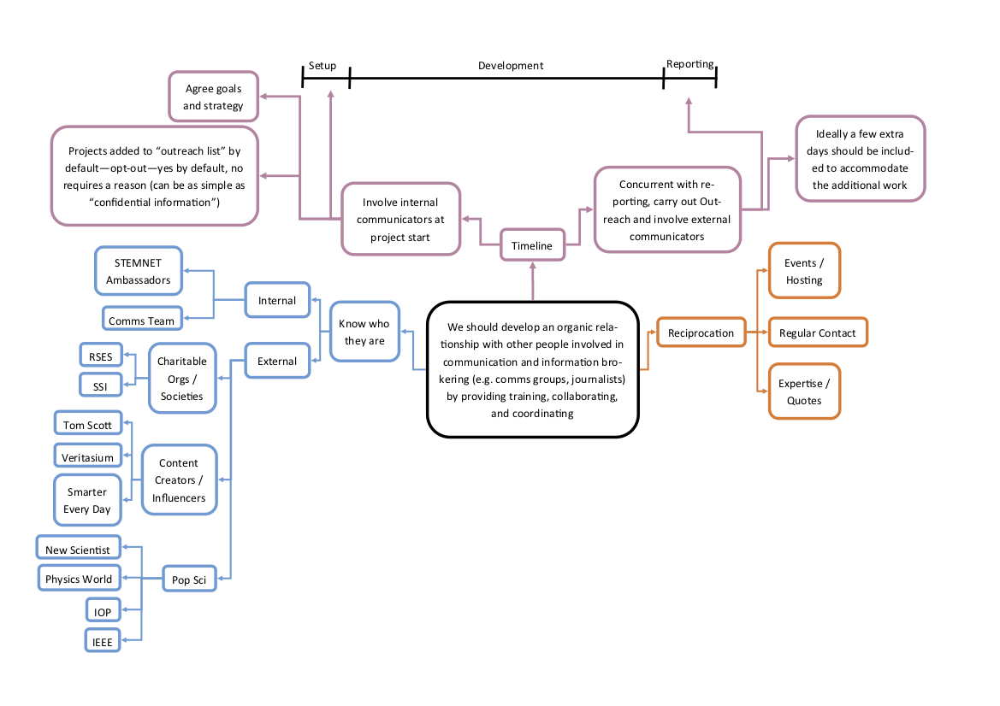

# Developing Relationships with Others

<!-- CRS: This section is not up to date...? --> 

> We should develop an organic relationship with other people involved in communications and information brokering (e.g. comms groups, journalists) by providing training, collaborating and coordinating.

Create a broad list of WHO you could contact for outreach possibilities. Internal comms teams, blogs, external journalists, content creators, pop sci, etc.

HOW was a lot harder, it’s basically saying how to make friends. This could be done within reciprocation, be available to external sources for event hosting, quotes, maintain a regular contact. Get in there early before you need to publish something.

See timeline on “Manifesto 4.pdf” document:

- Internal - Public engagement teams, industry trade body comms, PAs, Directorate give talks on other peoples work
- External - Industry & Trade publications (e.g. HPCWire), Journalists, academic science communicators or engagement professionals, science centres
- Reciprocation - social media profiles. Journalists ask for quotes on social media these days. Follow journalists and interact with them. ON A WORK ONLY SOCIAL MEDIA ACCOUNT
- Go to other events, more broader science conferences, networking events, offer to speak, offer to get involved in science communication & journalist postgrad studies > they are the future people who will be the contacts
- Prepare in advance with information before talking to media people

Not all stories need to flashy or hugely impactful - just need to be done well. Be proud of what you have done, not all science is discovering something new, real science is about finding the little changes. These are all small steps towards a ‘bigger’ discovery. 

Start with the view all projects have something worth talking about. Could be a technique, interesting facet of science, or the output of the project. 

Working with internal comms team shouldn’t be hard. Researchers can learn from them. It’s a transfer of skills. 
