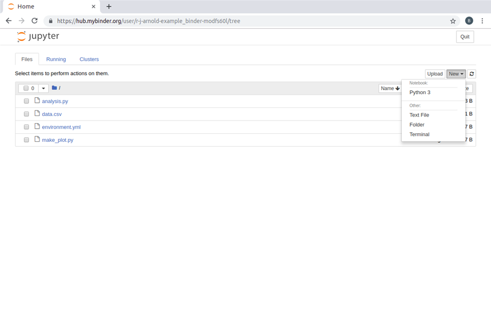
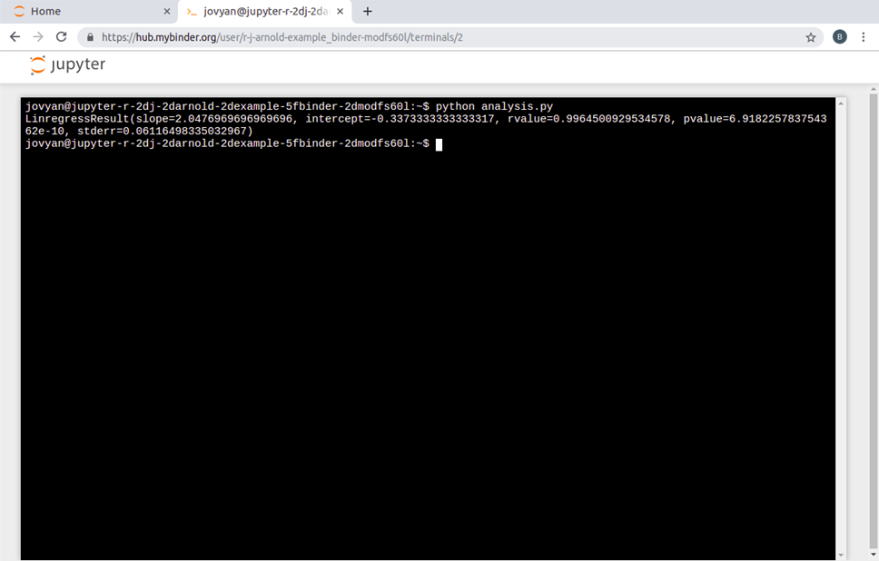

<a name="Binder_section"></a>

## Binder

Now that we've seen how to use and capture the computational environment used in a Python project, it's time to think about how to share that environment.

With an `environment.yml` file (or similar from alternative package management systems), it is possible for others to recreate the environment specified by that file. However, this relies on the new user having the same package management system set up, and knowing how to use it. It would be far easier if there was an automated solution to recreate the computational environment - and this is where Binder comes in.

Binder uses a tool called repo2docker to create a Docker image of a project based on the configuration files that are included. The resulting image contains the project and the computational environment specified by the original user. Other users can access the image via a cloud-based BinderHub, which allows them to view, edit and run the code from their web browser.

Juliette Taka's excellent cartoon below illustrates the steps in creating and sharing a "binderized" project.

**Step 1:** We start with a researcher who has completed a project and wants to share her work with anyone, regardless of their computational environment. Note that Binder does not only have to be applied to finished projects; it can be used in exactly the same way to share projects that are in progress.

**Step 2:** The researcher's project contains many files of different types. In this case the researcher has been working in Jupyter notebooks, but Binder can be used just as effectively with many other file formats and languages which we'll cover in more detail shortly.

**Step 3:** The researcher uploads her code to a publicly available repository hosting service, such as GitHub, where it can be accessed by others. She includes a file describing the computational environment required to run the project.

**Step 4:** She generates a link at the [mybinder.org](https://mybinder.org) BinderHub. By clicking on this link anyone can access a "Binderized" version of her project. The click triggers repo2docker to build an Docker image based on the contents of the repository and its configuration files. This image is then hosted on the cloud. The person who clicked the link will be taken to a copy of her project in their web browser that they can interact with. This copy of the project they interact with is hosted in the environment the researcher specified in step 3, regardless of the computational environment of the person is accessing it from.


Figure credit: [Juliette Taka, Logilab and the OpenDreamKit project](https://opendreamkit.org/2017/11/02/use-case-publishing-reproducible-notebooks/)

To get an idea of what this looks like here's what a binder of a simple example project looks like. Files are listed and can be clicked on and modified by the person accessing the binder.



Users can also open terminals to run or otherwise interact with the files by clicking on "New" and then "Terminal" in the top right of the home binder screen shown above. Here this is used to run the analysis script in the example binder which performs a linear regression on some data:



As mentioned Binder is well integrated with Jupyter notebooks which can be opened by clicking on "New" and then under "Notebook" in the same way terminals can be opened. These may be more convenient for those working with graphical outputs, as shown here where one is used to run `make_plot.py` in the example Binder:


If R is installed in a Binder the dropdown menu will show the options to open R Jupyter notebooks and RStudio sessions in the Binder.

<a name="Disambiguation"></a>

### Disambiguation

In this section there are a number of related terms, which will be outlined here for clarity:

- Binder: A sharable version of a project that can be viewed and interacted within a reproducible computational environment via a web browser.
- BinderHub: A service which generates Binders. The most widely-used is [mybinder.org](https://mybinder.org), which is maintained by the Binder team. It is possible to create other BinderHubs which can support more specialised configurations. One such configuration could include authentication to enable private repositories to be shared amongst close collaborators.
- [mybinder.org](https://mybinder.org): A public and free BinderHub. Because it is public you should not use it if your project requires any personal or sensitive information (such as passwords).
- Binderize: To make a Binder of a project.

<a name="Creating_a_binder_for_a_project"></a>

### Creating a Binder for a project

Creating a Binderized version of a project involves three key steps which will be explained in this section:

1. Specify the computational environment
2. Put the project files somewhere publicly available (we will describe how to do this with GitHub)
3. Generate a link to a Binder of the project

For a list of sample repositories for use with Binder, see the [Sample Binder Repositories](https://mybinder.readthedocs.io/en/latest/sample_repos.html) page.

<a name="Step_1_Specify_your_computational_environment"></a>

#### Step 1: Specify your computational environment

If a project contains no file specifying the computational environment when a Binder is generated the environment will be the Binder default environment, (containing Python 3.6) which may or may not be suitable for the project. However if it does contain a configuration file for the environment then the Binder will be generated with the specified environment. A full list of such files Binder accepts with examples can be found [here](https://mybinder.readthedocs.io/en/latest/config_files.html), but here are some of the key ones, some of which are language-specific:

- environment.yml
  - Recall that environment.yml files were discussed in the [Package management systems](#Package_management_systems) section.
- Dockerfile
  - Dockerfiles will be discussed in the [Containers](#Containers_section) section, so will not be discussed further here.
- apt.txt
  - Dependencies that would typically installed via commands such as `sudo apt-get install package_name` should be listed in an apt.txt file, and will be automatically installed in the Binder.
  - For example if a project uses Latex the apt.txt file should read
  ```
  texlive-latex-base
  ```
  to install the base Latex package.
- default.nix
  - For those that use the [package management system](#Package_management_systems) Nix a default.nix file can be a convenient way to capture their environment.
- requirements.txt (Python)
  - For Python users a requirements.txt file can be used to list dependent packages.
  - For example to have Binder install numpy this file would simply need to read:
  ```
  numpy
  ```
  - Specific package version can also be specified using an `==`, for example to have Binder install numpy version 1.14.5 then the file would be
  ```
  numpy==1.14.5
  ```
  - The requirement.txt file does not need to be hand written. Running the command `pip freeze > requirements.txt` will output a requirements.txt file that fully defines the Python environment.
- runtime.txt
  - Used to specify a particular version of Python of R for the Binder to use.
  - To specify which version of R to use specify find the date it was captured on [MRAN](https://mran.microsoft.com/documents/rro/reproducibility) and include it in the runtime.txt file as
  ```
  r-<YYYY>-<MM>-<DD>
  ```
  - To specify a version of Python, similarly state the version in this file. For example to use Python 2.7 the file would need to read
  ```
  python-2.7
  ```
- install.R or DESCRIPTION (R/RStudio)
  - An install.R file lists the packages to be installed, for example to install the package tibble in the Binder:
  ```
  install.packages("tibble")
  ```
  - [DESCRIPTION files](https://cran.r-project.org/doc/manuals/r-release/R-exts.html#The-DESCRIPTION-file) are more typically used in the R community for dependency management.

<a name="Step_2_Put_your_code_on_GitHub"></a>

#### Step 2: Put your code on GitHub

GitHub is discussed at length in the chapter on version control, which you should refer to if you wish to understand more about this step. In this chapter we will give the briefest possible explanation. GitHub is a very widely used platform where you can make "repositories", and upload code, documentation, or any other files into them. To complete this step:

1. Make an account on [GitHub](https://github.com/).
2. Create a repository for the project you wish to make a Binder of.
3. Upload your project files (including the file you have created to specify your computational environment) to the repository and save ("commit" in the vocabulary of GitHub) them there.

Again, if you are unable to complete these steps refer to the chapter on version control for a fuller explanation.

<a name="Step_3_Generate_a_link_to_a_Binder_of_your_project"></a>

#### Step 3: Generate a link to a Binder of your project

Head to [https://mybinder.org](https://mybinder.org). You'll see a form that asks you to specify a repository for [mybinder.org](https://mybinder.org) to build. In the first field, paste the URL of the project's GitHub repository. It'll look something like this: `https://github.com/<your-username>/<your-repository>`


As you can see there are additional fields in this form, but these are optional are will not be discussed here.

Once the URL to the project to be Binderized is supplied two fields will be automatically populated on the screen depicted above:

- The "Copy the URL below and share your Binder with others" field, which provides a link to the Binder which can be copied and shared by you.
- The "Copy the text below, then paste into your README to show a binder badge" field, which as described can be included by you in GitHub to create a button that allows anyone that accesses your project on GitHub to launch the Binder.

Finally, click the launch button. This will ask [mybinder.org](https://mybinder.org) to build the environment needed to run the project, note that this may take several minutes. You can click on the "Build logs" button to see the logs generated by the build process. These logs are helpful for resolving any issues that cause the build to fail, such as errors in the file defining the computational environment to be generated.

Once it has been built the Binder will be automatically launched, again this may take some time.

<a name="Including_data_in_a_Binder"></a>

### Including data in a Binder

There are a few ways to make data available in your Binder. Which is the best one depends on how big your data is and your preferences for sharing data. Note that the more data that is included include the longer it will take for a Binder to launch. Data also takes up storage space which must be paid for, so it is good to be considerate and minimise the data you include, especially on the publicly provided [mybinder.org](https://mybinder.org).

<a name="Small_public_files"></a>

#### Small public files

The simplest approach for small data files that are public is to add them directly to your GitHub repository, i.e to include them along with the rest of your project files in the Binder. This works well and is reasonable for files with sizes up to maybe 10MB.

<a name="Medium_public_files"></a>

#### Medium public files

For medium sized files, a few 10s of megabytes to a few hundred megabytes, find some other place online to store them and make sure they are publicly available. Then add a file named postBuild (which is a shell script so the first line must be `#!/bin/bash`) to your project files. In the postBuild file add a single line reading `wget -q -O name_of_your_file link_to_your_file`.

The postBuild file is used to execute commands when the files to produce the Binder are being generated. In this case it can be used to download your data into the files used to launch the binder.

<a name="Large_public_files"></a>

#### Large public files

The best option for large files is to use a library specific to the data format to stream the data as you are using it. There are a few restrictions on outgoing traffic from your Binder that are imposed by the team operating [mybinder.org](https://mybinder.org). Currently only connections to HTTP and Git are allowed. This comes up when people want to use FTP sites to fetch data. For security reasons FTP is not allowed on [mybinder.org](https://mybinder.org).
