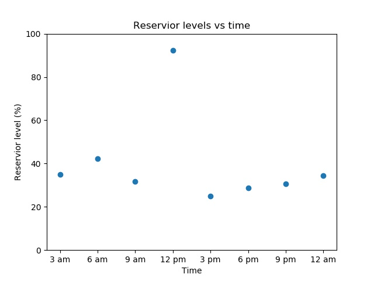

# Testing

| Prerequisite | Importance |
| -------------|------------|
| [Experience with the command line](https://programminghistorian.org/en/lessons/intro-to-bash) | Necessary |

## Table of contents

1. [Summary](#Summary)
2. [How this will help you/ why this is useful](#How_this_will_help_you_why_this_is_useful)
    1. [The advantages of testing for research](#The_advantages_of_testing_for_research)
3. [General guidance and good practice for testing](#General_guidance_and_good_practice_for_testing)
    1. [Write tests. Any tests.](#Write_tests_any_tests)
    2. [Run the tests](#Run_the_tests)
    3. [Consider how long it takes your tests to run](#Consider_how_long_it_takes_your_tests_to_run)
    4. [Document the tests and how to run them](#Document_the_tests_and_how_to_run_them)
    5. [Test realistic cases](#Test_realistic_cases)
    6. [Use a testing framework](#Use_a_testing_framework)
    7. [Aim to have a good code coverage](#Aim_to_have_a_good_code_coverage)
    8. [Use test doubles/mocking where appropriate](#Use_test_doubles_stubs_mocking_where_appropriate)
    9. [Testing stochastic code](#Testing_stochastic_code)
        1. [Use random number seeds](#Use_random_number_seeds)
        2. [Measure the distribution of results](#Measure_the_distribution_of_results)
    10. [Tests that are difficult to quantify](#Tests_that_are_difficult_to_quantify)
    11. [Testing if non-integer numbers are equal](#Testing_if_non_integer_numbers_are_equal)
        1. [When 0.1 + 0.2 does not equal 0.3](#When_point_1_plus_point_2_does_not_equal_point_3)
        2. [Equality in a floating point world](#Equality_in_a_floating_point_world)
4. [Types of tests](#Types_of_tests)
    1. [Level summary](#Level_summary)
5. [Smoke testing](#Smoke_testing)
6. [Unit tests](#Unit_tests)
    1. [Benefits of unit testing](#Benefits_of_unit_testing)
    2. [Unit testing tips](#Unit_testing_tips)
7. [Integration testing](#Integration_testing)
    1. [Approaches](#Approaches)
    2. [Integration testing tips](#Integration_testing_tips)
8. [System tests](#System_tests)
    1. [System testing tips](#System_testing_tips)
9. [Acceptance testing](#Acceptance_testing)
10. [Regression testing](#Regression_testing)
    1. [Limitations](#Limitations)
11. [Runtime testing](#Runtime_testing)
12. [Test driven development](#Test_driven_development)
13. [Checklist](#Checklist)
    1. [Writing tests](#Writing_tests)
    2. [Good practice checks](#Good_practice_checks)
14. [What to learn next](#What_to_learn_next)
15. [Further reading](#Further_reading)
16. [Definitions/glossary](#Definitions_glossary)
17. [Bibliography](#Bibliography)

<a name="Summary"></a>
## Summary

Researcher-written code now forms a part of a huge portion of research, and if there are mistakes in the code the results may be partly or entirely unreliable. Testing code thoroughly and frequently is vital to ensure reliable, reproducible research. This chapter will cover general guidance for writing tests, and describes a number of different kinds of testing, their uses, and how to go about implementing them.

<a name="How_this_will_help_you_why_this_is_useful"></a>
## How this will help you/ why this is useful

Here's a couple of examples of why should write tests:


It is very, very easy to make mistakes when coding. A single misplaced character can cause a program's output to be entirely wrong. One of the examples above was caused by a plus sign which should have been a minus. Another was caused by one piece of code working in meters while a piece of code written by another researcher worked in feet. *Everyone* makes mistakes, and in research the results can be catastrophic. Careers can be damaged/ended, vast sums of research funds can be wasted, and valuable time may be lost to exploring incorrect avenues. This is why tests are vital.

Even if problems in a program are caught before research is published it can be difficult to figure out what results are contaminated and must be re-done. This represents a huge loss of time and effort. Catching these problems as early as possible minimises the amount of work it takes to fix them, and for most researchers time is by far their most scarce resource. You should not skip writing tests because you are short on time, you should write tests *because* you are short on time. Researchers cannot afford to have months or years of work go down the drain, and they can't afford to repeatedly manually check every little detail of a program that might be hundreds or hundreds of thousands of lines long. Writing tests to do it for you is the time-saving option, and it's the safe option.

As researchers write code they generally do some tests as they go along, often by adding in print statements and checking the output. However, these tests are often thrown away as soon as they pass and are no longer present to check what they were intended to check. It is comparatively very little work to place these tests in functions and keep them so they can be run at any time in the future. The additional labour is minimal, the time saved and safeguards provided are invaluable. Further, by formalising the testing process into a suite of tests that can be run independently and automatically, you provide a much greater degree of confidence that the software behaves correctly and increase the likelihood that defects will be found.

Testing also affords researchers much more peace of mind when working on/improving a project. After changing their code a researcher will want to check that their changes or fixes have not broken anything. Providing researchers with a fail-fast environment allows the rapid identification of failures introduced by changes to the code. The alternative, of the researcher writing and running whatever small tests they have time for is far inferior to a good testing suite which can thoroughly check the code.

Another benefit of writing tests is that it typically forces a researcher to write cleaner, more modular code as such code is far easier to write tests for, leading to an improvement in code quality. [Good quality code](../code_quality/code_quality) is far easier (and altogether more pleasant) to work with than tangled rat's nests of code I'm sure we've all come across (and, let's be honest, written). This point is expanded upon in the section on [unit tests](#Unit_tests).

<a name="The_advantages_of_testing_for_research"></a>
### The advantages of testing for research

As well as advantaging individual researchers testing also benefits research as a whole. It makes research more reproducible by answering the question "how do we even know this code works". If tests are never saved, just done and deleted the proof cannot be reproduced easily.

Testing also helps prevent valuable grant money being spent on projects that may be partly or wholly flawed due to mistakes in the code. Worse if mistakes are not at found and the work is published any subsequent work that builds upon the project will be similarly flawed.

Perhaps the cleanest expression of why testing is important for research as a whole can be found in the [Software Sustainability Institute](https://www.software.ac.uk/) slogan: better software better research.

<a name="General_guidance_and_good_practice_for_testing"></a>
## General guidance and good practice for testing

There are a number of [different kinds](#Types_of_tests) of testing which each have best practice specific to them. Nevertheless there is some general guidance that applies to all of them, which will be outlined here.

<a name="Write_tests_any_tests"></a>
### Write tests. Any tests.

Starting the process of writing tests can be overwhelming, especially if you have a large code base. Further to that, as mentioned, there are many kinds of tests, and implementing all of them can seem like an impossible mountain to climb. That is why the single most important piece of guidance in this chapter is as follows: **write some tests**. Testing one tiny thing in a code that's thousands of lines long is infinitely better than testing no things in a code that's thousands of lines long. You may not be able to do everything, but doing *something* is valuable.

Do not be discouraged. Make improvements where you can, and do your best to include tests with new code you write even if it's not feasible to write tests for all the code that's already written.

<a name="Run_the_tests"></a>
### Run the tests

The second most important piece of advice in this chapter: run the tests. Having a beautiful, perfect test suite is no use if you rarely run it. Leaving long gaps between test runs makes it more difficult to track down what has gone wrong when a test fails because a great deal in the code will have changed. Also if it's been weeks or months since tests have been run and they fail it is difficult or impossible to know what work/results that have been done in the intervening time are still valid, and which have to be thrown away as they could have been impacted by the bug.

As such it is best to automate your testing as far as possible. If each test needs to be run individually then that boring painstaking process is likely to get neglected. This can be done by making use of a testing framework ([discussed later](#Use_a_testing_framework)). [Jenkins](https://jenkins.io) is another good tool for this. Ideally set your tests up to run at regular intervals, possibly each night.

Consider setting up continuous integration (discussed in the continuous integration chapter) on your project. This will automatically run your tests each time you make a change to your code and, depending on the continuous integration software you use, will notify you if any of the tests fail.

<a name="Consider_how_long_it_takes_your_tests_to_run"></a>
### Consider how long it takes your tests to run

Some tests, like [unit tests](#Unit_tests) only test a small piece of code and so typically are very fast. However other kinds of tests, such as [system tests](#System_tests) which test the entire code from end to end, may take a long time to run depending on the code. As such it can be obstructive to run the entire test suite after each little bit of work. In that case it is better to run lighter weight tests such as unit tests frequently, and longer tests only once per day overnight. It is also good to scale the number of each kind of tests you have in relation to how long they take to run. You should have a lot of unit tests (or other types of tests that are fast) but much fewer tests which take a long time to run.

<a name="Document_the_tests_and_how_to_run_them"></a>
### Document the tests and how to run them

It is important to provide documentation that describes how to run the tests, both for yourself in case you come back to a project in the future, and for anyone else that may wish to build upon or reproduce your work. This documentation should also cover subjects such as

- Any resources, such as test dataset files that are required
- Any configuration/settings adjustments needed to run the tests
- What software (such as [testing frameworks](#Use_a_testing_framework)) need to be installed

Ideally, you would provide scripts to set up and configure any resources that are needed.

<a name="Test_realistic_cases"></a>
### Test realistic cases

Make the cases you test as realistic as possible. If for example, you have dummy data to run tests on you should make sure that data is as similar as possible to the actual data. If your actual data is messy with a lot of null values, so should your test dataset be.

<a name="Use_a_testing_framework"></a>
### Use a testing framework

There are tools available to make writing and running tests easier, these are known as testing frameworks. Find one you like, learn about the features it offers, and make use of them. Common testing frameworks (and the languages they apply to) include:

- Language agnostic
  - CTest, test runner for executables, bash scripts, and more. Great for legacy code hardening
- C++
  - Catch
  - CppTest
  - Boost::Test
  - google-test      
- C
  - all C++ frameworks
  - Check
  - CUnit
- Python
  - pytest (recommended)
  - unittest comes with standard Python library
- R unit-tests
  - testthat
  - tinytest
  - svUnit (works with SciViews GUI)
- Fortran unit-tests:
  - funit
  - pfunit (works with MPI)

<a name="Aim_to_have_a_good_code_coverage"></a>
### Aim to have a good code coverage

Code coverage is a measure of how much of your code is "covered" by tests. More precisely it a measure of how much of your code is run when tests are conducted. So for example, if you have a `if` statement but only test things where that if statement evaluates to "True" then none of the code that comes under "False" will be run. As a result your code coverage would be < 100% (the exact number would depend on how much code comes under the True and False cases). Code coverage doesn't include documentation like comments, so adding more documentation doesn't affect your percentages.

As [mentioned](#Write_tests_any_tests) any tests are an improvement over no tests. Nevertheless it is good to at least aspire to having your code coverage as high as feasible.

Most programming languages have tools either built into them, or that can be imported, or as part of testing frameworks, which automatically measure code coverage. There's also a nice little [bot](https://codecov.io/) for measuring code coverage available too.

**Pitfall: The illusion of good coverage.** In some instances, the same code can and probably should be tested in multiple ways. For example, coverage can quickly increase on code that applies "sanity check" tests to its output ([see below](#tests-that-are-difficult-to-quantify)), but this doesn't preclude the risk that the code is producing the broadly right answer for the wrong reasons. In general, the best tests are those that isolate the smaller rather than larger chunks of coherent code, and so pick out individual steps of logic. Try to be guided by thinking about the possible things that might happen to a particular chunk of code in the execution of the whole, and test these individual cases. Often, this will result in the same code being tested multiple times - this is a good thing!

<a name="Use_test_doubles_stubs_mocking_where_appropriate"></a>
### Use test doubles/stubs/mocking where appropriate

If a test fails it should be constructed such that is as easy to trace the source of the failure as possible. This becomes problematic if a piece of code you want to test unavoidably depends on other things. For example if a test for a piece of code that interacts with the web fails that could be because the code has a bug *or* there is a problem with the internet connection. Similarly if a test for a piece of code that uses an object fails it could be because there is a bug in the code being tested, or a problem with the object (which should be tested by its own, separate tests). These dependencies should be eliminated from tests, if possible. This can be done via using test replacements (test doubles) in the place of the real dependencies. Test doubles can be classified as follows:

- A dummy object is passed around but never used, meaning its methods are never called. Such an object can for example be used to fill the parameter list of a method.
- Fake objects have working implementations, but are usually simplified. For example, they use an in memory database and not a real database.
- A stub is an partial implementation for an interface or class with the purpose of using an instance of this stub during testing. Stubs usually don’t respond to anything outside what’s programmed in for the test. Stubs may also record information about calls.
- A mock object is a dummy implementation for an interface or a class in which you define the output of certain method calls. Mock objects are configured to perform a certain behaviour during a test. They typically record the interaction with the system and tests can validate that.

Test doubles can be passed to other objects which are tested.

You can create mock objects manually (via code) or use a mock framework to simulate these classes. Mock frameworks allow you to create mock objects at runtime and define their behaviour. The classical example for a mock object is a data provider. In production an implementation to connect to the real data source is used. But for testing a mock object simulates the data source and ensures that the test conditions are always the same.

<a name="Testing_stochastic_code"></a>
### Testing stochastic code

Sometimes code contains an element of randomness, a common example being code that makes use of [Monte Carlo methods](https://en.wikipedia.org/wiki/Monte_Carlo_method). Testing this kind of code can be very difficult because if it is run multiple times it will generate different answers, all of which may be "right", even is it contains no bugs. There are two main ways to tackle testing stochastic code:

<a name="Use_random_number_seeds"></a>
#### Use random number seeds

Random number seeds are a little difficult to explain so here's an example. Here's a little Python script that prints three random numbers.
```
import random

# Print three random numbers
print(random.random())
print(random.random())
print(random.random())
```

This script has no bugs but if you run it repeatedly you will get different answers each time. Now let's set a random number seed.
```
import random

# Set a random number seed
random.seed(1)

# Print three random numbers
print(random.random())
print(random.random())
print(random.random())
```

Now if you run this script it outputs
```
0.134364244112
0.847433736937
0.763774618977
```

and every time you run this script you will get the *same* output, it will print the *same* three random numbers. If the random number seed is changed you will get a different three random numbers:

```
0.956034271889
0.947827487059
0.0565513677268
```
but again you will get those same numbers every time the script is run in the future.

Random number seeds are a way of making things reliably random. However a risk with tests that depend on random number seeds is they can be brittle. Say you have a function structured something like this:
```
def my_function()

  a = calculation_that_uses_two_random_numbers()

  b = calculation_that_uses_five_random_numbers()

  c = a + b
```

If you set the random number seed you will always get the same value of `c`, so it can be tested. But, say the model is changed and the function that calculates `a` uses a different number of random numbers that it did previously. Now not only will `a` be different but `b` will be too, because as shown above the random numbers outputted given a random number seed are in a fixed order. As a result the random numbers produced to calculate `b` will have changed. This can lead to tests failing when there is in fact no bug.

<a name="Measure_the_distribution_of_results"></a>
#### Measure the distribution of results

Another way to test code with a random output is to run it many times and test the distribution of the results. Perhaps the result may fluctuate a little, but is always expected around 10 within some tolerance. That can be tested. The more times the code is run the more reliable the average and so the result. However the more times you run a piece of code the longer it will take your tests to run, which may make tests prohibitively time-consuming to conduct if a reliable result is to be obtained. Furthermore, there will always be an element of uncertainty and if the random numbers happen to fall in a certain way you may get result outside of the expected tolerance even if the code is correct.

Both of these approaches to testing stochastic code can still be very useful, but it is important to also be aware of their potential pitfalls.

<a name="Tests_that_are_difficult_to_quantify"></a>
### Tests that are difficult to quantify

Sometimes (particularly in research) the outputs of code are tested according to whether they "look" right. For example say we have a code modelling the water levels in a reservoir over time. The result may look like this:


On a day with rain it might look like this:


and on a dry day it might look like this:


All of these outputs look very different but are valid. However, if a researcher sees a result like this:



they could easily conclude there is a bug as a lake is unlikely to triple it's volume and then lose it again in the space of a few hours. "Eyeballing" tests like these are time consuming as they must be done by a human. However the process can be partially or fully automated by creating basic "sanity checks". For example the water level at one time should be within, say, 10% of the water level at the previous time step. Another check could be that there are no negative values, as a lake can't be -30% full. These sort of tests can't cover every way something can be visibly wrong, but they are much easier to automate and will suffice for most cases.

<a name="Testing_if_non_integer_numbers_are_equal"></a>
### Testing if non-integer numbers are equal

<a name="When_point_1_plus_point_2_does_not_equal_point_3"></a>
#### When 0.1 + 0.2 does not equal 0.3

There is a complication with testing if the answer a piece of code outputs is equal to the expected answer when the numbers are not integers. Let's look at this Python example, but note that this problem is not unique to Python.

If we assign 0.1 to `a` and 0.2 to `b` and print their sum, we get 0.3, as expected.
```
>>> a = 0.1
>>> b = 0.2
>>> print(a + b)
0.3
```

If, however, we compare the result of `a` plus `b` to 0.3 we get False.
```
>>> print(a + b == 0.3)
False
```

If we show the value of `a` plus `b` directly, we can see there is a subtle margin of error.
```
>>> a + b
0.30000000000000004
```

This is because floating point numbers are approximations of real numbers. The result of floating point calculations can depend upon the compiler or interpreter, processor or system architecture and number of CPUs or processes being used. Obviously this can present a major obstacle for writing tests.

<a name="Equality_in_a_floating_point_world"></a>
#### Equality in a floating point world

When comparing floating point numbers for equality, we have to compare to within a given tolerance, alternatively termed a threshold or delta. For example, we might consider the calculated and expected values of some number to be equal if the absolute value of their difference is within the absolute value of our tolerance.

Many testing frameworks provide functions for comparing equality of floating point numbers to within a given tolerance. For example for the framework pytest:
```
import pytest

a = 0.1
b = 0.2
c = a + b
assert c == pytest.approx(0.3)
```

this passes, but if the 0.3 was changed to 0.4 it would fail.

Unit test frameworks for other languages also often provide similar functions:

- Cunit for C: CU_ASSERT_DOUBLE_EQUAL(actual, expected, granularity)
- CPPUnit for C++: CPPUNIT_ASSERT_DOUBLES_EQUAL(expected, actual, delta)
- googletest for C++: ASSERT_NEAR(val1, val2, abs_error)
- FRUIT for Fortran: subroutine assert_eq_double_in_range_(var1, var2, delta, message)
- JUnit for Java: org.junit.Assert.assertEquals(double expected, double actual, double delta)
- testthat for R:
  - expect_equal(actual, expected, tolerance=DELTA) - absolute error within DELTA
  - expect_equal(actual, expected, scale=expected, tolerance=DELTA) - relative error within DELTA

<a name="Types_of_tests"></a>
## Types of tests

There are a number of different kinds of tests, which will be discussed here.

Firstly there are positive tests and negative tests. Positive tests check that something works, for example testing that a function that multiplies some numbers together outputs the correct answer. Negative tests check that something generates an error when it should. For example nothing can go quicker than the speed of light, so a plasma physics simulation code may contain a test that an error is outputted if there are any particles faster than this, as it indicates there is a deeper problem in the code.

In addition to these two kinds of tests there are also different levels of tests which test different aspects of a project. These levels are outlined [below](#Level_summary) and both positive and negative tests can be present at any of these levels. A thorough test suite will contain tests at all of these levels (though some levels will need very few).

<a name="Level_summary"></a>
### Level summary

[Smoke testing](#Smoke_testing): Very brief initial checks that ensures the basic requirements required to run the project hold. If these fail there is no point proceeding to additional levels of testing until they are fixed.

[Unit testing](#Unit_tests):	A level of the software testing process where individual units of a software are tested. The purpose is to validate that each unit of the software performs as designed.

[Integration testing](#Integration_testing):	A level of software testing where individual units are combined and tested as a group. The purpose of this level of testing is to expose faults in the interaction between integrated units.

[System testing](#System_tests):	A level of the software testing process where a complete, integrated system is tested. The purpose of this test is to evaluate whether the system as a whole gives the correct outputs for given inputs.

[Acceptance testing](#Acceptance_testing):	A level of the software testing process where a system is tested for acceptability. The purpose of this test is to evaluate the system's compliance with the project requirements and assess whether it is acceptable for the purpose.

Here's an analogy: during the process of manufacturing a ballpoint pen, the cap, the body, the tail, the ink cartridge and the ballpoint are produced separately and unit tested separately. When two or more units are ready, they are assembled and integration testing is performed, for example a test to check the cap fits on the body. When the complete pen is integrated, system testing is performed to check it can be used to write like any pen should. Acceptance testing could be a check to ensure the pen is the colour the customer ordered.

There is also another kind of testing called regression testing. Regression testing is a type of testing that can be performed at any of the four main levels and compares the results of tests before and after a change is made to the code, and gives an error if these are different.

These different types of tests will now be discussed in more detail.

<a name="Smoke_testing"></a>
## Smoke testing

Smoke tests (also known as build verification tests) are a special kind of initial checks designed to ensure very basic functionality as well as some basic implementation and environmental assumptions. Smoke tests are generally run at the very start of each testing cycle as a sanity check before running a more complete test suite.

The idea behind this type of test is to help to catch big red flags in an implementation and to bring attention to problems that might indicate that further testing is either not possible or not worthwhile. Normally, the tester is asking whether any components are so obviously or badly broken that the build is not worth testing or some components are broken in obvious ways that suggest a corrupt build or some critical fixes that are the primary intent of the new build didn't work. Smoke tests are not very extensive, but should be extremely quick. If a change to a project causes it to fail a smoke test, its an early signal that core assertions were broken and that you should not devote any more time to testing until the problem is resolved. For example if a function that reads in the data a project requires to run is broken there's no point testing any further before that's fixed. The typical result of a failed smoke test is rejection of the build (testing of the build stops) not just a new set of bug reports.

<a name="Unit_tests"></a>
## Unit tests

Unit tests are responsible for testing individual elements of code in an isolated and highly targeted way. The functionality of individual functions and classes are tested on their own. The purpose is to validate that each unit of the software performs as designed. A unit is the smallest testable part of any software. In procedural programming, a unit may be an individual program, function or procedure. In object-oriented programming the smallest unit is typically a method. It usually has one or a few inputs and usually a single output. Any external dependencies should be replaced with [stub or mock implementations](#Use_test_doubles_stubs_mocking_where_appropriate) to focus the test completely on the code in question.

Unit tests are essential to test the correctness of individual code components for internal consistency and correctness before they are placed in more complex contexts. The limited extent of the tests and the removal of dependencies makes it easier to hunt down the cause of any defects. It also is the best time to test a variety of inputs and code branches that might be difficult to hit later on. For example system tests are often time consuming to run and it will likely be impractical to have system tests for every possible path through a code that has more than a few conditional statements. Unit tests are smaller, faster, and so it is more practical to cover all possible cases with them.

Often, after any smoke tests, unit tests are the first tests that are run when any changes are made.

<a name="Benefits_of_unit_testing"></a>
### Benefits of unit testing

If a researcher makes a change to a piece of code or how it is run then how can they be sure that doing so has not broken something? They may run a few tests, but without testing every small piece of code individually how can they be certain? Unit testing gives researchers that certainty, and allows them to be confident when changing and maintaining their code.

Here's a little example. Say a researcher has a small function that does one simple thing (here only a single line for brevity). In this example this will be raising a number to the 5th power:
```
def take_fifth_power(x):
    result = x * x * x * x * x
    return result
```

The unit test for this function could look like this:
```
def test_take_fifth_power():
    assert take_fifth_power(1.5) == 7.59375
```

So it checks that the correct result is outputted for a given input. If not the test will fail. The researcher carries on with their work. In the middle of it they decide to tidy up this function, multiplying the number five times like this is a bit crude. They change the `result = x * x * x * x * x` line to `result = x * 5`. Next time they run their unit tests, this test will fail, because they just made a mistake. Maybe they needed a coffee, maybe their finger slipped, maybe their coworker shot them in the ear with a nerf dart and distracted them, but when they were tidying up this function they should have written `result = x ** 5` *not* `result = x * 5`. The failed test will flag up the mistake and it can quickly be corrected. If a mistake like this went unobserved it could lead to serious errors in the researcher's work.

So unit testing leads to more reliable code, but there are other benefits too. Firstly it makes development faster by making bugs easier to find. Larger-scale tests which test large chunks of code (while still useful) have the disadvantage that if they fail it is difficult to pinpoint the source of the bug. Because unit tests by their very definition test small pieces of code they help developers find the cause of a bug much more quickly than higher-level tests or code with no tests at all. Unit tests also make fixing bugs faster and easier because they catch bugs early while they only impact small individual units. If bugs are not detected early via unit tests then it may be a long time before they are discovered, impacting later work that built on the faulty code. This means much more code is at risk and fixing the bug is more time consuming.

The other major benefit of unit testing is that it strongly incentivises researchers to write modular code because modular code is far easier to write unit tests for. Modular code is code that is broken up into manageable chunks which each accomplish simple tasks. This is typically achieved by dividing the code into functions and groups of functions. In contrast a script which is just one long continuous series of lines which produces a result is highly non-modular.

Modular code is much easier to reuse, for example if a researcher has a individual function that does some Useful Thing and in a future project they need to do that thing again it is trivial to copy or import the function. In contrast if the code that does this Useful Thing is entwined with a great deal of other code in a long script it is much harder to separate it out for re-use.

<a name="Unit_testing_tips"></a>
### Unit testing tips

- Many testing frameworks have tools specifically geared towards writing and running unit tests.
- Isolate the development environment from the test environment.
- Write test cases that are independent of each other. For example, if a unit A utilises the result of another unit B supplies you should test unit A with a [test double](#Use_test_doubles_stubs_mocking_where_appropriate), rather than actually calling the unit B. If you don't do this your test failing may be due to a fault in either unit A *or* unit B, making the bug harder to trace.
- Aim at covering all paths through a unit. Pay particular attention to loop conditions.
- In addition to writing cases to verify the behaviour, write cases to ensure the performance of the code. For example, if a function that is supposed to add two numbers takes several minutes to run there is likely a problem.
- If you find a defect in your code write a test that exposes it. Why? First, you will later be able to catch the defect if you do not fix it properly. Second, your test suite is now more comprehensive. Third, you will most probably be too lazy to write the test after you have already fixed the defect. Say a code has a simple function to classify people as either adults or children:

  ```
  def adult_or_child(age):

    # If the age is greater or equal to 18 classify them as an adult
    if age >= 18:
      person_status = 'Adult'

    # If the person is not an adult classify them as a child
    else:
      person_status = 'Child'

    return person_status
  ```

  And say this code has a unit test like this:

  ```
  def test_adult_or_child():

    # Test that an adult is correctly classified as an adult
    assert adult_or_child(22) == 'Adult'

    # Test that an child is correctly classified as a child
    assert adult_or_child(5) == 'Child'

    return
  ```

There's a problem with this code that isn't being tested: if a negative age is supplied it will happily classify the person as a child despite negative ages not being possible. The code should throw an error in this case. So once the bug is fixed:
```
def adult_or_child(age):

  # Check age is valid
  if age < 0:
    raise ValueError, 'Not possible to have a negative age'

  # If the age is greater or equal to 18 classify them as an adult
  if age >= 18:
    person_status = 'Adult'

  # If the person is not an adult classify them as a child
  else:
    person_status = 'Child'

  return person_status
```

go ahead and write a test to ensure that future changes in the code can't cause it to happen again:
```  
def test_adult_or_child():

  #Test that an adult is correctly classified as an adult
  assert adult_or_child(22) == 'Adult'

  # Test that an child is correctly classified as a child
  assert adult_or_child(5) == 'Child'

  # Test that supplying an invalid age results in an error
  with pytest.raises(ValueError):
      adult_or_child(-10)
```

<a name="Integration_testing"></a>
## Integration testing

Integration testing is a level of software testing where individual units are combined and tested as a group. While unit tests validate the functionality of code in isolation, integration tests ensure that components cooperate when interfacing with one another. The purpose of this level of testing is to expose faults in the interaction between integrated units.

For example, maybe a unit that reads in some data is working and passes its unit tests, and the following unit that cleans up the data once it's been read in is also working and passes its tests. However say the first unit outputs the data as (time_data, temperature_data) but the function that cleans the data expects input of the form (temperature_data, time_data). This can obviously lead to bugs. While the units are correct there in an error in their integration.

An example of an integration test for this case could be to supply a test data file, use these functions to read it in and clean it, and check the resulting cleaned data against what would be expected. If a bug like this is present then the cleaned data outputted would be very unlikely to match the expected result, and an error would be raised.

Integration testing is particularly important in collaborative projects where different people work on different parts of the code. If two different people complete separate units and then need to integrate then integration issues are more likely as neither may understand the other's code. A famous example of this is a multi-million dollar satellite which [crashed](https://en.wikipedia.org/wiki/Mars_Climate_Orbiter) because one piece of code outputted distance data in feet, while another assumed data in meters. This is another example of an integration issue.

A sub type of integration testing is system integration testing. This tests the integration of systems, packages and any interfaces to external organizations (such as Electronic Data Interchange, Internet). Depending on the nature of a project system integration testing may or may not be applicable.

<a name="Approaches"></a>
### Approaches

There are several different approaches to integration testing. Big Bang is an approach to integration testing where all or most of the units are combined together and tested at one go. This approach is taken when the testing team receives the entire software in a bundle. So what is the difference between Big Bang integration testing and system testing? Well, the former tests only the interactions between the units while the latter tests the entire system.

Top Down is an approach to integration testing where top-level sections of the code (that themselves contain many smaller units) are tested first and lower level units are tested step by step after that. So is a code can be split into the main steps A, B, and C, and each of those  contain steps to complete them, and these steps may have substeps like:

- A
  - A.1
    - A.1.1
    - A.1.2
  - A.2
- B
  - B.1
  - B.2
    - B.2.1
    - B.2.2
    - B.2.3
  - B.3

- C
  - C.1
    - C.1.1
    - C.1.2
  - C.2
    - C.2.1
    - C.2.2

So in the top down approach the integration between sections at the top level (A, B and C) are tested, then integration between sections at the next level (for example, A.1 -> A.2) and so on. Testing upper level units by running all the code they contain including running lower level ones can lead to upper level tests breaking due to bugs in low level units. This is undesirable, so to prevent this the lower level sections should not be run, but [test stubs](#Use_test_doubles_stubs_mocking_where_appropriate) should be used to simulate the outputs from them.

Bottom Up is an approach to integration testing where integration between bottom level sections are tested first and upper-level sections step by step after that. Again test stubs should be used, in this case to simulate inputs from higher level sections.

Sandwich/Hybrid is an approach to integration testing which is a combination of Top Down and Bottom Up approaches.

Which approach you should use will depend on which best suits the nature/structure of your project.

<a name="Integration_testing_tips"></a>
### Integration testing tips

- Ensure that you have a proper Detail Design document where interactions between each unit are clearly defined. It is difficult or impossible to perform integration testing without this information.
- Make sure that each unit is unit tested and fix any bugs before you start integration testing. If there is a bug in the individual units then the integration tests will almost certainly fail even if there is no error in how they are integrated.
- Use mocking/stubs where appropriate.

<a name="System_tests"></a>
## System tests

Once integration tests are performed, another level of testing called system testing can begin. System testing is a level of software testing where a complete and integrated software is tested. The tester supplies the program with input and verifies if the program's output is correct. If it is not then there is a problem somewhere in the system. Note that this does not have to be done manually, it can be automated. The purpose of these tests is to evaluate the system's compliance with the specified requirements. In many ways, system testing acts as an extension to integration testing. The focus of system tests are to make sure that groups of components function correctly as a cohesive whole.
However, instead of focusing on the interfaces between components, system tests typically evaluate the outward functionality of a full piece of software. This set of tests ignores the constituent parts in order to gauge the composed software as a unified entity. Because of this distinction, system tests usually focus on user- or externally-accessible outputs.

System testing can also test features of the system other than correctness. Examples include:

- Performance testing: does the program performance meet the minimum requirements? A performance test may measure how long the system takes to run in a given case.
- Migration testing: does the program work when transferred to another computational environment?
- Stress/scale/load testing: testing how the program behaves when under stress, for example, when required to process very large volumes of data.
- Usability testing: how user-friendly is the program (more common in commercial software, tests typically conducted by humans rather than automated).
- Recovery testing: Can the program continue if errors occur (again, more common in commercial software).

<a name="System_testing_tips"></a>
### System testing tips

System tests, also called end-to-end tests, run the program, well, from end to end. As such these are the most time consuming tests to run. Therefore you should only run these if all the lower-level tests (smoke, unit, integration) have already passed. If they haven't fix the issues they have detected first before wasting time running system tests.

Because of their time-consuming nature it will also often be impractical to have enough system tests to trace every possible route through a program, especially is there are a significant number of conditional statements. Therefore you should consider the system test cases you run carefully and prioritise:

- The most common routes through a program.
- The most important routes for a program. For example, the LIGO detector aims to find gravitational wave events, which are extremely rare. If there's a bug in that path through the program which monitors the detector then it's a *huge* problem.
- Cases that are prone to breakage due to structural problems within the program. Though ideally it's better to just fix those problems, but cases exist where this may not be feasible.

Because system tests can be time consuming it may be impractical to run them very regularly (such as multiple times a day after small changes in the code). Therefore it can be a good idea to run them each night (and to automate this process) so that if errors are introduced that only system testing can detect the programmer will be made of them relatively quickly.

<a name="Acceptance_testing"></a>
## Acceptance testing

Acceptance tests are one of the last tests types that are performed on software prior to delivery. Acceptance testing is used to determine whether a piece of software satisfies all of the requirements from the business or user's perspective. Does this piece of software do what it needs to do? These tests are sometimes built against the original specification.

Because research software is typically written by the researcher that will use it (or at least with significant input from them) acceptance tests may not be necessary.

<a name="Regression_testing"></a>
## Regression testing

Regression testing is a style of testing that focuses on retesting after changes are made. The results of tests after the changes are compared to the results before, and errors are raised if these are different. Regression testing is intended to ensure that changes (enhancements or defect fixes) to the software have not adversely affected it. The likelihood of any code change impacting functionalities that are not directly associated with the code is always there and it is essential that regression testing is conducted to make sure that fixing one thing has not broken another. Regression testing can be performed during any level of testing (unit, integration, system, or acceptance) but it is mostly relevant during system testing. Any test can be reused, and so any test can become a regression test.

Regression testing is obviously especially important in team working, but it is surprisingly easy to break your own code without noticing it, even if you are working on your own. And because regression testing is next to impossible to do satisfactorily by hand (it's simply too tedious), it's an obvious case for automation.

Regression tests are written by first running the (or part of the) code for given inputs and recording the outputs. This could be done by writing input files and saving the corresponding output files. These outputs serve as the expected outputs from the program given the corresponding inputs. Regression tests are then written. Each regression test runs the code for the set of inputs. It then compares the output from the code to the expected outputs, and raises an error if these do not match.

Regression testing approaches differ in their focus. Common examples include:

- Bug regression: We retest a specific bug that has been allegedly fixed.
- Old fix regression testing: We retest several old bugs that were fixed, to see if they are back. (This is the classical notion of regression: the program has regressed to a bad state.)
- General functional regression: We retest the project broadly, including areas that worked before, to see whether more recent changes have destabilized working code.
- Conversion or port testing: The program is ported to a new platform and a regression test suite is run to determine whether the port was successful.
- Configuration testing: The program is run with a new device or on a new version of the operating system or in conjunction with a new application. This is like port testing except that the underlying code hasn't been changed--only the external components that the software under test must interact with.

<a name="Limitations"></a>
### Limitations

Regression tests are not guaranteed to test all parts of the code. Most importantly, regression tests do not test if the result outputted by a piece of code is *correct*, only that is has not changed. This the remit of other kinds of tests, though regression tests can serve as the starting point for introducing tests for correctness, by both the use of analytical solutions, and test functions which read output files and check the data for correctness, as defined by a researcher.

<a name="Runtime_testing"></a>
## Runtime testing

Runtime tests are tests that run as part of the program itself. They may take the form of checks within the code, as shown below:
```
population = population + people_born - people_died

// test that the population is positive
if (population < 0):
  error( 'The number of people can never be negative' )
```

Another example of a use of runtime tests is internal checks within functions that verify that their inputs and outputs are valid, as shown below:
```
function add_arrays( array1, array2 ):

  // test that the arrays have the same size
  if (array1.size() != array2.size()):
    error( 'The arrays have different sizes!' )

  output = array1 + array2

  if (output.size() != array1.size()):
    error( 'The output array has the wrong size!'' )

  return output
```

Advantages of runtime testing:

- Run within the program, so can catch problems caused by logic errors or edge cases.
- Makes it easier to find the cause of the bug by catching problems early.
- Catching problems early also helps prevent them escalating into catastrophic failures. It minimises the blast radius.

Disadvantages of runtime testing:

- Tests can slow down the program.
- What is the right thing to do if an error is detected? How should this error be reported? Exceptions are a recommended route to go with this.

<a name="Test_driven_development"></a>
## Test driven development

One way of ensuring tests are not neglected in a project is to adopt test-driven development. This is an approach in which unit tests are written before the code. The tests thus describe a "contract" that the code is expected to comply with. This ensures that the code will be correct (as far as can be enforced by the testing contract) as written, and it provides a useful framework for thinking about how the code should be designed, what interfaces it should provide, and how its algorithms might work. This can be a very satisfying mental aid in developing tricky algorithms.

Once the tests are written, the code is developed so that it passes all the associated tests. Testing the code from the outset ensures that your code is always in a releasable state (as long as it passes the tests!). Test driven development forces you to break up your code into small discrete units, to make them easier to test; the code must be modular. The benefits of this were discussed in the section on [unit testing](#Unit_tests).

An alternative development approach is behaviour driven development. Simply put test driven development tests "has the thing been done correctly?", behaviour driven development tests "has the correct thing been done?". It is more often used in commercial software development to focus development on making the software as simple and effective as possible for users. User experience is very rarely at the heart of code written for the purposes of research, but there are cases where such software is written with a large user-base in mind. In such cases behaviour-driven development is a path worth considering.

<a name="Checklist"></a>
## Checklist

This checklist contains a lot of items. As [mentioned](#Write_tests_any_tests) it is far better to do some of the items than none of them. Do not be discouraged if this list of tasks seems insurmountable.

<a name="Writing_tests"></a>
### Writing tests

- [ ] Write a few smoke tests.
- [ ] Write unit tests for all your code units.
- [ ] Write integration tests to check the integration between units.
- [ ] Write a few system tests. Prioritise common and important paths through the program.
- [ ] Write regression tests. Regression tests can exist at any level of testing.
- [ ] If appropriate for your project write acceptance tests.
- [ ] Add runtime tests into your project.

<a name="Good_practice_checks"></a>
### Good practice checks

- [ ] Document the tests and how to run them.
  - [ ] Write scripts to set up and configure any resources that are needed to run the tests.
- [ ] Pick and make use of a testing framework.
- [ ] Run the tests regularly.
  - [ ] Automate the process of running tests. Consider making use of continuous integration (see continuous integration chapter) to do this.
- [ ] Check the code coverage of your tests and try to improve it.
- [ ] Engage in code review with a partner.


<a name="What_to_learn_next"></a>
## What to learn next

Try reading the chapter on reproducible computational environments and then the chapter on continuous integration. The chapter on reviewing outlines how you can further strengthen your code base by adding a formal reviewing stage to your development workflow.

<a name="Further_reading"></a>
## Further reading

[TutorialsPoint](https://www.tutorialspoint.com/software_testing/) has a number of useful tutorials related to testing, as does the [Turing Institute](https://alan-turing-institute.github.io/rsd-engineeringcourse/ch03tests/01testingbasics.html). It is also worth looking at [softwaretestingfundamentals.com](http://softwaretestingfundamentals.com).

<a name="Definitions_glossary"></a>
## Definitions/glossary

- **Acceptance test:** A test that the program meets the project's fundamental requirements.

- **Code coverage:** A measure which describes how much of the source code is exercised by the test suite.

- **End to end test:** A test that runs the program from beginning to end and verifies that the output is correct.

- **Integration test:** A test where units of code are combined and run, and the output is verified to check the units have been correctly integrated.

- **Mocking:** Replace a real object with a pretend one to use when running tests.

- **Regression test:** Comparing the result of a test before and after the code has been altered. If the output has changed a problem has been introduced somewhere in the program, and an error is thrown.

- **Runtime test:** Tests embedded within the program which are run as part of it.

- **Smoke test:** Very brief initial checks that ensure the basic requirements needed to run the project hold.

- **Stochastic code:** Code which, while correct, does not always output the same result. For example a program that outputs ten random numbers will generate a different result each time, despite being correct.

- **System test:** See "end to end test".

- **Test driven development:** A process of code development where unit tests are written before the units themselves.

- **Test stub:** Fake implementations of parts of code which are used in testing to remove dependences.

- **Test suite:** The tests that have been written for a project.

- **Testing framework:** Tools that make writing and running tests less labour intensive.

- **Unit:** A small piece of code that does one simple thing. It usually has one or a few inputs and usually a single output.

- **Unit test:** A test that checks the behaviour of a unit.

<a name="Bibliography"></a>
## Bibliography

### Materials used: How this will help you/ why this is useful

- [Talk by Chrys Woods](https://drive.google.com/file/d/1CBTAhCVixccui1DjeUT13qh6ga5SDXjl/view) [**Creative Commons Attribution-NonCommercial-ShareAlike 4.0 International License**](https://chryswoods.com/main/copyright.html)
- [Turing testing course basics](https://alan-turing-institute.github.io/rsd-engineeringcourse/ch03tests/01testingbasics.html) **Creative Commons share and remix**
- [SSI blog](https://www.software.ac.uk/resources/guides/testing-your-software?_ga=2.39233514.830272891.1552653652-1336468516.1531506806) **Creative Commons Attribution Non-Commercial 2.5 License.**

### Materials used: General guidance and good practice for testing

- [SSI blog on testing software](https://www.software.ac.uk/resources/guides/testing-your-software?_ga=2.39233514.830272891.1552653652-1336468516.1531506806) **Creative Commons Attribution Non-Commercial 2.5 License.**
- [Turing testing course](https://alan-turing-institute.github.io/rsd-engineeringcourse/ch03tests/03pytest.html) **Creative Commons share and remix**
- [Mocking](https://www.vogella.com/tutorials/Mockito/article.html) **Attribution-NonCommercial-ShareAlike 3.0 Germany (CC BY-NC-SA 3.0 DE)**
- [Testing with floating points](https://github.com/softwaresaved/automated_testing/blob/master/README.md) **Apache License 2.0**

### Materials used: Types of tests

- [Software testing fundamentals: levels of tests](http://softwaretestingfundamentals.com/software-testing-levels/) **Copyleft - 2019 STF**

### Materials used: Smoke testing

- [Digitalocean](https://www.digitalocean.com/community/tutorials/an-introduction-to-continuous-integration-delivery-and-deployment) **Creative Commons Attribution-NonCommercial-ShareAlike 4.0 International License.**

### Materials used: Unit testing

- [An introduction to continuous integration](https://www.digitalocean.com/community/tutorials/an-introduction-to-continuous-integration-delivery-and-deployment) **Creative Commons Attribution-NonCommercial-ShareAlike 4.0 International License.**
- [Software testing fundamentals: unit tests](http://softwaretestingfundamentals.com/unit-testing/) **Copyleft - 2019 STF**

### Materials used: Integration testing

- [An introduction to continuous integration](https://www.digitalocean.com/community/tutorials/an-introduction-to-continuous-integration-delivery-and-deployment) **Creative Commons Attribution-NonCommercial-ShareAlike 4.0 International License.**
- [Software testing fundamentals: integration testing](http://softwaretestingfundamentals.com/integration-testing/) **Copyleft - 2019 STF**

### Materials used: System testing

- [Software testing fundamentals: system testing](http://softwaretestingfundamentals.com/system-testing/) **Copyleft - 2019 STF**
- [An introduction to continuous integration](https://www.digitalocean.com/community/tutorials/an-introduction-to-continuous-integration-delivery-and-deployment) **Creative Commons Attribution-NonCommercial-ShareAlike 4.0 International License.**

### Materials used: Acceptance testing
- [An introduction to continuous integration](https://www.digitalocean.com/community/tutorials/an-introduction-to-continuous-integration-delivery-and-deployment) **Creative Commons Attribution-NonCommercial-ShareAlike 4.0 International License.**

### Materials used: Regression testing

- [Sound software](http://soundsoftware.ac.uk/unit-testing-why-bother/) **Creative Commons Attribution-NonCommercial 3.0 License**
- [Software testing fundamentalsL regression testing](http://softwaretestingfundamentals.com/regression-testing/) **Copyleft**
- [Examples of Regression Testing by Cem Karner](http://www.testingeducation.org/k04/RegressionExamples.htm) **Creative Commons Attribution-ShareAlike License 2.0**
- [Adopting automated testing](https://github.com/softwaresaved/automated_testing/blob/master/README.md) **Apache License 2.0**

### Materials used: Runtime testing

- [Talk by Chrys Woods](https://drive.google.com/file/d/1CBTAhCVixccui1DjeUT13qh6ga5SDXjl/view) [**Creative Commons Attribution-NonCommercial-ShareAlike 4.0 International License**](https://chryswoods.com/main/copyright.html)

### Materials used: Test driven development

- [Testing your software](https://software.ac.uk/resources/guides/testing-your-software) **Creative Commons Attribution-NonCommercial 3.0 License.**
- [Why bother](http://soundsoftware.ac.uk/unit-testing-why-bother/) **Creative Commons Attribution-NonCommercial 3.0 License.**

### Materials used: glossary

- [Netherlands eScience centre](https://guide.esciencecenter.nl/best_practices/testing.html) **Creative Commons Attribution 4.0 International License**
