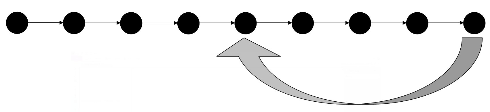
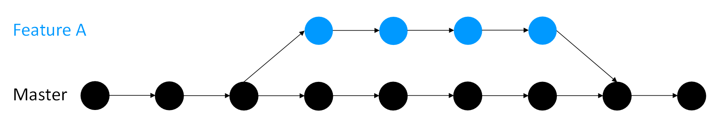
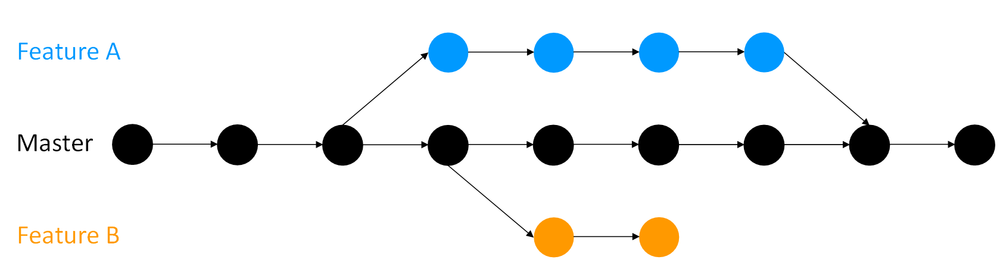

### The basic workflow

Version control is a systematic approach to record changes made in a file or set of files over time so that you and your collaborators can track the history, see what changed and recall specific versions later when needed.
A typical procedure for using version control is as follows:

1. Create files - these may contain text, code or both.
2. Work on these files, by changing, deleting or adding new content.
3. Create a snapshot of the file status (also known as version) at this time.

This process of creating a snapshot, which is described differently in different version control software.
For example, Git describes it as "a commit", a few systems call it "a timepoint" or "a checkpoint", and this is simply referred to as "saving your work" in other cases such as in [Google docs](https://docs.google.com/) or [HackMD](http://hackmd.io/).

As you keep saving your work by adding changes, you make more and more snapshots.
You can think of these as saving versions of these files while documenting their history. 
If you need to go back to the version of a file in a specific point in time because of a mistake, or if you changed your mind about a previous update, you can access the file in your preferred version, or return your entire project to a past state.

An illustration of this is shown below.



In many version control systems, you will be able to add a comment every time you save a new version.
These comments should be clear and concise to make it easy to understand what changes were proposed and what updates were made in a version.
This ensures that it is easy to find what you are looking for when you need to go back to a past version.
Your collaborators will thank you, but so will future versions of yourself.

### Other features offered by version control

So you have your project and you want to add something new or try something out before reflecting the changes in the main project folder.
To add something new, you can continue editing your files and save changes with the proposed changes.
If you want to try something without reflecting the changes in the main repository first, you can use the "branching" feature of more advanced version control systems such as Git. 
A branch creates a local copy of the main repository where you can work and try new changes.
Any work you do on your branch will not be reflected on your main project (referred to as your master branch) so it remains secure and error-free while you test your ideas and troubleshoot in a local branch.

When you are happy with the new changes, you can introduce them to the main project.
The merge feature in Git allows the independent lines of development in a local branch to get integrated into the master branch.



You can have more than one branch off of your master copy, and if one of your branches ends up not working you can either abandon it or delete it without impacting the master branch of your project.



If you want you can even create branches off of branches (and branches off of those branches and so on).


No matter how many branches you have you can access past versions you made on any of them.

## Why should you use version control?

As explained in the earlier section, version control helps us understand what changes we made in the past or why we did a certain analysis in the way we did it, even weeks or months later.
With the help of comments and commit messages, each version can explain what changes it contains compared to the previous versions.
This is helpful when we share our analysis (not only data), and make it auditable -- more generally, **reproducible**, which is good scientific practice.

A version control system stores all your changes neatly away so while it is still easy to access them your working directory is not cluttered by the debris of versions past that it is necessary to keep just in case.
Similarly, with version control there is no need to leave chunks of code commented should you ever need to come back to an old version again.

Finally, version control is invaluable for collaborative projects where different people work on the same code simultaneously and build on our work.
It allows the changes made by different people to be tracked, and can automatically combine people's work while saving a great deal of painstaking effort to do so manually.
Moreover, version control hosting websites, such as GitHub, provides a way to communicate in a more structured way, such as in code reviews, about commits and about issues.

## Getting Started with Git

To get started, please make sure that your have Git installed on your computer.
Instructions for installing Git on Linux, windows and mac machines are available [here](https://Git-scm.com/book/en/v2/Getting-Started-Installing-Git).
Once the installation is complete, go to your project directory via terminal or command-line interface (for example, `cd my-project-folder`).
Your project folder contains all of your files including subdirectories. 

When working on a project you will make numerous changes to your files as you progress. 
Sometimes you may need to undo changes, take another look at past versions, or compare versions.
Saving each version individually (such as `version_1.py` and `version_2.py`) is messy and quickly becomes impractical.

Commits serve as checkpoints where individual files or an entire project can be safely reverted to when necessary.
By making commits you can save versions of your code and switch between them/compare them easily without cluttering up your directory.

To get started with your Git repository, run the following Git command in the terminal to create/initialise your Git repository:

```
git init
```

This only needs to be done once per project.

Think of the repository as a place where the history is being stored. 
When you first initialise a repository with `git init` all of your files in your project would not be added to the Git repository as they are by default untracked by Git.
Therefore your next step is to add your files to the Git repository and allow Git to track them.

Run the following command to add all files in the current folder:
```
git add .
```
OR run the following command to add only the files ('your_file_name' in this example):
```
git add your_file_name
```

This command puts your newly added files or any other changes into what is called the "staging" state. 


If you are ever unsure what files have been added, what files have been changed, what files are untracked, you can run the following to find out:

```
git status
```

The next step is to "commit" any changes stored in your staging area so that they are recorded in your repository.

```
git commit
```
Congratulations, you have finished setting up your repository!

Every time you 'add' files (new files or existing files with some changes) and 'commit' those in your Git repository, you create a version of your project that are stored in your project history that can be accessed any time.

To commit changes with a meaning statement about changes made in a version, use `git commit` with a `-m` (m for message) flag:

```
git commit -m 'helpful statement about the change here'
```

You can see a log of your previous commits using

```
git log
```

In the log report on your terminal, you'll see that each version is automatically tagged with a unique string of numbers and letters, called an SHA.
You can access and compare different version by using their corresponding SHA.

#### Retrieving past versions

To cancel your latest commit (revert to the previous version), run the following command:
```
git revert HEAD
```

This command creates a new commit that reverts the changes made in the last version. 
If you want to retrieve a version from weeks or months ago, start by using `git log` to find the SHA of the version you want to retrieve. 
To reset your entire project to this version run the following commands:

```
git checkout SHA_of_the_version
```

If you want the old version of a single file and not the previous version of the entire project, you can do so by using the following command:

 ```
 git checkout SHA_of_the_version -- your_file_name
 ```

### Good practice

Commits should be 'atomic', meaning, **they should do one simple thing and they should do it completely**, for example, adding a new function or renaming a variable.
If a lot of different changes to your project are all committed together, it can be hard to troubleshoot if any error appears in that version and undoing the whole commit may throw away valid and useful work. 

It is good practice to **specify the files to be committed**, that is, adding files to the staging area by name (`git add your_file_name`) rather than adding everything (`git add .`). 
This prevents you from unintentionally bundling different changes together, for example, if you have made a change to file A while primarily working on file B you may have forgotten this when you go to commit, and with `git add .` file A would be brought along for the ride.

That said, **you do not necessarily need to do per-file commits** when working on multiple files but for one single problem. 
For example, if we add a figure to this chapter here, let's choose something to catch the attention of someone skimming through:


then when I do this two files are changed:

1. The figure file has been added in the project repository.
2. Then, I have added a line in this file that references to this figure so it is displayed.

So two files are affected, but "Add figure to version control chapter" is a single, *atomic* unit of work, so only one commit is necessary.

Finally, do not commit anything that is regenerated from other files, such as a script, committed in a version (unless it is something that would take hours to regenerate). 
Generated files just clutter up your repository and may contain features such as timestamps that can cause annoying file conflicts (see [below](#merge-conflicts)). 
You can instruct Git to ignore certain files by creating a file called `.Gitignore` and including names of the file that you don't need to store in your Git repository.
For example, configuration files should be ignored that might change from environment to environment. 

## More on the commit messages

As you work on your project you will make more and more commits.
Without any other information, it can be hard to remember which version of your project is in which.
Storing past versions is useless if you can not understand them, and figuring out what they contain by inspecting the code is frustrating and takes valuable time.

When you commit you have the chance to write a commit message describing what the commit is and what it does, and you should always, *always,* **_always_** do so.
A commit message gets attached to the commit so if you look back at it (for example, via `git log`) it will show up.
Creating insightful and descriptive commit messages is one of the best things you can do to get the most out of version control.
It lets people (and your future self when you have long since forgotten what you were doing and why) quickly understand what updates a commit contains without having to carefully read code and waste time figuring it out.
Good commit messages improve your code quality by drastically reducing wrong assumptions by people on why certain changes were made.

When you commit via `git commit`, a field appears (either within the terminal or in a text editor) where a commit message can be written. 
You can write a meaningful statement and save (and close if writing the message via text editor).
You can set your preferred editor as the default by running a statement like this:

```
git config --global core.editor "your_preferred_editor"
```

To avoid writing this commit message in an editor, you can use the command `git commit -m "your message here"`, as discussed earlier.

### Good practice

The number one rule is: **make it meaningful**.
A commit message like "Fixed a bug" leaves it entirely up to the person to understand what that means (again, this person may very well be you a few months in the future when you have forgotten what you were doing). 
This can end up wasting your or others time figuring out what the bug was, what changes were actually made, and how a bug was fixed.
As such a good commit message should *explain what you did, why you did it, and what is impacted by the changes*.
As with comments you should describe what the code is "doing" rather than the code itself. For example, it is not obvious what "Change N_sim to 10" actually does, but "Change number of simulations run by the program to 10" is clear.

**Summarise the change** the commit contains in the first line (50-72 characters), then leave a blank line before you continue with the body of the message. By doing this when shortened versions of `git log` are used just the summary will appear. 
This makes it much easier to quickly search through a large number of commits.
It is also a good practice to **use the imperative present tense** in these messages. 
For example, instead of "I added tests for" or "Adding tests for", use "Add tests for".

Here is a good example of a commit message structure:

```
Short (50 chars or less) summary of changes

More detailed explanatory text, if necessary. Wrap it to
about 72 characters or so. In some contexts, the first
line is treated as the subject of an email and the rest of
the text as the body. The blank line separating the
summary from the body is critical (unless you omit the body
entirely); tools like rebase can get confused if you run
the two together.

Further paragraphs come after blank lines.

  - Bullet points are okay, too

  - Typically a hyphen or asterisk is used for the bullet,
    preceded by a single space, with blank lines in
    between, but conventions vary here
```

## Comparing versions

At some point, it is likely you will need/want to compare versions of a project, for example, to see what version was used to generate a certain result.

To address this issue, use the `diff` function, that takes two input data sets and outputs the changes between them.

The Git `diff` is a multi-use function that runs on Git data sources such as commits, branches, files and more.
By default `git diff` will show you any uncommitted changes since the last commit.
If you want to compare two specific things the syntax is:

```
git diff thing_a thing_b
```

For example, if you want to compare how a file has changed between two commits use `git log` to get the SHAs of those commits and run:

```
git diff SHA_a:your_file_name SHA_b:your_file_name
```

Or if you wanted to compare two branches it would be:

```
git diff branch_name other_branch_name
```

### Good practice

With a little familiarity, `git diff` becomes an extremely powerful tool you can use to track what files have changed and exactly what those changes are.
This is extremely valuable for unpicking bugs and comparing work done by different people.
Be careful to **understand what exactly is being compared** and where possible **only compare the relevant files** for what you are interested in to avoid large amounts of extraneous information.

## The Git Branches

- If you add a new feature to your project you run the risk of accidentally breaking your working code as you test the feature.
This would cause unexpected issues for active users of your project, even if the only active user is you.
- The other problem can appear when you collaborate with others.
If everyone starts to work on the master branch simultaneously, it will cause a lot of confusion.
- Some code/feature might not be interesting for everyone and there needs to be a way to allow new work to be done on a project whilst protecting work that has already been done.

Git branches as extremely valuable when addressing any of those issues.
For every Git project, by default, you have one branch called 'master' where all commits are recorded.
Branching feature in Git allows us to create a copy of a project that we can work on and continue to make commits to without reflecting them on the master branch.
Meanwhile, one can continue to make commits on the master branch, which is untouched by the changes made on other branches.
Once you are happy with whatever you were working on on a branch you can merge it into your master branch (or indeed any other branch).
Merging will be covered in the [next section](#merging).

If you test a feature on a branch that does not work out, you can delete or abandon it (for example, Feature B in the diagram below) rather than spending time unpicking your changes if you were doing all your work on the master copy.
You can have as many branches off of branches as you desire (for example, Feature A-1).

Using branches keeps working code safe, particularly in collaborations.
Each contributor can have their own branch or branches which are only merged into the main project when they are ready.


You can create a branch and switch to it using:
```
git checkout -b name_of_your_new_branch
```

To change between branches, use the following command:
```
git checkout name_of_the_branch
```

You must commit any work you have in progress before you can to switch to another branch. 

You can see all branches of your project using:

```
git branch
```
This gives the output as a list with an asterisk next to the branch you are on.
You can also use `git status` if you have forgotten which branch you are on.

If you decide to get rid of a branch you can delete it with:

```
git branch -D name_of_the_branch
```

### Good practice

Branches should be used to **keep the master branch clean**.
That is, the master should only contain work which is complete and tested and so rightfully belongs in the master version of the project.
Similarly, you should try to keep individual branches as clean as possible by **only adding one new feature per branch**, because if you are working on several features some may be finished and ready to merge into master while others are still under development.
Keeping your branches clean means only making changes related to the feature on the feature's branch.
Give your branches **sensible names**, "new_feature" is all well and good until you start developing a newer feature on another branch.

## The Git Merge command

Once you've finished up some work on a branch and you're are ready to integrate it to your main project (or any other branch).

Merge the branch that you worked on into the master branch or any other target branch of your interest.
You can also use merging to combine work that other people have done with your own and vice versa.

To merge a branch, branch_A, into another branch, branch_B, switch to branch_A via: 
```
git checkout branch_A
``` 
Merge it into branch_B by:

```
git merge branch_B
```

Merging will not be possible if there are changes in either your working directory or staging area that could be written over by the files that you are merging in.
If this happens, there are no merge conflicts in individual files.
You need to commit or stash the files it lists and then try again.
The error messages are as follows:

```
error: Entry 'your_file_name' not update. Cannot merge. (Changes in working directory)
```

or

```
error: Entry 'your_file_name' would be overwritten by merge. Cannot merge. (Changes in staging area)
```

### Good practice

First and foremost your **master branch should always be stable**. 
Only merge work that is finished and tested (for example, on a different branch).
If your project is collaborative then it is a good idea to merge changes that others make into your own work frequently or share your changes with your collaborators.
If you do not do it often, it is very easy to merge conflicts to arise (next section).

## Merge conflicts

When changes to made to the same file on different branches sometimes those changes may be incompatible.
This most commonly occurs in collaborative projects, but it happens in solo projects too.
Let's say there's a project and it contains a file with this line of code:

```
print('hello world')
```

Let's say, one person, on their branch, decides to pep it up a bit and changes this line to:

```
print('hello world!!!')
```

while someone else on another branch instead decides to change `print('hello world')` to:

```
print('Hello World')
```

They continue doing work on their respective branches and eventually decide to merge.
Their version control software then goes through and combines their changes into a single version of the file, *but* when it gets to the hello world statement it doesn't know which version to use.
This is a merge conflict: incompatible changes have been made to the same file.

When a merge conflict arises it will be flagged during the merge process.
Within the files with conflicts the incompatible changes will be marked so you can fix them:

```
<<<<<<< HEAD
print('hello world!!!')
=======
print('Hello World')
>>>>>>> master
```
`<<<<<<<`: Indicates the start of the lines that had a merge conflict.
The first set of lines are the lines from the file that you were trying to merge the changes into.

`=======`: Indicates the break point used for comparison.
Breaks up changes that the user has committed (above) to changes coming from merge (below) to visually see the differences.

`>>>>>>>`: Indicates the end of the lines that had a merge conflict.

You resolve a conflict by editing the file to manually merge the parts of the file that Git had trouble merging.
This may mean discarding either your changes or someone else's or doing a mix of the two.
You will also need to delete the `<<<<<<<`, `=======`, and `>>>>>>>` in the file.
So in this project, the users may decide in favour of one `hello world` over another, or they may decide to replace the conflict with:

```
print('Hello World!!!')
```

Once you have fixed the conflicts commit the new version.
You have now resolved the conflict.
If, during the process, you need a reminder of which files the conflicts are in you can use `git status` to find out.

If you find there are particularly nasty conflicts and you want to abort the merge you can use:
```
git merge --abort
```

### Good practice

Before you start trying to resolve conflicts make sure you fully understand the changes and how they are incompatible to avoid the risk of making things more tangled.
Merge conflicts can be intimidating to resolve, especially if you are merging branches that diverged a great many commits ago which may now have many incompatibilities.
However, it is a good reminder that your previous versions are safe and you can go about fixing this issue without affecting the past versions.
This is why it is good practice to ** merges other's changes into your work frequently**.

There are tools available to assist in resolving merge conflicts, some are free, some are not.
Find and familiarise yourself with one that works for you.
Commonly used merge tools include [KDiff3](http://kdiff3.sourceforge.net/), [Beyond Compare](https://www.scootersoftware.com/), [Meld](http://meldmerge.org/), and [P4Merge](https://www.perforce.com/products/helix-core-apps/merge-diff-tool-p4merge).
To set a tool as your default do:

```
git config --global merge.tool name_of_the_tool
```

and launch it with:

```
git mergetool
```

Fundamentally the best way to deal with merge conflicts is to, so far as is possible, try to avoid them in the first place.
You can improve your odds on this by keeping branches clean and focused on a single issue and involving as few files as possible.
Before merging make sure you know what's in both branches, and if you are not the only one that has worked on the branches then keep the lines of communication open so you are all aware of what the others are doing.

## Summary of key Git commands

| Command                       | Use                                                                      |
| ----------------------------- | ------------------------------------------------------------------------ |
| git init                      | Initialises a Git repository in that directory                           |
| git add .                     | Add all changes to the staging area to be committed                      |
| git add file_name             | Add changes to the specified file to the staging area to be committed    |
| git commit                    | Commits staged changes and allows you to write a commit message          |
| git checkout SHA              | Check out past commit with the given SHA                                 |
| git checkout SHA -- file_name | Check out the past version of a file from the commit with the given SHA      |
| git checkout -b branch_name   | Create and switch to a new branch                                        |
| git checkout branch_name      | Switch to a specified branch                                             |
| git merge branch_name         | Merge the branch you are on into the specified branch                    |
| git log                       | Output a log of past commits with their commit messages                  |
| git status                    | Output status including what branch you're on & what changes are staged  |
| git diff                      | Output difference between the working directory and most recent commit       |
| git diff thing_a thing_b      | Output difference between two things, such as commits and branches       |
