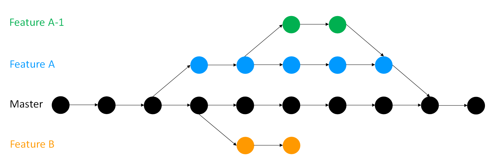

## Branches

### The problem

If you add a new feature to your project you run the risk of accidentally breaking your working code as you make changes to it.
This would be very bad for active users of your project, even if the only active user is you.
Also version control systems are regularly used for collaboration.
If everyone starts programming on top of the master branch, it will cause a lot of confusion.
Some people may write faulty/buggy code or simply the kind of code/feature others may not want in the project.
There needs to be a way allow new work to be done on a project whilst protecting work that has already been done.

### The solution

Branches.
At the start of this chapter an [overview](#other-facilities-offered-by-version-control) was given of the concept of branches, but let's recap.
You have a project, and you make commits on it.
By default you have one branch, called 'master'.
Making a branch essentially makes a copy of your code which you can work on and continue to make commits to.
Meanwhile your master branch is untouched by these changes, and you can continue to make commits on it too.
Once you are happy with whatever you were working on on a branch you can merge it into your master branch (or indeed any other branch).
Merging will be covered in the [next section](#merging).
If your work on a branch does not work out you can delete or abandon it (for example, Feature B in the diagram below) rather than spending time unpicking your changes if you were doing all your work on the master copy.
You can have as many branches off of branches as you desire (for example, Feature A-1).

Using branches keeps working code safe, particularly in collaborations.
Each contibuter can have their own branch or branches which are only merged into the main project when they are ready.



### How to do it

You can create a branch and switch to it using:
```
git checkout -b name_of_your_new_branch
```

To change between branches:
```
git checkout name_of_the_branch
```

though you must commit any work you have in progress before you will be able to switch. You can see all branches of your project simply using:

```
git branch
```
which will output a list with an asterix next to the branch you are on.
You can also use `git status` if you have forgotten which branch you are on.

If you decide to get rid of a branch you can delete it with:

```
git branch -D name_of_the_branch
```

### Good practice

Branches should be used to **keep the master branch clean**.
That is, master should only contain work which is complete and tested and so rightfully belongs in the master version of the project.
Similarly you should try to keep individual branches as clean as possible by **only adding one new feature per branch**, because if you are working on several features some may be finished and ready to merge into master while others are still under development.
Keeping your branches clean means only making changes related to the feature on the feature's branch.
Give your branches **sensible names**, "new_feature" is all well and good until you start developing a newer feature on another branch.
