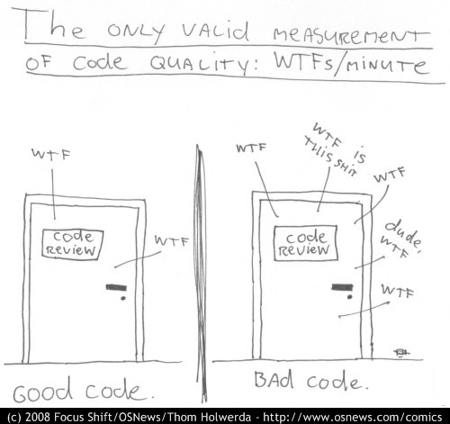

## Commit messages

### The problem

As you work on you project you will make more and more commits.
Without any other information it can be hard to remember which version of your project is in which.
Storing past versions is useless if you ca not understand them, and figuring out what they contain by inspecting the code is frustrating and takes valuable time.  

### The solution

When you commit you have the chance to write a commit message describing what the commit is and what it does, and you should always, *always,* **_always_** do so.
A commit message gets attached to the commit so if you look back at it (for example, via `git log`) it will show up.
Creating insightful and descriptive commit messages is one of the best things you can do to get the most out of version control.
It lets people (and your future self when you have long since forgotten what you were doing and why) quickly understand what changes a commit contains without having to carefully read code and waste time figuring it out.
Good commit messages improve your code quality by drastically reducing its WTF/min ratio:



### How to do it

When you commit via:

```
git commit
```

notice that a field appears (either within the terminal or in a text editor) where a commit message can be written. Simply do so and save (and close if writing the message via text editor).
To set your preferred editor as the default do:

```
git config --global core.editor "your_preferred_editor"
```

### Good practice

The number one rule is: **make it meaningful**.
A commit message like "Fixed a bug" leaves it entirely up to the person looking at the commit (again, this person may very well be you a few months in the future when you have forgotten what you were doing) to waste time figuring out what the bug was, what changes you actually made, and how they fixed it.
As such a good commit message should **explain what you did, why you did it, and what is impacted by the change**.
As with comments you should **describe what the code is doing rather than the code itself**. For example, it is not obvious what "Change N_sim to 10" actually does, but "Change number of simulations run by the program to 10" is clear.

**Summarise the change** the commit contains in the first line (50-72 characters), then leave a blank line before you continue with the body of the message. By doing this when shortened versions of `git log` are used just the summary will appear. This makes it much easier to quickly search through a large number of commits.
It is also a good practice to **use the imperative present tense** in these messages. In other words, use commands.
Instead of "I added tests for" or "Adding tests for", use "Add tests for".

Here is a good example of commit message structure:

```
Short (50 chars or less) summary of changes

More detailed explanatory text, if necessary. Wrap it to
about 72 characters or so. In some contexts, the first
line is treated as the subject of an email and the rest of
the text as the body. The blank line separating the
summary from the body is critical (unless you omit the body
entirely); tools like rebase can get confused if you run
the two together.

Further paragraphs come after blank lines.

  - Bullet points are okay, too

  - Typically a hyphen or asterisk is used for the bullet,
    preceded by a single space, with blank lines in
    between, but conventions vary here
```
