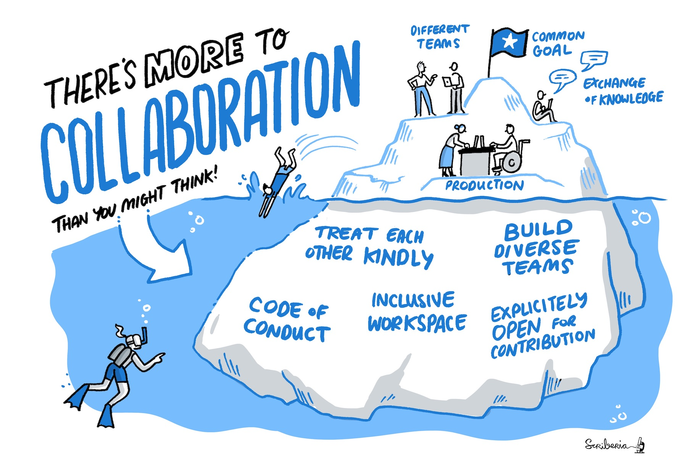

# Guide for Collaboration

***This book covers topics related to effective and inclusive collaboration.***

Data science is defined by its interdisciplinarity.
Our work can only reach its greatest potential if there are diverse teams of people involved in designing and delivering the research or product.

There are many different skills required to work well in groups with a range of expertise.
In this guide, we welcome contributions for developing guidance on:

* Distributed collaboration on GitHub
* Reviewing team member's contributions
* Remote working
* Running an inclusive event
* Chairing a meeting
* Defining explicit expectations
* Participatory co-creation
* Codes of conduct
