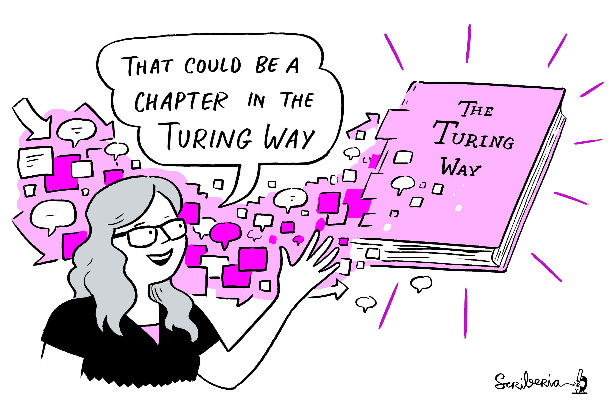

(ch-acknowledgement)=
# Acknowledging Contributors

_The Turing Way_ is collaboratively developed by its diverse community of researchers, learners, educators, and other stakeholders.
This project can simply not exist without the collaborative nature of this project and the willingness of our community members to work cooperatively in this book.
We value all kinds of contributions in this project and are committed to recognising each of them fairly.

In the subchapter {ref}`Contribution types and pathways <ch-persona-contributions>`, we have provided an overview of different kinds of contributions that are possible in this project with the help of personas and pathways.
We also described how we acknowledge them in the contributor's table in the [README file](https://github.com/alan-turing-institute/the-turing-way/blob/master/README.md#contributors).

## Contributors and co-authors

As a community-led project, we believe in and promote a collaborative approach to develop the content of this book.
Writing a chapter is an iterative process that involves designing, outlining, writing, reviewing, and editing its contents.
Everyone who contributes to this book, no matter how small or big their contributions are, is recognised in this project as a contributor and a community member.

All the substantial contributors are named as co-authors on the book as a whole.
These contributions include carrying out the larger task alone or with others in collaboration such as writing a chapter, maintaining the community interactions, setting up infrastructure, or mentoring others to feel comfortable in their participation.

## Creating opportunities for shared ownership

As an open-source community, the project invites contributions from the experts and enthusiasts alike to collectively develop guidance, recommendations, and practical resources that can foster a gold-standard for reproducible research.

Everyone has a skill that is useful for someone, and therefore anyone can contribute to _The Turing Way_.

<!---
|  |
|----------|
| “That could be a chapter” - Kirstie Whitaker, _The Turing Way_ project illustration by Scriberia. Zenodo. http://doi.org/10.5281/zenodo.3695300 |
--->

```{figure} ../figures/ThatCouldBeAChapter.png
---
height: 400px
name: ThatCouldBeAChapter
alt: A sketch of Kirstie saying “That could be a chapter”
---
“That could be a chapter” - Kirstie Whitaker, _The Turing Way_ project illustration by Scriberia. Zenodo. http://doi.org/10.5281/zenodo.3695300
```

_The Turing Way_ core team values and promotes a culture of collaboration.
In contrast to the traditional incentive structure in academia, which often discourages open collaboration, public engagements in developing projects and sharing data early on, we promote collaborative work culture in _The Turing Way_.

We intentionally avoid individual authorship in favor of establishing shared ownership and agency in this project.
This means that no "one" person owns the book or any of it's chapters.
The book belongs to the community and the chapters are always considered work in progress so that they can evolve over time with newer contributions.
We encourage authors to actively involve others in reviewing their work, providing missing information and adding diverse examples that are impossible to be written by a single person.

Such collaborative efforts also lower the psychological barriers for the new contributors who can propose improvements in the book by editing, moving, and adapting its content as the book grows.

With this document and the culture that emerges from open collaboration and acknowledgment, we want to capture the important work around answering questions, representing the project, developing and maintaining the infrastructure, and all other nurturing roles that make The Turing Way community so special.

We hope that with such acknowledgment of contributions, individuals can identify the work they've done and highlighted them in their profiles (like CV and research talks), without trying to fit _The Turing Way_ into a traditional credit system.

## Highlight your contributions!

In the subchapter {ref}`Record of contributions <ch-acknowledgement-records>`, we have listed all the documents in this project that are considered records of contributions every contributor has made in this project that they want to highlight.

We highly encourage community members to actively collaborate with others, support each other, and take pride in the work that they have done this project.
