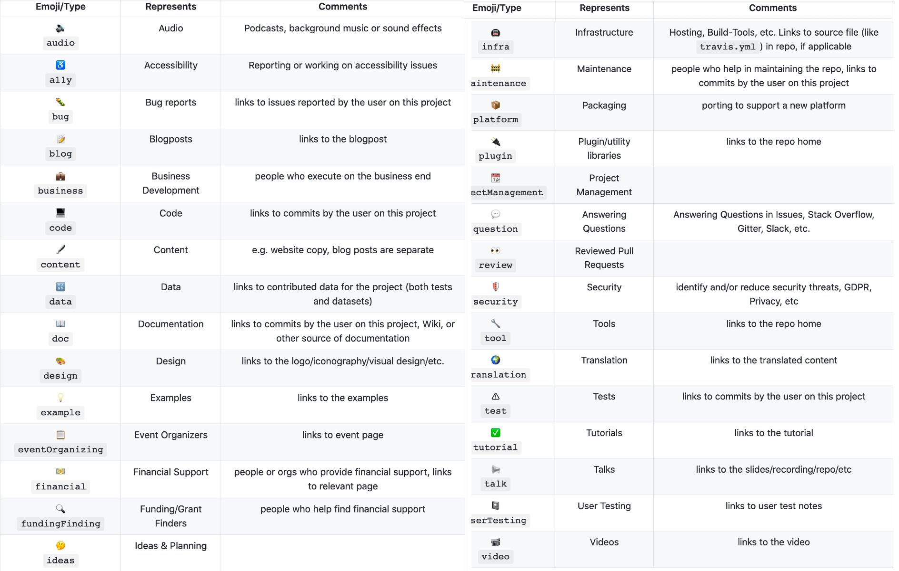

(ch-acknowledgement-records)=
# Records of Contributions

We invite all our contributors to co-create these records to capture the important work they do around answering questions, representing the project, developing and maintaining the infrastructure, and all other nurturing roles that make The Turing Way community so special.
These records can be used for highlighting skills that our members have gained and shared through their involvement in _The Turing Way_.
These records of contributions can be directly translated towards the professional development of our community members, which can be further used for enhancing their personal or professional portfolio (profile, CV, resume).

Two documents are considered as the records of contributions in _The Turing Way_.

## 1. Contributors Table

The [Contributors](https://github.com/alan-turing-institute/the-turing-way#contributors) section in [README](https://github.com/alan-turing-institute/the-turing-way/blob/master/README.md) file is updated with every contributor's name using [all contributors bot](https://allcontributors.org/) with their [emoji keys](https://allcontributors.org/docs/en/emoji-key).

This emoji key is used for recording and fairly acknowledging the different types of contributions our community members have made.
No contribution is too small.
They can include (but not limited to) bug fixing, chapter planning, writing, editing, reviewing, idea generation, presentation, project management, and maintenance.
Please see the subchapter {ref}`Contribution types and pathways <ch-persona-contributions>` for details.

|  |
|----------------------------------------------|
| Emoji key table of the all contributors bot that _The Turing Way_ uses for acknowledging different contributions from the community members |

## 2. Contributors file

The details for each contributor will be listed in the contributor's file called [`contributors.md`](https://github.com/alan-turing-institute/the-turing-way/blob/master/contributors.md) file with the following details, which will be referred as `contributor's detail` in the rest of this document:

> * Name: `Contributor's name`
> * GitHub id: `GitHub id`
> * ORCID: `ORCID id of the contributor`
> * List of contributions on GitHub: `A list of PRs, issues and comments`

Below, we will discuss how to record different contributions by adding details and pathways of contribution to the following text field:
> * Pathways of contributions: `details discussed below`

Additionally, contributors can opt to add more information they think can help them highlight their engagement with _The Turing Way_ project by supplementing information to the following text field:
> * More information: `personal information provided by the contributors`

*Text fields should be provided with details for each contributor with specific information by replacing the text describing the requested information inside the backticks "``"*

### Recording different types of contributions

Specifications for all types of contributions can be added in the [contributors file](https://github.com/alan-turing-institute/the-turing-way/blob/master/contributors.md) after adding the `contributor's detail` for each contributor.
In the contribution types discussed below, we revisit some of the most common scenarios that are already outlined in the chapter {ref}`Contribution types and pathways <ch-persona-contributions>`.

We recommend using the example statements only as a guide.
As a contributor, you will be able to add as many details as useful for your record.

#### Bug fixes

*A "bug" is a small error in the text or code like typo, formatting issue or broken links.*

Anyone who raises bugs, related issues or fixes them are listed as contributors in the Contributors table with  🐛 (`bug`) emoji.

The contributor's file will be updated for the contributors with a similar statement as below after the `contributor's detail`:
> * Pathways of contributions: `Contributor's Name` has fixed typos and made other contributions `other details like identified sections of the book that are unclear`.

### Reviewing chapters and other pull requests

*The review process of a newly contributed chapter or a subsection of an existing chapter involves approving the language and structure of a chapter or a section of a chapter, flagging errors or typos, asking for clarifications if certain parts of the content or statements are unclear, suggesting modifications and improving the overall quality of someone's contribution.*

Anyone who reviews a chapter is listed as reviewers and are acknowledged with 👀 (`review`) emoji in the Contributors table.

The contributor's file will be updated for the contributors with a similar statement as below:
> * Pathways of contributions: `Contributor's name` reviewed the chapter `Chapter name`. They made other contributions to the chapter `other details like structuring and adding references`.

### Chapter contribution

*The various contributions to a chapter are made towards designing, writing, and reviewing its content through GitHub issues, pull requests, and reviewing processes.*

The designing, writing, and reviewing of a chapter's content are acknowledged with 🤔 (`idea`), 🖋 (`content`) and 👀 (`review`) emojis respectively in the Contributors table.

The contributor's file will be updated for the contributors with a similar statement as below:
> * Pathways of contributions: `Contributor's name` designed and wrote a chapter on `chapter name` and `details on reviewing and structuring new content`.

### Translation

*The translation process in _The Turing Way_ includes aspects translating _The Turing Way_ chapters into languages other than English and reviewing them.*
The translation infrastructure as of May 2020 is [Trasifex](https://www.transifex.com/theturingway/theturingway/dashboard/).

Contributors who participate in the translation process will be acknowledged in the Contributors table with the 🌍 (`translation`) emoji.

The contributor's file will be updated for the contributors with a similar statement as below:
> * Pathways of contributions: `Contributor's name` has translated part of the chapter `chapter name` into `language`. They have also `details like designed and implemented a process to translate the book into multiple languages, mentored multiple contributors within the community and has translated 3 chapters of The Turing Way into Chinese`.

### Organisational support

*When members participate in _The Turing Way_ community with the in-kind support of their funders and organisation, we acknowledge each member individually and list their organisations as "Collaborating organisations".
Such organisational supports are applicable when one or multiple members from a project or community collaborate to build resources in _The Turing Way_.*

Each organisation who supports its members to collaborate with _The Turing Way_ will be listed as "Collaborating organisations" in the contributor's file.
Each contributor from these organisation will be acknowledged individually in the Contributors Table for their specific contributions with emoji keys reflecting specific contributions made with the organisational support.
Their contributors will be listed under their organisation's name in the contributor's file.

Every contribution from collaborating organisation will be updated with a similar statement as below:
> * Pathways of contributions: `Contributor's name` have also made contributions `contribution type` to the chapters `chapter name`. They have also `details on other contributions like managing a team of contributors, writing a chapter`.

### Maintenance

*Maintenance work in _The Turing Way_ applies to the conversations in community spaces, technical infrastructure, online hosting platforms for the book, and translation infrastructure of Transifex.*

Contributors will be acknowledged in the Contributors table with the 💬
(`question`) emoji for answering questions, 🤔 (`ideas`) emoji for discussions, 🚇 (`infra`) emoji for infrastructure support, and 🚧 (`maintenance`) for community efforts or infrastructure maintenance.

The contributor's file will be updated for the contributors with a similar statement as below:
> * Pathways of contributions: `Contributor's name` has `details like responded to questions in the community's Gitter channel, mentored multiple contributors within the community and has reviewed pull requests to fix typos in the book, maintains the backend infrastructure of the project, provide support and solution regarding Jupyter book and continuous integration, designed and implemented a process to translate the book into multiple languages, helped multiple contributors in facilitating translation efforts`.  

### Representing the Turing Way

*Anyone who shares _The Turing Way_ resources in any relevant publication, learning material, conference presentations, or community event are acknowledged for representing _The Turing Way_.*

Each contributor who represents _The Turing Way_ at an event is acknowledged in the Contributors table with the 📢 (`Talk`) emoji in the Contributors Table along with other contributions as applicable.

Their contributions will be listed in the contributor's file with a similar statement as below:
> * Pathways of contributions: `Contributor's name` has presented a talk at _The Turing Way_ at `event's name`. They have also `details like mentored multiple contributors within the community and have given talks at and event on behalf of the community`.
