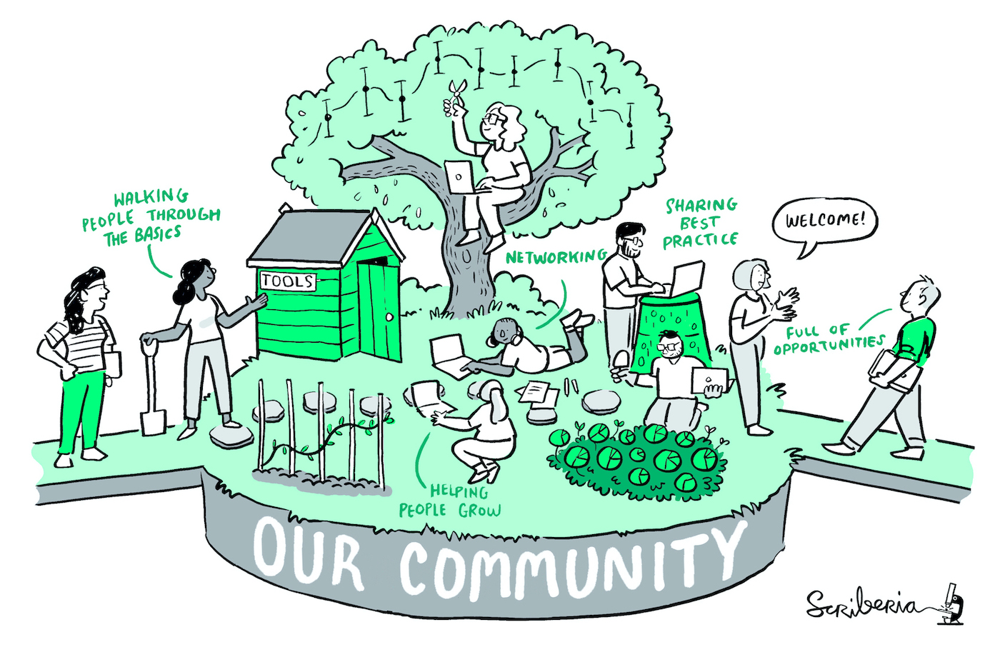

# Community Handbook

_The Turing Way__ is a community-led book project that involves diverse perspectives of researchers, funders, educators, learners and various stakeholders from around the world.

The Community handbook section of this book aims to provide information about the project, ways of working, and other aspects that can make community participation equitable for our members.

We are incredibly grateful to our community members who are the readers, co-authors, contributors, collaborators, maintainers, helper and supporters.

Thank you for joining the incredible journey of _The Turing Way_!

*This image was created by Scriberia for The Turing Way community and is used under a CC-BY licence. Available online on [Zenodo](http://doi.org/10.5281/zenodo.3695300)*

## License for The Turing Way book series

All content in this book series is licensed under the [Creative Commons Attribution 4.0 International (CC BY 4.0)](https://creativecommons.org/licenses/by/4.0/deed.ast) (CC BY 4.0) license.

The original files can be accessed online on our [GitHub repository](https://github.com/alan-turing-institute/the-turing-way/tree/master/book/website).

## Useful links

Visit the Turing Way GitHub repository at [https://github.com/alan-turing-institute/the-turing-way](https://github.com/alan-turing-institute/the-turing-way) to find out what we are working on.
Start contributin to the book by reading our [contribution guidelines](https://github.com/alan-turing-institute/the-turing-way/blob/master/CONTRIBUTING.md).

If you are new and would like to connect with us, join our [Gitter channel](https://gitter.im/alan-turing-institute/the-turing-way).
We also host bimonthly [online Collaboration Cafés](https://github.com/alan-turing-institute/the-turing-way/blob/master/project_management/online-collaboration-cafe.md) to cowork online with our community members online.
This would be the right place to get opinions from other community members and request their feedback and review on your work.

For specific questions or concerns, you can contact our community manager **Malvika Sharan** by email at [msharan@turing.ac.uk](mailto:msharan@turing.ac.uk).
Alternatively, you can contact the lead investigator **Kirstie Whitaker** by email at [kwhitaker@turing.ac.uk](mailto:kwhitaker@turing.ac.uk).

To stay updated with our community events, subscribe to [_The Turing Way_ calendar](https://calendar.google.com/calendar?cid=dGhldHVyaW5nd2F5QGdtYWlsLmNvbQ).
To receive monthly newsletters, [join our mailing list](https://tinyletter.com/TuringWay)

We are also on [Twitter](https://twitter.com/turingway), follow us for daily updates.

### Wondering where to start?

Here are a few suggestions for a good first contributions:

- Fix a typo in [the book](https://the-turing-way.netlify.com) and/or [repository](https://github.com/alan-turing-institute/the-turing-way).
- Flag the unclear or duplicated information in the book by opening an [issue on the GitHub](https://github.com/alan-turing-institute/the-turing-way/issues).
- Fix an [old issue](https://github.com/alan-turing-institute/the-turing-way/issues) or comment on the the [pull requests](https://github.com/alan-turing-institute/the-turing-way/pulls).
- Write your personal experience of reproducible research in this [google form](https://goo.gl/forms/akFqZEIy2kxAjfZW2).
- See more info on the GitHub: https://github.com/alan-turing-institute/the-turing-way/blob/master/project_management/online-collaboration-cafe.md

## The Turing Way Core Team

The lead investigator for this project is [Dr Kirstie Whitaker](https://whitakerlab.github.io/about).
She is a research fellow at the [Alan Turing Institute](http://turing.ac.uk) and senior research associate in the [Department of Psychiatry](https://www.psychiatry.cam.ac.uk) at the University of Cambridge.

The Community Manager is [Malvika Sharan](https://about.me/malvikasharan). She is a research associate at the [Alan Turing Institute](http://turing.ac.uk).

Some of our core contributors who have been involved in the project from the beginning are following (in alphabetical order):

* [Rachael Ainsworth](https://github.com/alan-turing-institute/the-turing-way/blob/master/contributors.md#rachael-ainsworth)
* [Becky Arnold](https://github.com/alan-turing-institute/the-turing-way/blob/master/contributors.md#becky-arnold)
* [Louise Bowler](https://github.com/alan-turing-institute/the-turing-way/blob/master/contributors.md#louise-bowler)
* [Sarah Gibson](https://github.com/alan-turing-institute/the-turing-way/blob/master/contributors.md#sarah-gibson)
* [Patricia Herterich](https://github.com/alan-turing-institute/the-turing-way/blob/master/contributors.md#patricia-herterich)
* [Rosie Higman](https://github.com/alan-turing-institute/the-turing-way/blob/master/contributors.md#rosie-higman)
* [Anna Krystalli](https://github.com/alan-turing-institute/the-turing-way/blob/master/contributors.md#anna-krystalli)
* [Alexander Morley](https://github.com/alan-turing-institute/the-turing-way/blob/master/contributors.md#alexander-morley)
* [Martin O'Reilly](https://github.com/alan-turing-institute/the-turing-way/blob/master/contributors.md#martin-oreilly)
