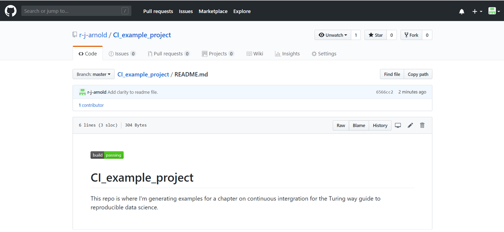

# Continuous integration

| Prerequisite | Importance | Notes |
| -------------|------------|-------|
| [Experience with the command line](https://programminghistorian.org/en/lessons/intro-to-bash) | Necessary | Continuous integration will follow command line instructions
| [Version control](/version_control/version_control) | Necessary | Continuous integration runs every time a new _commit_ is made to your project |
| [Reproducible computational environments](/reproducible_environments/reproducible_environments) | Necessary | Continuous integration runs your tests on a separate computer (usually in the cloud) so you need to set it up in the same way. |
| [Testing](/testing/testing) | Very helpful | Continuous integration _tests_ if anything important has changed when you make a change in your project |

## Table of contents

- [Summary](#Summary)
- [How this will help you/ why this is useful](#Why_this_is_useful)
  - [What are continuous delivery and continuous deployment?](#What_are_continuous_delivery_and_continuous_deployment)
- [What is Travis and how does it work?](#What_is_Travis_and_how_does_it_work)
- [Setting up continuous integration with Travis](#Setting_up_continuous_integration_with_Travis)
  - [Basic steps](#Basic_steps)
  - [Setting up the computational environment](#Setting_up_the_computational_environment)
    - [Operating system](#Operating_system)
    - [Programming language](#Programming_language)
    - [Compilers](#Compilers)
    - [Dependencies](#Dependencies)
    - [Containers](#Containers)
  - [The `.travis.yml` script](#The_travis_yml_script)
  - [After success](#After_success)
  - [Testing a project against multiple versions of a programming language](#Testing_a_project_against_multiple_versions_of_a_programming_language)
  - [Testing a project on multiple operating systems](#Testing_a_project_on_multiple_operating_systems)
    - [Allowing failures](#Allowing_failures)
- [Limitations of CI](#Limitations_of_CI)
- [Best practise for continuous integration](#Best_practise_for_continuous_integration)
  - [Small, iterative changes](#Small_iterative_changes)
  - [Trunk-based development](#Trunk_based_development)
  - [Keep the building and testing phases fast](#Keep_the_building_and_testing_phases_fast)
  - [Computational expense](#Computational_expense)
  - [Dependencies tracking](#Dependencies_tracking)
  - [Consistency throughout the pipeline](#Consistency_throughout_the_pipeline)
- [Checklist](#Checklist)
- [What to learn next](#What_to_learn_next)
- [Further reading](#Further_reading)
- [Definitions/glossary](#Definitions_glossary)
- [Bibliography](#Bibliography)

<a name="Summary"></a>
## Summary

Continuous integration (CI) is the practice of integrating changes to a project made by individuals into a main, shared version frequently (usually multiple times per day). CI software is also typically used to identify any conflicts and bugs that are introduced by changes, so they are found and fixed early, minimizing the effort required to do so. Running tests regularly also saves humans from needing to do it manually. By making users aware of bugs as early as possible researchers (if the project is a research project) do not waste a lot of time doing work that may need to be thrown away, which may be the case if tests are run infrequently and results are produced using faulty code.

<a name="Why_this_is_useful"></a>
## How this will help you/ why this is useful

CI has a number of key benefits:

- Helps the team to find bugs early, minimizing their damage and making them easier to fix
- Keeps project contributors up to date with each other's work so they can benefit from it as soon as possible, and adapt to any changes
- Encourages users to write tests
- Automates running of tests
- Ensures tests are run frequently

<a name="What_is_continuous_integration"></a>
## What is continuous integration?

This chapter demands a strong understanding of version control. The central concepts you will need to recall are:

- How version control can enable people collaborating on a single project to combine their work via merging
- What merge conflicts are and the difficulties they can present
- What GitHub is and how to use it

In brief if a group of researchers are collaborating on a project it is good practice for them to use version control to keep track of their changes over time, and combine their work regularly. If they do not combine (integrate) their work regularly then when they come to do so there is more opportunity for different people to have made contradictory changes.

Continuous Integration is a software development practice where members of a team integrate their work frequently, rather than doing work in isolation and merging in large changes at infrequent intervals. In CI usually each person integrates at least daily. Each integration is verified by an automated build (usually including tests) to detect integration errors as quickly as possible.

The idea is to minimize the cost of integration by making it an early consideration. Researchers can discover conflicts at the boundaries between new and existing code early, while they are still relatively easy to reconcile. Once the conflict is resolved, work can continue with confidence that the new code honours the requirements of the existing codebase. The goal is to build healthier software by developing and testing in smaller increments. Many teams find that this approach leads to significantly reduced integration problems and allows a team to develop more rapidly.

Integrating code frequently does not, by itself, offer any guarantees about the quality of the new code or functionality. This leads us to the second aspect of CI. When a developer merges code into the main repository, automated processes build a working version of the project. Afterwards, test suites are run against the new build to check whether any bugs were introduced. If either the build or the test phase fails, the team is alerted so that they can work to fix the problem. It is easier to fix a bug in something you wrote a few minutes ago than something you wrote yesterday (or last week, or last month).

By ensuring that your code is built and tested regularly CI helps researchers to demonstrate that their code does what it claims to do, and that it does so correctly. Typically, continuous integration servers will also allow build-and-test jobs to run at specific times, so a [CRON](https://en.wikipedia.org/wiki/Cron)-like, nightly-build-and-test, can be done, as well as a build-and-test job run on-demand.

<a name="What_are_continuous_delivery_and_continuous_deployment"></a>
### What are continuous delivery and continuous deployment?

Technically speaking the above explanation conflates three related concepts, continuous integration, continuous deployment, and continuous delivery. In reality:

- Continuous integration focuses on regularly integrating work from individual researchers into a main repository.
- Continuous delivery automates and runs the steps required to build and test the project.
- Continuous deployment takes this one step further by automatically deploying each time a code change is made.

In this chapter this entire process is referred to as continuous integration for the sake of simplicity.

<a name="What_is_Travis_and_how_does_it_work"></a>
## What is Travis and how does it work?

There are a number of CI tools available, such as Circle (tutorials [here](https://circleci.com/docs/2.0/project-walkthrough/) and [here](https://circleci.com/docs/2.0/hello-world/)).
A list of other CI tools can be found [here](https://www.software.ac.uk/resources/guides/hosted-continuous-integration).
In this chapter we will focus on [Travis](https://travis-ci.org/) because it's free (if your code is openly available), widely used, and well integrated with the version control platform [GitHub](https://github.com/).

To use Travis you will need to add a file to your project called `.travis.yml` which describes the computational environment to run the project in, and includes a script to run your tests. See the chapter on reproducible computational environments for more information on them, including writing `.yml` files to specify them. See the chapter on testing for information on writing and automating tests. The `.travis.yml` file has a number of other capabilities, which will be described [later](#After_success) along with more [detailed instructions](#Setting_up_the_computational_environment) for writing these files.

Once Travis has been set up on a project then each time a commit is made it:

- Clones a copy of project
- Generates a copy of the computational environment specified in the `.travis.yml` file in a brand new virtual environment
- Builds the project within that environment
- Runs the tests by following the script specified in the `.travis.yml` file
- Reports the results
  - Travis will output the results of every step of building the environment and running the script as a log viewable in your account on the [Travis site](https://travis-ci.org/) (the dark grey box in the figure below).
  - Travis will attach a badge to the results, green if all steps in the script (which run the tests) pass, red if not. The badge will be yellow whilst Travis is still running. If Travis is unable to generate the computational environment described in the `.travis.yml` file then it will not proceed further and the badge will be grey. See the figures below which show the passing build badge and failing build badge in the readme of a GitHub repository.
  - Travis will also report the results via email (notification settings can be adjusted).

Here's what the Travis dashboard of a repository looks like:


Everything's green because the build is passing. Note the "build passing" badge at the top. If you click that you will get a popup with a dropdown menu where you can select a way of copying the badge. If you select "markdown" and copy and paste the code snippet it outputs into a markdown file in the project, then GitHub will display the badge in that file:



If I deliberately create a bug and commit it then Travis automatically runs, the tests fail, and this badge automatically updates to "build failing":


You can use Travis to test your project in multiple computational environments my specifying them in the `.travis.yml` file. A quick note on Travis vocabulary:

- Job - an automated process that clones your repository into a virtual environment and then carries out a series of phases such as compiling your code and running tests. A job fails if the return code of the script encounters an error.
- Build - a group of jobs. For example, a build might have two *jobs*, each of which tests a project with a different version of a programming language. A build finishes when all of its jobs are finished.

<a name="Setting_up_continuous_integration_with_Travis"></a>
## Setting up continuous integration with Travis

<a name="Basic_steps"></a>
### Basic steps

- Write a `.travis.yml` file and add it to your project.
- Upload your project to GitHub if you have not already.
- Go to [Travis-ci.com](https://travis-ci.com) and [Sign up with GitHub](https://travis-ci.com/signin).
- Accept the Authorization of Travis CI. You'll be redirected to GitHub.
- You will see a list of your GitHub repositories with buttons next to them. Click the button next to your project repository to activate Travis on it.
- Check the build status page to see if your build passes or fails, according to the return status of the build command by visiting the [Travis CI](https://travis-ci.com/auth) and selecting your repository.
- Next time you commit to your repository Travis will run on the updated version of your project and report the results.

It's that simple. The rest of this section will describe the different components of the `.travis.yml` file and how to write them.

<a name="Setting_up_the_computational_environment"></a>
### Setting up the computational environment

This page on [common build problems](https://docs.travis-ci.com/user/common-build-problems/) is a good place to start troubleshooting if your build is broken.

<a name="Operating_system"></a>
#### Operating system

Travis CI works with a few different operating systems. In the `.travis.yml` file define the operating system to run a project on via the os keyword like:
```
os: linux
```

or
```
os: macOS
```

or
```
os: windows
```

It is possible to build and test a project on multiple operating systems and against multiple versions of a programming language. This presents an extra level of complexity and will not be needed in most cases for research, but it is discussed [later](#Testing_a_project_against_multiple_versions_of_a_programming_language).

To specify the distribution of an operating system to build the project on use `dist`, for example:

```
os: linux
dist: trusty
```

<a name="Programming_language"></a>
#### Programming language

Specify the programming language to run your project with using the language keyword, and specify which version of the language to use. So for python2.7 this would look like:
```
language: python
python:
- "2.7"
```
Further information on the programming languages that are compatible with Travis can be found [here](https://docs.travis-ci.com/user/languages/)

<a name="Compilers"></a>
#### Compilers

If a compiled language is being used which compiler to run can be specified with the compiler keyword:
```
compiler:
  - gcc
```
<a name="Dependencies"></a>
#### Dependencies

Not all languages/software are available on all operating systems however they can typically be installed within the `.travis.yml` file.

To install packages that are not included in the standard version of the operating system specified you can include a `before_install` step in your `.travis.yml` along with the necessary code to install them, for example:

```
before_install:
  - sudo apt-get install -y libxml2-dev
```
<a name="Containers"></a>
#### Containers

It is possible to use Docker containers (see the reproducible computational environments chapter) to generate the computational environment by pulling and running the image from the `.travis.yml` file. If you are doing so you should pull or generate the image (preferably pull to save Travis from having to build the image from scratch) in the before_install step (see above section). Then in the `.travis.yml` file's script ([see next section](#The_travis_yml_script)) you can run a command to run your tests like:
```
script:
  - sudo docker run -t image_name command_to_run
```

So to use pytest to run tests in python files in a container built from an image called a_demo_image
```
script:
  - sudo docker run -t a_demo_image pytest
```

If you need to run more than one command in your script then you can include a script file within the container which contains those commands. Then the same process shown above can be used to run it, like:
```
script:
  - sudo docker run -t a_demo_image ./a_script.sh
```

See [here](https://docs.travis-ci.com/user/docker/) for more information on this.

<a name="The_travis_yml_script"></a>
### The `.travis.yml` script

Travis will report that the build has failed if any commands in the script section return an error. Technically any commands can be included in the script, but it is mainly used for running tests. A script does not need to be long or complicated, as demonstrated by this example which uses the pytest command to run tests in python scripts:
```
script:
- pytest
```

If there are steps that need to be done before a project to be considered to be "fully" working these should also be included in the script too. Lets say some project needs a figure to be converted to a png file for some reason. The script could include
```
  - convert figure_name.jpg figure_name.png
```

If for any reason this cannot be done an error will be returned and the build will be marked as having failed.

<a name="After_success"></a>
### After success

The after success section is much like the script section in that it contains commands to run on the project. The key difference if that the build will not fail if steps in the after success section return errors.

The after success section is run after the script, and can be used to automate steps that need to be taken once a build has passed all the tests. Examples of things that can be automated include automatically merging the new version of the project to the master branch in GitHub. Another example is for the code coverage (see testing chapter) to be automatically measured and reported, as shown here:
```
language: python
python:
  - "2.7"

before_install:
  - pip install coverage

script:
  - pytest

after_success:
  - coverage run main.py
  - coverage report
```

<a name="Testing_a_project_against_multiple_versions_of_a_programming_language"></a>
### Testing a project against multiple versions of a programming language

When a project is expected to be run on systems with different versions of a programming language you can set Travis to run the tests on each of these versions. For example to test on a variety of versions of python:
```
language: python
python:
  - "2.6"
  - "2.7"
  - "3.2"
  - "3.3"
```
<a name="Testing_a_project_on_multiple_operating_systems"></a>
### Testing a project on multiple operating systems

If your code is used on multiple operating systems it should be tested on multiple operating systems. To enable testing on multiple operating systems add multiple entries under the `os` key in your `.travis.yml` file, for example:
```
os:
  - linux
  - osx
```

When you test your code on multiple operating systems, be aware of differences that can affect your tests, for example not all tools and programming languages are available on all operating systems. This should be taken into account when writing commands for your script file (or other sections of the `.travis.yml` file). Also file system behaviour may differ between OSs. Your tests may implicitly rely on these behaviours, and could fail because of them. They are different operating systems, after all.

When Travis is running a job it sets the `TRAVIS_OS_NAME` variable which describes the operating system being tested. You can use this to run commands only on specified operating systems like this:
```
  - if [[ "$TRAVIS_OS_NAME" == "osx" ]]; then command_to_run; fi
```

It is possible to go further and construct a [build matrix](https://docs.travis-ci.com/user/build-matrix/) to test a the project in a range of computational environments.

<a name="Allowing_failures"></a>
#### Allowing failures

To ignore the results of jobs in certain computational environments you can define rows that are allowed to fail in the build matrix. Do this by adding an `allow_failures` section to the `.travis.yml` file. Allowed failures are items in your build matrix that are allowed to fail without causing the entire build to fail.  For example to allow the build to pass even if the job(s) using the osx operating system fail you'd add the following to your `.travis.yml`:
```
matrix:
  allow_failures:
    - os: osx
```

This is useful if you ideally want the build to be successful in multiple environments, but not all of them are vital. 
Beware of ignoring failures as they get introduced by allowing them to "get back to green". 
In the short term, you may seem to get faster progress, but in practice, all of those failures are still there. 
They're now going unreported and may represent genuine problems with your code in the future.

<a name="Limitations_of_CI"></a>
## Limitations of CI

CI does have its limitations. Firstly it is only as effective at finding bugs as the tests provided to it. If a project contains few or poor tests then it is entirely possible the project will contain bugs the tests do not catch and Travis will report the build as successful.

Secondly, depending on the nature of your project there may be security considerations to think about.

Travis CI obfuscates secure environment variables and tokens displayed in the user interface. The [documentation about encryption keys](https://docs.travis-ci.com/user/encryption-keys/) outlines the build configuration required to set this up. However, if secret information is outputted in the course of running a script (for example in an error message) it may be included in Travis's build logs which may be accessible by others. To prevent leaks like this, secure environment variables and tokens that are longer than three characters are automatically filtered at runtime, effectively removing them from the build log, displaying the string `[secure]` instead. Nevertheless you should rotate your tokens and secrets regularly.

 However there are still many ways in which secure information can accidentally be exposed. These vary according to what tools you are using and the settings enabled. Some things to look out for are:

- Settings which duplicate commands to standard output, such as `set -x` or `set -v` in your bash scripts
- Displaying environment variables, by running `env` or `printenv`
- Printing secrets within the code, for example `echo "$SECRET_KEY"`
- Git commands like `git fetch` or `git push` may expose tokens or other secure environment variables
- Settings which increase command verbosity

Preventing commands from displaying any output is one way to avoid accidentally displaying any secure information. If there is a particular command that is using secure information you can redirect its output to `/dev/null` to make sure it does not accidentally publish anything, as shown in the following example:
```
git push url-with-secret >/dev/null 2>&1
```

If your project is set up such that each time a pull request is made on GitHub Travis tests that pull request there is an additional concern. If your tests require authentication credentials someone could make a pull request with malicious code to expose them. Therefore it is a good idea not to allow pull requests to automatically trigger Travis if you have such authentication requirements.

<a name="Best_practise_for_continuous_integration"></a>
## Best practise for continuous integration

<a name="Small_iterative_changes"></a>
### Small, iterative changes

One of the most important practices when adopting continuous integration is to encourage project members to make and commit small changes. Small changes minimize the possibility and impact of problems cropping up when they're integrated, which minimises the time and effort cost of integration.

<a name="Trunk_based_development"></a>
### Trunk-based development

With trunk-based development, work is done in the main branch of the repository or merged back into the shared repository at frequent intervals. Short-lived feature branches are permissible as long as they represent small changes and are merged back as soon as possible.

The idea behind trunk-based development is to avoid large commits that violate of concept of small, iterative changes discussed above. Code is available to peers early so that conflicts can be resolved when their scope is small.

<a name="Keep_the_building_and_testing_phases_fast"></a>
### Keep the building and testing phases fast

Because the build and test steps must be performed frequently, it is essential that these processes be streamlined to minimize the time spent on them. Increases in build time should be treated as a major problem because the impact is compounded by the fact that each commit kicks off a build.

When possible, running different sections of the test suite in parallel can help move the build through the pipeline faster. Care should also be taken to make sure the proportion of each type of test makes sense. Unit tests are typically very fast and have minimal maintenance overhead. In contrast, automated system or acceptance testing is often complex and prone to breakage. To account for this, it is often a good idea to rely heavily on unit tests, conduct a fair number of integration tests, and then back off on the number of later, more complex testing.

Where CI steps are run sequentially, organise them so that the most important, or those that give the most valuable feedback, run first. 
Doing so ensures that if these steps fail, the pipeline exits earlier that reduces the latency between pushing a change and receiving useful information.

### Computational expense

Some software will require significant compute resource to build and/or run. Examples include weather and climate models. This can make the use of continuous integration impractical as the tests either take too long or use too much resource. Therefore, a compromise needs to be found to balance the risk of incomplete testing against a usable development process.

One approach is to use different levels of testing, with different subgroups being required depending on what is being changed. A common broad subgroup can be used in every case, with additional ones being invoked to test certain areas in more detail. This introduces an element of judgement to the testing process, but can be applied successfully.

<a name="Dependencies_tracking"></a>
### Dependencies tracking

Checking for dependency updates should be done regularly. It can save a lot of time, avoiding bugs due to code dependent on deprecated functionality. Services such as [David](https://david-dm.org/) are available for dependency management.

<a name="Consistency_throughout_the_pipeline"></a>
### Consistency throughout the pipeline

A project should be built once at the beginning of the pipeline, the resulting software should be stored and accessible to later processes without rebuilding. By using the exact same artefact in each phase, you can be certain that you are not introducing inconsistencies as a result of different build tools.

Also, the environment defined by the `.travis.yml` file should reflect the actual environment the code is run in. If that environment is modified don't forget to update the `.travis.yml` file, otherwise the results Travis returns will not be trustworthy.

<a name="Checklist"></a>
## Checklist

- [ ] Have a project that you collaborate on with at least one other person
- [ ] Put the project on GitHub
- [ ] Have project members regularly commit their work to this central repository
- [ ] That project should have at least some tests
- [ ] Write a `.travis.yml` file which:
  - [ ] Sets out the operating system the project is run on
  - [ ] Defines the programming language and version of that language to run the project with
  - [ ] Includes code to install any dependencies required to run the project in a before_install step
  - [ ] Contains a script to run the project tests
- [ ] Commit the `.travis.yml` file to the project's GitHub repository
- [ ] Go to [travis-ci.com](https://travis-ci.com/) and sign in with GitHub
- [ ] Activate Travis on your project repository
- [ ] Each time a new commit is pushed Travis will run the tests and return the results. If these report that a commit causes test/tests to fail then find and fix the problem as soon as possible

<a name="What_to_learn_next"></a>
## What to learn next

If you have not already read the testing chapter it is suggested to do so to learn more about the different kinds of tests and their benefits in order to make the most of CI.

<a name="Further_reading"></a>
## Further reading

Travis offers a great deal of functionality not described here for automating other processes related to the testing and deployment of projects. Look into these, the Travis [documentation](https://docs.travis-ci.com/user/deployment) offers a good starting point for this.

A list of example Travis builds and tests for various languages/frameworks is available [here](https://github.com/softwaresaved/build_and_test_examples).

Travis's official tutorial is [here](https://docs.travis-ci.com/user/tutorial/). A tutorial focussed on using Travis with R can be found [here](https://juliasilge.com/blog/beginners-guide-to-travis/), tutorials geared towards python can be found [here](https://docs.python-guide.org/scenarios/ci/) and [here](https://docs.travis-ci.com/user/languages/python/).

<a name="Definitions_glossary"></a>
## Definitions/glossary

**Build:** A group of jobs. For example, a build might have two jobs, each of which tests a project with a different version of a programming language. A build finishes when all of its jobs are finished.

**Computational environment:** The environment where a project is run, including the operating system, the software installed on it, and the versions of both.

**Continuous integration:** The process of regularly combining the work of project members into a centralised version. Also called CI. CI software typically runs tests on the integrated version of a project to identify conflicts and bugs introduced by the integration.

**GitHub:** A widely used version control platform.

**Job:** An automated process that clones your repository into a virtual environment and then carries out a series of phases such as compiling your code and running tests. A job fails if the return code of the script encounters an error.

**Travis:** A commonly used continuous integration platform.

<a name="Bibliography"></a>
## Bibliography

### Materials used: What is continuous integration?

- [What is CI](https://github.com/travis-ci/docs-travis-ci-com/blob/master/user/for-beginners.md) **MIT**
- [SSI blog](https://software.ac.uk/using-continuous-integration-build-and-test-your-software?_ga=2.231776223.1391442519.1547641475-1644026160.1541158284) **Creative Commons Attribution Non-Commercial 2.5 License**
- [The difference between continuous integration, continuous deployment, and continuous delivery](https://www.digitalocean.com/community/tutorials/an-introduction-to-continuous-integration-delivery-and-deployment) **Creative Commons Attribution-NonCommercial-ShareAlike 4.0 International License.**
- [CI with python](https://docs.python-guide.org/scenarios/ci/) **Attribution-NonCommercial-ShareAlike 3.0 Unported**

### Materials used: What is Travis and how does it work?

- [Info about how Travis works](https://github.com/travis-ci/docs-travis-ci-com/blob/master/user/for-beginners.md) **MIT**

### Materials used: Setting up continuous integration with Travis

- [Light travis tutorial](https://github.com/travis-ci/docs-travis-ci-com/blob/master/user/tutorial.md) **MIT**
- [CI with travis](https://docs.python-guide.org/scenarios/ci/) **Attribution-NonCommercial-ShareAlike 3.0 Unported**
- [Installing dependencies via yaml](https://github.com/travis-ci/docs-travis-ci-com/edit/master/user/installing-dependencies.md) **MIT**
- [Testing multiple versions of programming languages](https://docs.python-guide.org/scenarios/ci/) **Attribution-NonCommercial-ShareAlike 3.0 Unported (CC BY-NC-SA 3.0)**
- [Using Travis with multiple operating systems](https://github.com/travis-ci/docs-travis-ci-com/blob/master/user/multi-os.md) **MIT**
- [Travis docs: customising the build](https://docs.travis-ci.com/user/customizing-the-build/) **MIT**

### Materials used: Limitations of CI

- [Security with Travis](https://github.com/travis-ci/docs-travis-ci-com/blob/master/user/best-practices-security.md) **MIT**

### Materials used: Best practise for continuous integration

- [Continuous integration, continuous deployment and continuous delivery](https://www.digitalocean.com/community/tutorials/an-introduction-to-continuous-integration-delivery-and-deployment) **Creative Commons Attribution-NonCommercial-ShareAlike 4.0 International License.**
- [Netherlands eScience Center guide](https://guide.esciencecenter.nl/best_practices/testing.html) **Creative Commons Attribution 4.0 International**

## Acknowledgements

Thanks to David Jones of the University of Sheffield RSE group for useful discussions.
