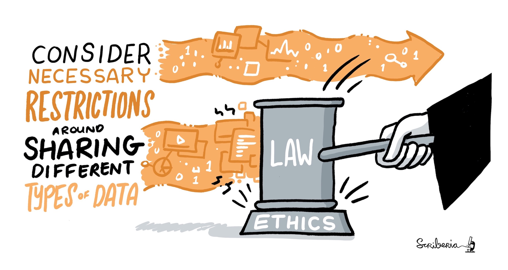

# Guide for Ethical Research

## Prerequisites / recommended skill level
> other chapters that should have been read before or content you should be familiar with before you read this

| Prerequisite | Importance | Notes |
| -------------|----------|------|
| Chapter/topic | How important it is | Any notes |

Data scientists make data-driven decisions that requires collection of data and model building approaches that can have serious implications for health, security, politics, society and everything associated with them.
Researchers or any kind of stakeholders in data science have an obligation to consider the ethical standards and their impact of people's lives {cite}`BibEntry2020Ethics`.

In this guide, we will discuss different aspects of ethics that a data scientist must consider to ensure high level of research integrity of their work.

## Summary
> easy to understand summary - a bit like tl;dr
