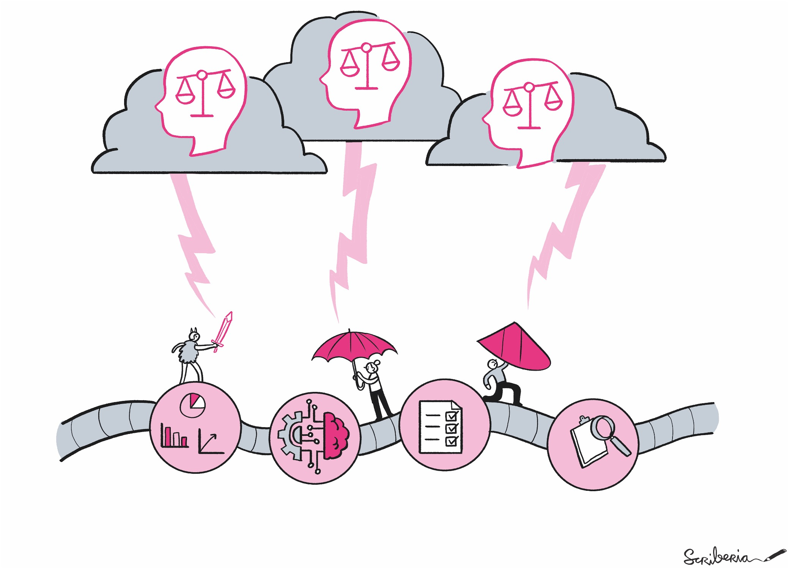

(ml-dev)=
# Machine Learning Project Design and Governance

(ml-dev-prerequisites)=
## Prerequisites

Structuring an ML project requires similar skills to any data-centric research. We recommend reviewing the following tips to support your design and management process.

| Prerequisite | Importance | Skill Level | Notes |
| -------------|----------|------|----|
| {ref}`Chapter <chapter-label>` | Helpful/Necessary | Beginner/Intermediate/Advanced | Any useful notes the reader should know |

(ml-dev-summary)=
## Summary

As machine learning (ML) continues to drive innovations across industries, ensuring that projects are designed with reproducibility, scalability, security, privacy and fairness considerations has become critical. Poorly structured pipelines can lead to unreliable models, while a lack of governance can result in biased outcomes and non-replicable results. This chapter aims to guide you through the essential aspects of ML project design and governance, focusing on building reproducible workflows, designing robust pipelines, and embedding fairness throughout the entire project lifecycle. 

To ensure that your ML projects are not only reliable but also transparent and equitable, this chapter focused on the following characteristics:

- [ ] **Transparent and standardized recording:**  A critical aspect of reproducibility in machine learning projects is the transparent and standardized documentation of all steps in the process. This includes version control for overall processes (e.g. data selection, feature engineering, model training) and artefacts (e.g. datasets, model weights). Standardized recording formats for documentation can support cross disciplinary teams to review, reproduce, and audit at any time, improving both reliability and accountability.
- [ ] **Open for interdisciplinary communication:** Machine learning projects often involve stakeholders from different fields such as data science, engineering, domain experts, and business leaders. Using an accessible language, defining roles clearly, and providing interpretable outputs that non-technical team members can understand is essential for fair project management. Interdisciplinary collaboration ensures that the ML system serves its intended purpose and addresses all necessary concerns, including ethical and operational considerations.
- [ ] **Clear motivation to integrate AI into the system:** Before integrating machine learning into a system, it is crucial to clearly define the reasons for doing so. This includes understanding the problem that AI will solve, setting measurable goals, and assessing the potential impact of the model on users and stakeholders. A well-defined motivation helps align the project with business objectives and social responsibilities while also allowing for more targeted evaluation metrics, ensuring that the AI system adds real value while maintaining fairness and minimizing unintended harm.

(ml-dev-motivation)=
## Motivation and Background

A vast amount of guidance, best practice documents, and standards are available for developing robust, secure, private, and fair ML development. Most of them are in continuous, active development, as the field advances fast and adoption pace of ML-enabled components are increasing. For example, the following table lists only a few ISO standards that can be used in assuring fairness in ML development:

| Fairness terminology| Management and governance | Measurement and test | Performance requirements |
---- | ---- | ---- | ----|
| IEEE P7003 | ISO/IEC 42001 | ISO/IEC TR 24027 | ISO/IEC TR 24027 |
| ISO/IEC TR 24027 | ISO/IEC 23894 | ISO/IEC TS 12791 | ISO/IEC 12791 |
| | ISO 31000 | | |

Non-ML researchers or software engineers may feel overwhelmed when beginning their journey into ML development or integration. While a well-designed ML project shares similarities with a secure and reliable software development lifecycle, it introduces unique challenges, such as attack vectors, fairness considerations, and robustness requirements.

This chapter provides an introduction to best practices for initiating a safe ML development process, with a focus on security and fairness in the ML pipeline. As an introductory resource, it does not delve into technical details but instead guides readers to appropriate resources for starting their journey toward safe and equitable ML development.