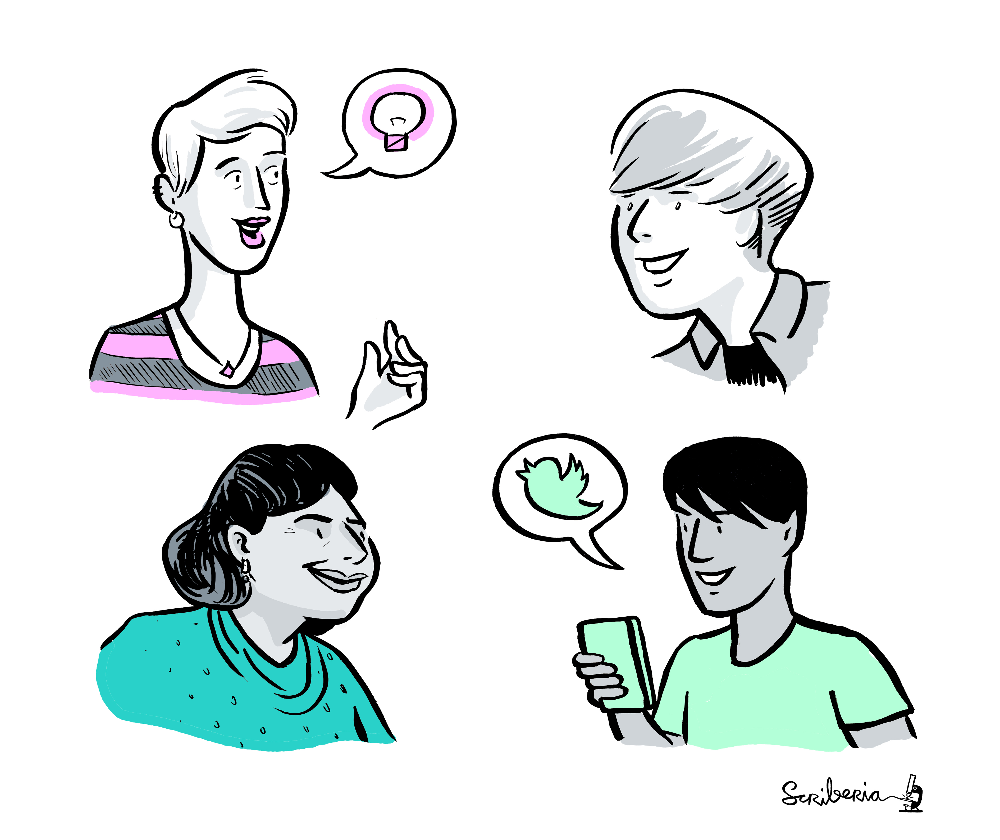

(ch-persona)=
# Personas & Pathways in _The Turing Way_

A persona is a detail of an imaginary user or member, based on real-world observations and understandings of existing members or potential future members.
It is meaningful when paired with pathways through which these personas engage with a project.

<!---
| |
|--------------------------------|
| People sharing their ideas through direct conversations and on social media. _The Turing Way_ project illustration by Scriberia. Zenodo. http://doi.org/10.5281/zenodo.3695300 |
--->

```{figure} ../figures/personas.png
---
height: 400px
name: personas
alt: 4 people with diverse appearances are talking to each other, sharing ideas directly with each other and also sharing on social media.
---
People sharing their ideas through direct conversations and on social media. _The Turing Way_ project illustration by Scriberia. Zenodo. http://doi.org/10.5281/zenodo.3695300
```
In a community-oriented and open source project, participants come with different levels of technical skills, as well as different lived experiences, backgrounds, identities and demography.
This chapter aim to capture different personas of the community members to explore how they come into contact with this project, how they continue to engage and how we can take their experiences and expectations into account when planning our community aspects.

In the first subchapter, we provide a {ref}`persona creation tool<pd-persona-creation>` and subsequently provide examples using personas and pathways in _The Turing Way_ community in the second subchapter called {ref}`Contributor's Personas and Pathways <pd-persona-contributors>`.

We welcome you to add your personas and pathways in this chapter to provide more examples from different projects.
