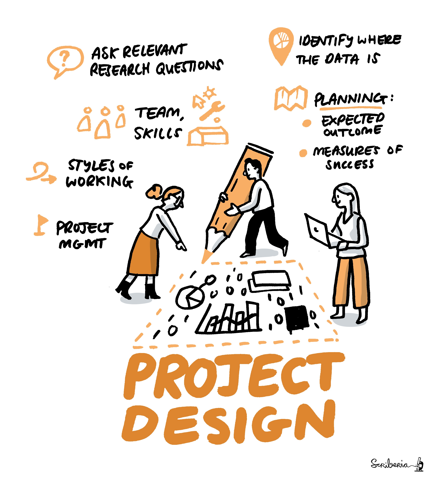

# Guide for Project Design

***This guide covers topics related to effective project planning and management.***

Before starting a project data scientists needs to understand what their research questions are, what are the possible outcomes, who are their users and target audience, what resources are available and what possible constraints exist in the project. 
Project design starts with these crucial questions.
Then comes the planning the scoping of the project in terms of ethics and usability of their outcome, expected minimum viable product of this project, synergies with other projects, similarities or differences compared to other projects, a measure of success, and the overall impact this project.
Project design also includes aspects such as time, budget, risks, expectations, people, resources and timeline management.

In this guide, we will compile best practices and guidance on project designing by including diffrent aspects of project management and agile development practices derived from academia, industries and product development fields. 
One of the most important resources of the project will be to compile different case studies for small, mid-size, and large projects spanning to both short-term and long-term plans. 
A few examples of failed projects will also be quite valuable at teaching the aspect that may create risk for a project.

|  |
| ---------------|
| _The Turing Way_ project illustration by Scriberia. Zenodo. http://doi.org/10.5281/zenodo.3695300 |

When designing a team-based project, it is important to think about all the skills required in the project and resources needed to access those skills.
With this in mind, this guide can also be a place to discuss the requirements in a project in terms of up-skilling, supporting and improving accessibility of different stakeholders. 
