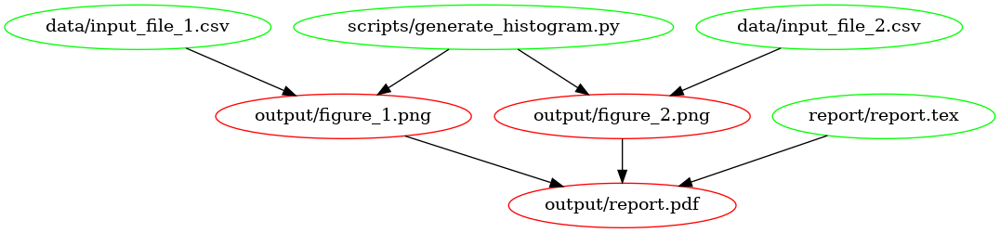
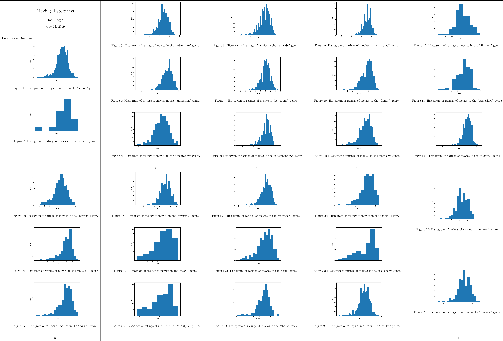

(rr-make-examples-learnmake)=
# Learn "Make" by Examples

(rr-make-examples-makefiles)=
## Makefiles

One of the things that might discourage someone from using Make is that
existing Makefiles can look quite complex, and it might seem difficult to
tailor one to your own needs. In this hands-on tutorial we will create a
Makefile from scratch for a real data analysis project. The idea is to explain
different features of Make by iterating through several versions of a Makefile
for this project. Hopefully the experience that you gain from this tutorial
allows you to create Makefiles for your own projects.

We will create a ``Makefile`` for a data analysis pipeline. The task is as
follows:

> **Task: Given some datasets, create a summary report (in pdf) that contains
> the histograms of these datasets.**

(Of course this data task is very simple to focus on how to use Make.)

*Throughout the tutorial code blocks that start with a dollar sign (``$``) are
intended to be typed in the terminal.*

(rr-make-examples-settingup)=
### Setting up

We have created a basic repository for this task, that already contains
everything that we need (*except the Makefile of course!*). To start, clone
the base repository using git:

```bash
$ git clone https://github.com/alan-turing-institute/IntroToMake
```

This basic repository contains all the code that we'll need in this tutorial,
and should have this content:

```text
.
├── data/
│   ├── input_file_1.csv
│   └── input_file_2.csv
├── LICENSE
├── output/
├── README.md
├── report/
│   └── report.tex
└── scripts/
    └── generate_histogram.py
```

- **data**: directory with two datasets that we're going to analyse
- **report**: the input directory for the report
- **scripts**: directory for the analysis script
- **output**: output directory for the figures and the report

You'll notice that there are two datasets in the **data** directory
(``input_file_1.csv`` and ``input_file_2.csv``) and that there is already a
basic Python script in **scripts** and a basic report LaTeX file in
**report**.

If you want to follow along, ensure that you have the ``matplotlib`` and
``numpy`` packages installed:

```bash
$ pip install matplotlib numpy
```

You will also need a working version of ``pdflatex`` and, of course, ``make``.
 
For installation instructions for Make, see {ref}`rr-make-appendix-installing`.

(rr-make-examples-makefile1)=
### Makefile no. 1 (The Basics)

Let's create our first Makefile. In the terminal, move into the
``IntroToMake`` repository that you just cloned:

```bash
$ cd IntroToMake
```

Using your favourite editor, create a file called ``Makefile`` with the
following contents:

```makefile
# Makefile for analysis report

output/figure_1.png: data/input_file_1.csv scripts/generate_histogram.py
	python scripts/generate_histogram.py -i data/input_file_1.csv -o output/figure_1.png

output/figure_2.png: data/input_file_2.csv scripts/generate_histogram.py
	python scripts/generate_histogram.py -i data/input_file_2.csv -o output/figure_2.png

output/report.pdf: report/report.tex output/figure_1.png output/figure_2.png
	cd report/ && pdflatex report.tex && mv report.pdf ../output/report.pdf
```
The indentation in each of the recipes are ***tabs***, Makefiles do not accept
indentation with spaces.

You should now be able to type:

```bash
$ make output/report.pdf
```

If everything worked correctly, the two figures will be created and pdf report
will be built.

Let's go through the Makefile in a bit more detail. We have three rules, two
for the figures and one for the report. Let's look at the rule for
``output/figure_1.png`` first. This rule has the target
``output/figure_1.png`` that has two prerequisites: ``data/input_file_1.csv``
and ``scripts/generate_histogram.py``. By giving the output file these
prerequisites it will be updated if either of these files changes. This is one
of the reasons why Make was created: to update output files when source files
change.

You'll notice that the recipe line calls Python with the script name and uses
command line flags (``-i`` and ``-o``) to mark the input and output of the
script. This isn't a requirement for using Make, but it makes it easy to see
which file is an input to the script and which is an output.

The rule for the PDF report is very similar, but it has three prerequisites
(the LaTeX source and both figures). Notice that the recipe changes the
working directory before calling LaTeX and also moves the generated PDF to the
output directory. We're doing this to keep the LaTeX intermediate files in the
report directory. However, it's important to distinguish the above rule from
the following:

```makefile
# don't do this
output/report.pdf: report/report.tex output/figure_1.png output/figure_2.png
	cd report/
	pdflatex report.tex
	mv report.pdf ../output/report.pdf
```

This rule places the three commands on separate lines. However, **Make
executes each line independently** in a separate subshell, so changing the
working directory in the first line has no effect on the second, and a failure
in the second line won't stop the third line from being executed. Therefore,
we combine the three commands in a single recipe above.

This is what the dependency tree looks like for this Makefile:


<small style="margin: 5pt auto; text-align: center; display: block;">The
dependency graph for our first Makefile, created using
[makefile2graph](https://github.com/lindenb/makefile2graph). Notice the
similarity to the figure {ref}`in the introduction<rr-make-summary>`!</small>

(rr-make-examples-makefile2)=
### Makefile no. 2 (all and clean)

In our first Makefile we have the basic rules in place. We could stick with
this if we wanted to, but there are a few improvements we can make:

1. We now have to explicitly call ``make output/report.pdf`` if we want to
   make the report.

2. We have no way to clean up and start fresh.

Let's remedy this by adding two new targets: ``all`` and ``clean``. In your
editor, change the Makefile contents to add the ``all`` and ``clean`` rules as
follows:

```makefile
# Makefile for analysis report

all: output/report.pdf

output/figure_1.png: data/input_file_1.csv scripts/generate_histogram.py
	python scripts/generate_histogram.py -i data/input_file_1.csv -o output/figure_1.png

output/figure_2.png: data/input_file_2.csv scripts/generate_histogram.py
	python scripts/generate_histogram.py -i data/input_file_2.csv -o output/figure_2.png

output/report.pdf: report/report.tex output/figure_1.png output/figure_2.png
	cd report/ && pdflatex report.tex && mv report.pdf ../output/report.pdf

clean:
	rm -f output/report.pdf
	rm -f output/figure_*.png
```

Note that we've added the ``all`` target to the top of the file. We do this
because Make executes the *first* target when no explicit target is given.  So
you can now type ``make`` on the command line and it would do the same as
``make all``.  Also, note that we've only added the report as the prerequisite
of ``all`` because that's our desired output and the other rules help to build
that output. If you have multiple outputs, you could add these as further
prerequisites to the ``all`` target. Calling the main target ``all`` is a
convention of Makefiles that many people follow.

The ``clean`` rule is typically at the bottom, but that's more style than
requirement. Note that we use the ``-f`` flag to ``rm`` to make sure it
doesn't complain when there is no file to remove.

You can try out the new Makefile by running:

```bash
$ make clean
$ make
```

Make should remove the output and intermediate files after the first command,
and generate them again after the second.

(rr-make-examples-makefile3)=
### Makefile no. 3 (Phony Targets)

Typically, ``all`` and ``clean`` are defined as so-called [Phony
Targets](https://www.gnu.org/software/make/manual/make.html#Phony-Targets).
These are targets that don't actually create an output file. If not marked as ``.PHONY`` these targets would
always be run if they come up in a dependency, but will no longer be run if a
directory/file is ever created that is called ``all`` or ``clean``. We
therefore add a line at the top of the Makefile to define these two as phony
targets:

```makefile
# Makefile for analysis report

.PHONY: all clean

all: output/report.pdf

output/figure_1.png: data/input_file_1.csv scripts/generate_histogram.py
	python scripts/generate_histogram.py -i data/input_file_1.csv -o output/figure_1.png

output/figure_2.png: data/input_file_2.csv scripts/generate_histogram.py
	python scripts/generate_histogram.py -i data/input_file_2.csv -o output/figure_2.png

output/report.pdf: report/report.tex output/figure_1.png output/figure_2.png
	cd report/ && pdflatex report.tex && mv report.pdf ../output/report.pdf

clean:
	rm -f output/report.pdf
	rm -f output/figure_*.png
```

Phony targets are also useful when you want to use Make recursively. In that
case you would specify the subdirectories as phony targets. You can read more
about [phony targets in the
documentation](https://www.gnu.org/software/make/manual/make.html#Phony-Targets),
but for now it's enough to know that ``all`` and ``clean`` are typically
declared as phony.

> Sidenote: another target that's typically phony is **test**, in case you
> have a directory of tests called **test** and want to have a target to run
> them that's also called **test**.

(rr-make-examples-makefile4)=
### Makefile no. 4 (Automatic Variables and Pattern Rules)

There's nothing wrong with the Makefile we have now, but it's somewhat verbose
because we've declared all the targets explicitly using separate rules. We can
simplify this by using [Automatic
Variables](https://www.gnu.org/software/make/manual/html_node/Automatic-Variables.html)
and [Pattern
Rules](https://www.gnu.org/software/make/manual/html_node/Pattern-Rules.html#Pattern-Rules).

(rr-make-examples-automaticvar)=
#### Automatic Variables.

With automatic variables we can use the names of the
prerequisites and targets in the recipe. Here's how we would do that for the
figure rules:

```makefile
# Makefile for analysis report

.PHONY: all clean

all: output/report.pdf

output/figure_1.png: data/input_file_1.csv scripts/generate_histogram.py
	python scripts/generate_histogram.py -i $< -o $@

output/figure_2.png: data/input_file_2.csv scripts/generate_histogram.py
	python scripts/generate_histogram.py -i $< -o $@

output/report.pdf: report/report.tex output/figure_1.png output/figure_2.png
	cd report/ && pdflatex report.tex && mv report.pdf ../output/report.pdf

clean:
	rm -f output/report.pdf
	rm -f output/figure_*.png
```

We've replaced the input and output filenames in the recipes respectively by
``$<``, which denotes the *first* prerequisite and ``$@`` which denotes the
*target*. You can remember ``$<`` because it's like an arrow that points to
the beginning (*first* prerequisite), and you can remember ``$@`` (dollar
*at*) [as the target you're aiming
*at*](https://jameshfisher.com/2016/12/07/makefile-automatic-variables/).

There are more automatic variables that you could use, see [the
documentation](https://www.gnu.org/software/make/manual/html_node/Automatic-Variables.html).

(rr-make-examples-patternrules)=
#### Pattern Rules

Notice that the recipes for the figures have become
identical!  Because we don't like to repeat ourselves, we can combine the two
rules into a single rule by using *pattern rules*. Pattern rules allow you to
use the ``%`` symbol as a wildcard and combine the two rules into one:

```makefile
# Makefile for analysis report

.PHONY: all clean

all: output/report.pdf

output/figure_%.png: data/input_file_%.csv scripts/generate_histogram.py
	python scripts/generate_histogram.py -i $< -o $@

output/report.pdf: report/report.tex output/figure_1.png output/figure_2.png
	cd report/ && pdflatex report.tex && mv report.pdf ../output/report.pdf

clean:
	rm -f output/report.pdf
	rm -f output/figure_*.png
```

The ``%`` symbol is now a wildcard that (in our case) takes the value ``1`` or
``2`` based on the input files in the ``data`` directory. You can check that
everything still works by running ``make clean`` followed by ``make``.

An advantage of this is that if you now want to add another dataset, say
``input_file_3``, then you would only need to add that to the rule for the
report!

(rr-make-examples-makefile5)=
### Makefile no. 5 (Wildcards and Path Substitution)

When Makefiles get more complex, you may want to use more advanced features
such as building outputs for all the files in an input directory. While
pattern rules will get you a long way, Make also has features for wildcards
and string or path manipulation for when pattern rules are insufficient.

While previously our input files were numbered, we'll now switch to a scenario
where they have more meaningful names. Let's switch over to the ``big_data``
branch:

```bash
$ git checkout big_data         # checkout the big_data branch
```

The directory structure now looks like this:

```text
├── data/
│   ├── action.csv
│   ├── ...
│   ├── input_file_1.csv
│   ├── input_file_2.csv
│   ├── ...
│   └── western.csv
├── LICENSE
├── output/
├── README.md
├── report/
│   └── report.tex
└── scripts/
    └── generate_histogram.py
```

As you can see, the **data** directory now contains additional input files
that are named more meaningfully (the data are IMBD movie ratings by genre).
Also, the **report.tex** file has been updated to work with the expected
figures.

We'll adapt our Makefile to create a figure in the output directory called
``histogram_{genre}.png`` for each ``{genre}.csv`` file, while excluding the
``input_file_{N}.csv`` files.

> Sidenote: if we were to remove the ``input_file_{N}.csv`` files, pattern
> rules would be sufficient here. This highlights that sometimes your
> directory structure and Makefile should be developed hand in hand.

Before changing the Makefile, run

```bash
$ make clean
```
to remove the output files.

We'll show the full Makefile first, and then describe the different lines in
more detail. The complete file is:

```makefile
# Makefile for analysis report
#

ALL_CSV = $(wildcard data/*.csv)
INPUT_CSV = $(wildcard data/input_file_*.csv)
DATA = $(filter-out $(INPUT_CSV),$(ALL_CSV))
FIGURES = $(patsubst data/%.csv,output/figure_%.png,$(DATA))

.PHONY: all clean

all: output/report.pdf

$(FIGURES): output/figure_%.png: data/%.csv scripts/generate_histogram.py
	python scripts/generate_histogram.py -i $< -o $@

output/report.pdf: report/report.tex $(FIGURES)
	cd report/ && pdflatex report.tex && mv report.pdf ../$@

clean:
	rm -f output/report.pdf
	rm -f $(FIGURES)
```

First, we use the ``wildcard`` function to create a variable that lists all
the CSV files in the data directory and one that lists only the old
``input_file_{N}.csv`` files:

```makefile
ALL_CSV = $(wildcard data/*.csv)
INPUT_CSV = $(wildcard data/input_file_*.csv)
```

A code convention for Makefiles is to use all capitals for variable names and
define them at the top of the file.

Next, we create a variable to list only the data files that we're interested
in by filtering out the ``INPUT_CSV`` from ``ALL_CSV``:

```makefile
DATA = $(filter-out $(INPUT_CSV),$(ALL_CSV))
```

This line uses the
[``filter-out``](https://www.gnu.org/software/make/manual/make.html#index-filter_002dout)
function to remove items in the ``INPUT_CSV`` variable from the ``ALL_CSV``
variable.  Note that we use both the ``$( ... )`` syntax for functions and
variables. Finally, we'll use the ``DATA`` variable to create a ``FIGURES``
variable with the desired output:

```makefile
FIGURES = $(patsubst data/%.csv,output/figure_%.png,$(DATA))
```

Here we've used the
[``patsubst``](https://www.gnu.org/software/make/manual/make.html#index-patsubst-1)
function to transform the input in the ``DATA`` variable (that follows the
``data/{genre}.csv`` pattern) to the desired output filenames (using the
``output/figure_{genre}.png`` pattern). Notice that the ``%`` character marks
the part of the filename that will be the same in both the input and output.

Now we use these variables for the figure generation rule as follows:

```makefile
$(FIGURES): output/figure_%.png: data/%.csv scripts/generate_histogram.py
	python scripts/generate_histogram.py -i $< -o $@
```

This rule again applies a pattern: it takes a list of targets (``$(FIGURES)``)
that all follow a given pattern (``output/figure_%.png``) and based on that
creates a prerequisite (``data/%.csv``). Such a pattern rule is slightly
different from the one we saw before because it uses two ``:`` symbols. It is
called a [static pattern
rule](https://www.gnu.org/software/make/manual/make.html#Static-Pattern).

Of course we have to update the ``report.pdf`` rule as well:

```makefile
output/report.pdf: report/report.tex $(FIGURES)
	cd report/ && pdflatex report.tex && mv report.pdf ../$@
```

and the ``clean`` rule:

```makefile
clean:
	rm -f output/report.pdf
	rm -f $(FIGURES)
```

If you run this Makefile, it will need to build 28 figures. You may want to
use the ``-j`` flag to ``make`` to build these targets **in parallel!**

```bash
$ make -j 4
```

The ability to build targets in parallel is quite useful when your project has
many dependencies!

The resulting PDF file should now look like this:

<small
style="margin: 5pt auto; text-align: center; display: block;">A compressed
view of the report with histograms for all genres.</small>
