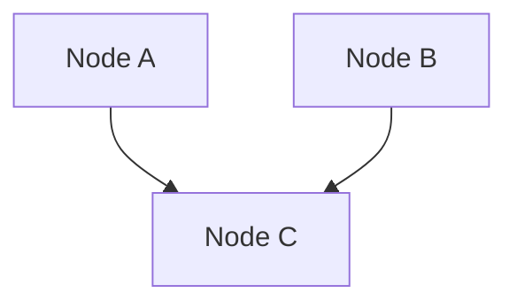

(rr-open-source-resources)=
# Open Source Resources

With the democratization of open practices, a variety of resources provide the right to be modified through open
licenses. However, the technical ability to actually modify these resources is not guaranteed and providing access to its editable components, to the raw source files becomes essential to be fully able to modify these open resources.

More than open access, a shift towards open source resources could deeply foster collaboration around digital resources in research.

The principle of open source resources applies to various typology of digital resources, such as an article, an image, a hardware plan, an educational resource, a video or audio clip. All situations where there is a final format for the user and an editable format manipulated during the production of the resource.

(rr-open-source-whatis)=
## What Is Open Source?

Commonly associated with software with an available source code, the meaning of this concept is debated and seems to extend beyond software. Defining open source is a delicate question with a variety of interpretations, but it might be summarized as follows:

> Open source is the practice of providing a digital resource with its source files.

At the intersection of these openness movements, we may be on the cusp of a conceptual revolution in the meaning
of open source. We invite researchers to work on defining and challenging this concept, a knowledge base to explore the idea of an « [Open Source 2.0](https://opensource2.cc/) » is being shaped.

The concept is no longer derived solely from the notion of source code but also from that of source file.

(rr-open-source-for-research)
## Open Source Resources for an Open Science

(rr-open-source-article)
### Open Source Article

One of the most basic illustration of open source resources can comes with PDF. This format is not intended to be
modified and an editable document will be used to generate it. It can be produced from LaTeX files, from an .odt file with
LibreOffice, from a .docx file with Microsoft Word, from Mardown files using a tool like Quarto and so on.

An open source article will be an article where both formats will be provided, the pdf with its associated source files.

```{figure} ../../../figures/arxiv-article.png
---
name: open-source-article
alt: 'Random ArXiV article to illustrate that the document is provided in pdf format along with downloadable TeX source'
---
ArXiV article that provide both a PDF format and its « Tex Source ».
```

With these source files available, an article can be reworked in collaboration with external parties to produce new versions.
The modification rights provided by open licenses become enforceable.

(rr-open-source-image)
### Open Source Image

A similar challenge in managing source files also exists for images, figures and illustrations. An
image can be made up of multiple layers that can be manipulated individually in an uncompressed format, but really difficult or
even impossible to modify in a compressed format such as png or jpeg.

Let's take the example of a diagram generated with the mermaid tool in command line mode.

```{figure} ../../../figures/mermaid-diagram.png
---
name: open-source-image
alt: 'Basic diagram used as an example with 3 nodes A, B and C connected together.'
---
Diagram in PNG format generated with Mermaid.
```

The associated Mermaid code used to generate this diagram and that would be stored in a Markdown file is the following:

````

````

To be able to easily edit the diagram image, the access to the Mermaid code and therefore the associated Markdown file would
be required.

Since components can be combined, such as having an image in an article, we end up with several nested elements that lead to
complex source management in order to fully enable resources modification.

(rr-open-source-educational-resource)
### Open Source Educational Resource

With open education the term « Open Educational Resources » (OER) is generally used to refer to resources with open licenses. Similarly,
there is a source management challenge to fully enable resource modification.

The notion of « [Open Source Educational Resources](https://arxiv.org/abs/2107.14330) » was developed by extension to specify OERs that
would provide their source files. We are therefore seeing the concept of “open source” being used outside the world of software.

By providing all of its source files (markdowns, images...), the manual “The Turing Way” can be considered as an open source educational resource.
