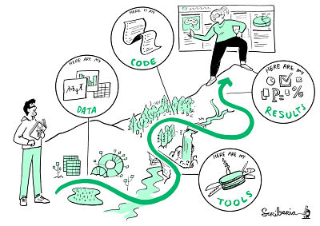

# Guide to Reproducible Research

_The Turing Way_ defines reproducibility in data research as data and code being available to fully rerun the analysis.

There are several definitions of reproducibility in use, and we discuss these in more detail in the [definitions](03/definitions) section of this chapter.
However, _The Turing Way_'s definition used by _The Turing Way_ Team at the time of writing, will be useful to avoid misunderstandings when reading the rest of the handbook.

This volume will define reproducibility in the context of this handbook, lay out its importance for science and scientists, and provide an overview of the common concepts, tools and resources.
