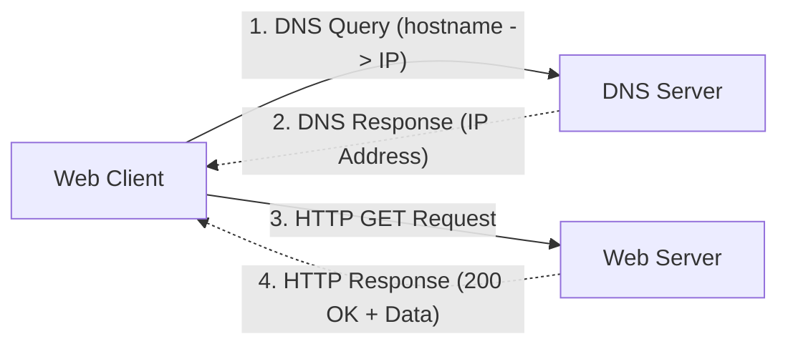
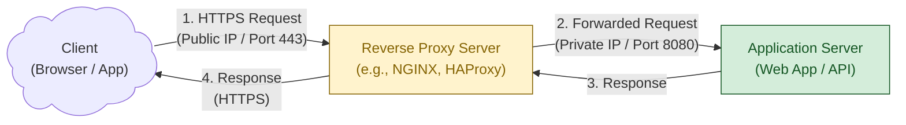

(rr-webserver)=
# Web Server Security

## Summary

This section explains the basics of setting up a publicly accessible web server.
It touches upon the following basic concepts:

1. Application server: a software that makes an application available to the end users. It can use frameworks like [Node.js](https://nodejs.org/en) (JavaScript), [FastAPI](https://fastapi.tiangolo.com/) or any other framework.
1. Client: a software that makes a request to a server. This can be a web browser that opens a web page that runs on a web server.
1. Reverse proxy: a server that does not host any content itself, but is exposed to the publicly accessible internet with the task to filter and forward incoming requests to an application server.

Note: both 'server' and 'client' are often used in an ambiguous manner, referring to either software or hardware.
The term 'server' sometimes means an (application) server software that provides data through a network, or to a computer running that software.
Equivalently, a client sometimes refers to a software that communicates with a server, or a computer that runs that software.
Therefore, the rest of this section avoids the terms as much as possible, or disambiguates them explicitly.

### Server and Network Basics


#### IP Addresses

Every computer on the internet is assigned a unique *IP address* through which it can be located by others. These IP addresses are shaped in a specific numeric format.

In version 4 of the Internet Protocol (IPv4), IP addresses have a form like this: `172.16.254.1`. IPv4 has been used since 1983 and is the first IP address specification for the internet. In version 6 (IPv6), they look like this: `0123:4567:89ab:cdef:0123:4567:89ab:cdef`. IPv6 has been designed as successor for IPv4 to address the problem of IP address depletion caused by the limited number of total addresses available through IPv4.

An IP address is considered unique and can only be used by a single computer on the internet at a given moment. Nevertheless, IP addresses can be re-assigned to another computer.

Some IP addresses and ranges have reserved meanings, including

- `127.0.0.1` is used to point to the current computer, hence it is called the *loopback device*.
- Private address ranges: The IP addresses starting with `10.*.*.*` or `192.168.*.*` are considered non-public, meaning they are only used for internal communication between computers in a private network that is not accessible through the internet. This means that they can be used by many computers at the same time, as long as they are in separate, private networks.

#### The Domain Name System (DNS)

To make it easier for humans to remember a server's address, the *DNS* (_Domain Name System_) service provides mappings from hostnames to IP addresses. It enables users to type `www.example.com` into their browser, pointing to, for instance, `104.20.23.154` or `2606:4700:10::ac42:93f3`.
For that purpose, dedicated DNS servers hold a registry of these mappings.
To loop back to the same computer, hence IP address `127.0.0.1`, there is also a special host name: when you enter `localhost`, no lookup at the DNS server is required and the request goes to your computer.

When a client wants to connect to through a server to its name, it performs two separate requests:

1. Connect to the DNS server to retrieve the IP address for `www.example.com` (-> `104.20.23.154`).
2. Connect to the server through that IP address.




#### Servers and Ports

Each server application uses a specific *port* through which clients can communicate with it. Ports are numbered from 0 to 65535.
The port number do not have inherent meaning, but many ports are widely used by specific applications. For instance, the ports 80 and 8080 are used for (unencrypted) web applications, or port 22 for SSH (Secure Shell); Wikipedia provides an (ever-changing) [overview](https://en.wikipedia.org/wiki/List_of_TCP_and_UDP_port_numbers#Well-known_ports) of these *well-known ports*.

The port numbers from 0 to 1023 are called *system ports*. Operating systems typically require special privileges to assign an application to a system port.

When a server application is configured to use a specific ports, it is said to 'listen' to that port. This is also used by firewalls to 'close' or 'open' specific ports to block or allow incoming specific requests to a server.

Similarly, a server application can allow or block clients originating from specific IP addresses or address ranges only. The configuration details are server-specific, but typical configurations include:

- only accept requests from the same computer (`localhost`)

#### Connecting to a Server

The communication between a client application and a server takes thus place on different levels, often represented as a *Uniform Resource Identifier* (URI). It comprises the following components:

- *scheme*: for instance `ftp` or `https`
- *userinfo*: typically a username for logging in, if provided
- *host*: the name or IP address of the server
- *port*: the port on which the server application listens

For instance `https://user@www.example.com:443`

Some parts are optional, for instance the username. The port is often unnecessary because the client application can derive the port based on the scheme (for instance `443` for `https`). Only when a non-standard port is used, it has to be specified.

The host can be specified as a name (like `www.example.com`) or as an IP address. In the former case, the client application firstly connects to a DNS server to retrieve the IP address, and uses that to connect to the server behind that address.

#### Application Protocols

Once a client has made a connection to a server application, they can communicate according to an specific the vocabulary and syntax, the application layer protocol. Using `http` (Hypertext Transfer Protocol), for instance, a web browser can request a specific resource -- like a web page -- from a web server using the `GET` method. The requested resource is specified using a `URL` (*Uniform Resource Locator*).
HTTP methods include, among others,  `POST`, `PUT`, `DELETE`, for processing, uploading or deleting resources respectively.

The [OSI layer architecture](https://en.wikipedia.org/wiki/OSI_model#Layer_architecture) provides a formal definition of the different layers of abstraction.

### Running a (Web) Server

Running a web application on any computer (for instance by running `npm run server` for a Node.js application) means that it starts *listening* to a specific port (for instance *8080*). Most servers allow an IP-based restriction too.

A server for testing a web application locally if often configured to listen to *127.0.0.1:8080* by default. This allows it to run without requiring system privileges because the port number is larger than 1023, and it only accepts connections from the same machine (127.0.0.1).

Outside the testing and development scenario, a web server's purpose is to allow users to access it via the internet. In terms of configuration, this typically means accepting connections from *0.0.0.0*, a placeholder for all IP addresses. More specific IP addresses or IP ranges can be specified equivalently.

<!-- The definition of IP ranges depends on the specific application, but often uses the [CIDR annotation](https://en.wikipedia.org/wiki/Classless_Inter-Domain_Routing) that uses annotations like `198.51.100.0/22` (IP addresses from 198.51.100.0 to 198.51.103.255). The number following the `/` defines the *network mask*, hence the number of IP addresses in the range in a bitmask notation. -->

A (web) server that is accessible through the internet, it will be accessed for a variety of reasons. Apart from legitimate users connecting to the web application, many of them are malicious. There are bots that continuously try to gain access to unprotected servers by randomly trying host and port combinations. Once they have been able to establish a network connection, they often try to apply security holes. These can be simple, like trying `GET` with various URLs to retrieve data from the server, `POST` with manipulated data, or `PUT` with malicious files.

Therefore, an application server should *never* be exposed to the internet. Given the number and sophisticated nature of attacks, it is considered virtually impossible to develop a web application in a way that is secure enough.

#### Securing a Web Server

The server hosting a web application is called an *application server*. These are often implemented using frameworks like [Node.js](https://nodejs.org/) (JavaScript), [Django](https://www.djangoproject.com/), [FastAPI](https://fastapi.tiangolo.com/) (both Python), [Spring](https://spring.io/) (Java) etc.

These frameworks differ widely regarding the defaults and options they provide. Many, however, are not designed with security in mind, but assume to be running in an environment that prevents uncontrolled external access, for instance behind a firewall.

Following the *principle of separation duties*, an application server should focus on implementing its functionality, but not be expected to implement security principles sufficient for exposure to the internet. Nevertheless, basic security principles as described in (TODO: link to Fundamentals section) should be followed by default. For instance,

- only provide functionality that is necessary for the specific application,
- run with low privileges,
- validate all user input,
- do not run in a context that contains files that are not part of the web application

#### Reverse Proxy

Following the *defence-in-depth* security principle, however, a web application should run on a server that is not reachable for external networks requests by default, only being exposed to explicitly legitimate request types. On the network level, only connections to the port used by the server application should be allowed. Depending on the application, access can also be restricted to specific IP address ranges, for instance a geographical region or a subnet that belongs to the same organisation.

On the application protocol level, requests should be restricted to the methods that are required by the web application, for instance only the `GET` and `PUT` HTTP methods. Furthermore, a filter on specific resource paths can be added to define which files can be retrieved or uploaded.

For such restrictions, a dedicated *reverse proxy* is recommended. This is a specific type of web server that does not implement application logic. It only handles network requests from the internet, for instance:
"forward all request to my public server at `https://myapp.example.com:443` to my internal server at `http://192.168.10.1:8080`".



[nginx](https://nginx.org/) is probably the software most frequently used as reverse proxy on the internet. It provides all the functionality necessary to run a highly performant web server on the internet. The [Apache web server](https://httpd.apache.org/) is a similarly comprehensive web server also useable as reverse proxy. This example, however, uses a [Caddyserver](https://caddyserver.com/) because its reduced functionality allows for a more beginners-friendly configuration.

##### Example: Set up Caddyserver

In the simplest use case, a reverse proxy runs on the same machine as the web application, and forwards requests to the web application port. Caddyserver can do that through command line arguments:

```console
caddy reverse-proxy --from :2080 --to :8080
```

This command uses non-system ports (larger than 1024) because it would require system privileges to forward well-known HTTP ports like 80 and 443. The recommend way for handling this is running it as a [system service](https://caddyserver.com/docs/running#linux-service).

For a slightly more complex example, imagine a web app with an HTML file as entry point: `/my-app-1.html`. As part of the app's functionality, it also serves the file `/my-app-2.html`.
Furthermore, the application stores images shown on the web page in the `/assets` directory, provides custom fonts in `/fonts`, and stylesheets in `/css`. User can upload files to the `/uploads` directory using `PUT` requests through the WebDAV HTTP extension.

A simple configuration for the ruleset described above looks like this:

```json
www.example.com {
    @allowed_get {
        method GET
        path /my-app-*.html
        path /favicon.png
        path /assets/*
        path /fonts/*
        path /css/*
    }
    @allowed_webdav {
        method PUT
        path /uploads/*
    }

    handle @allowed_get {
        reverse_proxy 192.168.10.1:8080
    }
    handle @allowed_webdav {
        reverse_proxy 192.168.10.1:8080
    }
    handle {
        error 500
    }
}
```

The first line defines the hostname as reachable from the internet. The `@allowed_get` and `@allowed_webdav` blocks define rulesets for the `GET` and the `PUT` methods respectively, defining the allowed requests.

The subsequent `handle` blocks apply these rulesets to forward allowed requests to the web application server running at the address and port defined in the `reverse_proxy` statements.
The final `handle` block catches all requests that do not match any of the allowed rulesets

The specific logic for the requests is implement by the web application, including user authentication or file name details. The reverse proxy, on the other hand, only needs to know that `PUT` requests to `/uploads` are generally allowed and throws an error for all other requests. The example stops at that level, but could further narrow down the allowed requests, for instance allowing only `PUT` paths matching `/uploads/*.png`.

After storing the adapted configuration file as `Caddyfile`, run it with

```console
caddy run --config Caddyfile
```

Note that a reverse proxy provides much more functionality than only forwarding and blocking requests. It can be used for load balancing -- distributing incoming requests among multiple server instances --, caching, or handling encryption certificates.

## Conclusions

Deploying a web server securely comprises many steps that need to be adapted to the specific context. Understanding basic networking principles, however, enables developers to avoid exposure to the lion's share of common attacks. A reverse proxy provides fundamental security mechanisms that a web application should not (re-)implement. The *separation of duties* principle comes to play: the web application server provides functionality, while a dedicated reverse proxy handles requests.

- Never expose an *application server* to the public internet
- *Defense-in-depth principle*: Use a specialised reverse proxy instead of implementing security features in the application
- *Principle of zero trust*: block all requests by default, only forward explicitly legitimate requests
- Monitor the log files of the web application server and the reverse proxy
- Perfect security is not achievable, but significantly deploying a web application in a setup that handles the majority of security threats is possible and necessary.
