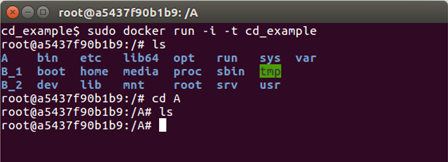

<a name="Containers_section"></a>

## Containers

<a name="What_are_containers"></a>

### Why Containers?

Even for moderately complex projects, the size of the software dependency stack can be huge. Take for example a simple
pipeline to build a pdf report for an analysis scripted in R using Rmarkdown. To make this reproducible, not only (i)
the respective R packages need to be installed and (ii) the R version needs to be the same, but also (iii) the versions
of pandoc and LaTeX need to be exactly the same as during runtime.

Instead of trying to resolve these dependencies via a package manager (such as conda) which also depends on all required
software being available in a single package manager, it might be easier to simply create a snapshot of the entire
computing environment including all dependencies. These computing environments are then self-contained, hence the name
'containers'.

### What are containers?

Containers allow a researcher to package up a project with all of the parts it needs, such as libraries, dependencies,
and system settings and ship it all out as one package. Anyone can then open up a container and work within it, viewing
and interacting with the project as if the machine they are accessing it from is identical to the machine specified in
the container - regardless of what their computational environment _actually_ is. They are designed to make it easier to
transfer projects between very different environments.

In a way, containers behave like a virtual machine. To the outside world, they look like their own complete system. But
unlike a virtual machine, rather than creating a whole virtual operating system plus all the software and tools
typically packaged with one, containers only contain the individual components they need in order to operate the project
they contain. This gives a significant performance boost and reduces the size of the application.

Containers are particularly useful way for reproducing research which relies on software to be configured in a certain
way, and/or which makes use of libraries that vary between (or don't exist on) different systems. In summary containers
are a more robust way of sharing reproducible research than, for instance, package management systems or Binder because
they reproduce the entire system used for the research, not just the packages explicitly used by it. Their major
downside is that due to their greater depth they are conceptually more difficult to grasp and produce than many other
methods of replicating computational environments.

Ben Corrie give as reasonably accessible overview on core concepts in
['What is a container?'](https://www.youtube.com/watch?v=EnJ7qX9fkcU).

<a name="What_are_images"></a>

### What are images?

Images are the files used to generate containers. Humans don't make images, they write the recipes to generate images.
Containers are then identical copies instantiated from images.

Think of it like this:

- A recipe file a human writes contains all the steps to generate a working version of the project and its computational
  environment, but no actual materials. Think of this as like a blueprint.
- Building an image takes that recipe and using it assembles all the packages, software libraries, and configurations
  needed to make the fully fledged project and environment and bundles them up in a condensed lump. Think of images like
  a bit of flat pack furniture made using the blueprint.
- Containers take that image and assemble a full working version of the project and the environment needed to run it.
  Think of this as assembling the bit of flat pack furniture.

So if a researcher wants to allow others to reproduce their work they would need to write a recipe file, and use it to
build an image of their project. They can then share this image file with anyone who wants to replicate their work. That
person can then use the image to generate a container containing a working version of the project.

<a name="What_is_Docker"></a>

### What is Docker?

There are a number of different tools available for creating and working with containers. We will focus on Docker, which
is widely used, but be aware that others such as Singularity also exist. Singularity is sometimes preferred for use on
high-performance computing systems as it does not need `sudo` permissions to be run, while Docker does.

In Docker the recipe files used to generate images are known as Dockerfiles, and should be named `Dockerfile`.

[Docker Hub](https://hub.docker.com/) hosts a great many pre-made images which can be downloaded and build upon, such as
[images](https://hub.docker.com/_/ubuntu) of Ubuntu machines. This makes the process of writing Dockerfiles relatively
easy since users very rarely need to start from scratch, they can just customise existing images. However, this does
leave a user vulnerable to similar security issues as were described in the section on [YAML files](#Security_issues):

- It is possible to include malicious code in Docker images
- It is possible for people producing images to unknowingly include software in them with security vulnerabilities

[This](https://opensource.com/business/14/7/docker-security-selinux) article goes deeper into the potential security
vulnerabilities of containers and here is a
[detailed breakdown](https://opensource.com/business/14/9/security-for-docker) of security features currently within
Docker, and how they function. The best advice for using images built by others is, as usual, only download and run
something on your machine if it comes from a trusted source. Docker Hub has "official image" badges for commonly used,
verified images as shown here:


<a name="Installing_Docker"></a>

### Installing Docker

Installers for Docker on a variety of different systems are available [here](https://docs.docker.com/install/). Detailed
installation instructions are also available for a variety of operating systems such as
[Ubuntu](https://docs.docker.com/install/linux/docker-ce/ubuntu/),
[Debian](https://docs.docker.com/install/linux/docker-ce/debian/),
[Macs](https://docs.docker.com/docker-for-mac/install/), and
[Windows](https://docs.docker.com/docker-for-windows/install/).

<a name="Key_commands"></a>

### Key commands

Here are a few key commands for creating and working with containers.

- To build an image from a Dockerfile go to the directory where the Dockerfile is and run:
  ```
  sudo docker build --tag image_name .
  ```
- To list the images on your system use
  ```
  sudo docker image ls
  ```
- To remove an image run
  ```
  sudo docker rmi image_name
  ```
- To open a container from an image run
  ```
  sudo docker run -i -t image_name
  ```
  The `-i -t` flags automatically open up an interactive terminal within the container so you can view and interact with
  the project files.
- To exit an interactive terminal use the command `exit`.
- To get a list of active containers with IDs run
  ```
  sudo docker container ls
  ```
- There are also three main commands used for changing the status of containers:
  - Pausing suspends the process running the container.
    ```
    sudo docker pause container_ID
    ```
    Containers can be unpaused by replacing `pause` with `unpause`.
  - Stopping a container terminates the process running it. A container must be stopped before it can be deleted.
    ```
    sudo docker stop container_ID
    ```
    A stopped container can be restarted by replacing `stop` with `restart`.
  - If `stop` does not work containers can be killed using
    ```
    sudo docker kill container_ID
    ```
- To remove a container run
  ```
  sudo docker rm container_ID
  ```

<a name="Writing_Dockerfiles"></a>

### Writing Dockerfiles

Let's go through the anatomy of a very simple Dockerfile:

```
# Step 1: Set up the computational environment

# Set the base image
FROM ubuntu:18.04

# Install packages needed to run the project
RUN apt-get update && \
    apt-get install -y --no-install-recommends python3.7 python3-pip && \
    rm -rf /var/lib/apt/lists/*
RUN python3 -m pip install numpy

#-----------------------

# Step 2: Include the project files in the image

# Copy files from the `project_files` directory on the machine building the image
# into the `project` folder in the container. This folder and any missing
# directories in its path are created automatically.
COPY project_files/ project/
```

This looks complicated, but most of the lines in this example are comments (which are preceded by `#`s), There are only
six lines of actual code. The first of these is a `FROM` statement specifying a base image. All Dockerfiles require a
FROM, even if it's just `FROM SCRATCH`. All the following commands in a Dockerfile build upon the base image to make a
functioning version of the researcher's project. Specifing a version for the image (`18.04` in this case) is optional
but is best practice as it ensures that our Dockerfile remains valid after new releases of Ubuntu, which may not
include packages (or specific versions thereof) that we require later (for example `python3.7`).

It is worth spending time carefully choosing an appropriate base image as doing do can reduce the amount of work
involved in writing a Dockerfile dramatically. For example a collection of images with the R programming language
included in them can be found [here](https://github.com/rocker-org/rocker-versioned). If a project makes use of R it is
convenient to use one of these as a base image rather than spend time writing commands in your Dockerfile to install R.

The biggest block of lines comes next, it's a series of `RUN` statements, which run shell commands when building the
image. In this block they are used to install the software necessary to run the project. The first `RUN` block is a
chain of commands of this form:

```
RUN command_to_do_thing_1 \
   && command_to_do_thing_2 \
   && command_to_do_thing_3 \
   && command_to_do_thing_4
```

It is good practice to group related commands into a single `RUN` block to reduce the final size of your image by
[avoiding the creation of unnecessary layers](https://docs.docker.com/develop/develop-images/#minimize-the-number-of-
layers). We also follow best-practice by using `--no-install-recommends` to
[avoid installing unnecessary packages](https://docs.docker.com/develop/develop-images/dockerfile_best-practices/#dont-install-unnecessary-packages)
and [cleaning up the apt cache](https://docs.docker.com/develop/develop-images/dockerfile_best-practices/#run), both of
which further reduce the size of Debian or Ubuntu images.

After we've installed Python we use another RUN statement to install a library required by our code.

Finally the `COPY` command is used to copy the project files from the machine building the image into the image itself.
The syntax of this command is `COPY file_to_copy location_in_container_to_copy_to`. In this example all the files in the
"project_files" directory are included in the "project" file in the container. Note that you can only copy files from
the directory where the Dockerfile is located, or subdirectories within it (in the example given here the
`project_files` subdirectory).

The `ADD` command has the same capabilities as `COPY`, but it can also be used to add files not on the machine building
the image. For example it can be used to include files hosted online by following ADD with a URL to the file. It is good
practice to use `COPY` except where `ADD` is specifically required as the term `COPY` is more explicit about what is
being done.

Here's what happens if a container is opened from an image called book_example built from the example above:


As you can see the directory "project" has been created, and if we look inside the project files "analysis.py" and
"data.csv" have been copied into it. Because the software required for the project has already been included by the
Dockerfile in the image the "analysis.py" script runs without any further software needing to be installed.

<a name="WORKDIR"></a>

#### WORKDIR

This command can be used in Dockerfiles to change the current working directory. Commands that follow this in the
Dockerfile will be applied within the new working directory unless/until another WORKDIR changes the working directory.
When a container is opened with an interactive terminal the terminal will open in the final working directory. Here's a
simple example of a Dockerfile that uses `WORKDIR`, and the container it generates.

```
# Basic setup
FROM ubuntu
RUN apt-get update

# Make a directory called A
RUN mkdir A

# Make the working directory A
WORKDIR A

# Make two directories, one called B_1 and one called B_2
RUN mkdir B_1
RUN mkdir B_2
```


Directories B_1 and B_2 have been created within directory A.

WORKDIR should be used whenever changing directories is necessary when building an image. It may be tempting to use
`RUN cd directory_name` instead as this syntax will be more familiar to those that commonly work via the command line,
but this can lead to errors. After each `RUN` statement in a Dockerfile the image is saved, any following commands are
applied to the image anew. As an example here is what happens in the above example if the `WORKDIR A` line is swapped
for `RUN cd A`



All the directories have are in the top level in this case, rather than B_1 and B_2 being inside A. This is because the
image was restarted after the `RUN cd A` command and opened at the top (root) level by default, so that is where the
`mkdir B_1` and `mkdir B_2` commands took effect.

<a name="Other_commands"></a>

#### Other commands

Other commands that are sometimes used in Dockerfiles include:

- `CMD`: This is used to run commands as soon as the container is opened. To clarify this is different to RUN commands
  which are commands run as part of _setting up_ a container. For example to have a welcome message when a container is
  opened from the image CMD could be used as follows:
  ```
  CMD ["echo","Welcome! You just opened this container!"]
  ```
  It's good practice to use CMD for any commands that need to be run before someone starts working in the container
  instead of forcing users to run them themselves (and trusting that they will even know that they need to).
- `VOLUMES`: These will be discussed [later](#Volumes).
- `MAINTAINER`: information regarding the person that wrote the Dockerfile. Typically included at the top of a
  Dockerfile.
- `EXPOSE`: This includes ports that should be exposed, this is more relevant to people using Docker to share web apps.
- `USER`: Change the user that a command is run as (useful for dropping privileges).

<a name="Building_images_and_dockerignore_files"></a>

### Building images and .dockerignore files

As mentioned in the [key commands](#Key_commands) section, to build an image open a terminal in the same directory as
the Dockerfile to be used and run

```
sudo docker build --tag name_to_give_image .
```

When an image is built everything in the Dockerfile's directory and below (this is called the "context") is sent to the
Docker daemon to build the image. The daemon uses the Dockerfile and its context to build the image. If the context
contains many large files which aren't needed for building the image (old datafiles, for example) then it is a waste of
time sending them to the daemon, and doing do can make the process of building an image slow. Files can be excluded from
the context by listing them in a text file called .dockerignore, and it is good practise to do so.

The files do not need to be listed individually in the .dockerignore file. Here is an example of the contents of a
.dockerignore file:

```
*.jpg
**/*.png
data_files/*
file_to_exclude.txt
```

This excludes from the context:

- All jpg files in the same directory as the Dockerfile file
- All png files in the same directory as the Dockerfile file _or any subdirectories within it_
- All files within the data_files directory
- The file named "file_to_exclude.txt"

<a name="Sharing_images"></a>

### Sharing images

Docker images can be shared most easily via [Docker Hub](https://hub.docker.com/), which requires an account. Say two
researchers, Alice and Bob, are collaborating on a project and Alice wishes to share an image of some of her work with
Bob.

To do this Alice must:

- Write a Dockerfile to produce an image of her work
- Build the image. She (being inventive) calls it image_name
- Go to Docker Hub and sign up for an account. Say Alice (again, being inventive) chooses the username username_Alice
- Log into Docker Hub via the terminal on her machine using `sudo docker login`
- Tag the image of her project on her machine via the command line by supplying the name of the image and using the
  pattern `username/image_name:version`, so Alice runs the command:
  ```
  sudo docker tag image_name username_Alice/image_name:version_1
  ```
- Push the image to her Docker Hub account using `sudo docker tag push username_Alice/image_name:version_1`
- Alice's image is now online and can be downloaded. Over to Bob...

Bob (assuming he already has Docker installed) can open a container from Alice's image simply by running

```
sudo docker run -i -t username_Alice/image_name:version_1
```

Initially Docker will search for this image on Bob's machine, and when it doesn't find it it will _automatically_ search
Docker Hub, download Alice's image, and open the container with Alice's work and environment on Bob's machine.

<a name="Copying_files_to_and_from_containers"></a>

### Copying files to and from containers

Containers act much like virtual machines, as a result copying files into and out of them is not as trivial as copying
files to different locations within the same computer is.

A file can be copied from the machine running a container into the container using:

```
sudo docker cp file_name container_ID:path_to_where_to_put_file/file_name
```

Recall that container IDs can be obtained using `sudo docker container ls`.

A file can be copied from within a container to the machine running the container by running the following command on
the machine running the container:

```
sudo docker cp container_ID:path_to_file/file_name path_to_where_to_put_file/file_name
```

If the second part (the `path_to_where_to_put_file/file_name`) is substituted for a `.` then the file will be copied to
whatever directory the terminal running the command is in.

<a name="Volumes"></a>

### Volumes

Every time a container is opened from an image that container is completely new. For example say a container is opened
and work is done within it, files created, changed, deleted and so on. If that container is then closed and the image it
came from is again used to start a container none of that work will be in the new one. It will simply have the starting
state described in the image.

This can be a problem if a researcher wants to work in a container over a period of time, but there is a way around this
using "volumes". These store work done within a container even after it is closed, and can then be used to load that
work into future containers.

To create/use a volume run

```
sudo docker run -i -t --mount source=volume_name,target=/target_directory image_name
```

Hopefully you will give your volume a more descriptive name than volume_name. A "target" directory is required, only
work within this directory in the container which will be saved in the volume. Once the researcher is done they can
close the container as normal. When they come back to the project and want to continue their work they just need to use
the exact same command as above, and it will load the work contained in volume_name into the new container. It will save
any new work there too.

Volume related commands:

- List volumes: `sudo docker volume ls`
- Delete a volume: `sudo docker volume rm volume_name`
- Delete all unattached volumes: `sudo docker volume prune`
- If, when deleting a container a `-v` is included after `rm` in `sudo docker rm container_ID` any volumes associated
  with the container will also be deleted.

<a name="Singularity"></a>

### Singularity

> Prerequisites: At present, Singularity only runs on linux systems (for example Ubuntu). If you use, macOS,
> [Singularity Desktop for macOS](https://www.sylabs.io/singularity-desktop-macos/) is in "Alpha Preview" stage.

A major drawback of Docker for reproducible research is that it is not intended as a user-space application but as a
tool for server administrators. As such it requires root access to operate. There is, however, no reason why the
execution of an analysis should require root access for the user. This is especially important when computations are
conducted on shared resource like HPC systems where users will never have root access.

The [singularity](https://www.sylabs.io/) container software was introduced to address exactly this issue. Singularity
was created with HPC sytems and reproducible research in mind (see [this](https://www.youtube.com/watch?v=DA87Ba2dpNM)
video). It does not require root access to run (only to build container _images_!) and thus enables HPC users to locally
build container images before running analyses, for example, on a high-performance cluster. As an added benefit, this makes it
possible to use almost any software on an HPC system without having to bother admin staff with installing it. In
recognition of the fact that Docker is _the_ most well known containerization approach, singularity aims at maintaining
compatibility with docker containers as much as possible, meaning that singularity can be used to run normal docker containers
(without requiring root access!).

Singularity can be used to run Docker images or extend them by building new images based on docker containers as base
layer. For instance, we could use singularity to spin up a vanilla ubuntu container and getting a shell in it using the
ubuntu docker image via

```
singularity shell docker://ubuntu
```

(type `exit` to leave the interactive shell again).

Just as docker images are built using `Dockerfile` files, singularity containers are built from singularity definition
files. The process and syntax is similar to docker files but there are subtle differences. As a minimal working example,
we can build a 'lolcow' container based on the official ubuntu docker container image. Put the following in a
`lolcow.def` file (based on the
[Singularity documentation](https://www.sylabs.io/guides/3.2/user-guide/build_a_container.html)):

```
Bootstrap: docker
From: ubuntu

%post
    apt-get -y update
    apt-get -y install fortune cowsay lolcat

%environment
    export LC_ALL=C
    export PATH=/usr/games:$PATH

%runscript
    fortune | cowsay | lolcat
```

This 'recipe' uses a docker image as basis (`ubuntu`) installs a few apt packages, modifies a few environment
variables, and specifies the runscript (which is executed using the `singularity run` command). Details on the
singularity definition file format can be found in the official [documentation](https://www.sylabs.io/docs/).

A container image can then be built (requiring root!) via

```
sudo singularity build lolcow.simg lolcow.def
```

This will pull the ubuntu image from Docker Hub, run the steps of the recipe in the definition file and produce a single
output image file (`lolcow.simg`). Finally the runscript is executed as

```
singularity run lolcow.simg
```

Ideally, you should see a nice ASCII cow and a few words of wisdom, as in

```
___________________________________
/ You will be called upon to help a \
\ friend in trouble.                /
-----------------------------------
       \   ^__^
        \  (oo)\_______
           (__)\       )\/\
               ||----w |
               ||     ||
```

Being HPC compatible, singularity containers are also supported by a wide range of workflow management tools. For
example, both [snakemake](https://snakemake.readthedocs.io/en/stable/) and
[nextflow](https://www.nextflow.io/docs/latest/singularity.html) support job-specific singularity containers. This makes
singularity containers uniquely suited for parallelizing workflows on HPC systems using the widely used
[slurm](https://slurm.schedmd.com/documentation.html) workload manager. Using singularity containers and
snakemake/nextflow is therefore a way of scaling reproducibility to massive scale and - as an added benefit - bringing
workflows from a desktop machine to an HPC system no longer requires writing custom job submission scripts.

#### Long-term storage of container images

It is important to note that a mere container recipe file is not reproducible in itself since the build process depends
on various (online) sources. Thus the same recipe file might lead to different images if the underlying sources were
updated.

To achieve true reproducibility, it is therefore important to store the actual container _images_. For singularity
images, this is particularly easy since an image is simply a large file. These can vary in size from a few tens of
megabytes (microcontainers) to several gigabyte and are therefore not suited for being stored in a git repository
themselves. A free, citable, and long-term solution to storing container images is [zenodo.org](https://zenodo.org/)
which allows up to 50 Gb per repository. Since zenodo is minting DOIs for all content uploaded, the images are
immediately citable. In contrast to [Docker Hub](https://hub.docker.com/) (which also only accepts docker images)
zenodo.org is also clearly geared towards long-term storage and discoverability via a sophisticated metadata system and
thus ideally suited for storing scientific containers associated with particular analyses since these tend to not change
over time.

#### Words of Warning

Even though singularity and docker might look similar, they are conceptually very different. Besides the obvious fact
that singularity does not require root access to run containers, it also handles the distinction between the host and
container file system differently. For instance, by default singularity includes a few bind points in the container,
namely:

- `$HOME`
- `/sys:/sys`
- `/proc:/proc`
- `/tmp:/tmp`
- `/var/tmp:/var/tmp`
- `/etc/resolv.conf:/etc/resolv.conf`
- `/etc/passwd:/etc/passwd`
- `$PWD`

Note, `$PWD` comes in handy since it implies that all files in the working directory are visible within the container.
Binding `$HOME` by default, however, also implies that software using configuration files from `$HOME` might behave in
an unexpected way since the image specific configuration files are overwritten with the current users settings in
`$HOME`. While this behaviour is handy in HPC scenarios, it is potentially dangerous for reproducible research. To avoid
potential issues, any software installed in a singularity container should be pointed to a global, user-independent
configuration files.
