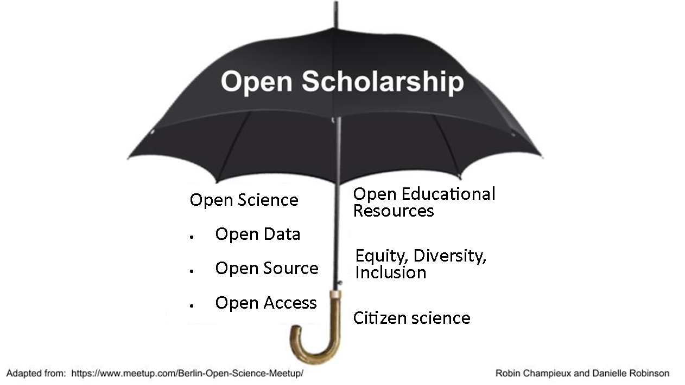

# Open research

## Prerequisites / recommended skill level

| Prerequisite | Importance | Notes |
| -------------|----------|------|
| Experience with version control | Helpful | Experience with GitHub is particularly useful |

Recommended skill level: low.

## Table of contents

1. [Summary](#Summary)
2. [How this will help you/ why this is useful](#Why_this_is_useful)
3. [Open data](#Open_data)
    1. [Steps to make your data open](#Steps_to_make_your_data_open)
        1. [Step 1: Make your data available](#Step_1_Make_your_data_available)
        2. [Step 2: Make your data easy to understand](#Step_2_Make_your_data_easy_to_understand)
        3. [Step 3: Make your data easy to use](#Step_3_Make_your_data_easy_to_use)
        4. [Step 4: Make your data citeable](#citing_data)
    2. [Barriers to data sharing](#Barriers_to_data_sharing)
        1. [Privacy](#Privacy)
        2. [National and commercially sensitive data](#National_and_commercially_sensitive_data)
4. [Open source software](#Open_source_software)
    1. [What is open source software](#What_is_open_source_software)
    2. [How running and contributing to open source software projects benefits you](#How_running_and_contributing_to_open_source_software_projects_benefits_you)
        1. [Making your own work open source](#Making_your_own_work_open_source)
        2. [Contributing to others' open source software projects](#Contributing_to_others_open_source_software_projects)
    3. [How open source software benefits research](#How_open_source_software_benefits_research)
    4. [How to run your own open source software project](#How_to_run_your_own_open_source_software_project)
        1. [Readme](#Readme)
        2. [Contributing guidelines](#Contributing_guidelines)
        3. [Code of conduct](#Code_of_conduct)
    5. [How to contribute to other's open source software projects](#How_to_contribute_to_others_open_source_software_projects)
        1. [Anatomy of an open source software project](#Anatomy_of_an_open_source_software_project)
        2. [Contribute your changes](#Contribute_your_changes)
        3. [Looking for projects to contribute to and how to contribute to them](#Looking_for_projects_to_contribute_to_and_how_to_contribute_to_them)
5. [Open hardware](#Open_hardware)
    1. [Why open hardware?](#Why_open_hardware)
    2. [Elements of an open source hardware project](#Elements_of_an_open_source_hardware_project)
    3. [Open source hardware processes and practices](#Open_source_hardware_processes_and_practices)
        1. [Designing your hardware](#Designing_your_hardware)
        2. [Hosting your design file](#Hosting_your_design_files)
        3. [Distributing open source hardware](#Distributing_open_source_hardware)
6. [Open access](#Open_access)
    1. [What is open access?](#What_is_open_access)
        1. [Repositories and self-archiving](#Repositories_and_self_archiving)
        2. [Open access publishing](#Open_access_publishing)
    2. [Why does open access matter?](#Why_does_open_access_matter)
    3. [Best practice for open access](#Best_practice_for_open_access)
        1. [Self-archiving](#Self_archiving)
        2. [Publication](#Publication)
7. [Open notebooks](#Open_notebooks)
8. [Open scholarship](#Open_scholarship)
    1. [Open educational resources](#Open_educational_resources)
    2. [Equity, Diversity, Inclusion](#Equity_Diversity_Inclusion)
    3. [Citizen science](#Citizen_science)
9. [Checklists](#Checklists)
10. [What to learn next](#What_to_learn_next)
11. [Further reading](#Further_reading)
12. [Definitions/glossary](#Glossary)
13. [Bibliography](#Bibliography)

## Summary

Open research aims to transform research by making research more reproducible, transparent, re-usable, collaborative, accountable and closer to society. It pushes for change in the way that research is carried out and disseminated by digital tools. One definition of Open research, as given by the OECD [is](https://www.fct.pt/dsi/docs/Making_Open_Science_a_Reality.pdf) the practice of making "the primary outputs of publicly funded research results – publications and the research data – publicly accessible in digital format with no or minimal restriction”. In order to achieve this openness in research, each element of the research process should:

- Be publicly available: it is difficult to use and benefit from knowledge hidden behind barriers such as passwords
- Be reusable: research outputs need to be licenced appropriately so that prospective users know clearly any limitations on re-use
- Be transparent and have appropriate metadata to provide clear statements of how research output was produced and what it contains

The research process typically has the following form: data is collected, it is then analysed (usually using software). This process may involve the use of specialist hardware. The results of the research are then published. Throughout the process it is good practice for researchers to document their working in notebooks. Open research aims to make each of these elements open:

- Open data - documenting and sharing research data openly for re-use
- Open source software - documenting research code and routines, and making them freely accessible and available
- Open hardware - documenting designs, materials, and other relevant information related to hardware, and making them freely accessible and available
- Open access - making all published outputs freely accessible for maximum use and impact
- Open notebooks - an emerging practice, documenting and sharing the experimental process of trial and error

These elements are expanded upon in this chapter.

Open scholarship is a concept that extends open research further. It relates to making other aspects of scientific research open to the public, e.g.

- Open educational resources - making educational resources publicly available to be re-used and modified.
- Equity, diversity, inclusion - ensuring scholarship is open to anyone without barriers based on factors such as race, gender, sexual orientation, etc.
- Citizen science - the inclusion of members of the public in scientific research

These elements are also discussed in detail in this chapter.

## How this will help you/ why this is useful

There are five main schools of thought motivating open practices to benefit research:

| School                     | Belief               | Aim                                               |
| -------------------------- | -------------------- | ------------------------------------------------- |
| Infrastructure | Efficient research depends on the available tools and applications. | Creating openly available platforms, tools and services for researchers. |
| Pragmatic | Knowledge-creation could be more efficient if researchers worked together. | Opening up the process of knowledge creation. |
| Measurement | Academic contributions today need alternative impact measurements. | Developing an alternative metric system for research impact. |
| Democratic | The access to knowledge is unequally distributed. | Making knowledge freely available for everyone. |
| Public | Research needs to be made accessible to the public. | Making research accessible for citizens. |

Open practices also benefit the researchers that propagate them. For example there is evidence [(Mckiernan et al. 2016)](https://elifesciences.org/articles/16800) that open access articles are cited more often, as shown by the metastudy presented in the figure below.

|  |
| -----------------------------------------------------|
| The relative citation rate (OA: non-OA) in 19 fields of research. This rate is defined as the mean citation rate of OA articles divided by the mean citation rate of non-OA articles. Multiple points for the same discipline indicate different estimates from the same study, or estimates from several studies. References by discipline: Agricultural studies (Kousha and Abdoli, 2010); Physics/astronomy (Gentil-Beccot et al., 2010; Harnad and Brody, 2004; Metcalfe, 2006); Medicine (Sahu et al., 2005; Xu et al., 2011); Computer science (Lawrence, 2001); Sociology/social sciences (Hajjem et al., 2006; Norris et al., 2008; Xu et al., 2011); Psychology (Hajjem et al., 2006); Political science (Hajjem et al., 2006; Antelman, 2004; Atchison and Bull, 2015); Management (Hajjem et al., 2006); Law (Donovan et al., 2015; Hajjem et al., 2006); Economics (Hajjem et al., 2006; McCabe and Snyder, 2015; Norris et al., 2008; Wohlrabe, 2014); Mathematics (Antelman, 2004; Davis and Fromerth, 2007; Norris et al., 2008); Health (Hajjem et al., 2006); Engineering (Antelman, 2004; Koler-Povh et al., 2014); Philosophy (Antelman, 2004); Education (Hajjem et al., 2006; Zawacki-Richter et al., 2010); Business (Hajjem et al., 2006; McCabe and Snyder, 2015); Communication studies (Zhang, 2006); Ecology (McCabe and Snyder, 2014; Norris et al., 2008); Biology (Frandsen, 2009b; Hajjem et al., 2006; McCabe and Snyder, 2014). |

Another benefit of openness is that while research collaborations are essential to advancing knowledge, identifying and connecting with appropriate collaborators is not trivial. Open practices can make it easier for researchers to connect with one another by increasing the discoverability and visibility of one’s work, facilitating rapid access to novel data and software resources, and creating new opportunities to interact with and contribute to ongoing communal projects.

## Open data

The world is witnessing a significant global transformation, facilitated by technology and digital media, and fuelled by data and information. This transformation has enormous potential to foster more transparent, accountable, efficient, responsive, and effective research.
 Only a very small proportion of the original data is published in conventional journals. Existing policies on data archiving notwithstanding, in today’s practice data are primarily stored in private files, not in secure institutional repositories, and effectively are lost to the public. This lack of data sharing is an obstacle to international research (be it academic, governmental or commercial) for two main reasons:

1. It is generally difficult or impossible to fully reproduce a study without the original data.
2. The data cannot be reused or incorporated into new work by other researchers if they cannot obtain access to it.

Accordingly, there is an ongoing global data revolution that seeks to advance collaboration and the creation and expansion of effective, efficient research programs. Open data is crucial to meeting these objectives.
Open data is freely available on the internet and any user is permitted to download, copy, analyse, re-process, and re-use it for any other purpose with minimal financial, legal, and technical barriers.
This represents a real shift in how research works. At the moment anyone who wishes to use data from a researcher often has to contact that researcher and make a request. "Open by default" turns this on its head and says that there should be a presumption of publication for all. If access to data is restricted, for instance due to security reasons, the justification for this should be made clear.
Free access to, and subsequent use of, data is of significant value to society and the economy, and that data should, therefore, be open by default. So, how do you go about making your data open?

### Steps to make your data open

#### Step 1: Make your data available

Put your data online. It should be easily discoverable and accessible, and made available without bureaucratic or administrative barriers, which can deter people from accessing the data. Choose a location to store the data which will ensure historical copies of datasets are preserved, archived, and kept accessible as long as they retain value. Whenever possible, researchers should provide data in its original, unmodified form.

Data should be free of charge, under [an open licence](https://fossbytes.com/open-sources-license-type/), (for example, those developed by Creative Commons) so it can be reused and remixed by other researchers. The data should be available as a whole and at no more than a reasonable reproduction cost i.e. no expensive piece of software should be required to read the file as this may obstruct researchers who wish to work with the dataset.

#### Step 2: Make your data easy to understand

Having data available is of no use if it cannot be understood. For example, a table of numbers is useless if there are no headings which describe the contents of the rows and columns. Therefore you should ensure that open datasets include consistent core metadata, and that the data is fully described. This requires that all documentation accompanying data is written in clear, plain language, and that data users have sufficient information to understand the source, strengths, weaknesses, and analytical limitations of the data so that they can make informed decisions when using it.

#### Step 3: Make your data easy to use

The data should be made available in a modifiable, machine-readable format so that it can be effectively used and  manipulated.
It is also important to think about the file formats that information is provided in. Data should be presented in structured and standardized formats to support interoperability, traceability, and effective reuse. In many cases, this will include providing data in multiple, standardized formats, so that it can be processed by computers and used by people.

#### Step 4: Make your data citeable

Data should be considered a legitimate, citable product of research. Making data citeable (and citing data yourself) facilitates the giving of scholarly credit; in scholarly literature, whenever and wherever a claim relies upon data, the corresponding data should be cited. Data citations facilitate identification of, access to, and verification of the specific data that support a claim, making it possible to reproduce the underlying analysis. You should ensure that anyone who wishes to cite a dataset that you host has access to a persistent identifier in order to do so.

A data citation should include a persistent method for identification that is unique, and widely understandable by a community. There are several types of persistent identifier that could be used to identify datasets: examples include Handles, Archival Resource Keys (ARKs) and Persistent URLs (PURLs), all of which can be resolved to an Internet location. The scheme that is gaining most traction is the Digital Object Identifier (DOI).

The DOI System is an identifier scheme administered by the International DOI Foundation. The task of managing DOI registers is delegated to registration agencies (list [here](http://www.doi.org/registration_agencies.html)) that each specialise in a type of resource. For research datasets, the registration agency is the [DataCite Consortium](https://www.datacite.org/). Among the services it provides are human and machine interfaces for simple end-user administration of DOI registrations. DataCite also collects metadata about each dataset it registers so they can be more easily understood and found. Any repository wishing to register DOIs needs to obtain a username and password from DataCite to gain access to the registration service. While best practice has yet to emerge on some matters, certain conventions are already becoming established:

When organisations register a DOI for a resource, they should not introduce semantic elements into the suffix, especially not metadata that might change over time (e.g. publisher, archive, owner). Assign identifiers to static datasets only when no further changes or corrections are expected (i.e. after quality control checks are complete). As DOIs are used to cite data as evidence, the resource to which a DOI points should also remain unchanged, with any new version receiving a new DOI.

Whichever identifier scheme you pick make sure it allows the identifier to be resolved to a URL. This URL should belong to a landing page that contains descriptive information about the dataset, as well as links or instructions for accessing it. You should also ensure that datasets are made citable and identifiable at an appropriate level of granularity, i.e. it would be no use citing CERN's entire data repository as someone attempting to reproduce your work would not be able to find the data used in a specific piece of work without considerable difficulty. Where possible it should be possible to cite the data used, and only the data used.

### Barriers to data sharing

Sometimes it may not be possible to make data publicly available in its entirety or even in part. There are two main reasons this may be the case:

#### Privacy

Many fields of research involve working with sensitive personal data, medical research being the most obvious example.
Individuals must be protected from (re)identification via their personal data used for research. Anonymisation of the data may be sufficient in some cases, but ensuring that reidentification is not possible is becoming increasingly difficult due to technical progress, growing computational power and – ironically – more open data. For example, reidentification may be possible via data-mining of accessible data and so-called quasi-identifiers, a set of (common) properties that are – in their combination – so specific that they can be used to identify individuals.

Preserving privacy may still be possible if partial or generalised datasets are provided e.g. age bands instead of birth date or only the first two digits of postal codes. It may also be possible to provide the data in such a format that researchers can query it whist keeping the data itself closed, e.g. a user may be able to send a query to retrieve the mean of a dataset, but not be able to access any of the individual datapoints.

#### National and commercially sensitive data

In many cases companies are understandably unwilling to publish much of their data. The reasoning goes that if commercially sensitive information of a company is disclosed, it will damage the company’s commercial interests and undermine competitiveness. This is based on the thinking that in competitive markets, innovation will only occur with some protection of information: if a company spends time and money developing something new, the details of which are then made public, then its competitors can easily copy it without having to invest the same resources. The result is that no-one would innovate in the first place. Similarly, governments are often unwilling to publish data that relates to issues such as national security due to public safety concerns.

In such cases it may not be possible to make data open, or it may only be only possible to share partial/obscured datasets as outlined in the section above on privacy.

## Open source software

### What is open source software?

When a project is open source anybody can view, use, modify, and distribute the project for any purpose. These permissions are enforced through an open source licence. Open source is powerful because it lowers the barriers to adoption, allowing ideas to spread quickly. In its most basic form, open sourcing your software simply means putting your code online where it can be viewed and reused by others.

Many of the most widely used research software is open source. Perhaps the paradigmatic example is the scikit-learn Python package for machine learning (Pedregosa et al., 2011), which, in the space of just over five years, has attracted over 500 unique contributors, 20,000 individual code contributions, and 2,500 article citations. Producing a comparable package using a traditional closed-source approach would likely not be feasible, and would, at the very least, have required a budget of tens of millions of dollars. While scikit-learn is clearly an outlier, hundreds of other open source packages that support much more domain-specific needs depend in a similar fashion on unsolicited community contributions e.g., the NIPY (neuroimaging in Python) group of projects in neuroimaging (Gorgolewski et al., 2016). Importantly, such contributions not only result in new functionality from which the broader community can benefit, but also regularly provide their respective authors with greater community recognition, and lead to new project and employment opportunities.

Researchers that make use of open source software often make changes to them such as adding features they need for their own research, or fixing bugs. They can then contribute these improvements back to the main project so the wider community can take advantage of them.

### How running and contributing to open source software projects benefits you

- Improve existing skills. Whether it’s coding, user interface design, graphic design, writing, or organizing, if you’re looking for practice, there’s a task for you on an open source software project. Further, open source necessitates cleaner, more maintainable code to enable collaboration between potentially thousands of people who may never meet. This helps to build and maintain good coding habits. Not to be underestimated are the people skills you can develop on open source software projects.
Open source offers opportunities to practice leadership and management skills, such as resolving conflicts, organising teams of people, and prioritising work.
- Advance your career. By definition, all of your open source work is public and this presents opportunities:
  - Demonstrate technical ability. Technical interviews traditionally involve working on a simulated problem that can be tackled in a set amount of time with little additional context. Such simulations, by definition, aren't real world use cases, nor do they show what working with an applicant would be like. Open source provides visibility into both how a candidate solves problems, and how they work with others. You make a much more appealing employee if an employer can see the quality of your work and see you working with others over a long period of time rather than taking a chance on a single short, high-stress case which may not play to your strengths.
  - Reputation. Becoming an active member of the open source community can gain you a positive reputation which may bolster future job prospects.
- Meet people who are interested in similar things. Open source software projects with warm, welcoming communities keep people coming back for years and many people form lifelong friendships through their participation in open source.
- Find mentors and teach others. Working with others on a shared project means you’ll have to explain how you do things, as well as ask other people for help. The acts of learning and teaching can be a fulfilling activity for everyone involved.

#### Making your own work open source

- Making your work openly available for re-use makes it easier for others to incorporate into their own research. If you make your software citeable, for example via a [DOI](doi_system) this can increase your citations.
- When you write closed source software, the only developers that can potentially detect, diagnose, triage, and resolve software bugs are those that have a copy of the code. If your project is open the number of potentially contributing developers and thus the potential knowledge pool is orders of magnitude larger.
- Feedback. Making your work open enables you to get feedback and improve your project in way you may never have thought of alone.
- Accountability. There is an argument that any software developed using government money should be open source by default- if the public has paid for its development they have a right to make use of it. If your work is government funded making it open is a step you can take towards government openness and accountability.

#### Contributing to others' open source software projects

- It’s empowering to be able to make changes, even small ones. You don’t have to become a lifelong contributor to enjoy participating in open source. Have you ever seen a typo on a website, and wished someone would fix it? On an open source software project, you can do just that. Open source helps people feel agency over their lives and how they experience the world, and that in itself is gratifying.
- It's fun. Open source provides an endless, ever-changing set of Rubix cubes for you to solve on weekends. Just like puzzles, both crossword and jigsaw, open source provides bite-sized intellectual escapes.

### How open source software benefits research

Open source software projects primarily benefit research by allowing researchers to take advantage of each other's work. This enables researchers to apply their efforts to  high-value work. It is sometimes said that "all the easy problems have already been solved". Blogging, content management, and operating systems are all problems with established (and mainstream) open source solutions, to name a few. While developers could spend their time reinventing wheels that the open source community have already perfected, it's far preferable to use the world's best wheel, especially when that wheel comes at no cost to you. This frees researchers up to work on yet-unsolved challenges. This reduces duplication of effort and allows researchers to focus on the work they're actually interested in.

Working openly also allows any number of researchers to collaborate on projects that could not possibly be developed by single researchers/research groups. Examples include [Linux](https://www.linux.org/) operating systems, Python packages such as [scipy](https://www.scipy.org/) and [numpy](http://www.numpy.org/), and the machine learning library [TensorFlow](https://www.tensorflow.org/).    

### How to run your own open source software project

You can open source an idea, a work in progress, or after years of being closed source. At the most basic level all you need to do is put your code online somewhere that is likely to last a long time. You can make your code citeable by assigning it a DOI (as discussed in the section on [making data citeable](#citing_data)). This helps ensure that you get proper credit if people use or build upon your work.

A popular place to make your code available is GitHub (see the chapter on version control). You must include a licence file stating that anyone has permission to use, copy and modify your work. Without this no one can legally use your work and so it isn't open source. [This](https://choosealicense.com/) website offers a very simple mechanism to help you pick the best licence for your project. There are also a few other files you should include with your code:

#### Readme

You should include a readme file where you include useful information about what the project is, how to use it and how to contribute to it. Here's a list of the main things a readme should include:

- The project name and what it is. This will greatly help someone that comes across it to get an idea of the project. Include a few key points that describe the main features of the project and what are the main features you're implementing.
This helps to quickly compare other projects with yours and to give an idea that why the project exists in the first place.
- Instructions on how to install the project. The installer might be a collaborator, someone that comes across and is interested in the project, or even you if you get a new machine and need to re-install your project. Nevertheless, it's a total waste of both of your resources to start figuring out how to just get started with the project. This should also include any prerequisites that will be needed to run the project.
The best thing you can do is to just write up the installation instructions when you first do them yourself, and you'll quickly save hours of work in the future.
- Instructions for how to run the code and any associated tests. If you've been working on your project it may seem obvious how to run it, but this will likely not be the case for someone coming across it for the first time.
- Links to related material
- List of authors/contributors to the project, possibly with contact information
- Acknowledgements

If you intend for other people to collaborate on your project (as opposed to just making your code available and considering it complete) then you should include contributing guidelines and most likely a code of conduct.

#### Contributing guidelines

Contributing guidelines tell your audience how to participate in your project. For example, you might include information on:

- How to file a bug report
- How to suggest a new feature
- Your roadmap or vision for the project
- How contributors should (or should not) get in touch with you

Using a warm, friendly tone and offering specific suggestions for contributions (such as writing documentation, or making a website) can go a long way in making newcomers feel welcomed and excited to participate. For example, [Active Admin](https://activeadmin.info/index.html) starts its [contributing guide](https://github.com/activeadmin/activeadmin/blob/master/CONTRIBUTING.md) with: "First off, thank you for considering contributing to Active Admin. It’s people like you that make Active Admin such a great tool."

In the earliest stages of your project, your contributing guidelines file can be simple. You should always explain how to report bugs or file issues, and any technical requirements (like tests) to make a contribution. Over time, you might add other frequently asked questions here or in your readme file. Writing down this information means fewer people will ask you the same questions over and over again. It's also a good idea to link to your contributing guidelines file from your readme, so more people see it.

#### Code of conduct

A code of conduct helps set ground rules for behaviour for your project's participants. This is especially valuable if you're launching an open source project for a community or company. A code of conduct empowers you to facilitate healthy, constructive community behaviour, which will reduce your stress as a maintainer. In addition to communicating how you expect participants to behave, a code of conduct also tends to describe who these expectations apply to, when they apply, and what to do if a violation occurs.

Much like open source licences, there are also emerging standards for codes of conduct, so you don't have to write your own. The [Contributor Covenant](https://contributor-covenant.org/) is a drop-in code of conduct that is used by [over 40,000 open source projects](https://www.contributor-covenant.org/adopters). No matter which text you use, you should be prepared to enforce your code of conduct when necessary.

Keep the file in your project's root directory so it's easy to find, and link to it from your readme.

### How to contribute to other's open source software projects

#### Anatomy of an open source software project

Every open source community is different. That said, many open source software projects follow a similar organizational structure. Understanding the different community roles and overall process will help you get quickly oriented to any new project.

A typical open source software project has the following types of people:

- Author: The person/s or organization that created the project
- Owner: The person/s who has administrative ownership over the organization or repository (not always the same as the original author)
- Maintainers: Contributors who are responsible for driving the vision and managing the organizational aspects of the project. They may also be authors and/or owners of the project.
- Contributors: Everyone who has contributed something back to the project.
- Community members: People who use the project. They might be active in conversations or express their opinion on the project’s direction.

Bigger projects may also have subcommittees or working groups focused on different tasks, such as tooling, triage, community moderation, and event organizing. Look on a project’s website for a “team” page, or in the repository for governance documentation, to find this information.

A great many open source projects are hosted on GitHub (see the chapter on version control for more detail), which has facilities such as:

- Issue tracker: Where people discuss issues related to the project.
- Pull requests: Where people discuss and review changes that are in progress.
- Discussion forums or mailing lists: Some projects may use these channels for conversational topics (for example, "How do I…" or "What do you think about…" instead of bug reports or feature requests). Others use the issue tracker for all conversations.
- Synchronous chat channel: Some projects use chat channels (such as Slack or IRC) for casual conversation, collaboration, and quick exchanges.

#### Contribute your changes

Say you've added a feature or fixed a bug and want to contribute this work to the main project.

1. Read the documentation. The main project may have contributing guidelines or information in a readme instructing prospective contributors on how to supply their changes.
2. Make sure your conventions match those of the main project, both in style and structure. For example if all the variables in a project are named in some particular way yours should be too! Consistent conventions make it much easier for someone who hasn't seen your piece of the project before to understand it rather than having to figure out your particular set of conventions *and* what the code is doing. The project's conventions may be outlined in its documentation, or may just be evident from inspection of the code itself.
3. Break your changes up into manageable, well-defined chunks, e.g. if you've added two separate features don't submit them together. Keeping things "clean" in this way makes your work simpler to understand and review.
4. Test your changes. If the project comes with tests run them, and make sure you're testing against an up to date version of the project as it may have evolved considerably over time. Write specific tests for your changes and submit those too.
5. Don't just submit code- update any relevant documentation too. If your changes are incorporated it will have to be updated, if you don't do it someone else will have to.
6. Ask questions. If there are things you are unsure about there's no harm in asking. Many larger projects have dedicated forums or other venues for questions and discussion.
7. When you submit your changes clearly describe the changes you've made, why you've made them, and how they have been implemented. This makes it as easier for someone looking at your work and deciding whether to incorporate it into the main project to do so. In the likely case the main project is hosted on GitHub you should put this in the pull request (see the version control chapter for more details).

#### Looking for projects to contribute to and how to contribute to them

You don’t need to overthink what exactly your first contribution will be, or how it will look. Instead, start by thinking about the projects you already use, or want to use. The projects you’ll actively contribute to are the ones you find yourself coming back to. Within those projects, whenever you catch yourself thinking that something could be better or different, act on your instinct. You might scan a readme and find a broken link or a typo. Or you’re a new user and you noticed something is broken, or an issue that you think should really be in the documentation. Instead of ignoring it and moving on, or asking someone else to fix it, see whether you can help out by pitching in. That’s what open source is all about!

You can also use one of the following resources to help you discover and contribute to new projects:

- [Open Source Friday](https://opensourcefriday.com/)
- [First Timers Only](https://www.firsttimersonly.com/)
- [CodeTriage](https://www.codetriage.com/)

If you're not sure how to start here's a few other ways you can go about it such as finding an open issue to tackle or asking if you can help write a new feature.

A common misconception about contributing to open source is that you need to contribute code. In fact, it’s often the other parts of a project that are most neglected or overlooked. You’ll do the project a huge favour by offering to pitch in with these types of contributions! You could:

- Review code on other people’s submissions
- Write and improve the project’s documentation
- Curate a folder of examples showing how the project is used
- Answer questions about the project on e.g., Stack Overflow
- Keep things organized, e.g. on GitHub by:
    - Linking to duplicate issues
    - Suggesting new issue labels
    - Going through open issues and suggesting closing old ones
    - Ask clarifying questions on recently opened issues to move the discussion forward

## Open hardware

"Open hardware," or "open source hardware," refers to the design specifications of a physical object which are licenced in such a way that said object can be studied, modified, created, and distributed by anyone. Like open source software, the "source code" for open hardware—schematics, blueprints, logic designs, Computer Aided Design (CAD) drawings or files, etc.—is available for modification or enhancement by anyone. Users with access to the tools that can read and manipulate these source files can update and improve the physical device and the code that underlies it, and, if they wish, proceed to share such modifications.

Open hardware's source code should be readily accessible, and its components are preferably easy for anyone to obtain. Essentially, open hardware eliminates common roadblocks to the design and manufacture of physical goods; it provides as many people as possible the ability to construct, remix, and share their knowledge of hardware design and function.

It's worth noting that open hardware does not necessary mean free. Units may still be sold (by the original designer or by others), but users *could* build them from scratch. Whether or not they choose to buy the unit, users can still get a full understanding of how the hardware works from open documentation, designs, etc.  

### Why open hardware?

Open hardware allows researchers to understand exactly what their equipment is doing, how it's doing it, and to verify that is doing it correctly rather than having to extend a degree of trust. Being aware of how the equipment that generates a result works puts researchers on a firmer footing in assessing those results. Open hardware also makes research more reproducible as researchers looking to verify results can do the same thing.

Other benefits of open hardware include protection against lock-in. Proprietary software for core infrastructure increases the risk of becoming locked in by the vendor or technology. If this happens, researchers can be at the mercy of vendors' price increases and experience a lack of flexibility they can't easily and readily escape. Further, if researchers want to modify their equipment to better suit their needs it is much easier to do so (and may only be legal) in the case of open source hardware.

### Elements of an open source hardware project

Here are some files that you should consider sharing when publishing your open source hardware project. You are not required to post them all, but the more you share the more the community benefits. There is a lot of crossover here with files to include in open source software projects.

- Overview / Introduction. Your open source hardware project should include a general description of the hardware’s identity and purpose, written as much as possible for a general audience. That is, explain what the project is and what it’s for before you get into the technical details. A good photo or rendering can help a lot here.
- A licence. This grants legal permission to anyone to re-use, modify and distribute your designs and hardware acoring to the terms stated e.g. they must acknowledge your contribution.  
- Original Design Files. These are the original source files that you would use to make modifications to the hardware’s design. The act of sharing these files is the core practice of open source hardware.
  - Ideally, your open source hardware project would be designed using a free and open source software application, to maximize the ability of others to view and edit it. For better or worse however, hardware design files are often created in proprietary programs and stored in proprietary formats. It is still essential to share these original design files; they constitute the original “source code” for the hardware. They are the very files that someone will need in order to contribute changes to a given design.
  - Try to make your design files easy for someone else to understand. Organize them in a logical way; comment complex aspects; note any unusual manufacturing procedures; etc.
  - Examples of Original Design Files include 2D drawings and computer-aided design (CAD) files.
- Auxiliary Design Files. Beyond the original design files, it is often helpful to share your design in additional, more accessible formats. For example, best practice open sourcing a CAD design is to share the design not just in its native file format, but also in a range of interchange and export formats that can be opened or imported by other CAD programs.
  - It is also helpful to provide ready-to-view outputs that can easily be viewed by end users who wish to understand (but not necessarily modify) the design. For example, a PDF of a circuit board schematic. These auxiliary design files allow people to study the design of the hardware, and sometimes even fabricate it, even without access to particular proprietary software packages. However, note that auxiliary design files are never recommended as substitutes for original design files.
- Additional technical drawings in their original formats, if required for fabrication of the device, in a commonly-readable format such as PDF.
- Bill Of Materials. While it might be possible to infer from the design files which parts make up a piece of hardware, it is important to provide a separate bill of materials. This can be a spreadsheet (e.g. CSV, XLS, Google Doc) or simply a text file with one part per line.
  - Useful things to include in the bill of materials are part numbers, suppliers, costs, and a short description of each part. Make it easy to tell which item in the bill of materials corresponds to which component in your design files: use matching reference designators in both places, provide a diagram indicating which part goes where, or otherwise explain the correspondence.
- Software and Firmware. You should share any code or firmware required to operate your hardware. This will allow others to use it with their hardware or modify it along with their modifications to your hardware. Document the process required to build your software, including links to any dependencies (e.g. third-party libraries or tools). In addition, it’s helpful to provide an overview of the state of the software (e.g. “stable” or “beta” or “barely-working hack”).
- Photos. Photos help people understand what your project is and how to put it together. It’s good to publish photographs from multiple viewpoints and at various stages of assembly. If you don’t have photos, posting 3D renderings of your design is a good alternative. Either way, it’s good to provide captions or text that explain what’s shown in each image and why’s it’s useful.
- Instructions and Other Explanations. In addition to the design files themselves, there are a variety of explanations that are invaluable in helping others to make or modify your hardware:
  - Making the hardware. To help others make and modify your hardware design, you should provide instructions for going from your design files to the working physical hardware. As part of the instructions, it’s helpful to link to datasheets for the components / parts of your hardware and to list the tools required to assemble it. If the design requires specialized tools, tell people where to get them.
  - Using the hardware. Once someone has made the hardware, they need to know how to use it. Provide instructions that explain what it does, how to set it up, and how to interact with it.
  - Design rationale. If someone wants to modify your design, they’ll want to know why it is the way it is. Explain the overall plan of the hardware’s design and why you made the specific choices you did.
  - Keep in mind that these instructions may be read by someone whose expertise or training is different from yours. As much as possible, try to write to a general audience, and check your instructions for industry jargon, be explicit about what you assume the user knows, etc.
  - The instructions could be in a variety of formats, like a wiki, text file, Google Doc, or PDF. Remember, though, that others might want to modify your instructions as they modify your hardware design, so it’s good to provide the original editable files for your documentation, not just output formats like PDF.

### Open source hardware processes and practices

#### Designing your hardware

If you’re planning to open source a particular piece of hardware, following certain best practices in its design will make it easier for others to make and modify the hardware:

Use free and open source software design (CAD) tools where possible. If that’s not feasible, try to use low-cost and/or widely-used software packages.

Use standard and widely-available components, materials, and production processes. Try to avoid parts that aren’t available to individual customers or processes that require expensive setup costs.

#### Hosting your design files

A basic way of sharing your files is with a zip file on your website. While this is a great start, it makes it difficult for others to follow your progress or to contribute improvements. Using an online source-code repository (like GitHub, GitLab, or NotaBug) may be a better place to store your open source hardware projects.

#### Distributing open source hardware

- Provide links to the source (original design files) for your hardware on the product itself, its packaging, or its documentation.
- Make it easy to find the source (original design files) from the website for a product.
- Label the hardware with a version number or release date so that people can match the physical object with the corresponding version of its design files.
- In general, clearly indicate which parts of a product are open source (and which aren’t).

## Open access

### What is open access?

One of the most common ways to disseminate research results is by writing a manuscript and publishing it in a journal, conference proceedings or book. For many years those publications were available to the public if purchased by means of a subscription fee or individually. However, new knowledge is built by synthesizing current scholarship and then building upon it. At the turn of the 21st century a new movement appeared with a clear objective: make all the research results available to anyone interested in reading it, free of charge by any user, with no technical obstacles such as mandatory registration or login to specific platforms. This movement took the name of Open access and established two initial strategies to achieve its final goal: self-archiving and open access publishing.

#### Repositories and self-archiving

The aim of the self-archiving movement is to provide tools and assistance to scholars to deposit their refereed journal articles in open electronic repositories.  As a result of the first strategy we see self-archiving practices: researchers depositing and disseminating papers in institutional or subject based repositories. There has also been a growth in the publication of preprints through institutional repositories and preprint servers. Preprints are widely used in physical sciences and now emerging in life sciences and other fields. Preprints are documents that have not been peer reviewed but are considered as a complete publication in a first stage. Some of the preprint servers include open peer review services and the availability to post new versions of the initial paper once reviewed by peers.

At the beginning of 2019 more than 4000 repositories are available for researchers to self-archive their publications according to the [registry of open access repositories](http://roar.eprints.org/). In this list we can find institutional repositories, subject based or thematic repositories and harvesters. The first ones are generally managed by research performing institutions to provide to their community a place to archive and share openly papers and other research outputs. Subject based repositories are usually managed by research communities and most of the contents are related to a certain discipline. Finally, harvesters aggregate content from different repositories becoming sites to perform general searches and build other value-added services.

When choosing a journal to publish research results, researchers should take a moment to read the journal policy regarding the transfer of copyright. Many journals still require for publication that authors transfer full copyright. This transfer of rights implies that authors must ask for permission to reuse their own work beyond what is allowed by the applicable law, unless there are some uses already granted. Such granted uses may include teaching purposes, sharing with colleagues, and self-archiving by researchers of their papers in repositories. Sometimes there a common policy among all the journals published by the same publishers but in general journals have their own policy, especially when they are published on behalf of a scientific society. When looking at the self-archiving conditions we must identify two key issues: the version of the paper that can be deposited and when it can be publicly available.

Regarding the version, some journals allow the dissemination of the submitted version, also known as preprint, and they allow its replacement for a reviewed version once the final paper has been published. Due to the increase of policies requiring access to research results, most of the journals allow self-archiving of the accepted version of the paper, also known as the author manuscript or postprint. This version is the final text once the peer review process has ended but it has not the final layout of the publication. Finally some journals do allow researchers to deposit the final published version, also known as the version of record.

In relation to the moment to make the paper publicly available, many journals establish a period of time from its original publication: the embargo period, which can range from zero to 60 months when making the paper publicly available is not permitted. Some journals include or exclude embargoes depending on the versions. For instance the accepted version could be made publicly available after publication but the published version must wait 12 months.

#### Open access publishing

Open access publishing attempts to ensure permanent open access to all the articles published in journals, and as a result we have seen the creation of the open access journals. The number of open access journals has increased during the last years, according to the Directory of Open access Journals \([DOAJ](http://www.doaj.org)\), currently there are more than 12,000. Open access journal must provide free access to its contents but it also must licence them to allow reusability.

Currently many paywalled journals offer individual open access options to researchers once the paper is accepted after peer review. Those options include the publication under a free content licence and free accessibility to anyone since its first publication. This model is commonly known as the hybrid model because in the same issue of a journal, readers can find open access and paywalled contributions. Usually publishers ask for a fee to open individual contributions.

Open access publishing has two primary versions—gratis and libre. Gratis open access is simply making research available for others to read without having to pay for it. However, it does not grant the user the right to make copies, distribute, or modify the work in any way beyond fair use. Libre open access is gratis, meaning the research is available free of charge, but it goes further by granting users additional rights, usually via a Creative Commons licence, so that people are free to reuse and remix the research. There are varying degrees of what may be considered libre open access. For example, some scholarly articles may permit all uses except commercial use, some may permit all uses except derivative works, and some may permit all uses and simply require attribution. While some would argue that libre open access should be free of any copyright restrictions (except attribution), other scholars consider a work that removes at least some permission barriers to be libre.

### Why does open access matter?

Research is useless if it’s not shared; even the best research is ineffectual if others aren’t able to read and build on it. When price barriers keep articles locked away, research cannot achieve its full potential. Open access benefits researchers who can work more effectively with a better understanding of the literature. It also helps avoid duplication of effort. No researcher (or funder) wants to waste time and money conducting a study if they know it has been attempted elsewhere. But, duplication of effort is all-too-possible when researchers can’t effectively communicate with one another and make results known to others in their field and beyond. It also benefits researchers by providing better visibility and therefore higher impact/citation rate for their scholarship.  Numerous publishers, both non-profit and for-profit, voluntarily make their articles openly available at the time of publication or within 6-12 months.  Many have switched from a closed, subscription model to an open one as a strategic business decision to increase their journal's exposure and impact. Further it can be argued that taxpayers who pay for much of the research published in journals have a right to access the information resulting from that investment without charge. Finally, if research is available to the widest possible pool of readers then it is more likely/easy for it to be checked and reproduced.  

### Best practice for open access

#### Self-archiving

Self-archive a publication in a suitable repository, institutional or subject-based, following the possible restrictions posed by the publisher, e.g. an embargo period, or limits on the allowed version to be deposited in such archives. In doing this it is important to make sure you are aware of the copyright implications of any documents/agreements you make when submitting your manuscript to a journal. If your institution does not have an institutional repository, advocate for the creation of one.

#### Publication

Consider submitting your work to a journal that is open access. When doing this be aware that there may be funds or discounts available to cover any associated costs.

## Open notebooks

Electronic Lab Notebooks (ELNs) enable researchers to organize and store experimental procedures, protocols, plans, notes, data, and even unfiltered interpretations using their computer or mobile device. They are a digital analogue to the paper notebook most researchers keep. ELNs can offer several advantages over the traditional paper notebook in documenting research during the active phase of a project, including searchability within and across notebooks, secure storage with multiple redundancies, remote access to notebooks, and the ability to easily share notebooks among team members and collaborators.

Open notebook research is simply the practice of making such notebooks openly available, usually online. Some researchers choose to keep their notebooks open from the very beginning of their projects. Rather than wait months, even years, to share their research through journal publication as is the current practice, this allows researchers to post their experimental data and protocols online and in real-time. Sharing research in this open and timely manner helps to reduce duplication of work, helps foster new collaborations and cultivates a more open dialogue with others. It also helps researchers avoid making exploring dead ends and making mistakes that have already been covered by their colleague, but went unpublished because of lack of scientific interest.

Open notebooks have the further benefit of increasing the quality of scientific outputs by forcing researchers to be careful, thorough, and explicit. Making research open has the added benefit of increasing the likelihood that any errors made in an investigation will be spotted quickly, instead of down the line. Immediate fixes will have much less impact on a research project, which will save a research time, the lab money, and pride.

Ideally, every scientist would maintain an open notebook in real-time which would encompass all aspects of their research. But many fears about dealing with complete open access, conflicts with intellectual property and publications, and online data overload hamper this movement. To combat this, practitioners encourage any form of open notebook research, "make open what you can", even if that means uploading some information for a project from many years ago that never saw the light of day.

## Open scholarship

Open research and its subcomponents fit under the umbrella of a broader concept- open scholarship.

### Open educational resources

Open Educational Resources (OER) are teaching and learning materials that can be freely used and reused for learning and/or teaching at no cost, and without needing to ask permission. Examples are courses- including MOOCs (Massive Online Open Course), lectures, teaching materials, assignments and various other resources. OERs are available in many different formats compatible with online usage, most obviously text, images, audio and video. Anyone with internet access can access and use OERs; access is not dependent on location or membership of a particular institution.

Unlike copyrighted resources, OER have been authored or created by an individual or organization that chooses to retain few, if any, ownership rights. In some cases, that means anyone can download a resource and share it with colleagues and students. In other cases, this may go further and enable people to edit resources and then re-post them as a remixed work. How do you know your options? OER often have a Creative Commons licence or other permission to let you know how the material may be used, reused, adapted, and shared.

Fully open OERs comply with the 5 Rs:

- Retain: the right to make, own, and control copies of the content
- Reuse: the right to use the content in a wide range of ways (e.g., in a class, in a study group, on a website, in a video)
- Revise: the right to adapt, adjust, modify, or alter the content itself (e.g., translate the content into another language)
- Remix: the right to combine the original or revised content with other open content to create something new (e.g., incorporate the content into a mashup)
- Redistribute: the right to share copies of the original content, your revisions, or your remixes with others (e.g., give a copy of the content to a friend)

Researchers generate a great deal of educational resources in the course of teaching students and each other (at workshops, for example). By making these openly available, for example in the [open educational resource commons](https://www.oercommons.org/), the wider community can benefit from them in three main ways:

1. Most obviously, the community can use the materials to learn about the material they cover
2. Sharing resources reduces duplication of effort. If an educator needs materials for teaching and such materials already exist openly then they need not make their own from scratch, saving time.
3. Making materials openly available helps a community build better resources by improving resources that already exist and combining OERs to take advantage of their different strengths, such as a great diagram or explanation.

Beyond the raw practical benefits the worldwide OER movement is rooted in the human right to access high-quality education. This shift in educational practice is about participation and co-creation. Open Educational Resources (OER) offer opportunities for systemic change in teaching and learning content through engaging educators in new participatory processes and effective technologies for engaging with learning.

### Equity, Diversity, Inclusion

Open scholarship means open to *everyone* without discrimination based on factors such as race, gender, sexual orientation or any number of other factors. As a community we should undertake to ensure equitable opportunities for all. We can go about that by deliberately fostering welcoming, inclusive cultures within out communities. For example, reasonable accommodations should be made wherever possible to include community members with disabilities to enable them to participate fully, and this can be as simple as choosing colourblind-safe colour schemes when making graphs.

### Citizen science

Citizen science is the involvement of the public in scientific research – whether community-driven research or global investigations, the Oxford English Dictionary recently defined it as: "scientific work undertaken by members of the general public, often in collaboration with or under the direction of professional scientists and scientific institutions." Citizen science offers the power of science to everyone, and the power of everyone to science.

By allowing members of the public to contribute to scientific research, citizen science helps engage and invest the wider world in science. It also benefits researchers by offering manpower that simply wouldn't be accessible otherwise. Examples of this include [finding](https://citizensciencegames.com/games/eterna/) ways of folding molecules, and [classifying](https://www.zooniverse.org/) different types of galaxies.

## Checklists

### Open data

- [ ] Ensure your data is in a simple, standard format or formats which is machine and human readable.
- [ ] Check, reformat or create metadata to clearly describe what the data is, how it was collected, and any associated strengths/weaknesses to someone that finds it.
- [ ] Identify a relevant, easily discoverable repository or repositories to host your data, and upload it there
- [ ] Assign your data a persistent identifier such as a DOI.

### Open source software

- [ ] Put your code in a freely accessible repository
- [ ] Include a licence granting others the right to use, copy and modify your work. You can use [this](https://choosealicense.com/) website to help you pick the most appropriate licence for your project.
- [ ] Include a readme file containing useful information about a project such as what it is, how to use/install it and how to run any tests.
- [ ] If you want others to collaborate on the project include contribution guidelines.

### Open hardware

- [ ] Use open hardware where practical
- [ ] Make detailed documentation and designs for any hardware you develop openly available
- [ ] Include a licence granting others the right to use, copy and modify your work. You can use [this](https://choosealicense.com/) website to help you pick the most appropriate licence for your project.
- [ ] Include a readme file containing useful information about a project such as what it is, materials used, etc.

### Open access

- [ ] Publish your research in an open access journal
- [ ] Store a copy and/or preprint of your work in a freely accessible public repository

### Open notebooks

- [ ] Keep notes in an Electronic Lab Notebook
- [ ] Make your notebooks publicly accessible online.

## What to learn next

If you haven't had a chance already, take a look at the chapter on version control, particularly the sections on GitHub in the latter half.

## Further reading

[This](http://book.openingscience.org.s3-website-eu-west-1.amazonaws.com/) book on open science has a great deal of interesting information. For information specific to open source software [this](https://opensource.guide/) is a good place to look. For more information on DOIs and citing resources look [here](http://www.doi.org/index.html). If you want to take a look at an active open source project this textbook *is* one. The source can be found on GitHub [here](https://github.com/alan-turing-institute/the-turing-way) and for further details related to this project you can take a look at the project [website](https://www.turing.ac.uk/research/research-projects/turing-way-handbook-reproducible-data-science).

## Definitions/glossary

**Citizen science:** The involvement of members of the public in scientific research.

**Contributing guidelines:** Guidelines outlining how a person should go about contributing to an open source project.

**Contributor:** Someone that has contributed something (not necessarily code) to an open source project.

**DOI:** A widely used type of persistent identifier.

**GitHub:** An online code hosting and version control service. It has a great many features to aid collaboration between users, and hosts a large number of open source projects.

**Maintainer:** Contributors who are responsible for driving the vision and managing the organizational aspects of the project. They may also be authors and/or owners of the project.

**Metadata:** Data used to describe other data. For example (35, 33, 27, 30, 33) is data but the units (miles per hour) and the fact these are the speeds of cars on a certain stretch of road is metadata.

**Open access publishing (gratis):** The practice of making research publications available to anyone to read without charge.

**Open access publishing (libre):** Libre open access is gratis, meaning the research is available free of charge, but it goes further by granting users the right to copy, reuse, and remix the publication.

**Open data:** Data that is freely available online for reuse without bureaucratic or administrative barriers.

**Open educational resource:** Educational materials available online for anybody to use, remix and distribute.

**Open notebook:** The practise of making research notebooks openly available.

**Open source software:** Software which is available online for anybody to view, use, modify, and distribute.

**Open source hardware:** Hardware with documentation, designs, materials used, and other relevant information freely accessible and available

**Persistent identifier:** A long-lived method for identifying a resource that is unique, and widely understandable by a community.

**Readme:** A file which contains useful information about a project such as what it is, how to use/install it, how to test it, and how to contribute to it.

**Repository:** A long-lived place on the internet where resources (be they data, software, publications or anything else) can be stored and accessed.

**Self-archive:** To place your research output in a repository.

## Bibliography
- [1.](https://www.fosteropenscience.eu/content/what-open-science-introduction) **CC-BY 4.0**
- [2.](https://open-science-training-handbook.gitbook.io/book/introduction) **CC 1.0**
- [3.](https://www.fosteropenscience.eu/content/introduction-open-science-funders-introductory) **Attribution + Noncommercial - CC-BY-NC**
- [4.](https://link.springer.com/chapter/10.1007/978-3-319-00026-8_2) **Creative Commons Attribution Noncommercial Licence**
- [5.](https://elifesciences.org/articles/16800) **Attribution 4.0 International (CC BY 4.0)**
- [6.](https://www.fosteropenscience.eu/content/introduction-open-science-funders-introductory) **Attribution + Noncommercial - CC-BY-NC**
- [7.](http://book.openingscience.org.s3-website-eu-west-1.amazonaws.com/vision/open_research_data.html) **Creative Commons Attribution-NonCommercical**
- [8.](http://opendatahandbook.org/guide/en/what-is-open-data/) **CC Attribution 4.0 International Licence**
- [9.](https://opendatacharter.net/) **Creative Commons Attribution 4.0 International Licence**
- [10.](http://book.openingscience.org.s3-website-eu-west-1.amazonaws.com/cases_recipes_howtos/making_data_citeable.html) **Creative Commons Attribution-NonCommercical**
- [11.](http://book.openingscience.org.s3-website-eu-west-1.amazonaws.com/cases_recipes_howtos/challenges_of_open_data_in_medical_research.html) **Creative Commons Attribution-NonCommercical**
- [12.](http://www.dcc.ac.uk/resources/how-guides/cite-datasets) **Creative Commons**
- [13.](https://www.open-contracting.org/2016/09/19/diving-deeper-commercial-confidentiality/) **Creative Commons Attribution 4.0 International Licence**
- [14.](https://ben.balter.com/2015/11/23/why-open-source/) **CC BY 3.0**
- [15.](https://opensource.guide/starting-a-project/) **(CC BY 4.0)**
- [16.](https://opensource.guide/) **(CC BY 4.0)**
- [17.](https://opensource.com/resources/what-open-access) **Attribution-ShareAlike 4.0 International**
- [18.](http://www.righttoresearch.org/learn/whyOA/index.shtml) **Creative Commons Attribution 3.0 Licence**
- [19.](https://open-science-training-handbook.gitbook.io/book/open-science-basics/open-access-to-published-research-results) **CC0 1.0 Universal**
- [20.](https://www.oercommons.org/about) **Creative Commons Attribution-NonCommercial-ShareAlike 3.0 Licence**
- [21.](https://libguides.ioe.ac.uk/oer)  **Creative CommonsAttribution-NonCommercial-ShareAlike 2.0 UK: England & Wales (CC BY-NC-SA 2.0 UK)**
- [22.](https://opencontent.org/blog/archives/3221) **Creative Commons Attribution licence version 4.0**
- [23.](https://opensource.com/resources/what-open-hardware) **CC BY-SA 4.0**
- [24.](https://opensource.com/article/17/8/enterprise-open-source-advantages) **CC BY-SA 4.0**
- [25.](https://www.oshwa.org/sharing-best-practices/) **Creative Commons Attribution-ShareAlike 4.0 International Licence**
- [26.](https://openlabnotebooks.org/open-science-at-sgc/) **CC BY 4.0**
- [27.](http://onsnetwork.org/) **Attribution 3.0 Unported (CC BY 3.0)**
- [28.](https://libraries.mit.edu/data-management/store/electronic-lab-notebooks/) **CC BY-NC 2.0**
- [29.](https://www.citizenscience.org/) **(CC BY 4.0)**
