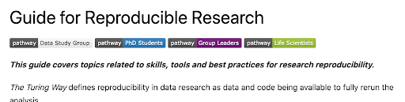
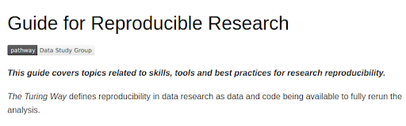
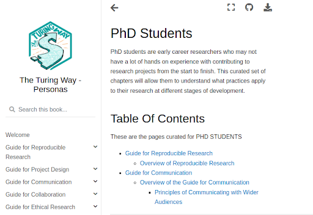

# Google Summer Of Code 2023 Final Report

# Table of Contents
- [About Me](#about-me)
- [Goals of the Project](#goals-of-the-project)
- [My Contributions](#my-contributions)
- [Pull Requests I Created](#pull-requests-i-created)
- [Weekly Status Update](#weekly-status-update)
- [Acknowledgements](#acknowledgements)
- [Conclusion](#conclusion)

## About Me

I am Arya A from Kerala, India, currently pursuing a B.Tech in Computer Science Engineering with a specialization in Artificial Intelligence.

## Goals of the Project

The Turing Way is an open-source, community-led handbook on data science hosted as a website. Over the past four years, the book has significantly expanded, making it challenging to navigate, especially for newcomers.

The primary project goal is to enhance the usability of The Turing Way book website. This includes improving a python package that the team initially developed in 2022. This package was created to enhance usability of the book website by establishing user-specific entry points known as 'pathways.' The idea is to simplify navigation for users, ensuring that if a user identifies with a particular profile such as Early Career Researchers or project leaders, they can easily navigate the content of the book tailored to their needs. The curated set of chapters can be easily browsed using the pathways feature. Improvements to this feature and other enhancements aimed at improving the accessibility and usability of The Turing Way book website are being pursued as a part of this project.

## My Contributions

### 1. Community Involvement : Participation in Turing Way Book Dash Event for Preparation and Gathering User Experience Feedback 

Turing Way Book Dash events are a less intense version of Book Sprints, where participants work together to create and enhance chapters of The Turing Way book, focusing on accessibility and comprehensiveness

During the book dash, I focused on gathering ideas to enhance the usability of the book website. To achieve this, I engaged with several users through one-on-one conversations to gather their feedback on their experiences using the pathways within the book. Users shared their insights and demonstrated their browsing patterns via screen-sharing sessions. Furthermore, I created a feedback form to collect input from a broader user base.The feedback from users was helpful in understanding the impact of pathways-based browsing and identifying areas for improvement

### 2. Enhancing the browsing experience of users who are exploring a single profile

**Problem:**  In the previous version, when a user navigates the book via pathways, badges associated with all profiles available in the book are shown on the top of the chapter pages. This affects the browsing experience of users exploring a single profile.

**Initial Approach:** The initial solution, as described in the proposal, was to modify hyperlinks by adding selected profile details (name, color) as search parameters of the hyperlink. However, during implementation and testing, it was discovered that this idea would create other issues, leading to the need for an alternative solution.

**Final and Revised Approach:**  In this approach, the profile selected by the user is stored using 'sessionStorage.' Session storage is a web storage mechanism that allows data to be stored in the user's browser during a single session. The user's selected profile is then fetched from sessionStorage and used to add the correct badges to the chapters.

**Old Version:**

A user belonging to data study group while accessing a chapter (Guide for Reproducible Research).

<kbd></kbd>

**New Version:**

<kbd></kbd>

### 3. Pathway Description Feature

Previously, the landing page for user profiles lacked descriptions, making it less meaningful.The previous version is shown below: 

<kbd></kbd>

A new functionality was implemented to include descriptions for all profiles, which can be specified in the 'profiles.yml' file. During the book-building process, these descriptions are retrieved and added to the landing page of all profiles. The new version is shown below:

<kbd></kbd>

### 4. Integration of Python Package for User Pathways in the Main Project

The implementation and testing of the Python package, along with additional enhancements to improve the usability of The Turing Way book, were carried out in the test repository named [bio-Turing-Way](https://github.com/alan-turing-institute/bio-Turing-Way)

**Integration into the Main Project:**  All the implementations need to be integrated into the main project. The package is added as a Python module and is installed during the book-building process.

**Addressing Version Conflicts:** A version conflict between Jupyter-Book arose during the integration process. The test project used Jupyter-Book 0.11.2, while the main project adopted Jupyter-Book 0.13. This conflict caused issues with the correct functioning of the pathways card in the main project.

**Resolution of the Conflict:** The pathways card implementation relies on 'sphinx-panels,' which was not included in the version used by the main project. To resolve this issue, 'sphinx-panels' was added as an extension to the main project, and other related issues were addressed during the resolution process.

### 5. Incorporating Text-to-Speech Functionality into the Turing Way Website

Text to Speech helps in enhancing the user experience of the Turing Way Website. Hence, an attempt was made to integrate text-to-speech functionality into the website. For this purpose, [Easy Speech](https://github.com/jankapunkt/easy-speech/tree/master), a cross-browser library for text-to-speech (TTS), was used. Easy Speech utilizes the [Web Speech API](https://developer.mozilla.org/en-US/docs/Web/API/SpeechSynthesis) for speech synthesis.

At present, the implementation is in its initial stages, and there is room for several improvements to ensure the proper functioning of the text-to-speech feature.

Using the Web Speech API may not be the best option as it has some limitations, such as varying voice quality based on the user's operating system and potential browser compatibility issues. These challenges will need to be addressed as the project progresses to provide the best possible user experience.

## Pull Requests I Created

- [#42](https://github.com/alan-turing-institute/bio-Turing-Way/pull/42) - Pathway Description Feature
- [#43](https://github.com/alan-turing-institute/bio-Turing-Way/pull/43) - Enhancing the browsing experience of users who are exploring a single profile
- [#3227](https://github.com/the-turing-way/the-turing-way/pull/3277) - Integration of Python Package for User Pathways in the Main Project
- [#44](https://github.com/alan-turing-institute/bio-Turing-Way/pull/44) - Incorporating Text-to-Speech Functionality into the Turing Way Website

## Weekly Status Update

The weekly status updates, which were sent every Wednesday to track my progress, can be found [here](https://github.com/the-turing-way/the-turing-way/discussions/3081).

## Acknowledgements

I would like to express my gratitude to my mentors, [Malvika Sharan](https://github.com/malvikasharan) and [Johanna Bayer](https://github.com/likeajumprope), for their support and guidance throughout the entire GSoC period.

## Conclusion

Participating in GSoC has been a wonderful learning experience for me. I have gained valuable knowledge and skills during this period.
