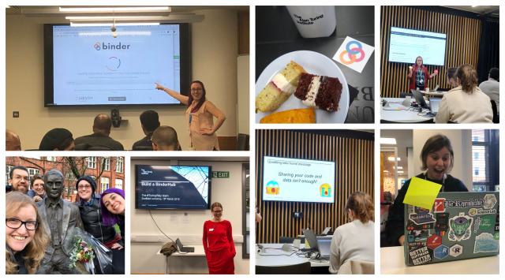

# The Turing Way - March update

Dear friends of the Turing Way,

We've had a busy March!
Our workshops and team sprints have been so much fun and really productive.
This newsletter gives you a little tour around some of our updates.

Please forward it to anyone you think would like to know what we're up to.
And stay tuned (here's the [sign up page](https://tinyletter.com/TuringWay) for new community members) for April's newsletter - we're excited to launch our Jupyter Book at the Collaborations Workshop next week!

## Workshops
We ran three successful workshops in March – many thanks to those who attended!

### [Boost your research reproducibility with Binder](https://github.com/alan-turing-institute/the-turing-way/tree/main/workshops/boost-research-reproducibility-binder)
Our two workshops to boost research reproducibility with Binder in Manchester and London were attended by 30 people.
We had a great mix of presentations and hands-on exercises and our feedback was really positive.
Every attendee said they felt confident using Binder to share their work reproducibily!

### [Build a BinderHub](https://github.com/alan-turing-institute/the-turing-way/tree/main/workshops/build-a-binderhub)
We hosted the first ever Build a BinderHub workshop in Sheffield on 18 March 2019.
In addition to learning how to build a BinderHub (and having the most BinderHubs ever in existence in parallel!), participants were introduced to [Mozilla's principles of working openly](http://mozillascience.github.io/working-open-workshop/).
They practically applied the principles and fed back ideas for new features to the Binder community or enhanced the existing documentation.

Look at all the fun (and some of the food) we had!

All workshop materials are available on our [GitHub repository](https://github.com/alan-turing-institute/the-turing-way/tree/main/workshops/) and can be re-used to run your own Binder based sessions!

## Handbook
Our handbook is shaping up and most of the chapters are written and ready for review.
We will move them into a separate repository for the book and are working on turning it into a jupyterbook for the launch.
Details will follow in our post-launch update newsletter in April.

### Rewriting history
The main project repository ([https://github.com/alan-turing-institute/the-turing-way](https://github.com/alan-turing-institute/the-turing-way)) was getting really big because we had a lot of large powerpoint slides in there.
So this week we "re-wrote" git history to remove those commits and slim the repository down to a svelt 60MB.
All the slides from the talks are still available, we just moved them to a [collection on Zenodo](https://github.com/alan-turing-institute/the-turing-way/pull/196/files)....following our own advice in the [data management chapter](https://github.com/alan-turing-institute/the-turing-way/pull/196) of the Turing Way!

If you had locally cloned the GitHub repository, or if you had a fork of it, you'll find that these are no longer linked.
Please re-clone and/or re-fork, and let us know if you have any questions.
Sorry for the confusion!
Hopefully we won't do this again :)

### Join us for the launch!
Most of the Turing Way team will be at the [Software Sustainability Institute's Collaborations Workshop](https://www.software.ac.uk/cw19) in Loughborough 1 - 3 April 2019.
We hope to see many of you there for [the launch demo](https://software.ac.uk/blog/2019-02-21-inspiring-demos-are-waiting-you-collaborations-workshop-2019) of our handbook and plenty of insightful discussions!

## Have your say!
While you may imagine that a book launch is the end of a project, for us this is simply a next big step to incorporating your feedback, case studies and suggestions.
We would still love you to share your tips, tricks and gotchas with the Turing Way community!

One of the easiest ways to contribut is to add your advice via this [quick form](https://goo.gl/forms/akFqZEIy2kxAjfZW2).

Colleagues from Research England are interested in understanding how researchers think the research landscape (i.e. research outputs, impacts and the research environment) might change over the next 5 to 10 years.
You can still fill [their survey]( https://www.smartsurvey.co.uk/s/nationalresearchsurvey) by **1 April 2019**.

Thank you for reading, and we look forward to your contributions!

The Turing Way project team
https://github.com/alan-turing-institute/the-turing-way
