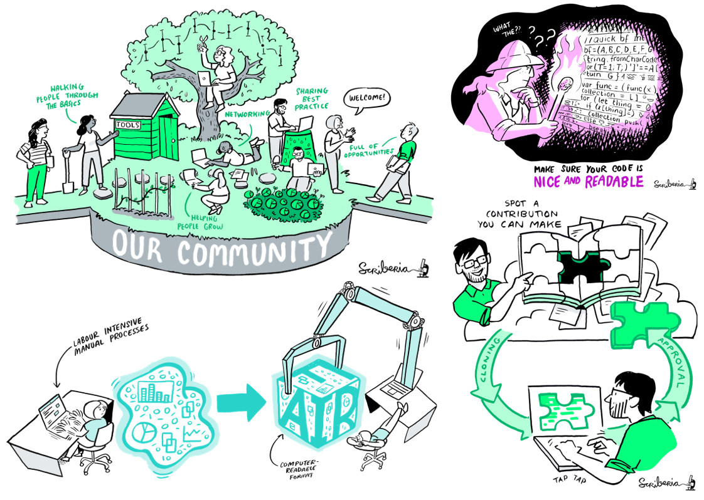

# The Turing Way - Introducing Online Collaboration Cafes

Hello Turing Way friends!

Have you had a great summer?
At The Turing Way we've been both busy and on haitus, but we're really excited to be back for the autumn.

Keep reading for information about our [online "Collaboration Cafes"](#online-collaboration-cafes) that start tomorrow, celebrate our [funding extension](#funding-approved) and some incredible [new jobs](#new-jobs), re-use the beautiful [artwork](#artwork) from our Book Dash 📚💨💨 events, and watch one of Kirstie's [talks](#turing-way-talks) about the project from PyData London.

## Online Collaboration Cafes

You are cordially invited to join Kirstie and the team for a two hour remote collaboration call on the 1st and 3rd Wednesdays of the month.

We're calling these events online *Collaboration Cafes*.
The goal is to build some personal connections between busy people around the world, support you in figuring out how you can contribute to *The Turing Way*, and have some fun building the book and community together 💖.

You can think of them as capturing and sharing the energy of the May book dashes 📚💨💨 without the travel and long time commitment.
We've written up a [longer description](https://github.com/alan-turing-institute/the-turing-way/blob/master/project_management/online-collaboration-cafe.md) in the project repository if you want to learn more.

**The first one is tomorrow, 4 September, at 3pm UK time** (find your local time [here](https://arewemeetingyet.com/London/2019-09-04/15:00/TuringWay-CollaborationCafe).)
Don't worry if you can't make it, there will be lots of opportunities for you to join us in future calls.
Check out [the schedule](https://github.com/alan-turing-institute/the-turing-way/blob/master/project_management/online-collaboration-cafe.md#dates-and-start-times) to add future dates to your calendar.

## Funding approved

We're delighted that *The Turing Way* has been awarded another round of funding from _Tools, Practices and Systems_ branch of the [AI for Science and Government programme](https://www.turing.ac.uk/research/ai-science-engineering-health-and-government) at the Turing.
🎉 ✨ 💃 🕺 🚀 🌟 🙌

You can read the application [in our GitHub repository](https://github.com/alan-turing-institute/the-turing-way/blob/master/project_management/tps-funding-application-20190429.md) and we'll
have more information in the coming months.
We'd love for you to help shape the future of the project, so please [get in touch](https://github.com/alan-turing-institute/the-turing-way/blob/master/CONTRIBUTING.md#get-in-touch) with any comments or ideas.

## New jobs

Congratulations to three of the core _Turing Way_ team members who have started new jobs this summer.

* [Rachael Ainsworth](https://twitter.com/rachaelevelyn) is now the Research Software Community Manager for the [Software Sustainability Institute](https://twitter.com/SoftwareSaved), based in Manchester.
* [Rosie Higman](https://twitter.com/RosieHLib) is the Research Data Manager for the [University of Sheffield Library](https://www.sheffield.ac.uk/library).
* [Patricia Herterich](https://twitter.com/PHerterich) has joined [Digital Curation](http://www.dcc.ac.uk/) to work on the [FAIRsFAIR](https://www.fairsfair.eu/) (Fostering Fair Data Practices in Europe) project in Edinburgh.
  You could get her off to a great start by filling in this [FAIR Policy and Practice Survey](https://ec.europa.eu/eusurvey/runner/FAIR_Policy_and_Practice_Survey_2019) before 20 September 2019.

We're so incredibly proud of all the Turing Way community members, and these roles in particular are incredibly important to the success of our goal of making "reproducible research too easy not to do".
Congratulations Rachael, Patricia and Rosie!
Well done 💖 😻 🌈

## Artwork

The beautiful artwork that Matt from [Scriberia](http://www.scriberia.co.uk/) created at our May events is now available for your use and re-use on Zenodo: [https://doi.org/10.5281/zenodo.3332807](https://doi.org/10.5281/zenodo.3332807).

Everything is [CC-BY licenced](https://creativecommons.org/licenses/by/4.0) and available in `jpg` and `svg` format.
We'd love to know which ones you like the best, and to receive any pictures of them in action in your own presentations.

If you adapt any of them (for example by changing the colours) please send us a copy so we can add it to the repository to make it available for others in the future.

## Turing Way talks

One of Kirstie's tasks now that its September is to update the GitHub repository with lots of the great talks and presentations that happened over the summer.

For now, if you're interested, you can watch her opening keynote at [PyData London](https://pydata.org/london2019/) on [YouTube](https://www.youtube.com/watch?v=IG3PcZ6EhiU) and download the slides from [zenodo](https://doi.org/10.5281/zenodo.3333759).

## Thank you

Thank you for reading this newsletter and for being part of our community.
We look forward to "seeing you" (in our [Gitter chat](https://gitter.im/alan-turing-institute/the-turing-way), via Zoom, or in real life) soon!

❤️ The Turing Way project team

*[https://github.com/alan-turing-institute/the-turing-way](https://github.com/alan-turing-institute/the-turing-way)*

