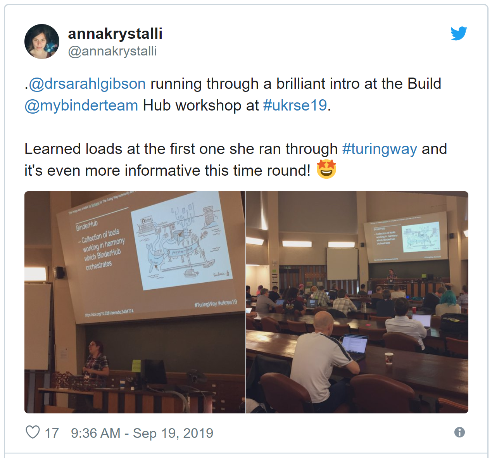

# Welcome Malvika, co-work with us at MozFest House, and check out our new #TuringWay impact story!

Hello Turing Way friends!

This month we had virtual coffees at **4 Online Collaboration Cafes** ([videos](https://www.youtube.com/channel/UCPDxZv5BMzAw0mPobCbMNuA), [more info](https://github.com/alan-turing-institute/the-turing-way/blob/main/project_management/online-collaboration-cafe.md)) ☕️ and discussed with you how you can contribute to this project.

_The Turing Way_ was highlighted in a [Turing impact story](https://www.turing.ac.uk/research/impact-stories/transforming-culture-data-science) authored by [Sean O'Neill](https://www.turing.ac.uk/people/business-team/sean-oneill) under the title **Transforming the culture of data science**.

Shout out to Sarah Gibson and Rachael Ainsworth who gave talks and ran a workshop/demo-sesson on _The Turing Way_ Project.
Thanks to Paula Andrea Martinez and Philip Durbin for engaging with the project from Australia and USA 🌎 🌏 🌍

Say hello to [Malvika Sharan](https://twitter.com/MalvikaSharan), who joined _The Turing Way_ team as a Community Manager (and is drafting this newsletter 😊).

We are excited to meet many of you in London at [MozFest 2019](https://www.mozillafestival.org/en/).

That's all from us before Halloween! 🎃 🍁

Find more details on these topics below 👇

## Community meetings

### Next Collaboration Cafes: online call series

We have three collaboration cafes this month!
The first was on 2 October at 15:00 BST and the next two are on 16 October at 19:00 BST ([your local time](https://arewemeetingyet.com/London/2019-10-16/19:00/TuringWay-CollaborationCafe)), and 30 October at 08:00 GMT ([your local time](https://arewemeetingyet.com/London/2019-10-30/08:00/TuringWay-CollaborationCafe)).

You can indicate your participation by signing up on this HackMD: [https://hackmd.io/@KirstieJane/CollabCafe](https://hackmd.io/@KirstieJane/CollabCafe), or come and say hello in our Gitter channel: [https://gitter.im/alan-turing-institute/the-turing-way](https://gitter.im/alan-turing-institute/the-turing-way).
We would love to have you on these calls to continue working together on different GitHub issues or help you get started if you are new to the project.

### MozFest 2019

Several community members of _The Turing Way_ will be attending [Mozilla Festival 2019](https://www.mozillafestival.org) in London from 21 to 27 October.

Kirstie and Malvika will be co-working at MozFest House on **Thursday 24 October** from 10am to 4pm.
If you are in town we would love to see you there for any amount of time!
To let the festival team plan appropriately, please sign up for the [Co-Working Space @ Mozfest House](https://www.mozillafestival.org/en/house/thursday/) (scroll to almost the end of the list of events to find that option, click and then grab a free ticket for Thursday) and then come along and say hello!

We look forward to seeing you in person!

## News from the community

*The Turing Way illustration published in the impact story, art by Scriberia, available under CC-BY licence (doi: [10.5281/zenodo.3332807](https://doi.org/10.5281/zenodo.3332807)).*

### Update on the last Collaboration Cafes

Ever since their launch in September 2019, total 4 online Collaboration Cafes have already taken place 🎉

Thanks to all our attendees for coming along and joining us to learn more about these calls, tips on community management, GitHub tricks and the project itself. Read all about this online call series on [this page](https://github.com/alan-turing-institute/the-turing-way/blob/main/project_management/online-collaboration-cafe.md) and watch the recording from previous calls on our [YouTube channel](https://www.youtube.com/channel/UCPDxZv5BMzAw0mPobCbMNuA).

Get in touch with us, if you would like to join a call in the future and if our [current schedule](https://github.com/alan-turing-institute/the-turing-way/blob/main/project_management/online-collaboration-cafe.md#attending-an-online-collaboration-cafe) is not compatible with your time zone.
Thanks to [Paula Andrea Martinez](https://github.com/orchid00), National Characterisation Training Coordinator at the Australian National Imaging Facility, we've already added an "Australia-friendly" slot on 30 October 💖

We are still developing the format (see the [template](https://github.com/alan-turing-institute/the-turing-way/blob/main/communications/collaboration-cafe/collaboration-cafe-template.md)) and will be happy to get your feedback to make these sessions useful for you.
There's a GitHub issue [#711](https://github.com/alan-turing-institute/the-turing-way/issues/711) open for your comments and ideas.
Thank you in advance!

## Relevant resources

### _The Turing Way_ Impact Story

_The Turing Way_ project was highlighted among [The Turing Impact Stories](https://www.turing.ac.uk/research/impact-stories) this month.
Under the title [Transforming the culture of data science](https://www.turing.ac.uk/research/impact-stories/transforming-culture-data-science), [Sean O'Neill](https://www.turing.ac.uk/people/business-team/sean-oneill) highlighted its role in representing the institute’s commitment to changing data science for the better.
Several community members including the project lead [Kirstie Whitaker](https://www.turing.ac.uk/people/researchers/kirstie-whitaker) shared their journey and impact related to this project.
You can read the main points in this 1-page short [PDF summary](https://www.turing.ac.uk/sites/default/files/2019-10/impact_story_-_transforming_the_culture_of_data_science.pdf).

> "The moonshot goal of the project is to make reproducible research too easy not to do."

Please share it with people who might be interested in joining our community and contributing to the project 💝

## Tips & Tricks for new contributors

Are you new to this project and want to participate in the community?
You can start by reading the [contribution guidelines](https://github.com/alan-turing-institute/the-turing-way/blob/main/CONTRIBUTING.md), where you can get an overview of the project and the different communication channels you can use to participate.

See [this page](https://github.com/alan-turing-institute/the-turing-way#contributors) to find out who is in the community and check out this list of [good first issues](https://github.com/alan-turing-institute/the-turing-way/labels/good%20first%20issue) to get to know this project well.

## Acknowledgements and celebrations!

Shout out to two of our members [Sarah Gibson](https://twitter.com/drsarahlgibson) and [Rachael Ainsworth](https://twitter.com/rachaelevelyn), who represented _The Turing Way_ at two separate conferences in September.

*-- Anna Krystalli (@annakrystalli) [September 19, 2019](https://twitter.com/annakrystalli/status/1174603229679763457?ref_src=twsrc%5Etfw)*

Sarah, Research Data Scientist at The Alan Turing Institute, delivered a successful workshop on building a [BinderHub](https://binderhub.readthedocs.io/en/latest/) and _The Turing Way_ at the [RSEconUK 2019](https://rse.ac.uk/conf2019/).
She shared her training materials in the [GitHub repository](https://github.com/alan-turing-institute/the-turing-way/blob/main/workshops/build-a-binderhub/workshop-presentations/zero-to-binderhub.md) and online via Zenodo (DOI: [10.5281/zenodo.3382208](https://doi.org/10.5281/zenodo.3382208)).

Rachael, Community Manager of Software Sustainability Institute, attended the Open Science Fair 2019 in Porto, Portugal, last month, where she presented a poster (DOI: [10.5281/zenodo.3381445](https://doi.org/10.5281/zenodo.3381445)) and a [demo session](https://www.opensciencefair.eu/demos-2019/the-turing-way-a-handbook-for-reproducible-data-science) (DOI: [10.5281/zenodo.3403160](https://doi.org/10.5281/zenodo.3403160)) on _The Turing Way_ project.
Her demo session was also featured by The ORION Open Science Podcast in the episode [The FAIR is in Town: figshare, The Turing Way, and Open Science Quest at the OSFAIR2019](https://orionopenscience.podbean.com/e/the-fair-is-in-town-figshare-the-turing-way-and-open-science-quest-at-the-osfair2019/)! 🎉

*-- Rachael Ainsworth (@rachaelevelyn) [September 16, 2019](https://twitter.com/rachaelevelyn/status/1173625329686110208?ref_src=twsrc%5Etfw)*

## Connect with us!

- [About the project](https://www.turing.ac.uk/research/research-projects/turing-way-handbook-reproducible-data-science)
- [_The Turing Way_ book](https://book.the-turing-way.org)
- [GitHub repository](https://github.com/alan-turing-institute/the-turing-way)
- [Gitter chat room](https://gitter.im/alan-turing-institute/the-turing-way)
- [YouTube Videos](https://www.youtube.com/channel/UCPDxZv5BMzAw0mPobCbMNuA)
- Twitter Hashtag [#TuringWay](https://twitter.com/hashtag/TuringWay?f=live)

You are welcome to contribute contents for the next newsletter by
emailing [Malvika Sharan](mailto:msharan@turing.ac.uk).

*Did you miss the last newsletters?*
*Check them out [here](https://tinyletter.com/TuringWay/archive).*
