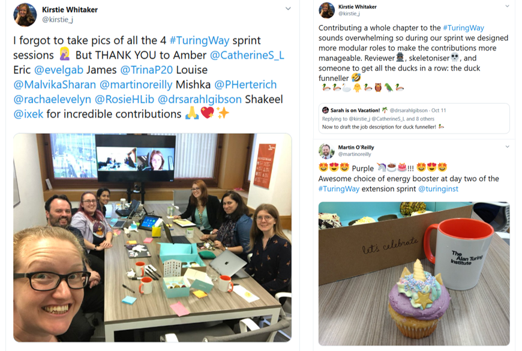
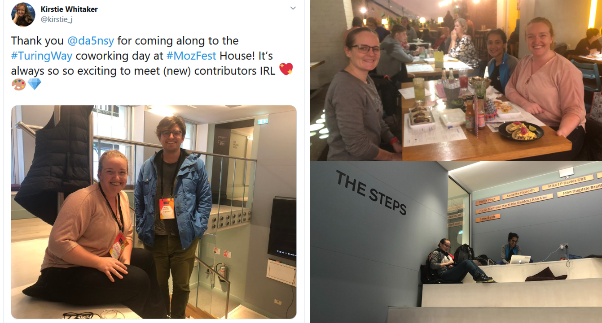
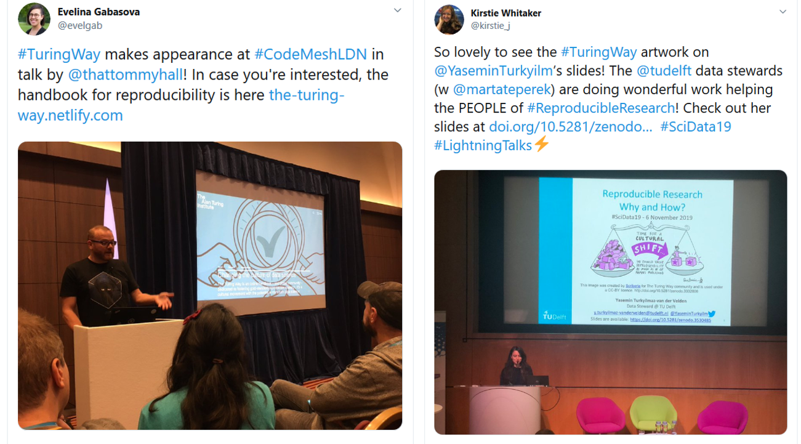

# *The Turing Way* project is expanding to a multi-volume book series!

Hello Turing Way friends!

We are excited to announce that we are expanding *The Turing Way* project to a build a series of online books: "A How To Guide to Data Science".
In addition to reproducibility, this book series will explore topics such as project design, communication, outreach, ethics and other best practices in data science 📚📚

Shout out to all the contributors and community members who engaged with us in last month, joined us at the MozFest, presented a talk about this project, shared or reused *The Turing Way* resources, and acknowledged the project in their work 🙌

If you haven’t yet had a chance to say hello to us, join us at our next collaboration cafe on 20 November 2019 (sign up at [this HackMD](https://hackmd.io/@KirstieJane/CollabCafe)) or connect with us on our [Gitter Channel](https://gitter.im/alan-turing-institute/the-turing-way) 👋

Find details on these topics and more news from the community below 👇

## Community meetings

### Collaboration Cafes

The next Collaboration Cafes will be held on **20 November** at 19:00 GMT (or [your local time](https://arewemeetingyet.com/London/2019-11-20/19:00/TuringWay-CollaborationCafe)).
Two more cafes have been scheduled for this year on **4 December** at 15:00 GMT (or [your local time](https://arewemeetingyet.com/London/2019-12-04/15:00/TuringWay-CollaborationCafe)), and **18 December** at 19:00 GMT (or [your local time](https://arewemeetingyet.com/London/2019-11-20/19:00/TuringWay-CollaborationCafe)).

If you need help remembering these dates and times, we have made a google calendar that you can add to your calendar or just go and check regularly at [http://bit.ly/TuringWayCalendar](http://bit.ly/TuringWayCalendar).

Sign up for the next Collaboration Cafe at [this HackMD](https://hackmd.io/@KirstieJane/CollabCafe) ☕️

### Save the date: Turing Way Book Dash in February 2019

The next Book Dash will take place on **Friday 21 February** (with dinner, lightning talks and networking the evening before) at the Turing Institute in London 📆.
A Book Dash is an in-person collaborative event that brings together participants who are enthusiastic about data science and reproducibility and want to contribute to the improvement of *The Turing Way* book.
We will share more information regarding the applications in December, but meanwhile, please check the reports from the [Manchester book dash](https://github.com/alan-turing-institute/the-turing-way/blob/master/workshops/book-dash/book-dash-mcr-report.md) and [London book dash](https://github.com/alan-turing-institute/the-turing-way/blob/master/workshops/book-dash/book-dash-ldn-report.md), summarising the participants' contributions during the event and their feedback.

## News from the community

### Turing Way is Expanding!

We are excited to announce that *The Turing Way* is expanding into [a series of books](https://github.com/alan-turing-institute/the-turing-way).
In addition to its previous focus on reproducibility, this project will aim to capture the vast amounts of knowledge of data science practices in the areas of project design, communication, outreach and ethics.
Following an open source, community driven approach, we will welcome contributions from anyone from within the Turing community and beyond  who can support researchers and practitioners in learning or improving the "how" of conducting world-leading research in data science.
The project proposal with further details is available [online](https://github.com/alan-turing-institute/the-turing-way/blob/master/project_management/tps-funding-application-20190429.md).

To plan the next steps, the core team met last month on 10 and 11 October to brainstorm and discuss the next steps in this project.
The participants of this meeting explored a number of topics in four themed sessions, draft report from which is available on [this HackMD](https://hackmd.io/zVTeKhG2SIiBLam1YtILNg?view).

*Tweets ([1](https://twitter.com/kirstie_j/status/1182740191884271616?s=20), [2](https://twitter.com/kirstie_j/status/1182743485922889728?s=20) & [3](https://twitter.com/martinoreilly/status/1182602159990460418?s=20)) from the Turing Way expansion sprint by Kirstie Whitaker ([@kirstie_j](https://twitter.com/kirstie_j)) and Martin O'Reilly ([@martinoreilly](https://twitter.com/martinoreilly)), October 11, 2019*

## Relevant resources

### Open Life Science Mentoring Program | Deadline Dec 8

We are delighted to collaborate with the [Open Life Science Program](https://openlifesci.org) organised by Bérénice Batut, Yo Yehudi and Malvika Sharan as one of the [Mozilla Open Leader X projects](https://foundation.mozilla.org/en/opportunity/mozilla-open-leaders/).
They are developing this mentoring program for mentoring and training early-stage researchers and potential academic leaders who want to become ambassadors for Life Science in their communities.
The applications can be submitted via [EasyChair](https://easychair.org/cfp/ols-2020) until **December 8**.
Reach out to the core team by emailing [hello@openlifesci.org](mailto:hello@openlifesci.org) or connect with them on Twitter [@openlifesci](https://twitter.com/openlifesci).

## Tips & Tricks for new members

### How to best cite Turing Way?

Like our community members, Paola ([GitHub pull request](https://github.com/alan-turing-institute/the-turing-way/issues/648)) and Heidi ([Tweet](https://twitter.com/HeidiBaya/status/1189116056641658880)), have you also wondered how to cite _The Turing Way_?
It is a fair question to ask when referring to an online Open Source project that undergoes several updates in the same week or sometimes on the same day 📝

All versions of this book (available under the [cc-by license]((http://creativecommons.org/licenses/by/4.0/legalcode))) can be cited using DOI [10.5281/zenodo.3233853](https://doi.org/10.5281/zenodo.3233853).
This digital object identifier represents all versions, and will always resolve to the latest one.
Different versions can be found on [Zenodo](https://zenodo.org) and can be individually cited.

The team is behind with releasing some of the versions!
However, if you have attended a book sprint or have written chapters, your name will appear in that author list soon ✊

## Acknowledgements and celebrations

Kirstie Whitaker presented the project at the Open Science Community Nijmegen on 9 October 2019 (slides doi: [10.5281/zenodo.3478386](https://doi.org/10.5281/zenodo.3478386)), at NESTA Hack STIR event on 22 October 2019 (doi: [10.5281/zenodo.3515936](https://doi.org/10.5281/zenodo.3515936)), and she shared the vision of the extended book series at PyData Cambridge on 16 November 2019 (doi: [10.5281/zenodo.3543478](https://doi.org/10.5281/zenodo.3543478)).

Thanks to several of you for joining Kirstie Whitaker, Yo Yehudi, and Malvika Sharan at the [MozFest House](https://ti.to/Mozilla/mozfesthouse-whyspace/en) to discuss and work on *The Turing Way* specific ideas, and discussing the project with us at the [MozFest 2019](https://www.mozillafestival.org/en/). 🎉

*-- Kirstie Whitaker (@kirstie_j) [October 24, 2019](https://twitter.com/kirstie_j/status/1187388883379589120?s=20)*

Congratulations to our friends in the [JupyterHub](https://jupyter.org/hub) and [Binder](https://mybinder.org/) communities who have recieved funding from the [Chan Zuckerberg Initiative](https://chanzuckerberg.com/) to continue their fantastic work building [Essential Open Source Software for Science](https://medium.com/@cziscience/essential-open-source-software-for-science-72faec2c38c1)!
[Georgiana Dolocan](https://twitter.com/GeorgianaElenaD), who joined the Jupyter community as an [Outreachy](https://www.outreachy.org/)  intern [last year](https://blog.jupyter.org/outreachy-jupyter-supporting-diversity-in-open-communities-dfa78db4b0bd), will be the first "JupyterHub Contributor in Residence" at the [Berkeley Institute for Data Science](https://bids.berkeley.edu/) in Calfornia 🎉🙌🎊

### Features and Shoutouts

A nature article, [Make code accessible with these cloud services](https://www.nature.com/articles/d41586-019-03366-x), by Jeffrey Perkel acknowledged contributions of Turing Way team members, Sarah Gibson and Kirstie Whitaker's contributions to the [BinderHub](https://binderhub.readthedocs.io/en/latest/) project.

Oxford e-Research centre published an article [Transforming the culture of data science](https://www.oerc.ox.ac.uk/news/transforming-culture-data-science) based on the [impact story](https://www.turing.ac.uk/research/impact-stories/changing-culture-data-science), which highlighted the work and vision of this project.

The project got shoutouts at [FORCE2019](https://www.force11.org/meetings/force2019) (see this [Tweet by Patricia Hertereich](https://twitter.com/PHerterich/status/1184034991400861696)), at [Goodenough College](https://www.goodenough.ac.uk/) in a [talk by Kirstie](https://zenodo.org/record/3522225#.XcmklpNKjUI), at [SciData19](https://researchdata.springernature.com/users/256983-irene-rodriguez/posts/50480-better-science-through-better-data-2019-scidata19-call-for-lightning-talks-proposal) by Yasemin Turkyilmaz-van der Velden in her talk [Reproducible Research: Why and How?](https://zenodo.org/record/3530485#.XcmopZNKjUI), by Tommy Hall at [Code Mesh London](https://codesync.global/conferences/code-mesh-ldn/) (see this [tweet by Evelina Gabasova](https://twitter.com/evelgab/status/1192804318795182080)) and at [EMBL](http://embl.org) Inspirational Seminar Series in Heidelberg ([talk by Kirstie](https://zenodo.org/record/3532650#.XcmlAZNKjUI)).

*Thank you [Tommy Hall](https://twitter.com/thattommyhall) and [Yasemin Turkyilm](https://twitter.com/YaseminTurkyilm) for incorporating The Turing Way into your excellent talks! Tweets by Evelina Gabasova (@evelgab) [November 8, 2019](https://twitter.com/evelgab/status/1192804318795182080?s=20) and Kirstie Whitaker (@kirstie_j) [October 24, 2019](https://twitter.com/kirstie_j/status/1192088878234185728?s=20)*

## Connect with us!

- [About the project](https://www.turing.ac.uk/research/research-projects/turing-way-handbook-reproducible-data-science)
- [_The Turing Way_ book](https://the-turing-way.netlify.com)
- [GitHub repository](https://github.com/alan-turing-institute/the-turing-way)
- [Gitter chat room](https://gitter.im/alan-turing-institute/the-turing-way)
- [YouTube Videos](https://www.youtube.com/channel/UCPDxZv5BMzAw0mPobCbMNuA)
- Twitter Hashtag [#TuringWay](https://twitter.com/hashtag/TuringWay?f=live)

You are welcome to contribute content for the next newsletter by
emailing [Malvika Sharan](mailto:msharan@turing.ac.uk) or adding it to issue [#749](https://github.com/alan-turing-institute/the-turing-way/issues/749) at the project's GitHub repository.

*Did you miss the last newsletters?*
*Check them out [here](https://tinyletter.com/TuringWay/archive).*
