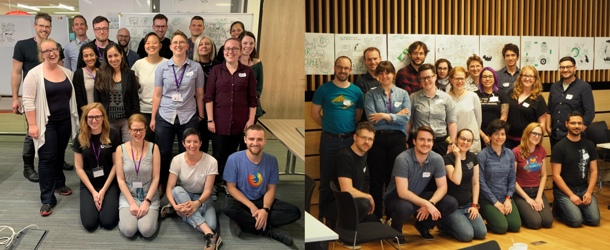
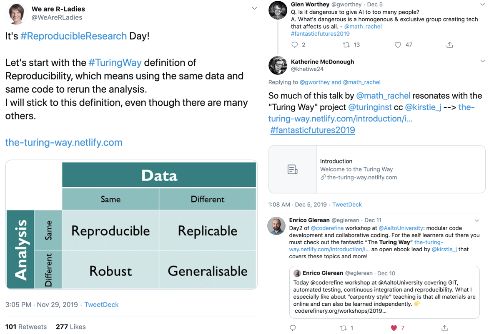

# One year of the Turing Way project and holiday wishes!

Hello Turing Way friends!

As we prepare to wrap up this year, join our holiday spectacular Collaboration Cafe on 18 December 2019 at 19:00 GMT, [sign up here](https://hackmd.io/sTZZwnYdS3umVWHHHLc6Mw?edit).

Save the date and send in your applications to participate at the for the first _Turing Way_ Book Dash 📚💨💨 of 2020, an in-person _The Turing Way_ collaboration event.
Here is the [application form](https://forms.gle/ayYz87UqNoxzJNpn6).

Can you represent the project in the new year?
Shout out to Kirstie Whitaker, Sarah Gibson, Rachael Ainsworth and Louise Bowler for representing _The Turing Way_ in the last month at PyData Cambridge, the Open Life Science mentoring program, Glasgow Women in Computing Science, and The Alan Turing Institute.

It was an eventful year for _The Turing Way_ project and its community.
We thank everyone for their contributions and highlight a few important milestones in this project.

Detailed posts on these topics are provided below 👇

Warm wishes for the holidays and new year!

## Community meetings

### Collaboration cafe

The next Collaboration Cafe will take place on 18 December 2019 at 19:00 UK time ([your local time](https://arewemeetingyet.com/London/2019-12-18/19:00/TuringWay-CollaborationCafe)).
More details are available on [this HackMD](https://hackmd.io/sTZZwnYdS3umVWHHHLc6Mw?edit).

This is an excellent opportunity to get to know the project, review currently open GitHub issues, contribute to one of its chapters or include your own work in the book.
You can sign up [here](https://hackmd.io/sTZZwnYdS3umVWHHHLc6Mw?edit) to connect with others over a virtual glass of eggnog and add this event to your calendar by clicking [here](https://calendar.google.com/event?action=TEMPLATE&tmeid=MDE4ZDdmZm9nMHFpNWVmbDlsMzhjcm5ybjggdGhldHVyaW5nd2F5QG0&tmsrc=theturingway%40gmail.com).

### The Turing Way Book dash: Applications Open!

We are accepting applications for the next _Turing Way_ Book Dash 📚💨💨 which will be held on **Friday 22 February** at the Turing Institute in London.

***Please send your book dash application by filling this [online form](https://forms.gle/ayYz87UqNoxzJNpn6).***

The main aim of this event is to facilitate in-person collaboration and content building of _The Turing Way_ book on topics related to data science, project design, reproducibility, ethics and how to collaborate.

You can read the reports from the events in [Manchester](https://github.com/alan-turing-institute/the-turing-way/blob/master/workshops/book-dash/book-dash-mcr-report.md) and [London](https://github.com/alan-turing-institute/the-turing-way/blob/master/workshops/book-dash/book-dash-ldn-report.md) in May 2019 for more information.

Deadlines for applications is **16 January 2019** [Anywhere on Earth](https://en.wikipedia.org/wiki/Anywhere_on_Earth).

**Please share this opportunity widely.**
These events are most successful when we bring together a diverse group of people.
(You could also suggest that they [sign up for this newsletter](https://tinyletter.com/TuringWay) too 😉)

If you have any questions we're very happy to answer them in the [collaboration cafes](https://github.com/alan-turing-institute/the-turing-way/blob/master/project_management/online-collaboration-cafe.md) on 18 December and 15 January, or in the _Turing Way_ [Gitter channel](https://gitter.im/alan-turing-institute/the-turing-way).

## News from the community

The last Collaboration Cafe ☕️ took place on 21 November 2019, which was joined by multiple people from across the globe making it a highly interactive and fun session.
[The lovely participants](https://twitter.com/kirstie_j/status/1197261780881477646) worked on restructuring some of the long chapters into manageable chunks & chatted about how cool [Jupyter Books](https://jupyterbook.org/intro.html) are!

[Sarah Gibson](https://twitter.com/drsarahlgibson) was interviewed by the [Open Life Science](https://openlifesci.org/) program, where she mentioned that _The Turing Way_ allowed her to learn about Open Science while practicing it.
You can read the [complete blog](https://openlifesci.org/posts/2019/11/25/expert-review) highlighting Sarah's contributions in reviewing the Open Life Science program.

[Rachael Ainsworth](https://twitter.com/rachaelevelyn) was invited by Glasgow Women in Computing Science, where she presented a talk on Open Science, research reproducibility and _The Turing Way_.
Read [this blog](https://software.ac.uk/blog/2019-11-29-open-science-university-glasgow) by [Frances Cooper](https://software.ac.uk/about/fellows/frances-cooper) to learn more about this event.

### Shout outs on Twitter

We love hearing on twitter how you're using material from _The Turing Way_!
This month we featured on the [We Are RLadies](https://twitter.com/WeAreRLadies) account and were recommended to attendees of the [Code Refinery](https://coderefinery.org/) workshop at Aalto University in Finland!

*Tweets ([1](https://twitter.com/WeAreRLadies/status/1200347578967232513?s=20), [2](https://twitter.com/khetiwe24/status/1202311272366141440?s=20) & [3](https://twitter.com/eglerean/status/1204631871591763970?s=20)) by Daniela Gawehns ([@dgawehns](https://twitter.com/dgawehns)) who was curating [@WeAreRLadies](https://twitter.com/WeAreRLadies), Katherine McDonough ([@khetiwe24](https://twitter.com/khetiwe24)) and Enrico Glerean ([@eglerean](https://twitter.com/eglerean)) in November and December 2019.*

See more tweets and share your experiences using the [#TuringWay](https://twitter.com/search?q=%23TuringWay) hashtag!

## Relevant resources

### ReproHacks

If you love reproducibility (and we know you do!) and you're from one of the [N8](https://www.n8research.org.uk) (the eight most intensive universities in the North of England) then you'll really enjoy taking part in one of the [N8 CIR ReproHacks](https://n8cir.org.uk/news/reprohacks) in 2020.

_Turing Way_ team member and Software Sustainability Institute fellow [Anna Krystalli](https://www.software.ac.uk/about/fellows/anna-krystalli) is running these one day hackathons in Newcastle ([21 January](https://n8cir.org.uk/events/reprohack-newcastle/)), Leeds ([14 February](https://n8cir.org.uk/events/reprohack-leeds/)), Liverpool ([25 February](https://n8cir.org.uk/events/reprohack-liverpool/)), Sheffield ([10 March](https://n8cir.org.uk/events/reprohack-sheffield/)) and Manchester ([12 March](https://n8cir.org.uk/events/reprohack-manchester/))!!

You can read more about these events to reproduce published papers [on the SSI blog](https://www.software.ac.uk/blog/2019-08-07-reprohacking-carpentryconnect-manchester-2019) and submit a suggestion of a paper to reproduce at [https://sheffield-university.shinyapps.io/n8cir-reprohacks](https://sheffield-university.shinyapps.io/n8cir-reprohacks/).

### Collaborations Workshop

Registration for the Software Sustainability Institute's [Collaborations Workshop](https://www.software.ac.uk/cw20) is now open!
This event brings together researchers, developers, innovators, managers, funders, publishers, leaders and educators to explore best practices and the future of research software.

The themes are Open Research, Data Privacy and Software Sustainability.
[Dr Andrew Stewart](https://www.software.ac.uk/news/dr-andrew-stewart-open-collaborations-workshop-2020-keynote-open-research) will open the event with a keynote on Open Research.
Stay tuned to the [agenda](https://software.ac.uk/cw20/agenda) for more updates as they come in.

Collaborations Workshop 2020 (CW20) takes place from Tuesday 31 March to Wednesday 1 April 2020 at Queen's University, Belfast.
The CW20 Hack Day takes place on the evening of Wednesday 1 of April to end of the working day Thursday 2 of April at Ulster University, Belfast.

This will be a great opportunity to connect with lots of Turing Way community members!
We hope to see you there 😸

## Acknowledgements and celebrations

### What an incredible year

In this last newsletter of the year 2019, we want to express our gratitude towards all our community members for their involvements in _The Turing Way_ project through various channels.

As we celebrate the completion of this project's first year, we want to highlight a few important events that have occurred over the last 12 months.

[The Turing Way project](https://github.com/alan-turing-institute/the-turing-way) was launched in January 2019 to support students, their supervisors, funders and journal editors in ensuring that reproducible data science is "too easy not to do".

Within one month of its launch, three chapters were added in the handbook, contributing guidelines were collaboratively developed and the [first newsletter](https://tinyletter.com/TuringWay/letters/the-turing-way-february-update) was published.

In the next few months, three workshops were successfully conducted on reproducibility with Binder and BinderHub, and the [_The Turing Way_ handbook](https://software.ac.uk/blog/2019-02-21-inspiring-demos-are-waiting-you-collaborations-workshop-2019) was launched and demo-ed at the [Software Sustainability Institute's Collaborations Workshop](https://www.software.ac.uk/cw19) in Loughborough.

Two book-dash events were organised in [Manchester on 16-17 May](https://github.com/alan-turing-institute/the-turing-way/blob/master/workshops/book-dash/book-dash-mcr-report.md) and [London on 27-28 May](https://github.com/alan-turing-institute/the-turing-way/blob/master/workshops/book-dash/book-dash-ldn-report.md), which were attended by 26 new members who came together to exchange their skills with others through the project by reviewing existing chapters and creating new chapters.

[Collaboration Cafes](https://github.com/alan-turing-institute/the-turing-way/blob/master/project_management/online-collaboration-cafe.md), an online meeting series, started in September, with a goal of facilitating contributions from around the world.
You can see recordings of the Collaboration Cafes at the _Turing Way_'s [YouTube channel](https://www.youtube.com/channel/UCPDxZv5BMzAw0mPobCbMNuA).
The last one this year will take place on 18 December 2019 at 19:00 UK time.

_The Turing Way_ was highlighted in a [Turing impact story](https://www.turing.ac.uk/research/impact-stories/transforming-culture-data-science) under the title "Transforming the culture of data science".

An additional funding was granted for [expanding this project into a multi-book series](https://github.com/alan-turing-institute/the-turing-way) that, in addition to reproducibility, include project design, communication, outreach, ethics and other best practices in data science.
Malvika joined the core team as a community manager, who will work closely with Kirstie to enable the planned expansion of this project.

A [book-expansion meeting](https://hackmd.io/zVTeKhG2SIiBLam1YtILNg?view) was held in October with the core members and contributors who discussed the immediate and long term plans for the project.

_The Turing Way_ was highlighted in multiple resources, presented by its core members in several conferences, mentioned in others' talks in different occasions and the members from other communities of practice contributed to enhancing the content of the handbook.

## Thank you

As we approach the end of this eventful year for _The Turing Way_, we thank you for joining this community, developing and improving contents with us, reaching out with your valuable feedback, discussing your ideas and engaging with the project positively.

We wish you a warm end of the year and happy new year!

Kirstie, Malvika and all the team x

## Connect with us!

- [About the project](https://www.turing.ac.uk/research/research-projects/turing-way-handbook-reproducible-data-science)
- [_The Turing Way_ book](https://the-turing-way.netlify.com)
- [GitHub repository](https://github.com/alan-turing-institute/the-turing-way)
- [Gitter chat room](https://gitter.im/alan-turing-institute/the-turing-way)
- [YouTube Videos](https://www.youtube.com/channel/UCPDxZv5BMzAw0mPobCbMNuA)
- Twitter Hashtag [#TuringWay](https://twitter.com/hashtag/TuringWay?f=live)

You are welcome to contribute content for the next newsletter by
emailing [Malvika Sharan](mailto:msharan@turing.ac.uk).

*Did you miss the last newsletters?*
*Check them out [here](https://tinyletter.com/TuringWay/archive).*
