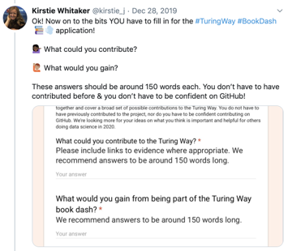
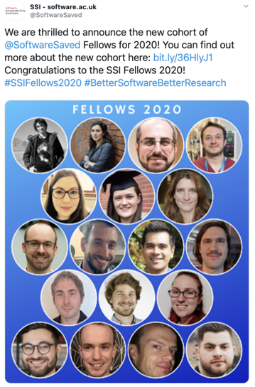
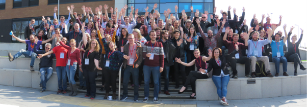
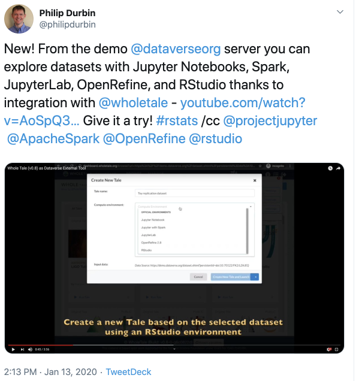

# New year wishes, and deadline reminder for Book Dash (16 Jan)!

Hello Turing Way friends!

Warm wishes for the year 2020!

We start this year by congratulating SSI fellows of 2020, including our core contributors Sarah Gibson and Jez Cope! 🎉

Our first Collaboration Cafe is on 15 January 2020 at 19:00 GMT ([add this to your calendar](https://calendar.google.com/event?action=TEMPLATE&tmeid=XzZjc2o4cDlvNmNxamlvcjZja29qOGNqMTYwczZhY2I0YzVpM2djaGljb3BtNGRiMzY5aDAgdGhldHVyaW5nd2F5QG0&tmsrc=theturingway%40gmail.com)).
Join us to discuss how you are planning to get involved in the community and engage with the project this year.
Sign up on [this HackMD](https://hackmd.io/@KirstieJane/CollabCafe) 📆

_The Turing Way_ Book Dash 📚 💨 application deadline is **16 January 2020**.
Fill [this short form](https://forms.gle/ayYz87UqNoxzJNpn6) to send your application and join us in London at this short hackathon-like event 📢

There are many relevant workshops taking place this month, including two workshops in Cambridge on reproducibility using Binder.
Find the details below and register soon!

We thank you for your participation and feedback in 2019, which made it a productive year for the project (read our last newsletter [here](https://tinyletter.com/TuringWay/archive)).
We look forward to welcoming your ideas and supporting your contributions to the community moving forward 💞💞

Get in touch with us through various channels listed below this newsletter, and find more details on other topics below 👇

## Community meetings

### The Turing Way Collaboration Cafe

Join us at the next Collaboration Cafe this week on 15 January 2020, 19:00 GMT ([see your local time](https://arewemeetingyet.com/London/2020-01-15/19:00/TuringWay-CollaborationCafe)).
Find more details on [this HackMD](https://hackmd.io/@KirstieJane/CollabCafe).
At this first online community meeting of the new year, we would like to facilitate an online workspace for _The Turing Way_ project while getting to know our community members and discussing ways to support their participation and contributions in 2020.
If you are not sure what to expect from this meeting, check out a few videos recorded in the previous collaboration cafe events on [our YouTube channel](https://www.youtube.com/channel/UCPDxZv5BMzAw0mPobCbMNuA).

### Open call for the February 2020 Turing Way Book Dash

The deadline is **16 January 2020** [Anywhere on Earth](https://en.wikipedia.org/wiki/Anywhere_on_Earth) to send your application for the first Book Dash 📚💨 of 2020, which is taking place on 20 and 21 February.
Fill this [short online form](https://forms.gle/ayYz87UqNoxzJNpn6).
You might find this [step by step guide](https://twitter.com/kirstie_j/status/1210934696248586241) that Kirstie wrote on twitter helpful!

A _Turing Way_ Book Dash is an in-person collaborative event where you will work with others to add to and improve [_The Turing Way_](https://github.com/alan-turing-institute/the-turing-way) book.

The event will start on the afternoon of 20 February 2020 with an introduction to the project, which will be followed by an official dinner.
The complete day of 21 February 2020 will be dedicated to the project content development.
Your contributions may include, but are not limited to: science communication - skills in writing, editing and/or exciting interactive communications, great examples and case studies of reproducible research, writing new chapters, editing the current chapters and updating how the book looks online (CSS, logos, layout etc).

### Looking for helpers for the Book Dash

If you've already attended a _Turing Way_ Book Dash 📚💨 or Binder workshop events then you're elgible to apply to join us as one of our helpers.
Your role will be to support contributors and help them brainstorm how they can share their expertise with the community.

Please contact [theturingway@gmail.com](mailto:theturingway@gmail.com) if you are available and able to join the _Turing Way_ team for these events.
**Funding is available to support travel, accomodation and childcare requirements.**
Please include a few sentences about why you're interested and able to help participants get the most out of the two days.

We will review emails on Wednesday 22 January and reply with our selection (in the case of having more than 2 people offer their support) on Monday 27 January.

## News from the community

### Looking for helpers to deliver Binder workshop

[The British Antarctic Survey](https://www.bas.ac.uk/) is hosting a half-day [Boost Your Research Reproducibility with Binder](https://github.com/alan-turing-institute/the-turing-way/tree/main/workshops/boost-research-reproducibility-binder) workshop **in Cambridge on 31 January** from 13:30 to 17:00.
At this workshop, the trainers will discuss reproducible computing environments, with examples of others' projects in [myBinder.org](https://mybinder.org) to help you learn how to prepare a binder-ready project.
At the end of the workshop, you will be able to take some of your own content (in R, Jupyter notebook, or scripts that can be run in the terminal) and prepare it so that it can be used by others on [myBinder.org](https://mybinder.org).

Registrations are currently limited to British Antarctic Survey team members, but _The Turing Way_ team are **looking for two helpers** to support Kirstie Whitaker in delivering the workshop.
Please contact [theturingway@gmail.com](mailto:theturingway@gmail.com) if you are available and able to join the _Turing Way_ team.
Please include a few sentences about why you're interested and able to help participants learn how to use myBinder.
**Funding is available to support day return travel for the workshop.**

We will review emails on Monday 20 January and reply with our selection (in the case of having more than 2 people offer their support) on Tuesday 21 January.

### Binder workshop hosted by PyData Cambridge

Another [Boost Your Research Reproducibility with Binder](https://github.com/alan-turing-institute/the-turing-way/tree/main/workshops/boost-research-reproducibility-binder) workshop will be hosted by the Raspberry Pi Foundation in Cambridge on **29 January** at 19:00.
Sarah Gibson will be leading participants through the [Zero to Binder](https://github.com/alan-turing-institute/the-turing-way/blob/main/workshops/boost-research-reproducibility-binder/workshop-presentations/zero-to-binder.md) code along demonstration.

Everyone is welcome to attend.
You can sign up and find more details about the event at [https://www.meetup.com/PyData-Cambridge-Meetup/events/267902974](https://www.meetup.com/PyData-Cambridge-Meetup/events/267902974).

## Tips & Tricks for new contributors

Have you ever wondered what are the pathways to contribute to _The Turing Way_ project and how getting involved in the community can benefit you?
You can find that out by reading [impact statements](https://github.com/alan-turing-institute/the-turing-way/tree/main/project_management/impact_statements) from our active contributors.
[Patricia](https://github.com/alan-turing-institute/the-turing-way/blob/main/project_management/impact_statements/patricia_herterich.md), the Research Data Specialist at Digital Curation Centre, states that *contributing to the Turing Way helped her identify which activities she wants to focus on in her career going forward*.
[Rachael](https://github.com/alan-turing-institute/the-turing-way/blob/main/project_management/impact_statements/rachael-ainsworth.md), the Research Software Community Manager at SSI, states that *being a core member empowered her to pursue a community management position in the domain of open research*.

Do you have your _The Turing Way_ stories and experiences to share?
Contact us ([by email](mailto:theturingway@gmail.com) or at [this issue](https://github.com/alan-turing-institute/the-turing-way/issues/790)) to learn how you can add them on our GitHub repository.

## Acknowledgements and celebrations

### Congratulations Software Sustainability Institute's (SSI) Fellows 2020

SSI fellowships are awarded every year to open science advocates for supporting their effort as ambassadors in their respective fields.

*[Tweet](https://twitter.com/SoftwareSaved/status/1215572740381372416?s=20) from the official Twitter page of SSI with pictures of all the new fellows.*

This year, among [18 SSI fellowship](https://software.ac.uk/about/fellows?_ga=2.125569866.1329264381.1579011146-1585188985.1568709796) recipients are several of our valuable contributors.
This fantastic set of fellows include two of our core contributors, Sarah Gibson and Jez Cope.

Sarah aims to [build a welcoming community of reproducible research](https://software.ac.uk/about/fellows/sarah-gibson) by encouraging contributions, promoting diversity and transparency, and fostering collaborations.
Jez is interested in developing [infrastructure and practices to archive and preserve research data and software for the future](https://software.ac.uk/about/fellows/jez-cope).

Three more fellows, [Alex Clarke](https://software.ac.uk/about/fellows/alex-clarke), [Will Hulme](https://software.ac.uk/about/fellows/will-hulme) and [Tarek Allam](https://software.ac.uk/about/fellows/tarek-allam), are contributors to _The Turing Way_ through their participation at the Book Dash 📚💨 events in 2019.

We are really thrilled to have their works and efforts recognized by this prestigious fellowship. More details can be read in [this blog post](https://software.ac.uk/blog/2020-01-10-announcing-2020-software-sustainability-institute-fellows).

### Shout-outs on Twitter

We love to hear on Twitter how you and your colleagues have been using _The Turing Way_ resources.
Here are a few tweets from our community members from last month, mentioning the hashtag [#TuringWay](https://twitter.com/hashtag/TuringWay?f=live).

*Tweets [1](https://twitter.com/PHerterich/status/1206966606397628416?s=20) by Patricia Hertreich, [2](https://twitter.com/MalvikaSharan/status/1201926068812206080?s=20) by Malvika Sharan, [3a](https://twitter.com/cassgvp/status/1215200442713624577?s=20) by Cassandra Gould van Praag, [3b](https://twitter.com/KirchnerHausler/status/1215211479038939136?s=20) by Alexander Kirchner-Hausler and [4](https://twitter.com/HeidiBaya/status/1214486610676506624?s=20) by Heidi Seibold, in December 2019 and January 2020, described below.*

1. _The Turing Way_ illustrations by [Scriberia](http://www.scriberia.co.uk/scribing-sketchnotes) were included in [Nadia Soliman](https://twitter.com/Nadia_Soliman_)'s [OASPA](https://twitter.com/OASPA) talk as [mentioned in this tweet](https://twitter.com/PHerterich/status/1206966606397628416?s=20) by Patricia Hertreich.

2. The project was [introduced](https://twitter.com/MalvikaSharan/status/1201926068812206080?s=20) by Malvika Sharan at a community-based unconference during an [EMBO course at National Center for Biological Science in India](http://meetings.embo.org/event/19-protein-protein).

3. Kirstie discussed it in the context of Data Science in her talk at [Advanced Methods for Reproducible Science 2020](https://www.bristol.ac.uk/psychology/research/ukrn/ukrnevents/repro2020/), which was mentioned in a [tweet by Cassandra](https://twitter.com/cassgvp/status/1215200442713624577?s=20) and a [tweet by Alexander Kirchner-Hausler](https://twitter.com/KirchnerHausler/status/1215211479038939136?s=20).

4. The project's content derived from Florian Markowetz's paper, [Five selfish reasons to work reproducibly (2015)](https://genomebiology.biomedcentral.com/articles/10.1186/s13059-015-0850-7), was cited by Heidi Seibold in [this tweet](https://twitter.com/HeidiBaya/status/1214486610676506624?s=20) which discussing reproducible research.

## Relevant Resources

### Panel Discussion on sharing research software in London

This evening panel discussion on **5 February** at 18:00, hosted by [Open Research London](https://twitter.com/openresldn) and [Research Software London](https://rslondon.ac.uk), will explore the importance and challenges of effective and sustainable sharing of research software.

The discussion will be chaired by _Turing Way_ community member, and Director of Research Engineering at the Alan Turing Institute, Martin O'Reilly.
He'll be joined by _Turing Way_ community members Rachael Ainsworth (Software Sustainability Institute) and Stephen Eglen (University of Cambridge), and head of product innovation at SAGE Publishing, with a few more speakers to be announced.

Everyone is welcome to attend.
You can sign up and find more details about the event at [https://www.eventbrite.co.uk/e/the-importance-and-challenges-of-sharing-research-software-tickets-85224955135](https://www.eventbrite.co.uk/e/the-importance-and-challenges-of-sharing-research-software-tickets-85224955135).

### The Software Sustainability Institute's Collaborations Workshop 2020 (CW20)

The Software Sustainability Institute’s [Collaborations Workshop 2020 (CW20)](http://bit.ly/ssi-cw20) will take place from 31 March to 2 April 2020 at [Queen's University Belfast](http://qub.ac.uk/), Northern Ireland and registration is now open on [Eventbrite](https://www.eventbrite.co.uk/e/collaborations-workshop-2020-cw20-collabw20-tickets-72375437883?aff=TuringWay)!
This workshop brings together researchers, developers, innovators, managers, funders, publishers, leaders and educators to explore best practices and the future of research software. The themes of the keynote presentations, demos, discussion groups, panel sessions and more at CW20 are: Open Research, Data Privacy and Software Sustainability.
The [call for proposals for mini-workshop and demo sessions](https://www.software.ac.uk/news/call-proposals-mini-workshops-and-demo-sessions-collaborations-workshop-2020) is open until 31 January, and these sessions are unique opportunities for CW20 participants and sponsors to share a particular software product, approach, standard, or other idea relating to the workshop themes, research software and pitches for the Hackday.

### Librarians building momentum for reproducibility logistics program

Registration is open for a virtual half-day conference for librarians who are working in, or want to learn more about, supporting research reproducibility.
This event will take place on **January 28** at 9:00-3:00pm PST, 12:00-6:00pm EST. They are are running this conference completely online, through the videoconferencing tool Zoom.
You are free to participate in the conference from wherever you can connect to the Internet!
Check details on [their official website](https://vickysteeves.gitlab.io/librarians-reproducibility/).

### The Whole Tale open source platform for reproducible research

The [Whole Tale project](https://wholetale.org/)  is an NSF-funded initiative building a scalable, open source platform for reproducible research.
Whole Tale supports the creation, publication, and execution of _tales_ -- executable research artifacts that capture, data, code and the complete software environment required to reproduce computational results.
They along with Harvard Dataverse team have set up a platform to demonstrate _tales_ using the Whole Tale platform as a dataset-level external tool on the demo instance at [https://demo.dataverse.org](https://demo.dataverse.org).

Check out examples for two different use cases: 1) [Whole Tale as Dataverse External Tool](https://youtu.be/AoSpQ3A7poY), demonstrating how Whole Tale can be used to launch an RStudio (or other) environment for exploration of "replication datasets" that contain code.
2) [Registering data for analysis in Whole Tale](https://youtu.be/oWEcFpEUmrU), demonstrating how source datasets can be registered in Whole Tale for analysis using RStudio with automatic citation.
A [short document](https://docs.google.com/document/d/1ln4wUTsBZ1mP9qUGGwfkM6p8bpmPSBRAvAWOkz2U_L) further describes the integration and planned features for anyone interested.

*Tweet by [Philip Durbin](https://twitter.com/philipdurbin/status/1216709968323391488).*

## Connect with us!

- [About the project](https://www.turing.ac.uk/research/research-projects/turing-way-handbook-reproducible-data-science)
- [_The Turing Way_ book](https://book.the-turing-way.org)
- [GitHub repository](https://github.com/alan-turing-institute/the-turing-way)
- [Gitter chat room](https://gitter.im/alan-turing-institute/the-turing-way)
- [YouTube Videos](https://www.youtube.com/channel/UCPDxZv5BMzAw0mPobCbMNuA)
- Twitter Hashtag [#TuringWay](https://twitter.com/hashtag/TuringWay?f=live)

You are welcome to contribute content for the next newsletter by
emailing [Malvika Sharan](mailto:msharan@turing.ac.uk) or adding links to your updates at this issue: [#791](https://github.com/alan-turing-institute/the-turing-way/issues/791).
We love to hear from you 💖

*Did you miss the last newsletters?*
*Check them out [here](https://tinyletter.com/TuringWay/archive).*
