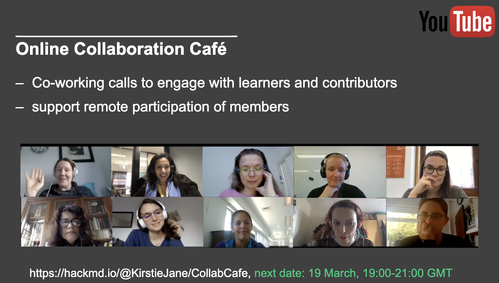
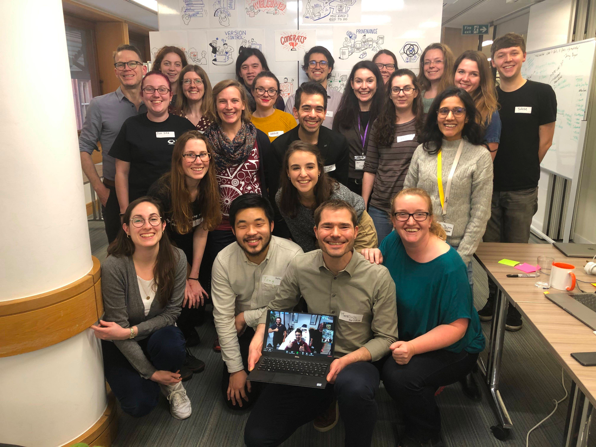
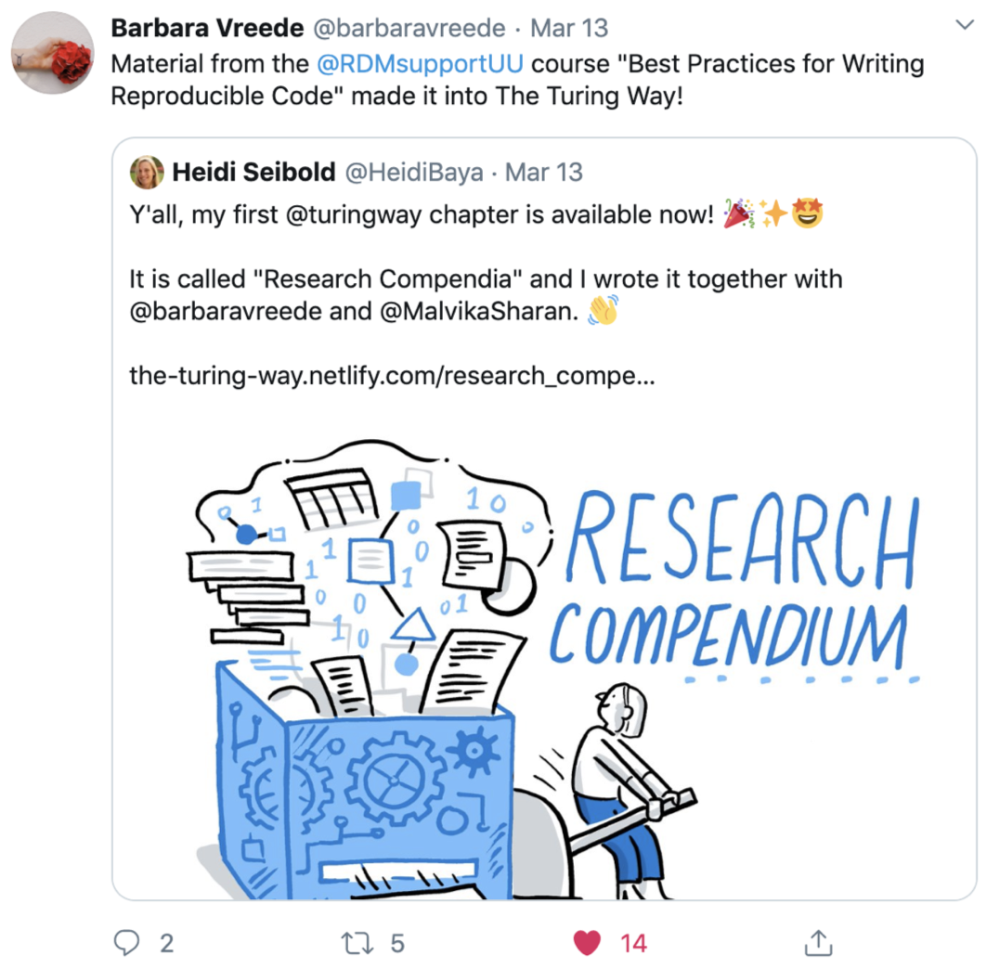
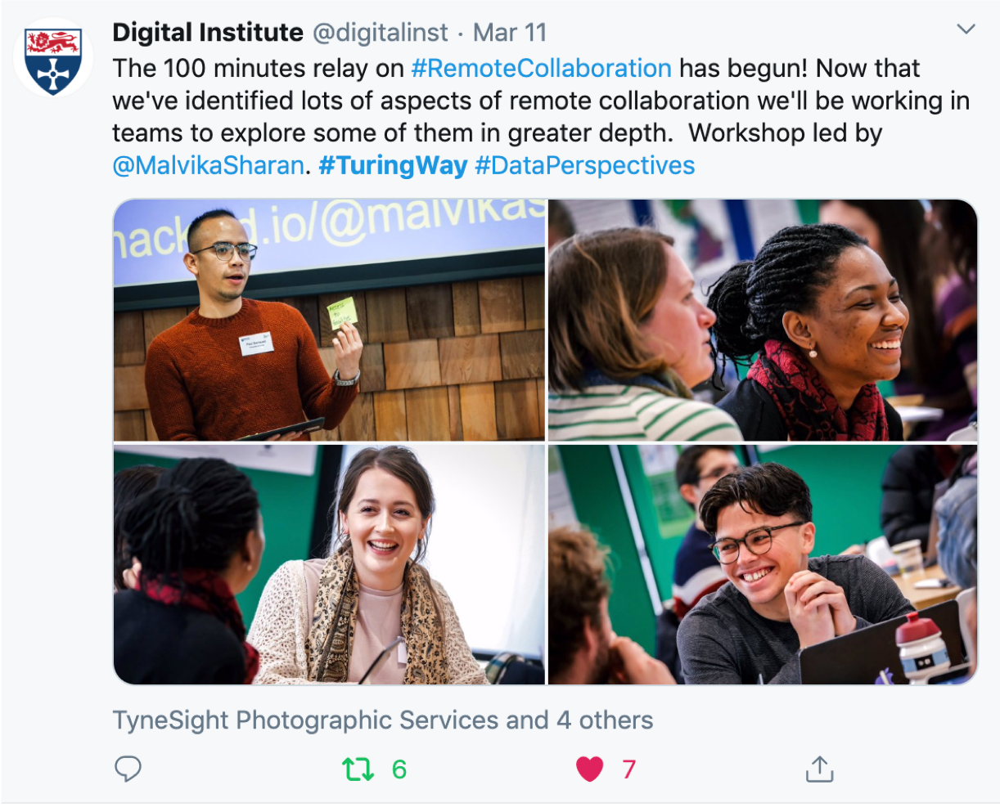
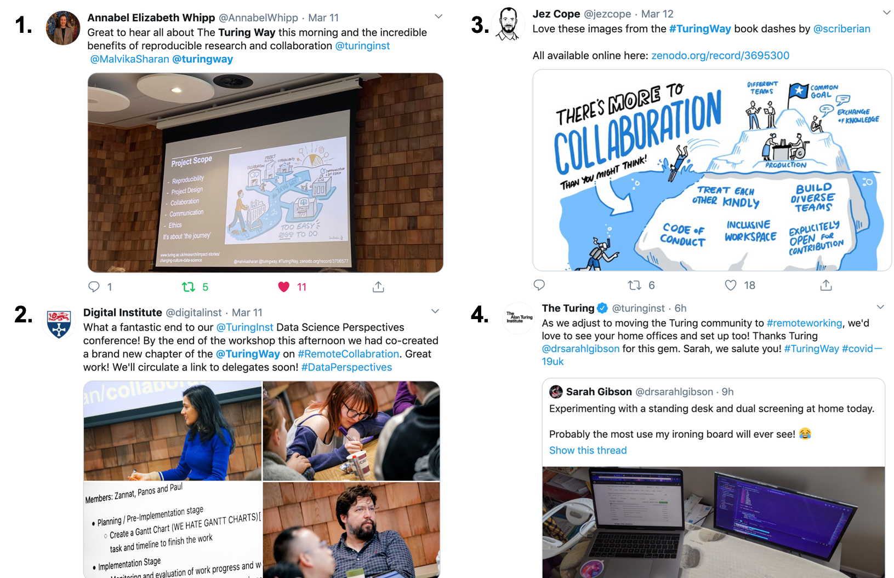

The Turing Way Newsletter: 16 March 2020

# Sharing updates from the community, launching our new logo, and sending wishes for your well-being during COVID-19 situation

Hello Turing Way friends!

We hope that you are well and practising recommended precautions as the COVID-19 spreads around the world.

Our next Collaboration Cafe is tomorrow, on 18 March 2020 at 19:00 GMT ([check your time](https://arewemeetingyet.com/London/2020-03-18/19:00/TuringWay-CollaborationCafe)).
If you have been working remotely from home already and want to take a break to document your research skills into _The Turing Way_ Project, take advantage of this co-working space.

Shout out to all our wonderful contributors from the last Book Dash event and the Data Science Perspectives PhD Conference attendees for contributing chapters to _The Turing Way_ (see their [PRs](https://github.com/alan-turing-institute/the-turing-way/pulls) and [issues](https://github.com/alan-turing-institute/the-turing-way/issues)).

The [Collaboration Workshop 2020](https://www.software.ac.uk/cw20) hosted by The [Software Sustainability Institute](https://www.software.ac.uk) has gone completely online in response to the rapidly changing situation with Coronavirus (COVID-19).
This meeting will take place from 31 March to 2 April 2020 and would provide an opportunity to participate and collaborate with researchers using virtual solutions.

Stay safe and take care of yourself during this unprecedented time!

Spot our logo and more details from the community below 👇

## Special notices

### COVID-19

The _Turing Way_ community mostly collaborates online, so there are no changes on our end that we need to implement to keep work going as usual.

However, you are likely to need time, space and support as many of us around the world are transitioning to working from home and implementing strong social distancing measures.

We are here to support you as best we can in these challenging and anxious times.
You are always welcome to chat in our [Gitter channel](https://gitter.im/alan-turing-institute/the-turing-way), or attend collaboration cafes if you're looking for some company and moral support.
Please let us know if you'd like additional co-working support.
We are happy to arrange ad-hoc collaboration spaces as you need them.

We are proud of how well the people of _The Turing Way_ prioritise their mental and physical well-being and the safety of others.
Thank you for being leaders in your own communities, and take care.

### UCU Industrial Action

Many of you will know that _The Turing Way_ has maintained a quieter presence online in support of the [Four Fights](https://www.ucu.org.uk/why-we-are-taking-action) industrial action by the University and College Union.

This action continues for [a few more days](https://www.ucu.org.uk/heaction-institutions).
[Pickets have been called off](https://www.ucu.org.uk/article/10692/Reballots-postponed-due-to-Covid-19-pickets-cancelled-but-action-continues) to help slow the spread of coronavirus, but that makes our continued online support of the action all the more important.

We look forward to engaging fully with you all from Monday 23 March on twitter.
Thank you to all community members who have maintained the [digital picket line](https://twitter.com/PlacardSticks/status/1239211718657662976?s=20).
It has been of great support to Kirstie and other community members taking action.

## Community meetings

### Collaboration Cafe

The next Collaboration Cafe is scheduled this week on 18 March 2020 ([your local time](https://arewemeetingyet.com/London/2020-03-18/19:00/TuringWay-CollaborationCafe)). [Sign up here](https://hackmd.io/@KirstieJane/CollabCafe) to join this coworking space.
Through these calls, we support contributions to _The Turing Way_ project and facilitate discussions among the community members.

Next month's Collaboration Cafes will take place on 1 April 2020 and 15 April 2020. Check out the [details online](https://github.com/alan-turing-institute/the-turing-way/blob/main/project_management/online-collaboration-cafe.md).

*Screenshots from our previous Collaboration Cafes*

### _The Turing Way_ at other conferences

Several of our team members will be attending the [Collaboration Workshop 2020](https://www.software.ac.uk/cw20) organised by the Software Sustainability Institute.
Under the leadership of Rachael Ainsworth, the community manager for the SSI, this event will take place online in response to the COVID-19 pandemic and facilitate remote participation of their attendees.
[Malvika Sharan](https://twitter.com/MalvikaSharan) will give [a talk in the Open Research session](https://software.ac.uk/cw20/agenda), discussing the push-back and barriers to Open Research and how _The Turing Way_ aims to help combat them.
[Patricia Hertreich](https://twitter.com/PHerterich) will facilitate a session on Professionalising support for Open Research.
[Louise Bowler](https://twitter.com/louise_a_bowler) will be leading a mini-workshop and demo session called [Generating synthetic datasets using the QUiPP pipeline](https://software.ac.uk/cw20/mini-workshops-and-demo-sessions#4.3).
[Yo Yehudi](https://twitter.com/yoyehudi) and Malvika will facilitate the session Open Life Science: Empowering communities with open* principles.
Read the full list [here](https://www.software.ac.uk/blog/2020-02-20-announcing-mini-workshop-and-demo-sessions-collaborations-workshop-2020).

We look forward to connecting with members of the broader _Turing Way_ community during the event.
Let us know if you'll "be there" (online!) so we can say hello 👋

## News from the community

### New chapters, GitHub issues and pull requests (PRs) from the Book Dash

*Group picture from our last Book Dash event*

The last Book Dash successfully took place in London from 20 to 21 February 2020.
Our attendees contributed to the chapters and issues on Credit for Reproducibility, Data management and publication, Tools and methods for reproducible research, Ethics, collaboration and contributions, and other technical aspects of the book.
A complete [report can be read online](https://hackmd.io/@malvikasharan/rJSSJurEL).

Thanks to Heidi Siebold and Barbara Vreede, we have a new chapter on [Research Compendia](https://book.the-turing-way.org/research_compendia/research_compendia.html).
We will be reviewing the remaining [PRs](https://github.com/alan-turing-institute/the-turing-way/pulls?q=is%3Apr+is%3Aopen+label%3Abook-dash-feb20) and [issues](https://github.com/alan-turing-institute/the-turing-way/issues?q=is%3Aissue+is%3Aopen+label%3Abook-dash-feb20) from the Book Dash and will be delighted to receive your support in that.

*Tweets by [Heidi Siebold](https://twitter.com/HeidiBaya/status/1238460446207873024?s=20) and [Barbara Vreede](https://twitter.com/barbaravreede/status/1238465267304407042?s=20)*

### Remote participation at the Book Dash

A group of researchers from the [Netherlands eScience Center](https://www.esciencecenter.nl/) joined this event remotely to add relevant content from their [Software Development Guide](https://nlesc.gitbooks.io/guide/content/).
This was a mutually beneficial experience and a wonderful addition to the originally planned event that allowed us to explore remote working options beyond online Collaboration Cafes.

## Relevant resources

### Our brand new logo and more Turing Way illustrations

**We have a logo. Share away!**

*The Turing Way Logo, The Turing Way Community, & Scriberia. (2020, March 3).
Illustrations from the Turing Way book dashes. Zenodo. http://doi.org/10.5281/zenodo.3695300.*

_The Turing Way_ illustrations from last year have been extremely popular in our network, which was shared online under a CC-BY licence.
Encouraged by such positive use of these resources, we invited a [Scriberia](http://www.scriberia.co.uk/)  artist - Sam, to the last book dash event.
Our attendees discussed their ideas and helped Sam capture important concepts they were working on during the book dash, the cover images for the various sections, _The Turing Way_ logo and other relevant topics in general.
You are welcome to share, reuse and distribute them by attributing "_The Turing Way_ Community, & Scriberia. (2020, March 3).
Illustrations from _The Turing Way_ book dashes. Zenodo. http://doi.org/10.5281/zenodo.3695300".

*Welcome banner, The Turing Way Community, & Scriberia. (2020, March 3).
Illustrations from the Turing Way book dashes. Zenodo. http://doi.org/10.5281/zenodo.3695300.*

## Tips & tricks for new contributors

### How are you working remotely during COVID-19 pandemic? Share with us!

At the [Data Science Perspectives: PhD Conference](https://www.ncl.ac.uk/nicd/events/event-items/data-science-perspectives-phd-conference/) in the Newcastle University, Malvika ran a workshop title [100 minutes relay on remote collaboration](https://hackmd.io/@malvikasharan/collaboration-nc).
Around 50 PhD students came together to discuss the various aspects of distributed collaboration in light of the newly presented challenge associated with working remotely during the COVID-19 pandemic.

If like most of us, you are working remotely, share your personal challenges and solutions that you think others can benefit from.
Check out the issues that we have started [under the label `collaboration-book`](https://github.com/alan-turing-institute/the-turing-way/issues?q=is%3Aissue+is%3Aopen+label%3Acollaboration-book).

*Tweet about The Turing Way 100 minutes relay from The Digital Institute, Newcastle University*

## Acknowledgements and celebrations

### Improving our global inclusion efforts through translation

Tony Yang who is a graduate student in Imperial College London, and two students from Kirstie Whitaker's lab, Yini He and Ang Li started translating _The Turing Way_ chapters in Chinese.
Inspired by their work, Anna Hadjitofi who was interested in translating these materials to Turkish, joined Tony in setting a [translation guideline](https://github.com/alan-turing-institute/the-turing-way/blob/translation/translation_guide.md) and [Transifex framework](https://www.transifex.com/theturingway/theturingway/) for collaborative translation.
After this event, a wider community and people have expressed interest in translating our project into Spanish, Hindi, Russian, and other local languages.

This was possible only because of the discussion and work led by our international community members.
We thank them for helping us create new pathways to involve our members in making _The Turing Way_ accessible for a wider community (join conversations in [these issues](https://github.com/alan-turing-institute/the-turing-way/issues?utf8=%E2%9C%93&q=is%3Aissue+is%3Aopen+chinese)).

*Community Translation efforts, The Turing Way Community, & Scriberia. (2020, March 3).
Illustrations from the Turing Way book dashes. Zenodo. http://doi.org/10.5281/zenodo.3695300.*

### Online mentions

Thanks to the Oleg Lavrovsky for the shout out to _The Turing Way_ project in the Swiss open data community forum post, [4 basic challenges in open data](https://forum.opendata.ch/t/4-basic-challenges-in-open-data/634).

Sarah Gibson wrote a blog post title [Continuous Integration: Fail Fast and Fail First](https://www.software.ac.uk/blog/2020-02-27-continuous-integration-fail-fast-and-fail-first), which was published in the SSI fellows blog series.
Her post discusses the main aspects of building an effective continuous integration, delivery and analysis pipeline and features _The Turing Way_ illustrations.

### Tweets from the community

Tweets by [1. Annabel Whipp](https://twitter.com/AnnabelWhipp/status/1237753130714050562?s=20), [2. The Digital Institute at Newcastle University](https://twitter.com/digitalinst/status/1237773081621549060?s=20) [3. Jez Cope](https://twitter.com/jezcope/status/1238102621484875776?s=20), [4. The Alan Turing Institute](https://twitter.com/turinginst/status/1239874239336980481?s=20) sub-tweeting [Sarah Gibson's tweet](https://twitter.com/drsarahlgibson/status/1239826780854390784?s=20)

## Connect with us!

- [About the project](https://www.turing.ac.uk/research/research-projects/turing-way-handbook-reproducible-data-science)
- [_The Turing Way_ book](https://book.the-turing-way.org)
- [GitHub repository](https://github.com/alan-turing-institute/the-turing-way)
- [Gitter chat room](https://gitter.im/alan-turing-institute/the-turing-way)
- [YouTube Videos](https://www.youtube.com/channel/UCPDxZv5BMzAw0mPobCbMNuA)
- Twitter Hashtag [#TuringWay](https://twitter.com/hashtag/TuringWay?f=live)

You are welcome to contribute content for the next newsletter by adding your item to [this issue](https://github.com/alan-turing-institute/the-turing-way/issues/954) or emailing [Malvika Sharan](mailto:msharan@turing.ac.uk).

*Did you miss the last newsletters?*
*Check them out [here](https://tinyletter.com/TuringWay/archive).*
