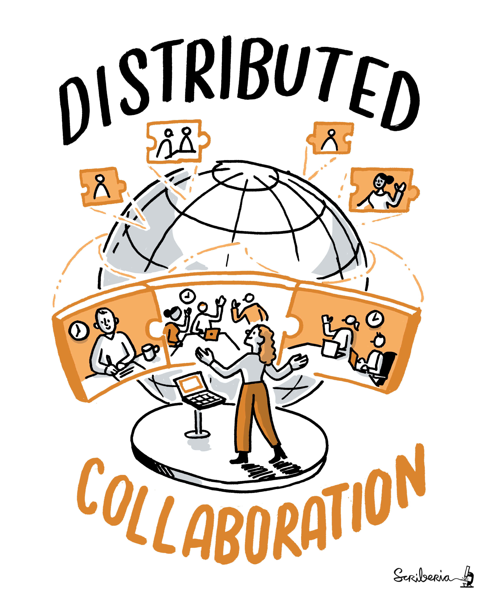
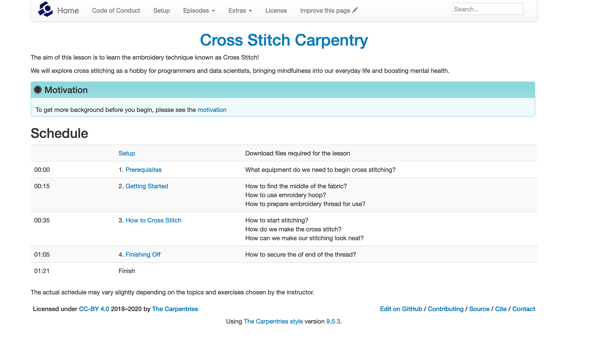
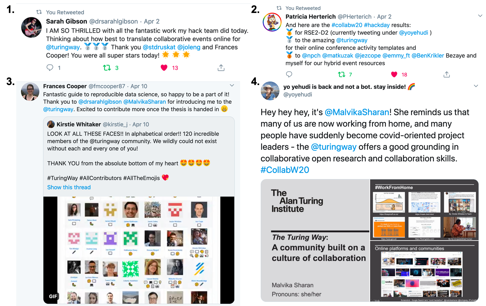

# The Turing Way Newsletter: 15 April 2020

# Collaboration cafe on 15 April, highlights from the Collaboration Workshop and other news from the community

Hello Turing Way friends!

Most of us have been working from home for over a month due to the global COVID-19 pandemic and trying to adapt to the current situation.
We truly hope that you and your loved ones are keeping well.
Share with us how you are doing on [our Gitter channel](https://gitter.im/alan-turing-institute/the-turing-way) or tag us on twitter [@turingway](https://twitter.com/turingway) 👋

Want to start contributing to _The Turing Way_, or would like to continue on your past work?
Join us at our next Collaboration Cafe **today**, 15 April 2020, from 19:00 to 21:00 BST ([check your local time](https://arewemeetingyet.com/London/2020-04-15/19:00/TuringWay-CollaborationCafe)).
☕ Sign up on [this HackMD](https://hackmd.io/sTZZwnYdS3umVWHHHLc6Mw?both), and find more details below.

We are super delighted to announce that our contributors community has grown to 120 people.
As of today, we have 17 chapters in the book and many more are being developed by you.
So, a huge thank you for supporting this project, and making it such a beautiful community to work with.
See all our members in the [contributors section](https://github.com/alan-turing-institute/the-turing-way#contributors).

Many members from the core team attended the Collaboration Workshop 2020 from 31 March to 2 April 2020, which was hosted virtually by the Software Sustainability Institute.
Below, we share highlights from the event and celebrate the winning teams from the final day collaborative projects, 2 of which worked to create chapters to be hosted in _The Turing Way_. 🎉

Find more news and fantastic work from our community below. 👇

## Community meetings

### Collaboration Cafe

We continue to hold our co-working hours through collaboration workshop on the first and third Wednesdays of each month.
The next Collaboration Cafe is today, 15 April 2020, at 19:00 BST ([check your local time](https://arewemeetingyet.com/London/2020-04-15/19:00/TuringWay-CollaborationCafe)).

We have announced the dates till Jun [on our repository](https://github.com/alan-turing-institute/the-turing-way/blob/master/project_management/online-collaboration-cafe.md).
Sign up on the [collaborative HackMD notes](https://hackmd.io/sTZZwnYdS3umVWHHHLc6Mw) to let us know that you will join us on the call.

### Want to see more opportunities to work together?

Do you want to see more of such meetings hosted by us, or do you want to lead these co-working hours on different dates or time zones?
Get in touch with the team by emailing [theturingway@gmail.com](mailto:theturingway@gmail.com), or head over to the community Gitter channel to share your idea with everyone: https://gitter.im/alan-turing-institute/the-turing-way.

Please forward this newsletter to anyone you know, including community managers who can send it around their own mailing lists.
If you've received these updates from one of your colleagues or friends, welcome!
You can join the newsletter mailing list yourself at [tinyletter.com/TuringWay](https://tinyletter.com/TuringWay).

## News from the community

### Resources on remote collaboration

On 11 March 2020, the _Turing Way_ team started to build resources on the topical issue of [Remote Collaboration](https://github.com/alan-turing-institute/the-turing-way/issues/960).
Thanks to the attendees from the Collaboration Cafe in March, workshop at the Data Perspective PhD conference in Newcastle and Collaboration Workshop 2020, we have now [11 issues](https://github.com/alan-turing-institute/the-turing-way/labels/collaboration-book) and multiple chapters on remote participation and collaboration in projects, events and teams.
Please help us by reviewing these chapters or contributing content that you think others in the community can benefit from.

*The Turing Way Community, & Scriberia. (2020, March 3). Illustrations from the Turing Way book dashes. Zenodo. http://doi.org/10.5281/zenodo.3695300*

### New chapters and new book design under development

Carlos Martinez Ortiz and Stefan Verhoeven from Netherlands eScience Center started [a chapter on licensing](https://the-turing-way.netlify.com/licensing/licensing.html).
They have written a subsection on software licencing comprehensively.
To build on their work, we invite your contribution regarding data licensing that will be extremely useful for enhancing our understaning of licenses in Data Research.

We are currently working on the new design of the book ([see this preview](https://deploy-preview-977--the-turing-way.netlify.com/welcome)), which aims to provide easier access to the different volumes of the book and their subsections.

*Screenshot from the new proposed design of The Turing Way Book, developed in PR [#977](https://github.com/alan-turing-institute/the-turing-way/pull/977)*

## Relevant resources

### Translation efforts in _The Turing Way_

Anna Hadjitofi has written [a guide to using the Transifex interface](https://github.com/alan-turing-institute/the-turing-way/blob/translation/translation_guide.md) that Tony Yang is currently coordinating for _The Turing Way_ translation efforts.
They recommend that it's more effective when 2 people work on the translation process together so that they can review each other's translations.

Transifex will also allow you to raise issues and browse all the past translations.
Tony has opened the [GitHub issues with the label "Translation"](https://github.com/alan-turing-institute/the-turing-way/labels/translation) to keep record of the contributions made by the different translator's groups. 

You can start with [this meta-issue](https://github.com/alan-turing-institute/the-turing-way/issues/967) to get an overview of all the discussions around translation.
Tony has also set up a netlify build on the translation branch that can be previewed for [Chinese version here](https://competent-nightingale-4c1d36.netlify.com/zh_cn/introduction/introduction) and the [Spanish version here](https://competent-nightingale-4c1d36.netlify.com/es/introduction/introduction).

### The Hidden REF announces new categories

[The Hidden REF](https://hidden-ref.org/), an initiative to celebrate all research outputs and their contributors, just announced new categories under which outputs and people can be submitted.
As a complement to the Research Excellence Framework (REF) exercise run in the UK, the Hidden REF will highlight outputs that are not selected or eligible for REF.
Until the end of June, the research community can suggest and comment on categories for which submissions should be accepted.
[Latest suggestions](https://www.software.ac.uk/blog/2020-04-06-first-look-new-categories-hidden-ref) include training material such as _The Turing Way_ resources or carpentry lessons, data and metadata standards, colleagues working in professional services and others.
To keep up to date with the Hidden REF, follow the initiative [on Twitter](https://twitter.com/HiddenRef).

### Mindful activities and Cross-Stitch Carpentry

Are you looking for some non-digital time after spending the entire day working online and attending virtual meetings?
Check this [Carpentries-style lesson on cross stitching](https://sgibson91.github.io/cross-stitch-carpentry/index.html) that Sarah Gibson recently launched to get beginners started with this mindful hobby.
You can also read [this post](https://sgibson91.github.io/cross-stitch-carpentry/motivation/index.html) where Sarah and Malvika give more reasons for computer programmers and _The Turing Way_ community members to take time for mindful activities that can have a positive impact on our mental health and well-being.

*Screenshot from the Carpentry Style lesson on Cross Stitching*

## Tips & Tricks for new contributors

If you are new to GitHub or _The Turing Way_, or both, here are a few resources to orient yourself with our project repository:

* Start by reading our [contribution guideline](https://github.com/alan-turing-institute/the-turing-way/blob/master/CONTRIBUTING.md), that lists the different pathways for the new and existing contributors to interact with this project.
* [GitHub issues](https://github.com/alan-turing-institute/the-turing-way/issues) are opened by different contributors on the topics they are interested in discussing, fixing or working on in the future.
* You can browse these issues by labels (see [contributing through GitHub section](https://github.com/alan-turing-institute/the-turing-way/blob/master/CONTRIBUTING.md#contributing-through-github)) and participate in a conversation by adding your comment under the respective issues. 
* We have [good first issues](https://github.com/alan-turing-institute/the-turing-way/issues?q=is%3Aissue+is%3Aopen+label%3A%22good+first+issue%22) to help our new contributors start by contributing little because every little bit helps.
* You can open a new issue on a topic where you would like to gather feedback from others.
* You are invited to introduce yourself to others on [our Gitter channel](https://gitter.im/alan-turing-institute/the-turing-way), or reach out to Malvika, _The Turing Way's_ community manager, by emailing [theturingway@gmail.com](mailto:theturingway@gmail.com).
  We love to say hello 👋

## Acknowledgements and celebrations

### Highlights from the Collaboration Workshop 2020

Several members from The Turing Way community participated at the [Virtual Collaboration Workshop 2020](https://software.ac.uk/events/2019-11-20-collaborations-workshop-2020), that was organised by Rachael Ainsworth, Community Manager of the Software Sustainability Institute (SSI), from 31 March to 2 April 2020.
Recordings and blog posts will be published on [SSI homepage](https://software.ac.uk) soon.

Meanwhile, here are some notable mentions from the event:

* Andrew J. Stewart in his keynote on Open Research discussed the existing challenges around reproducibility in open research in psychology and ways we can improve them ([slides](https://drive.google.com/file/d/1sN8xdUYD9flusHxR0SfTFy7EpLaGiDAK/view?usp=sharing)).
* Becca Wilson in her keynote gave us a thorough overview of Data Privacy, different policies across different countries, pseudonymisation to replace identifiable information from the public data, and safe infrastructures to ensure data security ([slides](http://bit.ly/2020cw-data-privacy)).
* Malvika Sharan gave a perspective talk on building a culture of collaboration in online communities with _The Turing Way_ as an example for the community of practices ([slides](https://zenodo.org/record/3745008#.XpWxaTJKjOQ)).
* On the final day, several teams with many members from _The Turing Way_ worked under a common umbrella topic of Remote Collaboration.
* Sarah Gibson, Frances Cooper, Joanna Lang and Stephan Druskat wrote a [chapter on facilitating collaborations at remote events](https://github.com/alan-turing-institute/the-turing-way/issues/1005) that won 2nd place among the winning team.
* Patricia Herterich, Ben Krikler, Bezaye Tesfaye, Emmy Tsang, Jez Cope, Mateusz Kuzak, and Neil Chue Hong worked on [Persona and Pathways for organising hybrid events](https://github.com/softwaresaved/hybrid-event-guide) that secured 3rd place.
* The first place was secured by Yo Yehudi, Blair Archibald, David Perez-Suarez, Alison Clarke, and Marion Weinzierl who developed a Twitter bot called [RSE2-D2](https://github.com/yochannah/RSE2-D2) that provides helpful advice for research software.

Congratulation to all the winners, and the organisers for this successful event 🎊

### Tweets and other online mentions

*Tweets [1](https://twitter.com/drsarahlgibson/status/1245748006332268545?s=20) and [2](https://twitter.com/PHerterich/status/1245744686507180033?s=20) by Sarah Gibson and Patricia Herterich about their winning project from the Collaboration Workshop.*
*Tweet [3](https://twitter.com/fmcooper87/status/1248686680900603908?s=20) by Frances Cooper, quote tweeting [Kirstie Whitaker](https://twitter.com/kirstie_j)'s post about the contributors list update.*
*In tweet [4](https://twitter.com/yoyehudi/status/1245281982667460608?s=20), Yo Yehudi is quoting slides from Malvika's talk at the Collaboration Workshop 2020*

## Connect with us!

- [About the project](https://www.turing.ac.uk/research/research-projects/turing-way-handbook-reproducible-data-science)
- [_The Turing Way_ book](https://the-turing-way.netlify.com)
- [GitHub repository](https://github.com/alan-turing-institute/the-turing-way)
- [Gitter chat room](https://gitter.im/alan-turing-institute/the-turing-way)
- [YouTube Videos](https://www.youtube.com/channel/UCPDxZv5BMzAw0mPobCbMNuA)
- [Twitter](https://twitter.com/turingway)

You are welcome to contribute content for the next newsletter by emailing [Malvika Sharan](mailto:msharan@turing.ac.uk) or adding them to issue [#1037](https://github.com/alan-turing-institute/the-turing-way/issues/1037).

*Did you miss the last newsletters?*
*Check them out [here](https://tinyletter.com/TuringWay/archive).*
