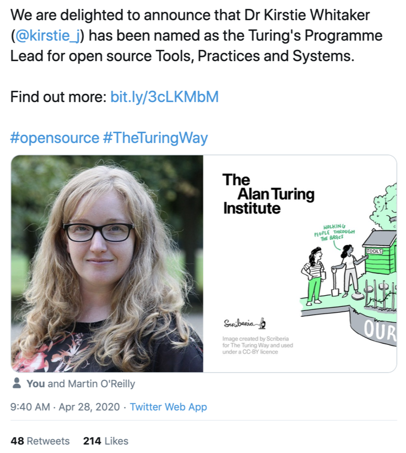
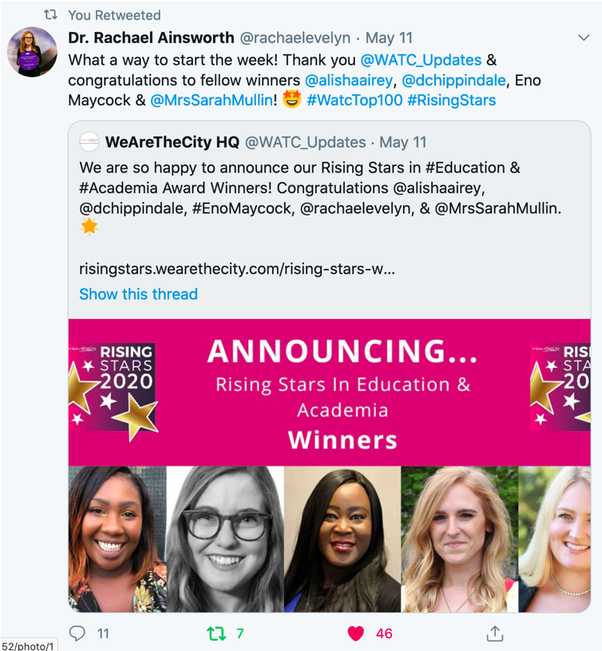
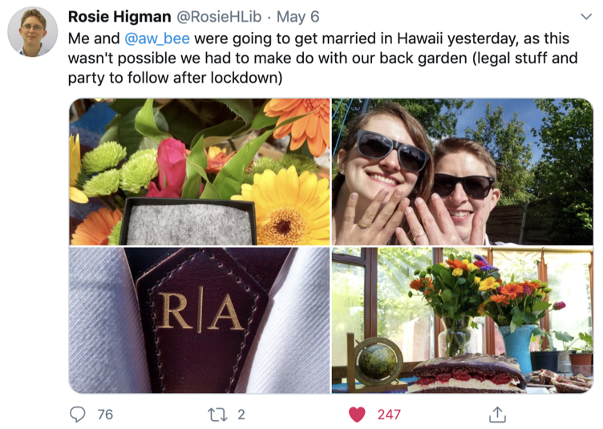
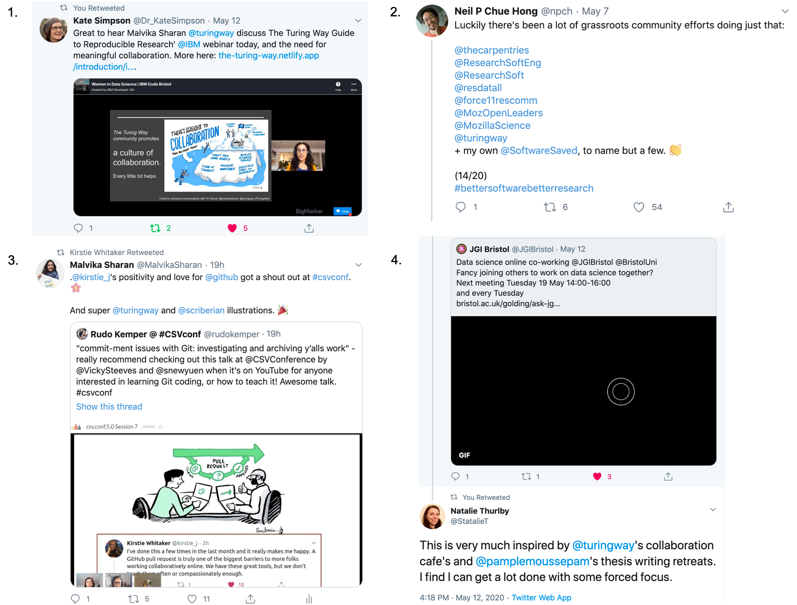

# This week’s Collaboration Café, Mental Health Awareness Week and other updates from the community!

Hello Turing Way friends!

This month as we continue to adjust to the current norm, we wish you good health and hope that you and your loved ones are keeping well. 
It’s not easy keeping morale up with the current state of the pandemic, therefore, in this newsletter, we talk about the importance of self-care and highlight the Mental Health Foundation who are hosting [Mental Health Awareness Week](https://www.awarenessdays.com/awareness-days-calendar/mental-health-awareness-week-2020/) from 18 to 24 May 2020. 🌻

We congratulate Kirstie Whitaker, the founder of the Turing Way for starting her new role as the [lead of Tools, Practices and Systems research programme](https://www.turing.ac.uk/news/dr-kirstie-whitaker-named-institutes-programme-lead-open-source-tools-practices-and-systems) at The Alan Turing Institute, London. 🎊

🗓 Join us at our upcoming Collaboration Café this week on 20 May 2020 at 19:00 ([check your local time](https://arewemeetingyet.com/London/2020-05-20/19:00/TuringWay-CollaborationCafe)). 
More details are available on [this HackMD](https://hackmd.io/@KirstieJane/CollabCafe).

📢 [International Neuroinformatics Coordinating Facility (INCF)](https://www.incf.org/blog/call-mentors-join-us-gsod-2020) is participating at the [Google Seasons of Docs](https://developers.google.com/season-of-docs/docs/participants).
As one of their projects, we invite interested technical writers to connect with us to discuss their project ideas during the exploration phase until 8 June 2020. 

Stay safe and find more news from the community below 👇

## Community meetings

### Collaboration Café
Our next Collaboration Café is scheduled tomorrow, 20 May 2020, from 19:00 - 21:00 BST ([check your local time](https://arewemeetingyet.com/London/2020-05-20/19:00/TuringWay-CollaborationCafe)). 
Join us to learn more about our work or discuss something that you would like to add to the project. 
You can join for as long as your schedule allows. 
Sign up on [this HackMD
](https://hackmd.io/@KirstieJane/CollabCafe) to indicate your participation.

### Co-working Calls
If you are looking for more opportunities to connect with the community, get on-boarded as a new member or co-work on your ideas for the project, participate in the co-working calls hosted by the community manager, Malvika Sharan at 11:00 AM BST everyday. 
More information can be found on [this HackMD](https://hackmd.io/@malvikasharan/TW-coworking).

## News from the community

### Kirstie Whitaker’s new role at The Alan Turing Institute

We congratulate our project lead Kirstie Whitaker for being named the first programme lead of the Tools, Practices and systems at The Alan Turing Institute. 
Kirstie joined the institute in 2017 as a Turing Research Fellow and was awarded a seed funding grant to "make reproducible research too easy not to do" alongside the Turing’s Director of Research Engineering Martin O'Reilly.
In her own words: 
*"I've always loved working at the Turing, the breadth of skills and interests has always meant fascinating discussions in the (now virtual) kitchen over coffee. 
I'm delighted that I have the opportunity to support our national responsibility to maintain the open source tools, practices and systems that underpin and enable the ethical and responsible use of data to solve the biggest challenges around the world."* 
Read more in [this announcement](https://www.turing.ac.uk/news/dr-kirstie-whitaker-named-institutes-programme-lead-open-source-tools-practices-and-systems).

*Tweet by [The Turing Institute](https://twitter.com/turinginst/status/1255054249807024128?s=20)*

## Upcoming workshops and events

### Boost Research Reproducibility with Binder Workshop

In collaboration with [UK DRI](https://ukdri.ac.uk/), The Turing Way is hosting a half-day workshop on Binder on 11 June 2020, from 13:00 to 17:00.
Binder allows you to share your software from GitHub in a single clickable link, making it easier for users to not worry about the computational environments, dependencies and platforms.
In this workshop, we will discuss reproducible computing environments, show examples of others’ projects in myBinder.org and help you learn how to prepare a binder-ready project. 
At the end of the workshop, you will be able to take some of your own content (in Jupyter notebook or scripts) and prepare it so that it can be used by others on myBinder.org.
More information is available on the [registration page online](https://www.eventbrite.co.uk/e/workshop-boost-research-reproducibility-with-binder-registration-105228216428).
If you have previous experience with Binder and would like to join as a helper, please reach out to us by emailing theturingway@gmail.com.

### Google Seasons of Docs

INCF is taking part in this year's [Google Seasons of Docs](https://developers.google.com/season-of-docs/docs/participants) as an open source organisation and _The Turing Way_ is listed as one of its projects.
During its exploration phase from May 11 to June 8, we invite the professional technical writers to connect with us and discuss the project ideas that can allow them to bring in their perspectives and unique skill set.
_The Turing Way_ involves a large community of volunteers who edit, review and maintain its resources online on GitHub.
As a book project, we can benefit tremendously from the support of experienced individuals who can provide editorial support and related guidance in our project.
We have compiled some recommendations that can be used as the starting points for the GSOD candidates.
Please find details on [this issue](https://github.com/alan-turing-institute/the-turing-way/issues/1075), and feel free to comment there if any further information will be useful.

### Data Feminism Book and “Challenging Power in Data Science” seminar 

[Data Feminism](https://mitpress.mit.edu/books/data-feminism) is a recent book by Catherine D'Ignazio and Lauren F. Klein that discussed data feminism as a way of thinking about data science and its communication informed by decades of intersectional feminist activism and critical thought. 
They will be giving a talk hosted by The Alan Turing Institute to discuss how challenges to the male/female binary can challenge other hierarchical classification systems; how an understanding of emotion can expand our ideas about effective data visualization; and how the concept of “invisible labor” can expose the significant human efforts required by our automated systems. 
You can read more about the event and register for free online using [this Eventbrite link](https://www.eventbrite.co.uk/e/challenging-power-in-data-science-tickets-105238272506?aff=erelexpmlt).
The Authors have been running a weekly reading group that can be attended online ([see details](http://datafeminism.io/blog/book/data-feminism-reading-group/)).

## Past workshops and events

### Women in Science IBM Code Bristol

Malvika Sharan was invited to the Women in Data Science (WiDS) event hosted by IBM Code Bristol to speak about _The Turing Way_ and its collaborative aspects.
This event involved an all-women lineup of speakers who gave Tech Talks related to their work and participated in a panel discussion.
You can watch the [recordings online](https://www.bigmarker.com/ibm-developer-uki/Women-in-Data-Science-IBM-Code-Bristol?bmid=2581093331c4).
This was the first WiDs event at Bristol to coincide with the annual Global WiDS Conference held at Stanford University.
WiDS initiative aims to inspire and educate data scientists worldwide, regardless of gender, and to support women in the field.

### ReproHack 

Anna Krystalli hosted an online ReproHack event on 14 May 2020, where Sarah Gibson delivered a talk on Binder.
Both members are active contributors to _The Turing Way_ and fellows of the Software Sustainability Institute.
[ReproHacks](https://github.com/reprohack) are one-day workshop events, where participants attempt to reproduce published research of their choice from a list of proposed papers with publicly available associated code and data.
See [the workshop page](https://n8cir.org.uk/events/remote-reprohack/) for details. 

## Tips & Tricks for new contributors

Are you new to _The Turing Way_ and would like to learn more about the project? Listen to the insightful talk by Kirstie Whitaker, project lead from one of her recent talks at [OpenMR Benelux 2020](https://openmrbenelux.github.io/products/product08/) recording from which is available [online on YouTube](https://www.youtube.com/watch?v=dlycvMU45ek&feature=youtu.be).

### Community Persona: Camila Rangel Smith

Camila is a Research Data Scientist at The Alan Turing Institute.
She is also a co-founder of the CEVALE2VE project (http://www.cevale2ve.org/en/home/) that has become consolidated into LA-CoNGA physics (http://laconga.redclara.net/), an EU Erasmus+ funded project with a mission to create a Latin American and European Community for Advanced Physics.
She is translating _The Turing Way_ resources into Spanish in collaboration with her friends and colleagues from Venezuela and Mexico. 
In her words: *“I think The Turing Way is an excellent resource that can change the way science is done (I wish I had it when I started my PhD). 
Although the international language of science is English, I know for a fact that not everyone in places like Latin-American has the time and resources to learn it, so I think we must do everything we can to break those barriers and improve the accessibility of knowledge for everyone. 
This is my motivation to translate the book to Spanish, and I hope that the Spanish version will be used as an important resource on the master course we are developing in LA-CoNGA physics project.”*

## Mental Health Awareness Week

This week, the Mental Health Foundation is campaigning around the theme “Kindness” for Mental Health Awareness Week. They share [resources online](https://www.mentalhealth.org.uk/our-work) on practical ways to look after your mental health and promote awareness in your network.

*From the resources of the Mental Health Foundation*

As a community based on a culture of collaboration, we strive to maintain a foundation of inclusion and kindness in _The Turing Way_ project.
If you are new to the community, come and say hello on [our Gitter channel](https://gitter.im/alan-turing-institute/the-turing-way), explore our resources on [GitHub](https://github.com/alan-turing-institute/the-turing-way/) and learn the pathways to get involved in our [contribution guideline](https://github.com/alan-turing-institute/the-turing-way/blob/master/CONTRIBUTING.md).

### Staying connected with others

To avoid feeling disconnected while you work from home, you can join others for online coffee breaks or co-working calls. 
These short informal calls can help you stay connected with others in your network, create opportunities to exchange ideas, keep each other motivated and show kindness. 
Kirstie has shared her thoughts and ideas on running effective virtual coffee calls on [this issue](https://github.com/alan-turing-institute/the-turing-way/issues/965).

### Self-care when volunteering

Our community members volunteer their time and effort to develop resources that others can learn from. 
Several of our members have been a part of this community from the beginning of the projects, and several of you might have joined just a few weeks or months ago but have taken significant roles of developers and maintainers of our resources. 
We acknowledge that during this unprecedented time, you may experience increased responsibility at work or home, and in those moments It is ok to unplug.
We, in fact, encourage you to take time for yourself and when you have regained the time and energy we will be happy to welcome you back.

### Share your tips on self-care

We would love to hear your tips and recommendations on self-care and ensuring the well being of your team members that you can add as a comment on [this issue](https://github.com/alan-turing-institute/the-turing-way/issues/965).
These recommendations will be added to the chapter on remote collaboration ([see details](https://github.com/alan-turing-institute/the-turing-way/pull/962)].

Have ideas for other ways to improve accessibility in our community? Reach out to us by emailing theturingway@gmail.com.

## Relevant resources

### Publications

The citation advantage of linking publications to research data, Colavizza G, Hrynaszkiewicz I, Staden I, Whitaker K, McGillivray B (2020). PLOS ONE 15(4): e0230416. https://doi.org/10.1371/journal.pone.0230416 

### eLife sprint

The eLife Innovation Sprint is taking place online from 2 to 3 September 2020. 
eLife is a non-profit organisation with the mission to accelerate research communication and discovery, and the Innovation Sprint is a collaborative event where developers, designers, technologists, researchers, etc work together to develop technological solutions and prototypes to change the ways scientific research is done and shared. 
Apply here by June 7: www.elifesci.org/sprint.

### CarpentryCon @ home

[The Carpentries](https://carpentries.org/) is a volunteer-driven organisation that teaches programming and technical teaching skills to their global community of learners and educators.
They are hosting the “CarpentryCon @ Home” online event series in July and August, and invite you to present talks, lead breakout discussion sessions, share skills through short workshops or host social events in your time zone.
Find more details in this blog post](https://carpentries.org/blog/2020/05/2020-carpentrycon-at-home-proposals/).

## Acknowledgments and celebrations 

### Personal Celebrations! 🎉

We congratulate Rachael Ainsworth for being named a Rising Star in the education and academia category of the [2020 Rising Star awards](https://risingstars.wearethecity.com/rachael-ainsworth-university-of-manchester/). 
Rachael is the Research Software Community Manager of The Software Sustainability Institute, who worked with the core team of _The Turing Way_ in 2019 and continues to be one of the key collaborators.

*Tweet by [Rachael Ainsworth](https://twitter.com/rachaelevelyn/status/1259796328135176192?s=20)*

On a more personal note, we are overjoyed to share a personal tweet by Rosie Higman and congratulate her on her wedding that took place in their back garden on 6 May 2020.
Rosie Higman is a Research Data Manager and a PhD student at Sheffield iSchool & British Library who also worked with the core team of _The Turing Way_ in 2019.

*Tweet by [Rosie Higman](https://twitter.com/RosieHLib/status/1257964110165299200?s=20)*

### Tweets from the community

*1. [Kate Simpson’s tweet]() from the Women in Data Science organised by IBM code Bristol, 2. [Neil Chung’s tweet](https://twitter.com/npch/status/1258387097930653702?s=20) from this [Twitter thread on software code quality](https://twitter.com/npch/status/1258381963620204545?s=20), 3. Malvika [subtweeting Rudo Kemper’s tweet](https://twitter.com/MalvikaSharan/status/1260954742093643777?s=20) from the CSV Conference 2020, 4. Natalie Thurlby’s tweet on JGI Bristol’s co-working calls, which was inspired by _The Turing Way_’s Collaboration Café.*

## Connect with us!

- [About the project](https://www.turing.ac.uk/research/research-projects/turing-way-handbook-reproducible-data-science)
- [_The Turing Way_ book](https://the-turing-way.netlify.com)
- [GitHub repository](https://github.com/alan-turing-institute/the-turing-way)
- [Gitter chat room](https://gitter.im/alan-turing-institute/the-turing-way)
- [YouTube Videos](https://www.youtube.com/channel/UCPDxZv5BMzAw0mPobCbMNuA)
- Twitter Hashtag [#TuringWay](https://twitter.com/hashtag/TuringWay?f=live)

You are welcome to contribute content for the next newsletter by comment under [this issue](https://github.com/alan-turing-institute/the-turing-way/issues/1037) or directly
emailing [Malvika Sharan](mailto:msharan@turing.ac.uk).

*Did you miss the last newsletters?*
*Check them out [here](https://tinyletter.com/TuringWay/archive).*
