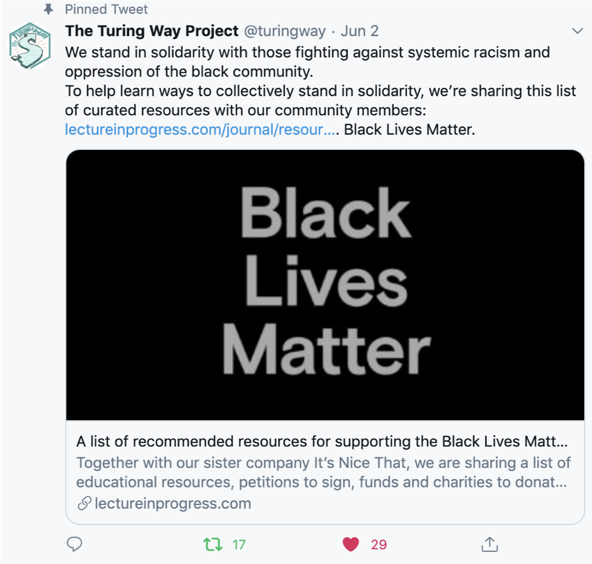
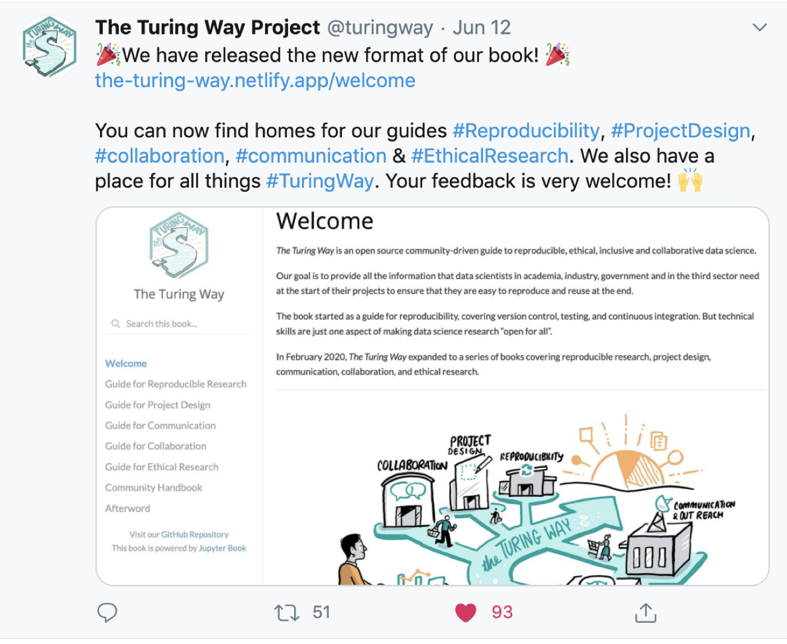
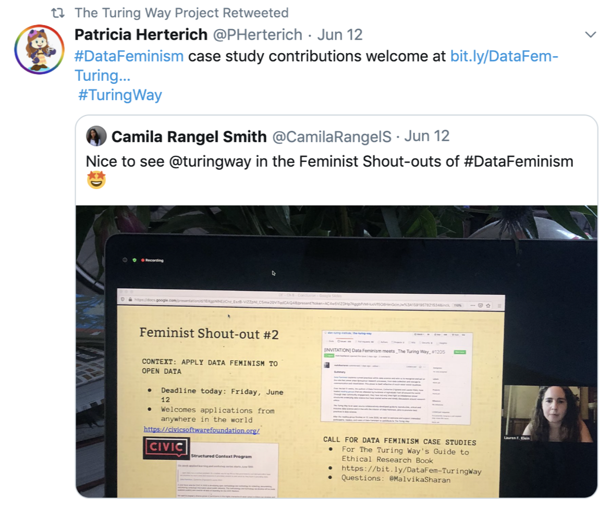
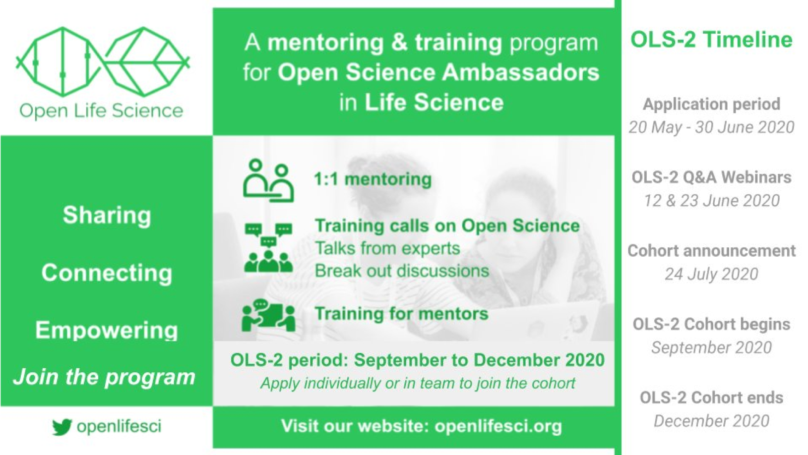
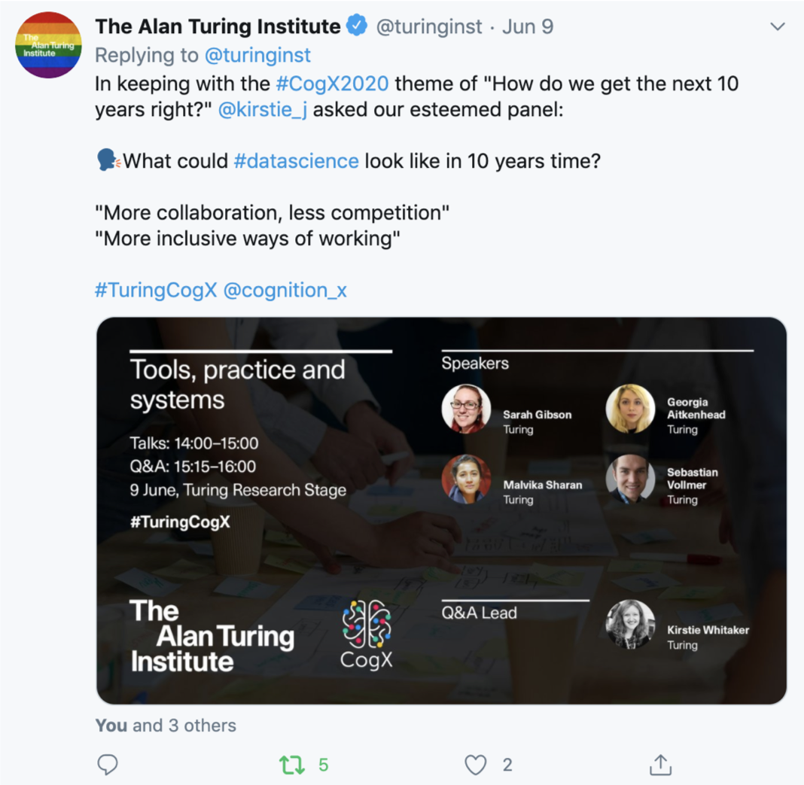
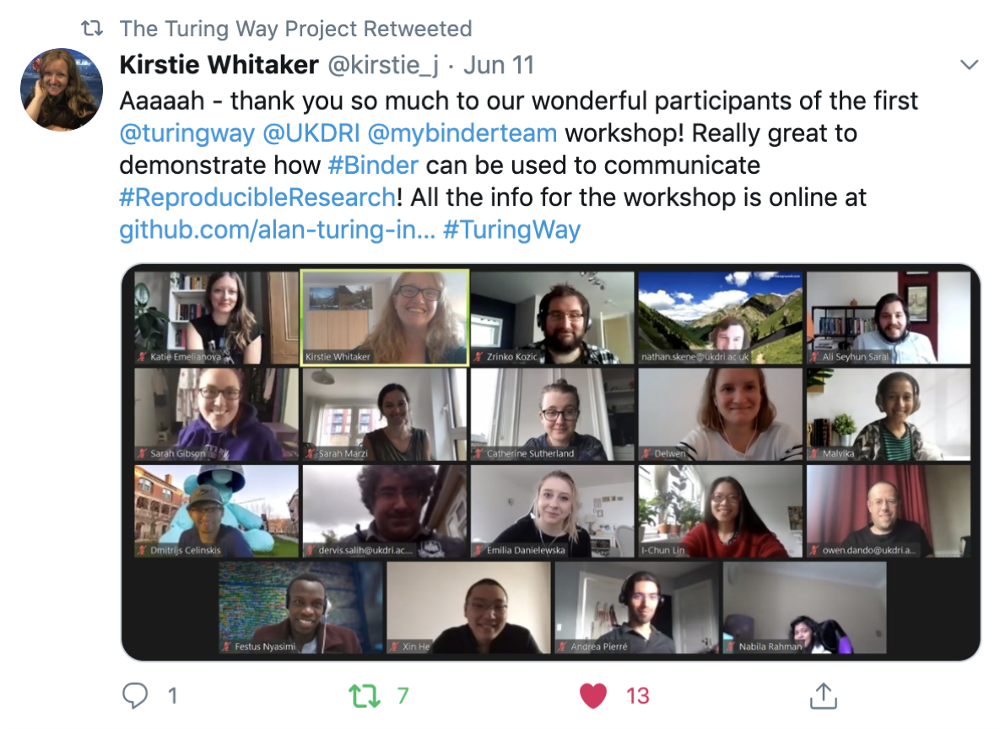
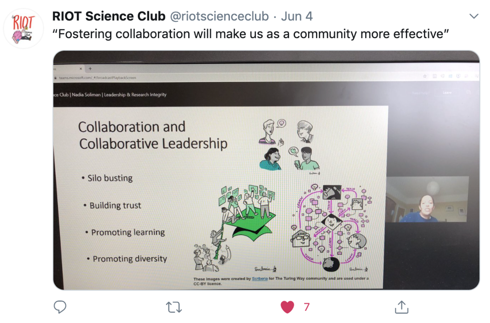
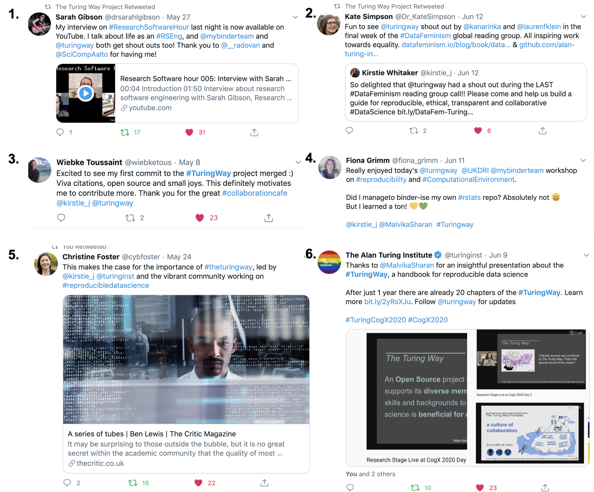

The Turing Way Newsletter: 17 June 2020

# Join Collaboration Café today, bring your Data Feminism perspectives to _The Turing Way_ and learn how we can promote an equitable culture in our community!

Hello Turing Way friends!

The core team of _The Turing Way_ advocates for open and equitable research culture and is committed to support efforts against systemic inequality in the science and community at large. 
to support the ongoing [Black Lives Matter movement](https://blacklivesmatter.com/), we urge our community members to understand the wider context, join calls for action and help each other learn ways to collectively stand in solidarity.

Join this week’s Collaboration Cafe today at 19:00 BST ([your local time](https://arewemeetingyet.com/London/2020-06-17/19:00/TuringWay-CollaborationCafe)) and subscribe to the community calendar for future events.

Read our book online in it’s updated format that allows easy navigation of its chapters on research reproducibility and provides dedicated locations for new guides for project design, communication, collaboration and ethical research. 
Report any bug, issue or idea for the new format in the [issue #1220](https://github.com/alan-turing-institute/the-turing-way/issues/1220).

If you have been reading the Data Feminism book by Catherine D’Ignazio and Lauren Klein, join our effort to capture your perspective and lessons learned in _The Turing Way_’s guide to Ethical Research ([issue #1205](https://github.com/alan-turing-institute/the-turing-way/issues/1205)).

Stay safe!

Read more details on these topics below 👇

## recommended resources for supporting the Black Lives Matter movement

The [Black Lives Matter movement](https://blacklivesmatter.com/about/) and its ongoing protests demand us to have informed and sensitive discussions on history, race, science and society to take necessary actions as individuals against systemic injustice.
We are highlighting [this list of curated resources](https://lectureinprogress.com/journal/resources-for-supporting-black-lives-matter-movement) by [lectureinprogress.com](https://lectureinprogress.comt).
These resources cover a range topics like history, philosophy, race, allyship, mentoring and training opportunities.
They have also listed a number of educational resources like books, videos, and podcasts, calls for actions, and organisations to support.
We believe that we can support this movement authentically only when we educate ourselves on these issues, recognise our privilege (or lack thereof) and use our platforms to raise voice against systemic inequality.

*[Tweet by _The Turing Way_](https://twitter.com/turingway/status/1267870724678696961?s=20) in support of Black Lives Matter Movement*

## Community meetings

### Collaboration Café

Our next Collaboration Café is today at 19:00 BST ([your local time](https://arewemeetingyet.com/London/2020-06-17/19:00/TuringWay-CollaborationCafe)). Please go ahead and sign up on this hackMD: [https://hackmd.io/@KirstieJane/CollabCafe](https://hackmd.io/@KirstieJane/CollabCafe).

In this coworking call, we would love to onboard new members who have recently joined the community and would like to know where they can get involved.
We would also like to discuss how we can continue hosting these calls in the future to accommodate the need from the community and the team members.

### Weekly coworking calls
During the lockdown while many of us are working from home, we have also been hosting 1 hour short coworking calls. 
Unlike the Collaboration Café, these calls take place almost everyday during the week and offer a space for quiet coworking on your ideas for The Turing Way with a few core members of the _The Turing Way_.
You can sign up every week to indicate your participation on this HackMD: [https://hackmd.io/@malvikasharan/TW-coworking](https://hackmd.io/@malvikasharan/TW-coworking).

### Calendar
To get notified with the dates for the upcoming community events, click on [this link](https://calendar.google.com/calendar?cid=dGhldHVyaW5nd2F5QGdtYWlsLmNvbQ) to subscribe to _The Turing Way_ community calendar.

## News from the community

### New Book Format

We overhauled _The Turing Way_ book to make it easy to browse, read and contribute to.
You will now find the dedicated locations for guides for reproducible research, project design, communication, collaboration and ethical research.
Please visit the online book and provide your feedback to make it more accessible for a wider community [https://the-turing-way.netlify.app/](https://the-turing-way.netlify.app/).
You will also be able to read and write chapters useful for maintaining and supporting our community in the community handbook.

Followed by a recent upgrade of [Jupyter Book](https://github.com/jupyter/jupyter-book/), we have been able to bring about the recent changes while simplifying the backend infrastructure that hosts the book on [Netlify](https://www.netlify.com/).
Our [style guides](https://the-turing-way.netlify.app/community-handbook/style.html) have also been updated to include ways to cite and cross-refer chapters within the book.
Thanks to the numerous community members who have helped us achieve this major milestone in the project. 
We look forward to engaging more members who can help us fix errors and bugs introduced in this massive update and help improve the overall accessibility of this book.

*[Tweet by The _Turing Way_](https://twitter.com/turingway/status/1271369319012761602?s=20) with the screenshot of the welcome page of the online book*

### Data Feminism and _The Turing Way_

[Data Feminism](https://mitpress.mit.edu/books/data-feminism) explores current practices within data science and asks us to recognise and act on the role that power plays throughout research processes, from data collection and storage to communication and visualisation. 
On 4 June, The Alan Turing Institute hosted a webinar with the authors of [Data Feminism](https://mitpress.mit.edu/books/data-feminism), Catherine D’Ignazio and Lauren Klein, which was attended by around 700 attendees.
Through their talks, online reading groups and community engagement, the authors have not only shed light on imbalanced power structures underlying data science but have started active and timely discussions around research ethics.

Inspired by their work, we want to welcome and support interested participants, readers, and users of Data Feminism to contribute to _The Turing Way_.
Specifically, we invite contributions to build new chapters with recommendations, best practices, case studies, and impact stories inspired and shaped by Data Feminism in _The Turing Way_'s Guide to [Ethical Research](https://the-turing-way.netlify.app/ethical-research/ethical-research.html).
You can join the discussion but commenting on [the Github Issue #1205](https://github.com/alan-turing-institute/the-turing-way/issues/1205).

*Our community member Patricia herterich [subtweeting Camila rangel Smith’s tweet](https://twitter.com/PHerterich/status/1271489363252314112?s=20) from the Data Feminism Reading Group’s last call where _The Turing Way_ got a shout out for our call for contribution*

### OLS-2 for Turing

[Open Life Science](https://openlifesci.org/) program mentors and trains individuals and stakeholders working in research organisations who want to promote Open Science practice in their communities. 
After successfully concluding theri first cohort, they have announced the call for application deadline for which  is 30 June 2020
The application can be submitted via https://easychair.org/conferences/?conf=ols2. 

Under the [Turing’s Tools, Practices and Systems Research Program](https://www.turing.ac.uk/research/research-programmes/tools-practices-and-systems), Open Life Science has collaborated with [_The Turing Way_](https://www.turing.ac.uk/research/research-projects/turing-way-handbook-reproducible-data-science) to offer training and mentoring to interested members from the community to join this program with individual or team projects. 
More information regarding the [roles and benefits for the mentees](https://openlifesci.org/about#mentees) and [eligibility of a proposed project](https://openlifesci.org/index#projects) can be found on their website.

*Open Life Science promotional flyer for their second cohort*

## Tips & Tricks for new contributors

### Contributor in focus: Heidi Siebold

[Heidi Siebold](https://github.com/HeidiSeibold) is a medical AI researcher, research software engineer and open science expert at LMU Munich, Bielefeld University and the Helmholtz Zentrum Munich.
She develops machine learning methods to figure out which patients react well to certain treatments and implements these methods in R.
Her passion for open and reproducible research has led her to join the Turing Way community.
She is involved in meta-research projects (research about research), and identifies ways to improve the way we do research while supporting, teaching and contributing to open projects such as The Turing Way.
She co-authored two chapters [Research Compendia]() and [File Naming Convention]() in _The Turing Way_ at the last book dash event.
Ever since, she has been engaging with other community members through reviewing, editing and participating in community discussions through GitHub.
In the long term, she would like to create an online course on reproducible data science with the Turing Way as a basis.

### Learn how to use Binder with “Zero to Binder” tutorials

Tim Head, the project lead for Binder has written a tutorial called [Zero to Binder](https://github.com/Build-a-binder/build-a-binder.github.io/blob/master/workshop/10-zero-to-binder.md) to help learners get started with using BinderHub (the software behind mybinder.org), that provides a step-by-step guide with examples from Python scripts.
Recently, our core community member Sarah Gibson has co-written versions of this tutorial with Anna Krystalli called [From Zero to Binder in R!](https://github.com/alan-turing-institute/the-turing-way/blob/master/workshops/boost-research-reproducibility-binder/workshop-presentations/zero-to-binder-r.md) and with Oliver Strickson called [Zero to Binder in Julia!](https://github.com/alan-turing-institute/the-turing-way/blob/master/workshops/boost-research-reproducibility-binder/workshop-presentations/zero-to-binder-julia.md) for R and Julia users.
## Relevant resources

### Recommendations for starting a new community online

From the beginning of the COVID-19 pandemic, computational communities have been asynchronously organising hackathons, data modelling projects, task forces, and working groups.
Event though this is a unique chance to establish new collaborations and start a meaningful project, it is equally important to ensure that the teams and communities around these projects are built on the foundation of excellent science and community practices.
Here is [a post on 10 community practices](https://software.ac.uk/blog/2020-05-26-cw20-speed-blog-bootstrapping-development-team-during-time-crisis) that can help build an effective online team or community, especially to ensure that a positive culture of collaboration is fostered. 
This blog was posted on [The Software Sustainability Institute](https://software.ac.uk), and co-authored by Malvika Sharan, Yo Yehudi, Colin Sauze, Raniere Silva, Robert Haines and Claire Wyatt, under the mini-blog series.

### Lessons from remote meeting to take back to office

If you are preparing to go back to your office after working remotely for the last 3 months, give this post a read: [3 lessons from remote meetings we’re taking back to the office](https://opensource.com/article/20/6/remote-meetings).
This blog was posted by opensource.com and authored by project leads of Mozilla Open Leaders, Abigail Cabunoc Mayes and Chad Sansing, and the OpenScapes community lead Julia Stewart Lowndes.
They describe how using a welcoming tone, developing robust documentations and choosing right tools that we have been using while working at home during the pandemic can make in-real-life meetings better and more inclusive when we get back to the office.

### Publication

Van Lissa, C. J., Brandmaier, A. M., Brinkman, L., Lamprecht, A., Peikert, A., Struiksma, M., & Vreede, B. (2020, May 31). WORCS: A Workflow for Open Reproducible Code in Science. [https://doi.org/10.31234/osf.io/k4wde](https://psyarxiv.com/k4wde)

## Acknowledgements

### _The Turing Way_ at CogX

[CogX 2020](http://cogx.co/) Global Leadership Summit and Festival of AI & Emerging Technology took pace on 8-10 June 2020 online.
Among several international speakers, were also a few members from The Alan Turing Institute who presented their research work at specialised sessions.
Kirstie Whitaker, project lead of _The Turing Way_ and head of the Tools, Practices & Systems (TPS) research programme hosted a stage for open source practices and research with 4 talks: "Sharing Reproducible Analyses with Binder at Scale" by Sarah Gibson, “Research to empower: Co-creating a citizen science platform” by Georgia Aitkenhead, “The Turing Way: Building a culture of collaboration in Data Science” by Malvika Sharan and “Julia and MLJ: Adopting new technology for AI/ML” by Sebastian Vollmer and Gwyn Jones.
You can catch up on this session by reading [this twitter thread](https://twitter.com/kirstie_j/status/1270340695388291074?s=20) by Kirstie, or watching this session online [on YouTube](https://youtu.be/WPaOFIpYYKU?t=15605).

*[Tweet by The Alan Turing Institute](https://twitter.com/turinginst/status/1270373843501223936?s=20) about the TPS stage at CogX 2020*

### Binder workshop

On 11 June 2020, _The Turing Way_ team members Kirstie Whitaker, Sarah Gibson and Malvika Sharan delivered a [Binder workshop for research reproducibility](https://github.com/alan-turing-institute/the-turing-way/tree/master/workshops/boost-research-reproducibility-binder) in collaboration with [UKDRI](https://ukdri.ac.uk/).
Attended by 25 participants, this half-day workshop introduced _The Turing Way_ projects and discussed the importance of reproducibility when sharing codes online.
The second part of the workshop was designed to get the participants to follow along a hands-on Binder-isation of a test GitHub repository followed by group exercise to work on real case examples.

We thank the UKDRI members, I-Chun Lin and Emilia Danielewska for hosting this workshop and taking care of all the tasks that went into organising this event online.

*[Tweet by Kirstie Whitaker](https://twitter.com/kirstie_j/status/1271111744023339013?s=20) with a picture of our online course participants on Zoom*

## Online mentions

### Online events and articles

Esther Plomp, Lena Karvovskaya, and Yasemin Turkyilmaz wrote a blogpost [Movement-building from home, a participant view](https://openworking.wordpress.com/2020/05/20/movement-building-from-home-a-participant-view/), describing their lessons learned from attending the Mozilla Foundation’s [Movement-building from home](https://foundation.mozilla.org/en/blog/new-movement-building-home-community-calls/).
In these online calls they learned about online meetings, community care, personal ecology and community management.
They complemented their comprehensive notes with the illustrations developed by _The Turing Way_ and Scriberia.

The Reproducible, Interpretable, Open, & Transparent Science or [Riots Science club](http://riotscience.co.uk/tribe-events/leadership-research-integrity-by-nadia-soliman/) hosted an event on Leadership & research integrity where Nadia Soliman talked about leadership and leadership development from the Army.

*[Tweet by RIOTS Science club](https://twitter.com/riotscienceclub/status/1268506427355734016?s=20) with Nadia’s slide with _The Turing Way_ and Scriberia illustrations.*

### Twitter shoutouts

**1.** *Tweet by [Sarah Gibson](https://twitter.com/drsarahlgibson/status/1265553718096920577?s=20) about her interview on Research Software Hour where she talked about life as an Research Software Engineer, and a core contributor of the Binder and _The Turing Way_ projects.*
**2.** *Tweet by [Wiebke Toussaint](https://twitter.com/wiebketous/status/1258636770629083141?s=20) expressing joy of contributing to an Open Source project and getting the first Pull Request merged in _The Turing Way_.*
**3.** *Tweet by [Fiona Grimm](https://twitter.com/fiona_grimm/status/1271109919652155393?s=20) from the Binder workshop with _The Turing Way_ team.*
**4.** *Tweet by [Kate Simpsons](https://twitter.com/Dr_KateSimpson/status/1271492883330318336?s=20) inviting case studies from Data Feminism to _The Turing Way_.*
**5.** *Tweet by [Christine Foster](https://twitter.com/cybfoster/status/1264486354072862721?s=20) in the context of [this post](https://thecritic.co.uk/a-series-of-tubes/) oncreating reproducible code and research pipeline.*
**6.** *Tweet from [The Alan Turing Institute](https://twitter.com/turinginst/status/1270350063487909889?s=20) from the CogX 2020 talk on _The Turing Way_ with illustrations developed by _The Turing Way_ and Scriberia.*

## Connect with us!

- [About the project](https://www.turing.ac.uk/research/research-projects/turing-way-handbook-reproducible-data-science)
- [_The Turing Way_ book](https://the-turing-way.netlify.com)
- [GitHub repository](https://github.com/alan-turing-institute/the-turing-way)
- [Gitter chat room](https://gitter.im/alan-turing-institute/the-turing-way)
- [YouTube Videos](https://www.youtube.com/channel/UCPDxZv5BMzAw0mPobCbMNuA)
- Twitter Hashtag [#TuringWay](https://twitter.com/hashtag/TuringWay?f=live)

You are welcome to contribute content for the next newsletter by
emailing [Malvika Sharan](mailto:msharan@turing.ac.uk).

*Did you miss the last newsletters?*
*Check them out [here](https://tinyletter.com/TuringWay/archive).*
