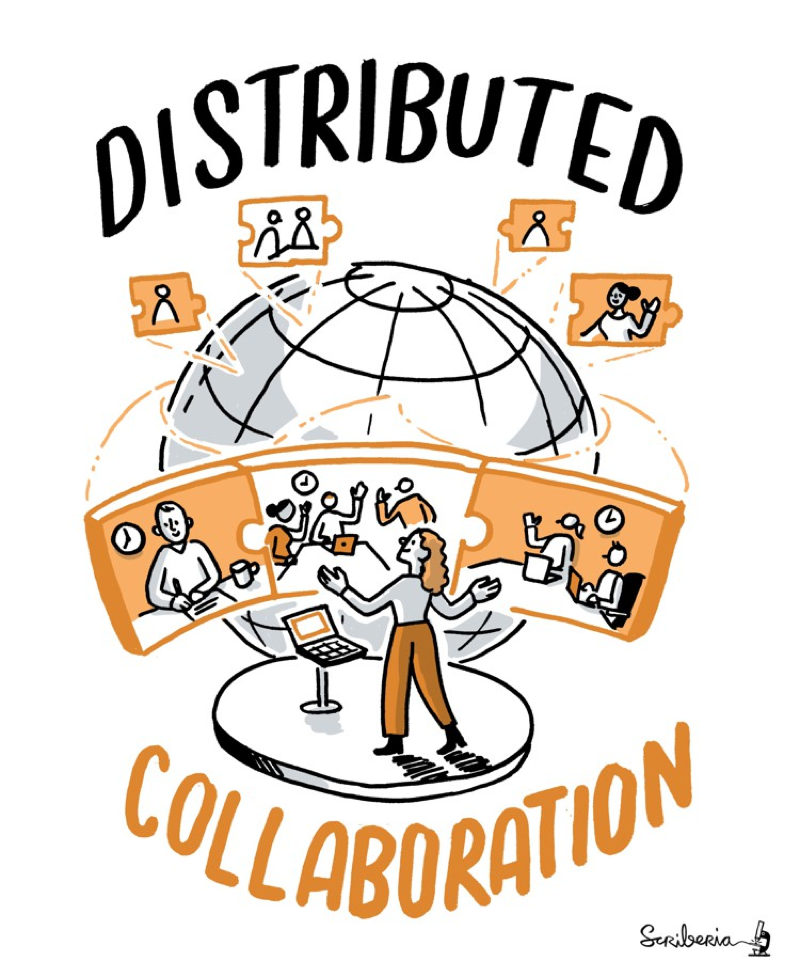
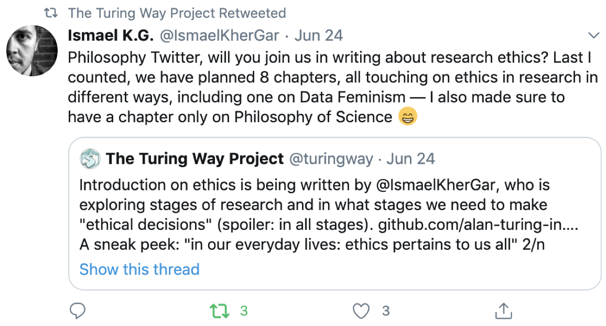
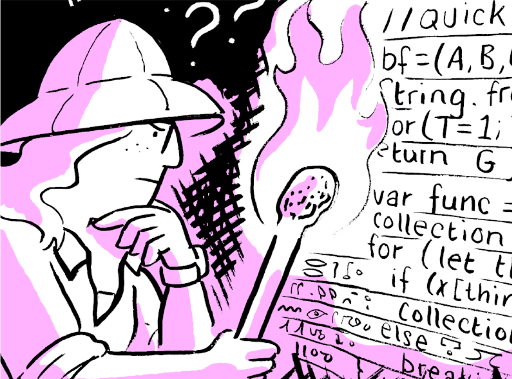
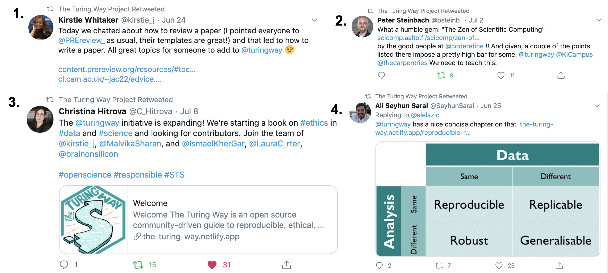

The Turing Way Newsletter: 15 July 2020

# Join today’s Collaboration Cafe, learn how you can develop chapters on ethical research and connect on Slack before you go on a summer break!

Hello Turing Way friends!

This month we have updates on how our community members have been engaging with the project by collaboratively developing plans for the Guide for Ethical Research.
Thank you Ismael Kherroubi, Christina Hitrova, Laura Carter, and Sophia Batchelor for all your hard work. 🙌

We are hosting our Collaboration Cafe today (15 July 2020) at 15:00 BST ([see in your time zone](https://arewemeetingyet.com/london/2020-07-15/15:00)) to keep it within the working hours in the European Time Zones.
But, we don't want to leave you and your colleagues out. Please reach out to us if you would like to host these coworking calls in your time zones. 🗓

Shout out to Arielle Bennett-Lovell and Heidi Siebold for sharing blog posts on The Turing Way project and its community events.👏

We will take a summer break in August (and we hope you do too!), which means you will hear from us next time in September.
Meanwhile, you can stay in touch with us by joining [our new Slack space](https://join.slack.com/t/theturingway/shared_invite/zt-fn608gvb-h_ZSpoA29cCdUwR~TIqpBw). 🏖

Find more details on these topics below 👇

## Community meetings

### Collaboration Café

Our second Collaboration Café of this month is today at 15:00 BST ([see in your local time](https://arewemeetingyet.com/london/2020-07-15/15:00)).
Find details in this [shared HackMD](https://hackmd.io/@KirstieJane/CollabCafe) and sign up to indicate your participation.

This change in schedule is to make sure that our regular attendees can still attend it during their work hour while they are working from home.
However, we want to support our contributors from different time zones as well.
To help us with that, we invite interested members to host Collaboration Cafes in their time zones especially if our coworking calls and events have not been compatible with their locations.
Please reach out to the core team members for more details by emailing [theturingway@gmail.com](mailto:theturingway@gmail.com).

### Community Coworking Call

During the lockdown, we have been hosting coworking calls regularly each week.
If you have been involved in an ongoing task in _The Turing Way_ and want to receive support from others in brainstorming, collaboration, or a dedicated space that can provide you with accountability and routine, then these calls are for you.
See the available dates and times in this [shared HackMD](https://hackmd.io/@malvikasharan/TW-coworking).

You can also subscribe to [our community calendar](https://calendar.google.com/calendar/embed?src=theturingway%40gmail.com&ctz=Europe%2FLondon) to get notified with future events.

Malvika Sharan has also proposed a chapter in the [PR #1257](https://github.com/alan-turing-institute/the-turing-way/pull/1257) that explains why we hold these calls and how you can reproduce such events in your community space.
We would love for you to review this chapter while learning about the techniques for designing coworking calls.

*Image: Online discussions with our online community, The Turing Way Community, & Scriberia. (2019, July 11)*

## News from the community

### Slack

As the number of subscribers of our [Gitter channel](https://gitter.im/alan-turing-institute/the-turing-way) is increasing, we realise the need for the structured and threaded conversation that community members can have with the core team and each other.
To facilitate such a space, we have created a dedicated [Slack channel](theturingway.slack.com) for _The Turing Way_ community members.
Join the Slack space [using this link](https://join.slack.com/t/theturingway/shared_invite/zt-fn608gvb-h_ZSpoA29cCdUwR~TIqpBw) and start connecting with others.

### Proposed Chapters for the Guide for Ethical Research

Earlier this year, _The Turing Way_ team announced that the scope of the project will now include recommendations and best practices for ethical considerations in reproducible research.
Ismael Kherroubi, Ethics Research Associate at The Alan Turing Institute has been helping gather support and co-develop plans for _The Turing Way_'s guide for Ethical Research.

Ismael and Malvika, with the support and input from our colleagues Christina Hitrova, Laura Carter, Sophia Batchelor, and the previous contributors (see the [PR #913 ](https://github.com/alan-turing-institute/the-turing-way/pull/913)) have come up with a plan to develop this guide in 7 chapters: Introduction, Benefit and Challenges, Philosophy and Science, Ethical Consideration by Research Stages, Suggested Workflows, Case Studies and Law and Policy.
Read this [Twitter Thread](https://twitter.com/turingway/status/1275843984015982592?s=20) (online [post version](https://threader.app/thread/1275843984015982592)) for a quick overview, and explore the [issues with details on GitHub](https://github.com/alan-turing-institute/the-turing-way/issues?q=is%3Aopen+is%3Aissue+label%3Aethics-book+).

We invite your contributions in developing this guide by providing support in ideation, writing, editing, reviewing, reference collection or developing illustrations.

*Image: Tweet by [Ismael Kherrubi Garcia](https://twitter.com/IsmaelKherGar/status/1275854113184587777?s=20) inviting contributions to the Guide for Ethical Research*

### New chapters on persona creation and a case study in reproducibility

In the Guide for Project Design, we have added a new chapter on Persona Creation for your project.
Persona creation tools can allow team members to collaborate efficiently with each other, develop a common understanding of their target audience, and bring design principles into their work while ultimately creating an empathetic pathway for engagement.
Read the chapter in _The Turing Way_ book, hosted online via Netlify: https://book.the-turing-way.org/project-design/persona-creation.html.

Kevin Kunzmann has written a case study to discuss the reproducible research strategy employed in their manuscript on statistical methods, and reference them back to the respective sections discussed in our Guide for Reproducible Research.
Read the [case study online](https://book.the-turing-way.org/reproducible-research/case-studies/statistical-methods-manuscript.html), which is built upon the following manuscript:

> Kunzmann, K., Grayling, M. J., Lee, K. M., Robertson, D. S., Rufibach, K., & Wason, J. (2020). A review of Bayesian perspectives on sample size derivation for confirmatory trials. arXiv preprint arXiv:2006.15715.

### New chapters proposed for the Community Handbook

Many community practices of _The Turing Way_ are derived from Open Source communities such as The Carpentries and Mozilla Foundation and have then further been adapted for our community.
The [Community Handbook](https://book.the-turing-way.org/community-handbook/community-handbook.html) has been established to capture these practices for our members and related communities to learn from them and apply in their communities.

The following pull requests (PR) are open for review and suggestions, that propose new chapters for the Community Handbook:

- A chapter on creating monthly newsletters: [PR #1251](https://github.com/alan-turing-institute/the-turing-way/pull/1251)
- Hosting _The Turing Way_ coworking calls and Collaboration Cafe: [PR #1257](https://github.com/alan-turing-institute/the-turing-way/pull/1257)
- _The Turing Way_ book dash events: [PR #1262](https://github.com/alan-turing-institute/the-turing-way/pull/1262)
- _The Turing Way_ community personas and pathways: [PR #1254](https://github.com/alan-turing-institute/the-turing-way/pull/1254)

More open PRs can be read and reviewed [on GitHub](https://github.com/alan-turing-institute/the-turing-way/pull).

*More open PRs can be read and reviewed [on GitHub](https://github.com/alan-turing-institute/the-turing-way/pull), The Turing Way Community, & Scriberia.*

## Relevant resources

### Binder resources

In case you missed it in our last newsletter, check out the Zero to Binder tutorials written for Python, R, and Julia users (see the [tutorials here](https://github.com/alan-turing-institute/the-turing-way/tree/main/workshops/boost-research-reproducibility-binder/workshop-presentations)).
This effort was coordinated by Sarah Gibson, who is giving a talk and running session at [EuroPython 2020](https://ep2020.europython.eu/profiles/sarah-gibson/) and [JuliaCon 2020](https://pretalx.com/juliacon2020/speaker/8BQNLY/) respectively.

### Resources for running online events

As we move all our meetings and conferences online due to the ongoing pandemic and lockdown, it is extremely beneficial to learn from others what best practices we can integrate into our events.
Recently, Rachael Ainsworth and Shoaib Sufi, the hosts of Software Sustainability Institute’s Collaborations Workshop 2020 (CW20), have published their lessons learned and resources for facilitating virtual unconference.
An overview can be read on [this online post](https://www.software.ac.uk/news/collaborations-workshop-2020-resources-now-available) and the entire document can be accessed on Figshare under CC-BY license at [10.6084/m9.figshare.c.5026400](https://doi.org/10.6084/m9.figshare.c.5026400.v3).

Another resource to look at is [Mentored Sprint Community Handbook](https://www.mentored-sprints.dev/) by Tania Allard and team, who run coding sprints, both in-person and online.
This community offers mentoring and support for the folks that have faced and continue to face barriers to contributing to open source.

## Tips & Tricks for new contributors

### Contributor in focus: Martina G. Vilas

*Martina G. Vilas, our July's contributor in focus*

[Martina Vilas](https://martinagvilas.github.io/) is doing her PhD in Neuroscience at the Max Planck Institute for Empirical Aesthetics in Frankfurt, Germany.
She studies how the brain processes conceptual knowledge analyzing neural recordings with computational modelling techniques.
As an advocate of open-research, she also works on improving the reproducibility of neuroscientific-analyses and enjoys contributing to open-source software projects.
Since the Book Dash in February 2020, she further pursues these interests by helping in the maintenance of _The Turing Way_ infrastructure and its reliance on _Jupyter Book_.

In her words:

> _The Turing Way_ is not only a great guide for conducting reproducible research, but it also provides a wonderful entry point into open-source contribution in general and connects you to a variety of open data-science communities.

### Applying JupyterBook features to _The Turing Way_

To ensure that the book can be read easily by everyone, including screen readers and non-native English speakers, we have compiled a set of guidelines to keep a consistent style across all chapters of the book.
This style guide is available in the Community Handbook as a chapter ([read here](https://book.the-turing-way.org/community-handbook/style.html)).

Since the current [Jupyter Book](https://jupyterbook.org/) is built upon [Sphinx](https://jupyterbook.org/reference/glossary.html#term-sphinx), several styling for _The Turing Way_ has also been updated.
Therefore, we urge you to go through our style guide and help us consistently apply it to the existing and upcoming chapters in our book.

## Acknowledgements and celebrations

### _The Turing Way_ seminar and Binder workshop

Kirstie Whitaker gave a talk at the University of Exeter Data Science Week on 27 May 2020 introducing _The Turing Way_.
If you want to learn more about where the project is currently at, see [her talk on Zenodo](https://doi.org/10.5281/zenodo.3929321).
More presentations from the community can also be found on [Zenodo's community page](https://zenodo.org/communities/the-turing-way/).

Malvika Sharan and Sarah Gibson ran a Zero to Binder workshop on 10 July at the [third Bioinformatics Residential Training](https://github.com/eanbit-rt) Course organised by [the Eastern Africa Network for Bioinformatics Training (EANBiT)](http://eanbit.icipe.org/).
EANBiT works with universities in Kenya, Uganda and Tanzania, to support curriculum development, offer MSc fellowships and provide their placement in research.
This year's residential training took place online.

### Blogs and online articles

Arielle Bennett-Lovell, wrote [a blog post on _The Turing Way_ book dash](https://www.cscce.org/2020/07/09/book-dashes-collaborative-community-events/#more-4135) based on her participation in the most recent Book Dash event in February 2020.
Arielle Bennett-Lovell is the Coordinator for the Institute for Neuroscience at the University of Cambridge and a CSCCE Community Engagement Fellows Program 2019 Fellow.

Heidi Siebold, who also attended the book dash with Arielle, has been involved in the community as one of our sustained contributors.
She wrote a post for Generation R blog platform explaining _The Turing Way_, our project vision and how practices from this community can be transferred across to different projects.
[Read her blog here](https://genr.eu/wp/a-community-handbook-for-open-data-science/).

Malvika Sharan was recently interviewed for The Alan Turing Institute’s Spotlight series, where she discussed her work as the community manager of _The Turing Way_.
You can read her interview [here](https://www.turing.ac.uk/people/spotlights/malvika-sharan).

### Tweets

_**1.** Tweet by [Kirstie Whitaker](https://twitter.com/kirstie_j/status/1275688758097129481?s=20) inviting a chapter contribution on writing and reviewing papers, **2.** Tweet by [Peter Steinbach](https://twitter.com/psteinb_/status/1278654028373790720?s=20) highlighting resources to be considered in The Turing Way, **3.** Tweet by [Christina Hitrova](https://twitter.com/C_Hitrova/status/1280966020082139136?s=20) sharing the recent development in the Guide for Ethical Research, and **4.** Tweet by [Ali Seyhun Saral](https://twitter.com/SeyhunSaral/status/1276276376182624263?s=20) sharing our classic table illustrating what we mean by reproducibility, replicability, robust and generalisable in The Turing Way._

## Connect with us!

- [About the project](https://www.turing.ac.uk/research/research-projects/turing-way-handbook-reproducible-data-science)
- [_The Turing Way_ book](https://book.the-turing-way.org)
- [GitHub repository](https://github.com/alan-turing-institute/the-turing-way)
- [Gitter chat room](https://gitter.im/alan-turing-institute/the-turing-way)
- [YouTube Videos](https://www.youtube.com/channel/UCPDxZv5BMzAw0mPobCbMNuA)
- [Twitter Channel](https://twitter.com/turingway)

You are welcome to contribute content for the next newsletter by emailing [Malvika Sharan](mailto:msharan@turing.ac.uk).

*Did you miss the last newsletters?*
*Check them out [here](https://tinyletter.com/TuringWay/archive).*
