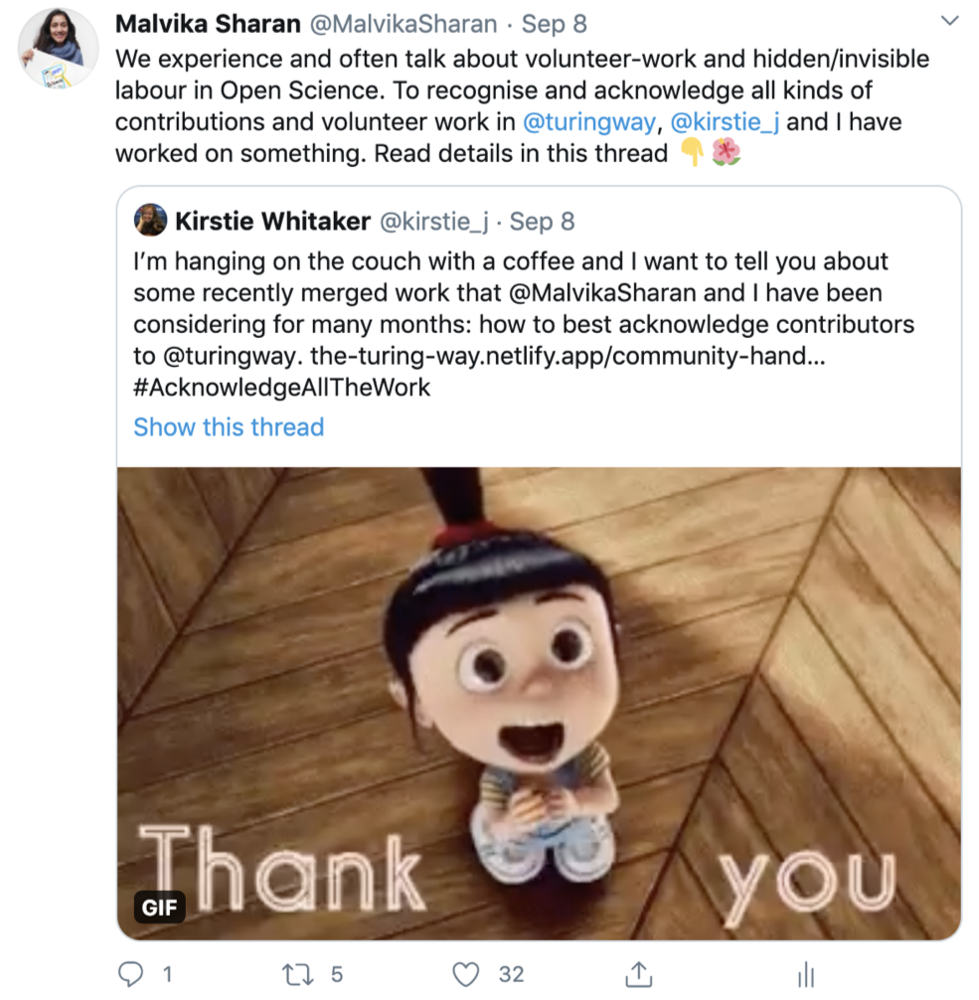
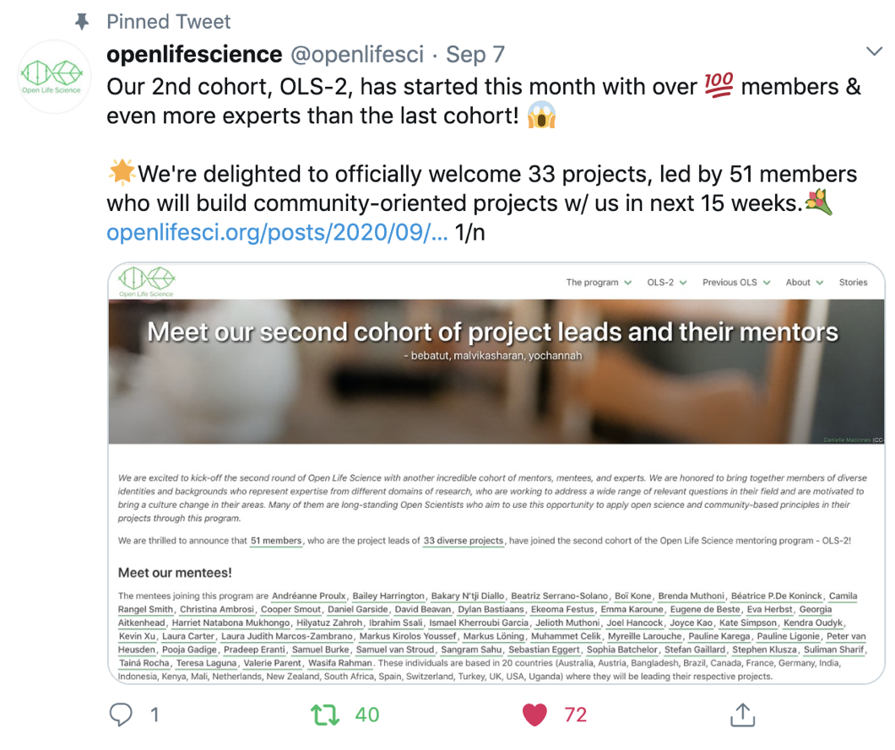
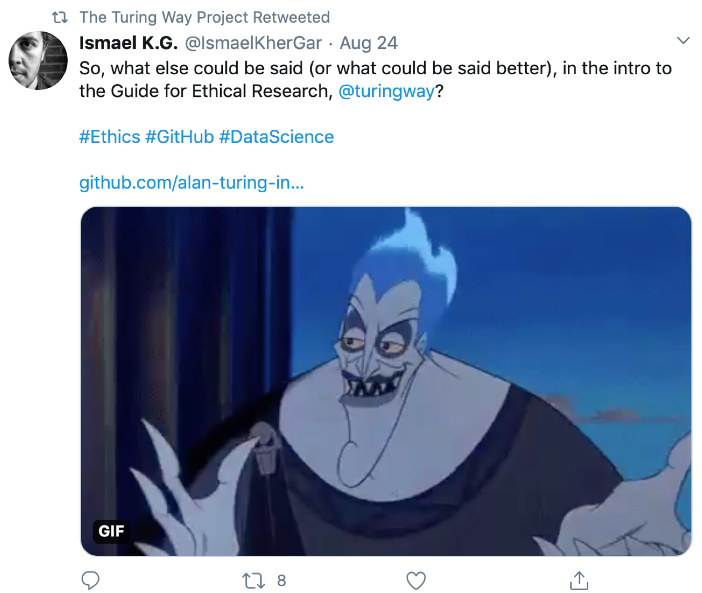
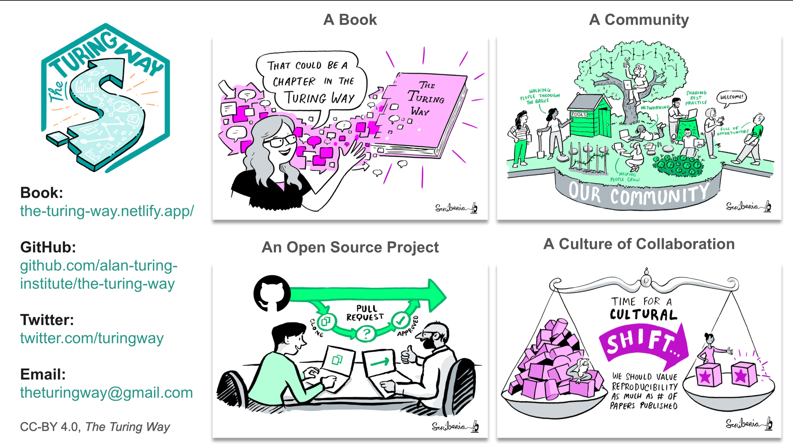
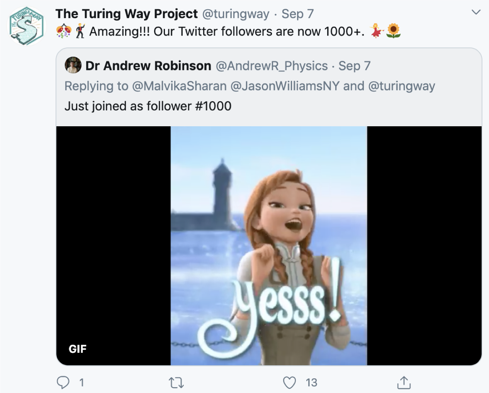
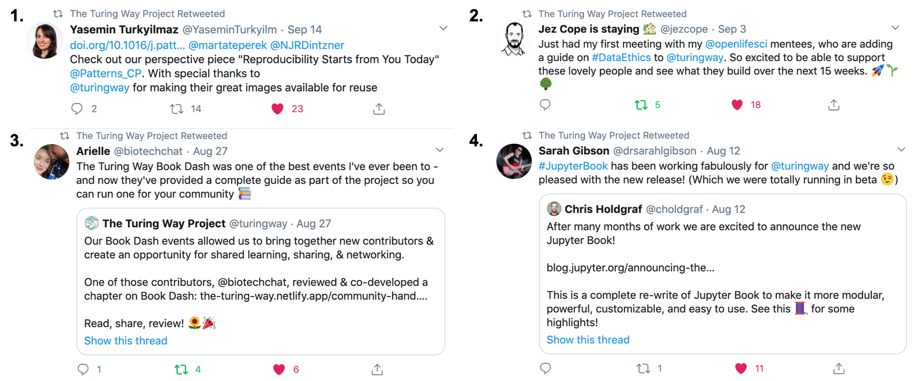

The Turing Way Newsletter: 16 September 2020

# We are back with our coworking calls and welcome you to read the contributor acknowledgment processes

Hello Turing Way friends!

We hope you all are keeping well. Here's what you missed in August:

- We published a chapter on Book Dash events in the [Community Handbook](https://book.the-turing-way.org/community-handbook/community-handbook.html) (there will be another event coming in November 🗓)
- We released the [acknowledgement chapter](book.the-turing-way.org/community-handbook/acknowledgement.html) on how The Turing Way supports and recognises contributors (Your feedback and suggestions are very welcome on all these resources. 🙌)
- The second cohort of Open Life Science will involve 12 members who are joining the [OLS-2 for Turing Collaboration](https://openlifesci.org/ols-2#collaborators) with 6 projects. Congratulations! 🎉
- Esther Plomp represented _The Turing Way_ in two conferences by giving lightning talks. Thank you! 💐

More details on these can be found below the details on Community Meetings👇 

## Community meetings

### Collaboration Cafés

This month we resumed hosting our [Collaboration Café](https://book.the-turing-way.org/community-handbook/coworking/coworking-collabcafe.html) on 2 September 2020.
We will continue hosting these calls on the first and third Wednesdays of each month, details for which are provided below.
Please sign up to let the core team know that you will join: [https://hackmd.io/@KirstieJane/CollabCafe](https://hackmd.io/@KirstieJane/CollabCafe).

Dates and time for the upcoming Collaboration Cafés:
- 16 September: 15:00 - 17:00 BST ([see in your time zone](https://arewemeetingyet.com/London/2020-09-16/15:00/TheTuringWay-CollaborationCafe#eyJ1cmwiOiJodHRwczovL2hhY2ttZC5pby9AS2lyc3RpZUphbmUvQ29sbGFiQ2FmZSJ9))
- 07 October: 15:00 - 17:00 BST ([see in your time zone]())

### Coworking calls

Since April 2020 we have been hosting the community [coworking calls](https://book.the-turing-way.org/community-handbook/coworking/coworking-weekly.html) where anyone from the community can join the [Pomodoro sessions](https://book.the-turing-way.org/community-handbook/coworking/coworking-motivation.html#pomodoro-technique) and discuss their work with the core team members.
For the rest of this year, we will be hosting these coworking calls each week on Monday and Thursday at 11:00 - 12:00 BST ([time for the next meeting in your time zone](https://arewemeetingyet.com/London/2020-09-17/11:00)). 
Sign up on this HackMD [https://hackmd.io/@malvikasharan/TW-coworking](https://hackmd.io/@malvikasharan/TW-coworking).

Dates for the upcoming Coworking calls:
  - Dates in September 2020: 17th, 21st, 24th and 28th
  - Dates in October 2020: 1st, 5th, 8th, 12th, and 15th

Additional time compatible for Latin American Time Zones, which are co-hosted with [Laura Acion](https://twitter.com/_lacion_):
  - Dates in September 2020: 23rd
  - Dates in October 2020: 14th

If you would like to receive automatic updates on these meetings, please [subscribe to the calendar](https://calendar.google.com/calendar/embed?src=theturingway%40gmail.com&ctz=Europe%2FLondon) and/or the announcement channel of our [Slack space](https://join.slack.com/t/theturingway/shared_invite/zt-fn608gvb-h_ZSpoA29cCdUwR~TIqpBw).

## News from the community

### Acknowledging our community members

We value and appreciate all the collaborative work that happens in _The Turing Way_, from fixing bugs to writing a chapter to hosting an event, and we are committed to acknowledging them all appropriately. 

Last week, we released the [Acknowledgement chapter](https://book.the-turing-way.org/community-handbook/acknowledgement.html) that describes our process of recording all the contributions and how we recognise them.
In this chapter, we provide details on how we create opportunities for shared ownership of this project and create a record of contributions with the [Contributor’s Table](https://github.com/alan-turing-institute/the-turing-way#contributors) and [contributors.md](https://github.com/alan-turing-institute/the-turing-way/blob/main/contributors.md) files.
These documents can be updated by all our contributors and used for highlighting their work in a manner that is most meaningful and useful for them.
We welcome all our past and current contributors to check our record and update it by adding details and personal highlights from their contributions in [contributors.md](https://github.com/alan-turing-institute/the-turing-way/blob/main/contributors.md).
 

*Read a detailed [thread by Kirstie Whitaker](https://twitter.com/kirstie_j/status/1303335123656626177?s=20) describing the main highlights from the Acknowledgement chapter*

### New chapters in the Community Handbook

We have 3 additional chapters in our [Community Handbook](https://book.the-turing-way.org/community-handbook/community-handbook.html): [Monthly Newsletter](https://book.the-turing-way.org/community-handbook/newsletters.html), [Book Dash Events](https://book.the-turing-way.org/community-handbook/bookdash.html), and [Community Coworking Calls](https://book.the-turing-way.org/community-handbook/coworking.html).
These chapters cover different community practices of _The Turing Way_ that will be helpful for our community members in their participation.
These are complemented by [various templates](https://book.the-turing-way.org/community-handbook/templates.html) that can be easily reused, remixed and adapted by others.
Though written for _The Turing Way_ community, these resources will be useful for other Open Source community projects as well.

### 6 projects to be mentored and trained in Open Life Science

12 members from _The Turing Way_ and The Alan Turing Institute have joined the second cohort of Open Life Science with [6 projects](https://github.com/alan-turing-institute/the-turing-way/tree/main/open-life-science-mentoring#ols-2-for-turing-projects) under the collaboration [OLS-2 for Turing](https://openlifesci.org/ols-2#collaborators).
Congratulations [Sophia Batchelor](https://openlifesci.org/ols-2/projects-participants/#BrainonSilicon), [Ismael Kherroubi Garcia](https://openlifesci.org/ols-2/projects-participants/#Ismael-KG), [Laura Carter](https://openlifesci.org/ols-2/projects-participants/#LauraCarter), [Markus Löning](https://openlifesci.org/ols-2/projects-participants/#mloning), [Camila Rangel Smith](https://openlifesci.org/ols-2/projects-participants/#crangelsmith), [David Beavan](https://openlifesci.org/ols-2/projects-participants/#DavidBeavan), [Samuel van Stroud](https://openlifesci.org/ols-2/projects-participants/#samvanstroud), [Kevin Xu](https://openlifesci.org/ols-2/projects-participants/#Kevinxufs), [Neha Moopen](https://openlifesci.org/ols-2/projects-participants/#NehaMoopen), [Kate Simpson](https://openlifesci.org/ols-2/projects-participants/#KateSimpson), [Georgia Aitkenhead](https://openlifesci.org/ols-2/projects-participants/#GeorgiaHCA) and [Katharina Kloppenborg](https://openlifesci.org/ols-2/projects-participants/#katoss). 
They will be mentored by [Jez Cope](https://openlifesci.org/ols-2#jezcope), [Anjali Mazumdar](https://openlifesci.org/ols-2#anjali-mazumder), [Martina Vilas](https://openlifesci.org/ols-2#martinagvilas), [Yo Yehudi](https://openlifesci.org/ols-2#yochannah), [Samuel Guay](https://openlifesci.org/ols-2#SamGuay), [Arielle Bennett](https://openlifesci.org/ols-2#ArielleBL) and [Anelda van der Walt](https://openlifesci.org/ols-2#anelda).
Two more mentors [Sarah Gibson](https://openlifesci.org/ols-2#sgibson91) and [Markus Löning](https://openlifesci.org/ols-2#mloning) will mentor 1 project each in the program.
Read more details about these and the other 27 projects in [this blog post](https://openlifesci.org/posts/2020/09/01/ols2-announcement/).

**Congratulations to all the Open Life Science project leads!**

*[Open Life Science tweet](https://twitter.com/openlifesci/status/1302923905548668928?s=20) announcing its second cohort members, including the members joining under the OLS-2 for Turing Collaboration.*

### Participating in the Google Season of Docs 

_The Turing Way_’s application has been accepted to involve a technical writer during this year’s [Google Seasons of Doc](https://developers.google.com/season-of-docs/docs/participants).
You can read the [full proposal here](https://developers.google.com/season-of-docs/docs/participants/project-incf-pgadige).
In this proposal we have set three major technical writing goals: 
1. Retrospective consistency across the entire book to create a coherent feel and style. 
2. Contributing to future maintenance by developing user documentation and guiding resources to support its contributors and maintainers. 
3. Improving the overall accessibility of the online book to improve access to information and its user-friendliness.

We will be looking into ways to collaborate with our community members in achieving these goals as our technical writer develops and leads initiatives within _The Turing Way_.

## Contributor in focus: Ismael Kherroubi Garcia

[Ismael Kherroubi Garcia](https://twitter.com/IsmaelKherGar) is an Ethics Research Assistant at the Alan Turing Institute.
He has a BSc in Business Management and Administration and is currently working towards an MSc in Philosophy of the Social Sciences.
Ismael has been working with _The Turing Way_ core team to engage the community of researchers in designing and developing the [Guide for Ethical Research](https://book.the-turing-way.org/ethical-research/ethical-research.html).

In his words:
> Since my undergraduate degree, I have worked in fintech and then in arts organisations within human resources teams, finally reaching the Alan Turing Institute and helping support the Ethics Advisory Group.
> I think my highlight is that I've got a great background as a generalist!
> I am currently really thrilled to be working alongside [Laura Carter](https://github.com/LauraCarter) and [Sophia Batchelor](https://github.com/BrainonSilicon) to build a community around the Guide for Ethical Research!
> I am really fascinated by philosophical discussions about the social sciences, so I love the thought of questioning what an open science culture looks like and how to get there!

[Ismael’s Tweet](https://twitter.com/IsmaelKherGar/status/1297953105183735814?s=20) inviting feedback and collaboration on developing chapters in the guide for Ethical Research.

## Relevant resources

*The Turing Way is a book, an open source project and a community that promotes a culture of collaboration*

### Promotion pack for representing _The Turing Way_

We would LOVE for anyone from our community, our past or present contributors to give talks about the project or represent The Turing Way in other ways! 
We have created a [promotion pack](https://github.com/alan-turing-institute/the-turing-way/tree/main/communications/promotion-pack) for you to reuse, remix and adapt for your use.
Links to all the presentations along with the abstracts are stored on our GitHub repository](https://github.com/alan-turing-institute/the-turing-way/tree/main/conferences).
We have also created a list of [frequently asked questions](https://github.com/alan-turing-institute/the-turing-way/blob/main/communications/promotion-pack/faqs.md) to complement the presentation materials.
If you would like to represent the project in your network, please open an [issue on GitHub](https://github.com/alan-turing-institute/the-turing-way/issues) and connect with core team members to receive any support that will help you in preparing for your event.

### Articles and blogs

- [Low availability of code in ecology: A call for urgent action](https://www.ncbi.nlm.nih.gov/pmc/articles/PMC7386629/). Culina, A., van den Berg, I., Evans, S., & Sánchez-Tójar, A. (2020). PLoS biology, 18(7), e3000763. https://doi.org/10.1371/journal.pbio.3000763
- [Reproducibility Starts from You Today](https://www.sciencedirect.com/science/article/pii/S2666389920301331), Turkyilmaz-van der Velden, Y., Dintzner, N., Teperek, M. (2020), Patterns Volume 1, Issue 6, 100099, https://doi.org/10.1016/j.patter.2020.100099
- [Git or Perish](https://blogs.egu.eu/divisions/sm/2020/08/25/git-or-perish/), Tsekhmistrenko M. August 25, 2020, The European Geosciences Union (EGU) blogs 
- [Challenging power in data science](https://www.turing.ac.uk/blog/challenging-power-data-science), Kherroubi Garcia, I. 2020, The Alan Turing Institute
- [Simulation Replication Challenge](https://www.replisims.org/), Lohmann, A., Groenwold, G., Luijken, K. (2020), https://github.com/replisims

## Upcoming and past events

### BioHackathon-EU in November

_The Turing Way_ is participating in this year’s [BioHackathon-EU](https://www.biohackathon-europe.org) that is taking place online from 9 to 13 November as one of the selected projects. 
Read the abstract [here](https://github.com/elixir-europe/BioHackathon-projects-2020/tree/master/projects/9).
Hosted by [ELIXIR-EU](https://elixir-europe.org/), BioHackathon is a great opportunity for researchers to work together on different projects and exchange current practices in bioinformatics.
You can [register by 18 September 2020](https://www.biohackathon-europe.org/registration.html) and join the core team members to work on _The Turing Way_ and/or other projects.

### Book Dash event in November

The next Book Dash will be hosted in November in parallel to the BioHackathon from 9 to 13 November 2020.
The [Book Dash event](https://book.the-turing-way.org/community-handbook/bookdash.html) is a collaborative community event that brings together individuals interested in developing chapters in _The Turing Way_ [online book](https://book.the-turing-way.org).
The call for application will be opened soon. 
Look out for notifications on Slack, Twitter and the mailing list in a couple of weeks (links at the end of this newsletter).

Meanwhile, you can read the report from our last Book Dash events [on GitHub](https://github.com/alan-turing-institute/the-turing-way/tree/main/workshops/book-dash).

### Talks and videos from previous events

Kirstie Whitaker was invited to give a public talk at the Data Science for Social Good - DSSGx UK programme.
Her talk on replicable AI and The Turing Way, a handbook for best practice in academic data science, which is currently in development is available on Zenodo ([https://zenodo.org/record/3959180](https://zenodo.org/record/3959180)).

Thanks to Esther Plomp for presenting two lightning talks in August 2020 about _The Turing Way_ at [FORCE 11 2020](https://www.force11.org/fsci/2020) and [CarpantryCon @ Home 2020](https://2020.carpentrycon.org/).
Both the presentations are available on Zenodo ([https://zenodo.org/record/3968454](https://zenodo.org/record/3968454) and [https://zenodo.org/record/3979179](https://zenodo.org/record/3979179)) under CC-BY license for reuse.

I (Malvika Sharan, Community Manager of _The Turing Way_) participated in three different panels Last month. 
The Open Science Seminar at EANBiT Virtual Training 2020 was organised by Caleb Kibet, a bioinformatics researcher from Kenya and a Mozilla fellow, where I talked about [sharing and learning research skills collaboratively](https://zenodo.org/record/3968440).
At the MIT Experiential Ethics Class 2020, I presented [ _The Turing Way_ guide for Ethical Research](https://zenodo.org/record/3968454).
At the EuroScience Forum 2020, I joined the DORA panel to discuss [challenges in assessing contributions to reproducible research and Open Science](https://zenodo.org/record/4013300).

## Acknowledgements and celebrations

*[Subtweeting](https://twitter.com/turingway/status/1302955528738484224?s=20) a [tweet by Dr. Andrew Robinson](https://twitter.com/AndrewR_Physics/status/1302953236056420353?s=20), our 1000th follower on Twitter!*

### Our community is growing, and we thank you for that!

Thank you for engaging with the project formally and informally on Twitter, Slack and Gitter channels.
We are grateful to be able to create a collaborative platform where each of your contributions makes a huge difference in sharing best practices for reproducible, ethical and inclusive research more widely.
A massive thank you for your support towards this project and the members of this growing community.

### Online mentions

**1.** [Yasemin Turkyilmaz’s Tweet](https://twitter.com/YaseminTurkyilm/status/1305476188379525121?s=20) about her recent publication.
**2.** [Jez Cope’s Tweet](https://twitter.com/jezcope/status/1301471507785408514?s=20) about his mentoring role for one of the teams leading an OLS project under OLS-2 for Turing.
**3.** [Arielle Bennett’s Tweet](https://twitter.com/biotechchat/status/1298940206071119873?s=20) about her participation at our last book dash.
**4.** [Sarah Gibson subtweeting](https://twitter.com/drsarahlgibson/status/1293640024727191552?s=20) Chris Holdgraf who announced the release of a new version of JupyterBook.

***Thank you Sophia Batchelor and Ismael K.G. for reviewing this month's newsletter!*** 👏

## Connect with us!

- [About the project](https://www.turing.ac.uk/research/research-projects/turing-way-handbook-reproducible-data-science)
- [_The Turing Way_ book](https://book.the-turing-way.org)
- [GitHub repository](https://github.com/alan-turing-institute/the-turing-way)
- [Gitter chat room](https://gitter.im/alan-turing-institute/the-turing-way)
- [YouTube Videos](https://www.youtube.com/channel/UCPDxZv5BMzAw0mPobCbMNuA)
- [Twitter Channel](https://twitter.com/turingway)

You are welcome to contribute content for the next newsletter by
emailing [Malvika Sharan](mailto:msharan@turing.ac.uk).

*Did you miss the last newsletters?*
*Check them out [here](https://tinyletter.com/TuringWay/archive).*
