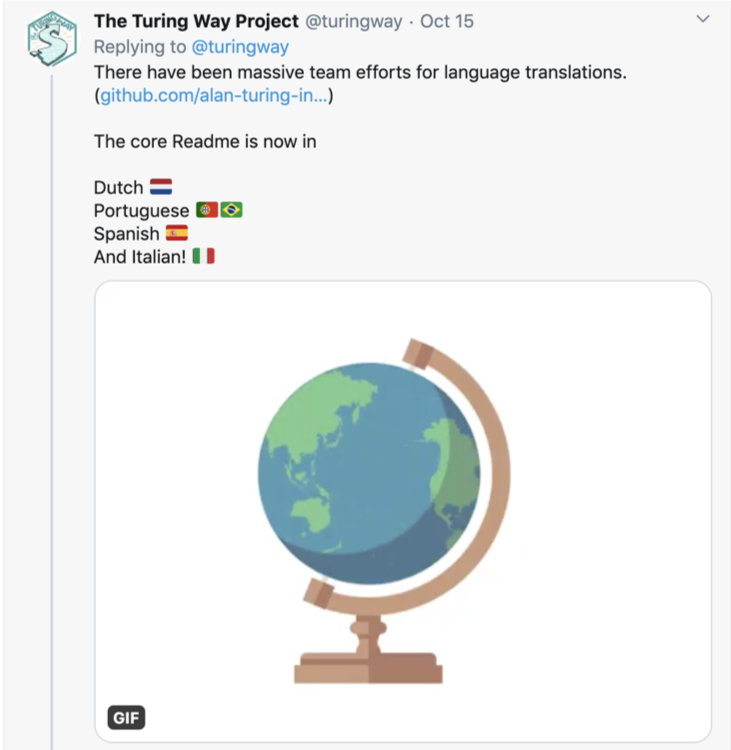
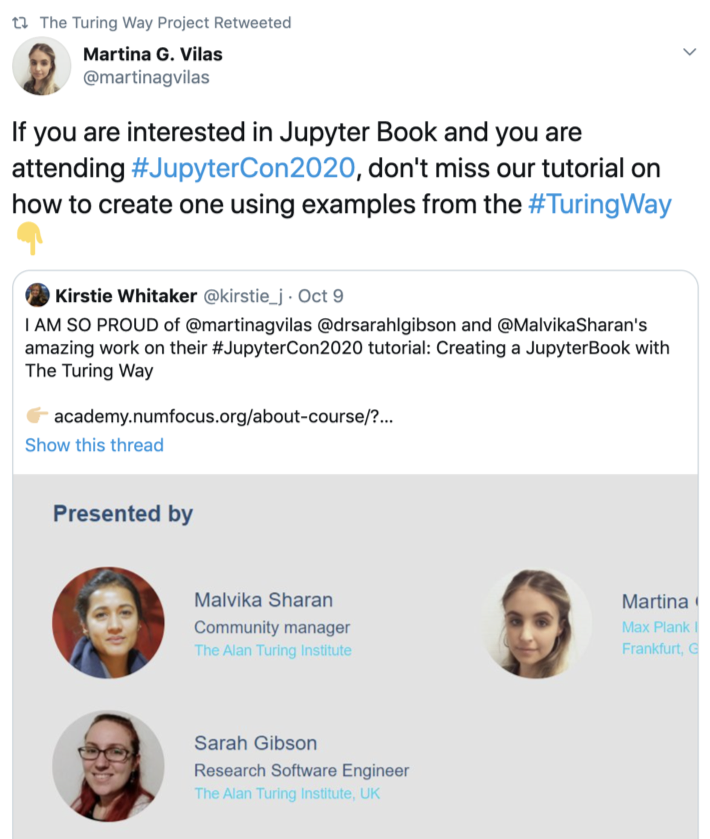
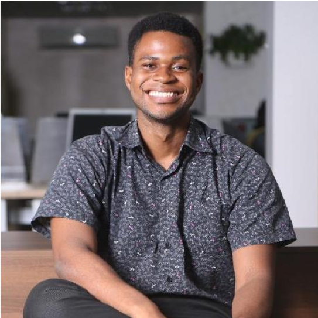
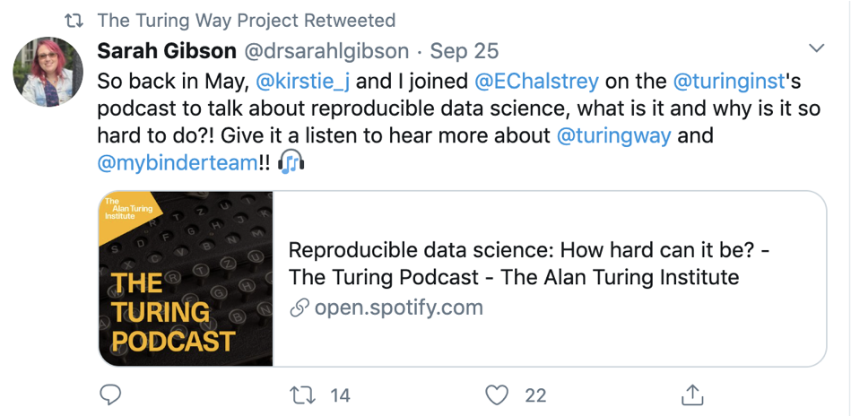
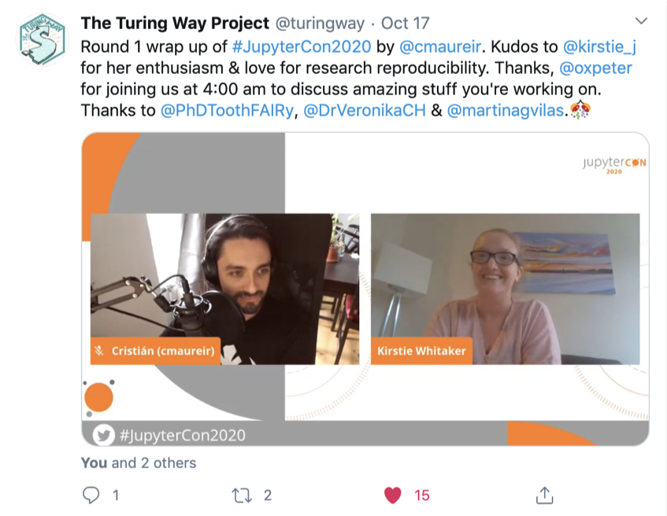
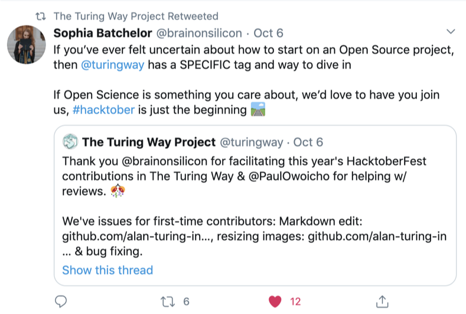
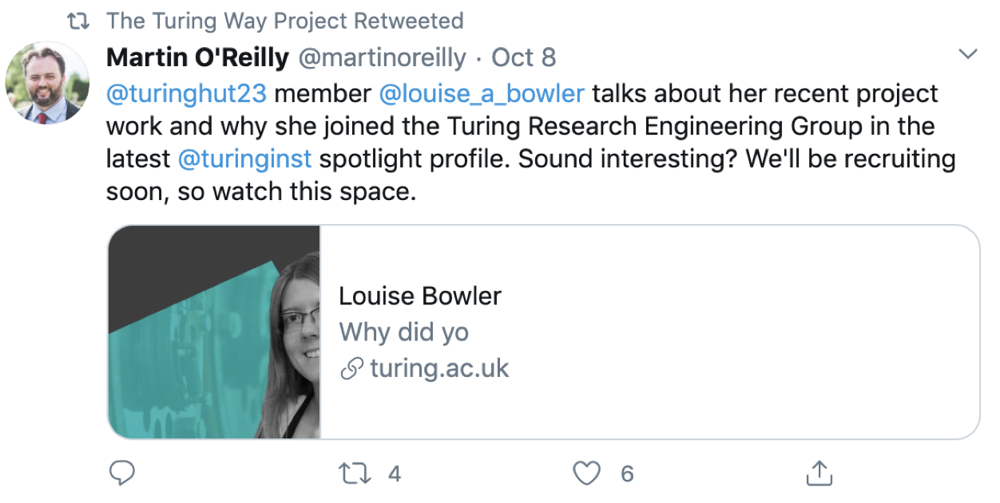
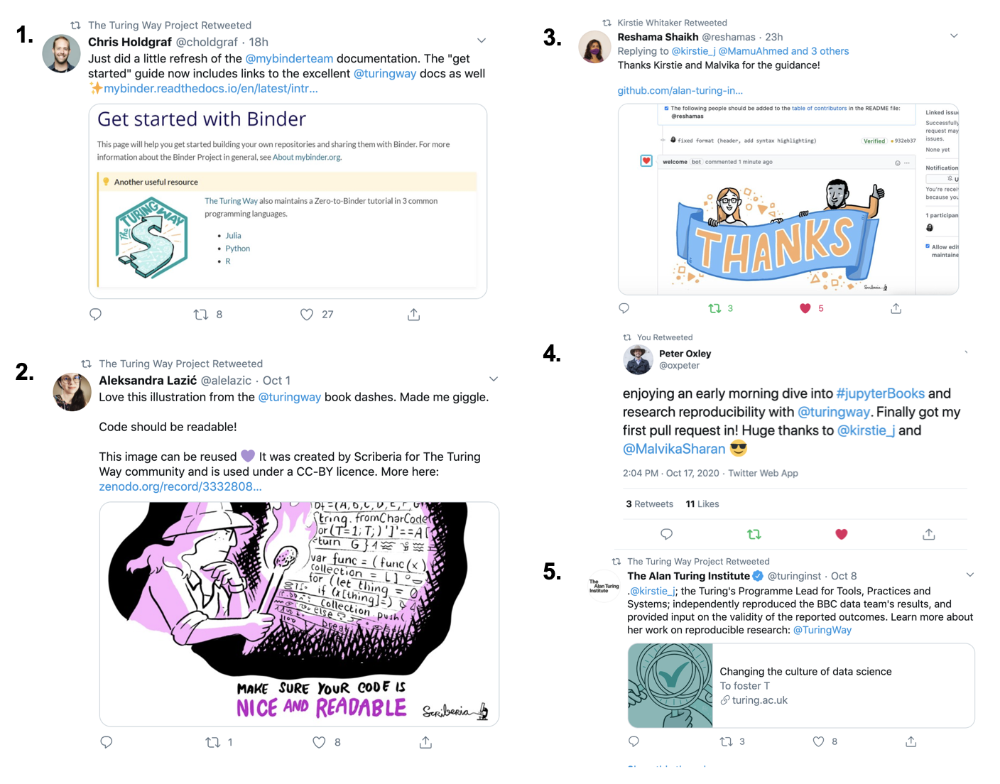

The Turing Way Newsletter: 19 October 2020

# Send your application for the Book Dash event and read updates from our fabulous community!

Hello Turing Way friends!

This month has been busy! Here is what we have been up to:

* 📢 Call for application is open for the upcoming [Book Dash](https://the-turing-way.netlify.app/community-handbook/bookdash.html) with participation support grant — send your application by 22 October 2020.
* 🌍 Hacktoberfest contributors are helping fix bugs and translating our README.md files in multiple languages — Thanks Sophia Batchelor and Paul Owoicho for facilitating these contributions.
* 📖 We have created a tutorial on Jupyter Book with _The Turing Way_ — Thanks Martina G. Vilas, Sarah Gibson and Christ Holdgraf for your contributions.
* 🗓 We are planning a community share-out event on 13 November — Have an idea to make this event truly inclusive for you? Connect with us.

See you at one of the community meetings!

Find more details on these topics below 👇

## Community meetings

### Call for application for the upcoming Book Dash

We invite you to submit your application to participate in the upcoming Book Dash taking place online from 9-13 November 2020: https://forms.gle/usZkYogVfH2nhNjh7. The deadline is 22 October 2020.
The Turing Way Book Dash is a collaborative event where you’ll work with others to add to and improve The Turing Way book.
Successful applicants will be able to claim financial reimbursement to support their participation as laid out in the online chapter: https://the-turing-way.netlify.app/community-handbook/bookdash.html.

### Collaboration Café

The second Collaboration Cafe of this month is 21 October 2020 from 15:00 - 17:00 BST ([add the schedule to your calendar in your time zone](https://arewemeetingyet.com/London/2020-10-21/15:00/TheTuringWay-CollaborationCafe)).
You can see the full agenda on this HackMD: https://hackmd.io/@turingway/collaboration-cafe.
More information about the event is available in the [Community Handbook](https://the-turing-way.netlify.app/community-handbook/coworking.html).
If you are planning to send your application for the Book Dash, this call will be a good chance to get your questions answered by one of the team members.

Please sign up to let us know that you will join.
* Next Collaboration Cafes will take place on 4 November ([in your time zone](https://arewemeetingyet.com/London/2020-11-04/15:00)) and 18 November ([in your time zone](https://arewemeetingyet.com/London/2020-11-18/15:00)).

### Weekly Coworking Calls: 

We are continuing to host multiple coworking calls (1 hour each) weekly.
Bookmark this document, and sign up to join one or multiple of these sessions: https://hackmd.io/@turingway/coworking-call.
* Dates in October: 22, 26 and 29 from 11:00 - 12:00 London time ([first meeting in your time zone](https://arewemeetingyet.com/London/2020-10-22/11:00))
  * Additional slot in Latin American time: 28 October, 15:00 - 16:00 London ([first meeting in * your time zone](https://arewemeetingyet.com/London/2020-10-28/15:00))
Dates in November 2, 5, 16 and 19 November from 11:00 - 12:00 London time ([first meeting in your time zone](https://arewemeetingyet.com/London/2020-11-02/11:00))

## News from the community

### README file available in multiple languages

*[The Turing Way](https://twitter.com/turingway/status/1316750745228713984?s=20) announces the newly translated README files in Dutch, Italian, Spanish and Portuguese*

Thanks to our HackberFest contributors for translating and reviewing _The Turing Way_ README.md file in multiple languages.
The file has been translated in Dutch (by Esther Plomp and Stefan Janssen), Italian (by Angelo Varlotta and Luca Bertinetto), Spanish (by Camila Rangel-Smith, Reina Camacho Toro and Laura Acion) and Portuguese (by Romero Silva and Gustavo Becelli do Nacimento), which are available in our [GitHub repository](https://github.com/alan-turing-institute/the-turing-way/tree/master/README-translated).
Translation in more languages including French, German, Indonesian and Turkish are ongoing with the help of different contributors (see [GitHub issue #1335](https://github.com/alan-turing-institute/the-turing-way/issues/1335)). 

### Tutorial on Jupyter Book with _The Turing Way_

Malvika Sharan, Martina Vilas and Sarah Gibson have put together a tutorial on Jupyter Book using chapters from _The Turing Way_.
This tutorial was developed and launched at the JupyterCon 2020, and is available on [GitHub](https://github.com/jupytercon/2020-jupyterbook-with-turing-way) under a CC-BY 4.0 and MIT license.
Through a step-by-step guide in 7 modules, you will learn about the collaborative nature of both projects and create your own Jupyter Book using files and chapters from The Turing Way as examples.
Each module comes with a Jupyter Notebook ([notebooks](https://github.com/jupytercon/2020-jupyterbook-with-turing-way/blob/master/notebooks)) and an introductory video available in this [YouTube playlist](https://www.youtube.com/playlist?list=PLBxcQEfGu3Dmdo6oKg6o9V7Q_e7WSX-vu).
Please test this tutorial, and share your feedback with us so that we can improve and further develop this resource.
 

[Martina quote Tweeting Kirstie’s tweet](https://twitter.com/martinagvilas/status/1314497921455357952?s=20 about their Jupyter Book tutorial at JupyterCon 2020
 
### Contributors record with collaborating organisations

Last month, we announced the publication of our Contributors Record online in the [Afterword section of _The Turing Way_](https://the-turing-way.netlify.app/afterword/contributors-record.html).
As described in our [acknowledgement chapter](https://the-turing-way.netlify.app/community-handbook/acknowledgement/acknowledgement-examples.html#organisational-support), we also want to use this document to highlight collaborative efforts made by our contributors with the help of their organisations.
Thanks to [Carlos Martinez Oritz](https://the-turing-way.netlify.app/afterword/contributors-record.html#carlos-martinez-oritz) and [Mateusz Kuzak](https://the-turing-way.netlify.app/afterword/contributors-record.html#mateusz-kuzak), we have added the first entry about the [Netherlands eScience Center](https://www.esciencecenter.nl/) under the [Collaborating Organisation](https://the-turing-way.netlify.app/afterword/contributors-record.html#collaborating-organisations) section.
If you have participated in _The Turing Way_ with the support of your organisation, we invite you to expand this section by adding relevant details.

## Contributor in focus: Paul Owoicho

We are delighted to introduce you to our Google Season of Doc (GSoD) intern, Paul Owoicho.
Paul has a BSc in Software Engineering from the American University of Nigeria, and an MSc in Data Science from the University of Glasgow. 
He will be working with us for the next few months in the role of a technical writer, providing editorial support in the project. 
Together with Neha Moppen, he is participating in Open Life science with a project to embed accessibility in _The Turing Way_ guide, where he will receive training and mentorship on Open Science and community skills ([project detail](https://openlifesci.org/ols-2/projects-participants/)).

In his words:
> The Turing Way is my first foray into open source and has been a fantastic learning experience. 
> Not only have I gained a deeper understanding and appreciation for how GitHub works, but I am also learning to prioritise sustainability and empowerment in the work that I do. 
> Soon, I hope to begin a PhD that explores how conversational search can be made more effective with the use of clarifying questions

Read more about him in our [Contributors Record online](https://the-turing-way.netlify.app/afterword/contributors-record.html#paul-owoicho).

## Relevant resources

### Papers and manuscripts

* YaseminTurkyilmaz-van der Velden, Nicolas Dintzner, Marta Teperek, (2020, September). Reproducibility Starts from You Today. PATTER, 1(6). doi: 10.1016/j.patter.2020.100099

* Kirstie J. Whitaker, Olivia Guest, (2020, October), #bropenscience is broken science. The Psychologist. [November 2020Vol.33 (pp.34-37)](https://thepsychologist.bps.org.uk/volume-33/november-2020/bropenscience-broken-science
  * Kirstie Whitaker shared a [Tweet thread](https://twitter.com/kirstie_j/status/1316295588296753152?s=20) with a background on how this article was developed by the authors.

### Podcast recommendation

Ed Chalstrey invited Sarah Gibson and Kirstie Whitaker to be featured on [The Turing Podcast](https://podcasts.apple.com/gb/podcast/reproducible-data-science-how-hard-can-it-be/id1504860303?i=1000492423241). 
This episode was published under the title “Reproducible Data science: How hard can it be?”, where both Kirstie and Sarah discuss how they facilitate research reproducibility through their work.
 
 
*[Sarah Gibson Tweets](https://twitter.com/drsarahlgibson/status/1309489395175751690?s=20) about the Turing Podcast episode where Ed invited her and Kirstie to talk about the reproducibility of scientific research.*

## Upcoming and past events

### Community share-out event on 13 November

The upcoming Book Dash will take place from 9 to 13 November.
On the last day of the Book Dash event, 13 November, we will host 4 open sessions for community share-out and celebrations of contributions from our community members.
These contributions won’t only include the Book Dash attendees, but anyone who would like to join us on the day to share their contributions made in _The Turing Way_ or hear what others have worked on.
More information will be shared on the GitHub repository on the [issue #1450](https://github.com/alan-turing-institute/the-turing-way/issues/1450).
Comments and suggestions are very welcome as comments under this issue.

### _The Turing Way_ at JupyterCon 2020

The JupyterCon 2020 conference took place online from 5 to 17 October 2020 (see [event page](https://jupytercon.com/)).
_The Turing Way_ participated in its tutorial track from 5 to 9 October with the tutorial [Jupyter Book with _The Turing Way_](https://github.com/jupytercon/2020-jupyterbook-with-turing-way), developed by Malvika Sharan, Martina Vilas and Sarah Gibson, with the support of Christ Holdgraf and Kirstie Whitaker.
Several members attended the main conference, which featured talks on Jupyter software, standards, community and governance.
These talks were live-streamed for registered participants, which will be made available on their [YouTube channel](https://www.youtube.com/playlist?list=PL055Epbe6d5aP6Ru42r7hk68GTSaclYgi).
On 17 October 2020, _The Turing Way_  project lead, Kirstie Whitaker and Malvika Sharan participated in the JupyterCon sprint, details for which are available on this [HackMD document](https://hackmd.io/@turingway/JC2020-sprint).
Thanks to Peter Oxley, Reshama Shaikh, Mariam Ahmed, Martina Vilas, Veronika Cheplygina and Esther Plomp for joining us online for coworking and coffee breaks.

*Kirstie Whitaker presented the Sprint plan for _The Turing Way at the JupyterCon 2020, [Tweet from @turingway](_https://twitter.com/turingway/status/1317482918399311873?s=20).*

### More from our friends and community members

#### Ally Skills workshop: 4 December 2020

The Open Life Science team members will offer virtual Ally Skills workshops on December 4 2020. 
Participants of this workshop will learn about and practice simple daily techniques to make their workplace and communities more inclusive. 
Read more about the workshop in [this blog post](https://openlifesci.org/posts/2020/10/05/ally-skills-training/).

Two training sessions are scheduled to accommodate participants in different time zones.
* Workshop 1: 09:00 UTC - 12:00 UTC [Check your time](https://arewemeetingyet.com/UTC/2020-12-04/09:00/Ally%20Skills%20Training%20by%20OLS) - [Register on Eventbrite](https://www.eventbrite.co.uk/e/ally-skills-training-by-open-life-science-tickets-123254606847)
* Workshop 2: 17:00 UTC - 20:00 UTC [Check your time](https://arewemeetingyet.com/UTC/2020-12-04/17:00/Ally%20Skills%20Training%20by%20OLS) - [Register on Eventbrite](https://www.eventbrite.co.uk/e/ally-skills-training-by-open-life-science-tickets-124094438807).

#### Software Sustainability Institute Fellow 2021 announcement

Applications for the [Software Sustainability Institute’s Fellowship Programme 2021](https://software.ac.uk/news/ssi-fellowship-programme-2021) will open on Monday 7 December 2020.
The Fellowship Programme provides funding for individuals who want to improve how research software is done in their domains and/or area of work. 
Each Fellow will be allocated £3,000 to spend over 15 months beginning 1 May 2021.
The funding is flexible to support activities that are beneficial to both the Fellow and the Institute.
Sign up for updates and to be notified when registration opens: https://software.ac.uk/news/ssi-fellowship-programme-2021.

## Acknowledgements and celebrations

### 2 more weeks of Hacktoberfest: Sophia Batchelor

*Sophia Batchelor's [Tweet](https://twitter.com/brainonsilicon/status/1313589151258882048?s=20) inviting new open source contributors to contribute _The Turing Way_ as a part of Hacktoberfest*

Sophia Batchelor has been facilitating this year’s Hacktoberfest contributions with the support of Paul Owoicho and Malvika Sharan.
In addition to the README.md translations, we have received many Pull Requests from first-time contributors on our GitHub repository who are helping fix small bugs in our files.
With two more weeks to go, we have created more issues that can be taken up by Hacktoberfest contributors, see [here](https://github.com/alan-turing-institute/the-turing-way/issues?q=is%3Aissue+is%3Aopen+label%3AHacktoberfest).
She has also collaborated on the project’s [Twitter account](https://twitter.com/turingway) to share updates about Hacktoberfest contributions.

### Presentation at Live MEEG 2020: Martina Vilas

Thanks to Martina G. Vilas for presenting _The Turing Way_  at [Live MEEG 2020](https://livemeeg2020.org/) conference on good scientific practices in EEG and MEG research.
You can see her talk on Zenodo: [http://doi.org/10.5281/zenodo.4075439](https://zenodo.org/record/4075439).

### The Alan Turing Spotlight Series interview: Louise Bowler

Louise Bowler, a Research Data Scientist and a core contributor of _The Turing Way_ was recently interviewed as a part of the Turing Spotlight Series.
In this post, she discussed her career including her current involvement in the [DECOVID project], which aims to address research questions using clinical data about patient care during the COVID-19 pandemic.
She lists [Docker](https://www.docker.com/use-cases) and [Jupyter Book](https://jupyterbook.org/intro.html) with an example of _The Turing Way_ as two of her favorite software.
Read the complete post on [The Alan Turing Institute’s website](https://www.turing.ac.uk/people/spotlights/louise-bowler).

*Martin O’Reilly [Tweets](https://twitter.com/martinoreilly/status/1314272638445985794?s=20) highlights Louise’s interview with news on upcoming recruitment in his Research Engineering Group*

### Online mentions

**1** [Chris Holdgraf’s Tweet](https://twitter.com/choldgraf/status/1316888102858706946?s=20) about the Zero to Binder guide maintained by _The Turing Way_ team.
**2** [Aleksandra Lazic’s Tweet](https://twitter.com/alelazic/status/1311736198801620992?s=20) about the illustration of _The Turing Way_ recommendation on ‘Nice and Readable code’ by Scriberia.
**3** [Reshama Shaikh’s Tweet](https://twitter.com/reshamas/status/1317550956666564613?s=20) about her Pull Request merged in _The Turing Way_ during her participation at the JupyterCon 2020 Sprint.
**4** [Peter Oxley’s Tweet](https://twitter.com/oxpeter/status/1317451377015140353?s=20) about his interaction with _The Turing Way_ project and team during the JupyterCon 2020 sprint.
**5** [The Alan Turing institute’sTweet](https://twitter.com/turinginst/status/1314122071388106752?s=20) highlighting _The Turing Way_ project’s impact report highlighting Kirstie’s work on research reproducibility.

## Connect with us!

- [About the project](https://www.turing.ac.uk/research/research-projects/turing-way-handbook-reproducible-data-science)
- [_The Turing Way_ book](https://the-turing-way.netlify.com)
- [GitHub repository](https://github.com/alan-turing-institute/the-turing-way)
- [Gitter chat room](https://gitter.im/alan-turing-institute/the-turing-way)
- [YouTube Videos](https://www.youtube.com/channel/UCPDxZv5BMzAw0mPobCbMNuA)
- [Twitter Channel](https://twitter.com/turingway)

You are welcome to contribute content for the next newsletter by
emailing [Malvika Sharan](mailto:msharan@turing.ac.uk).

*Did you miss the last newsletters?*
*Check them out [here](https://tinyletter.com/TuringWay/archive).*
