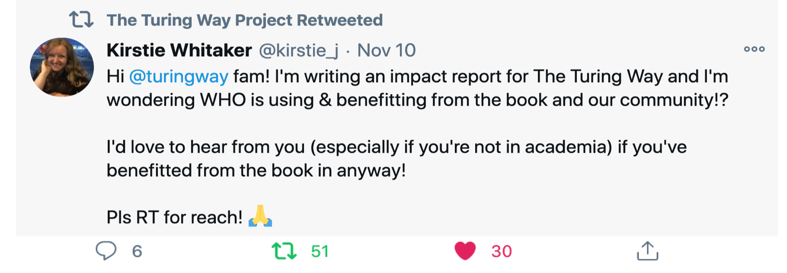
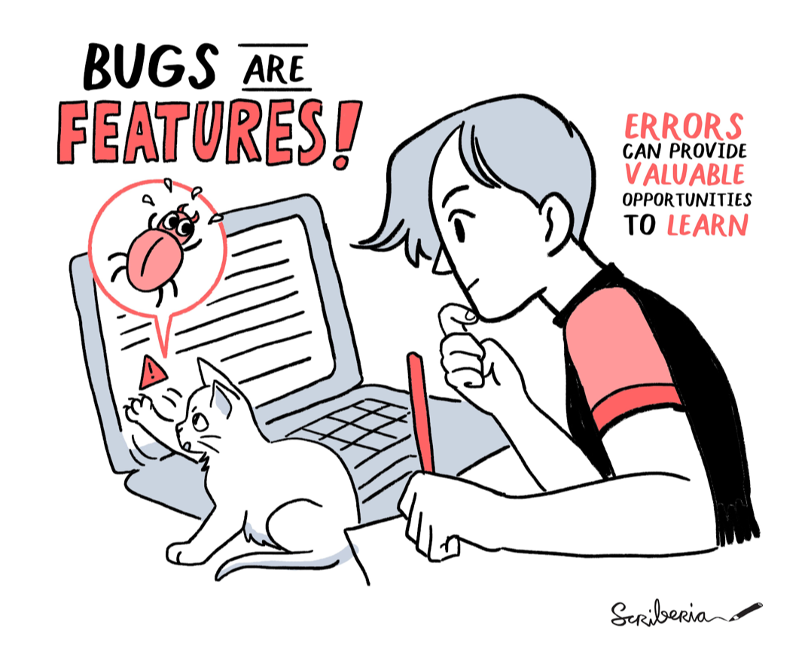
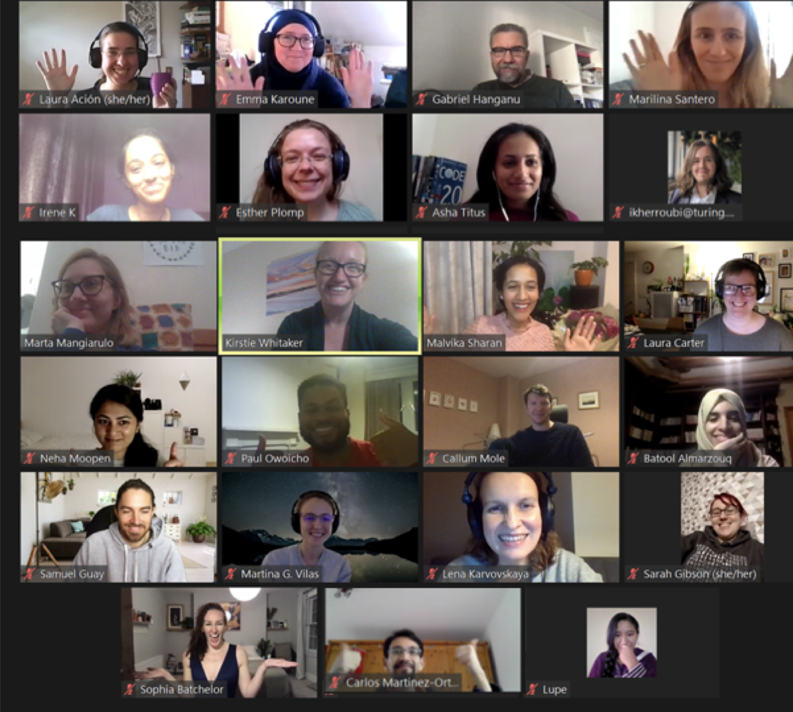
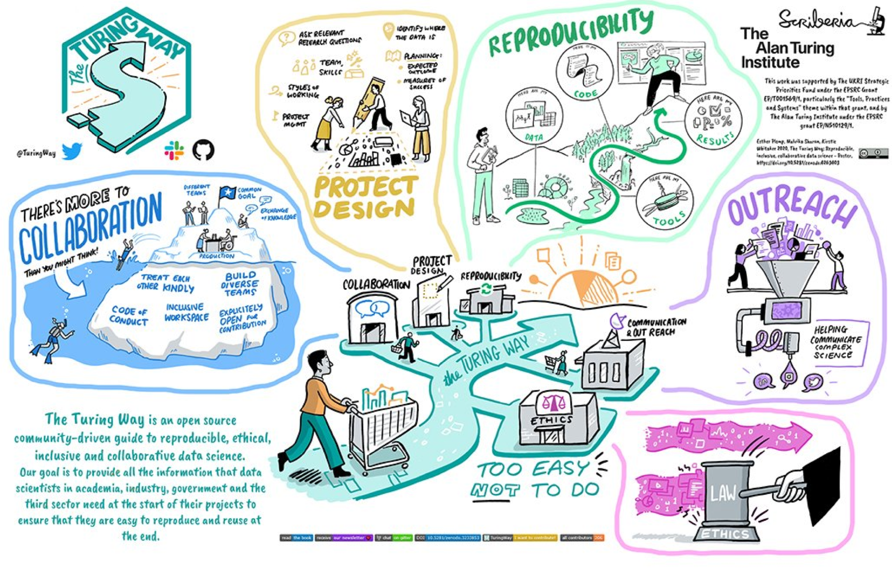
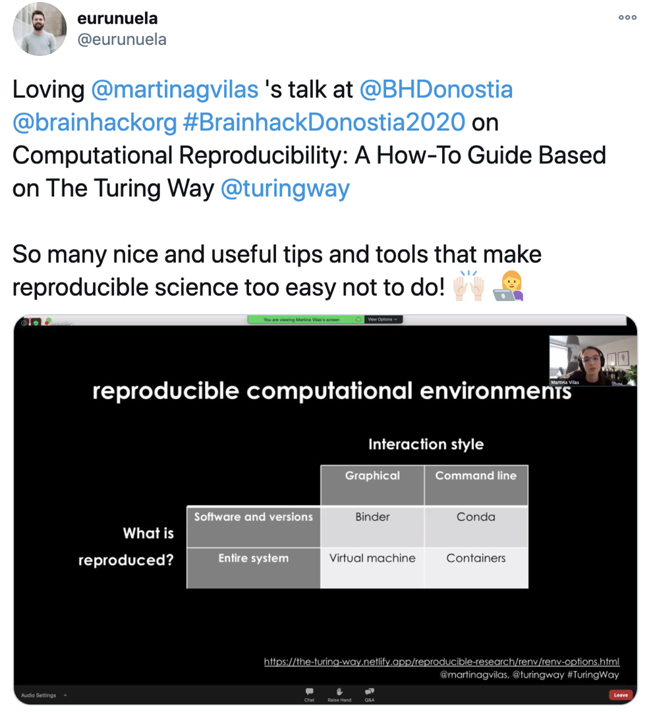
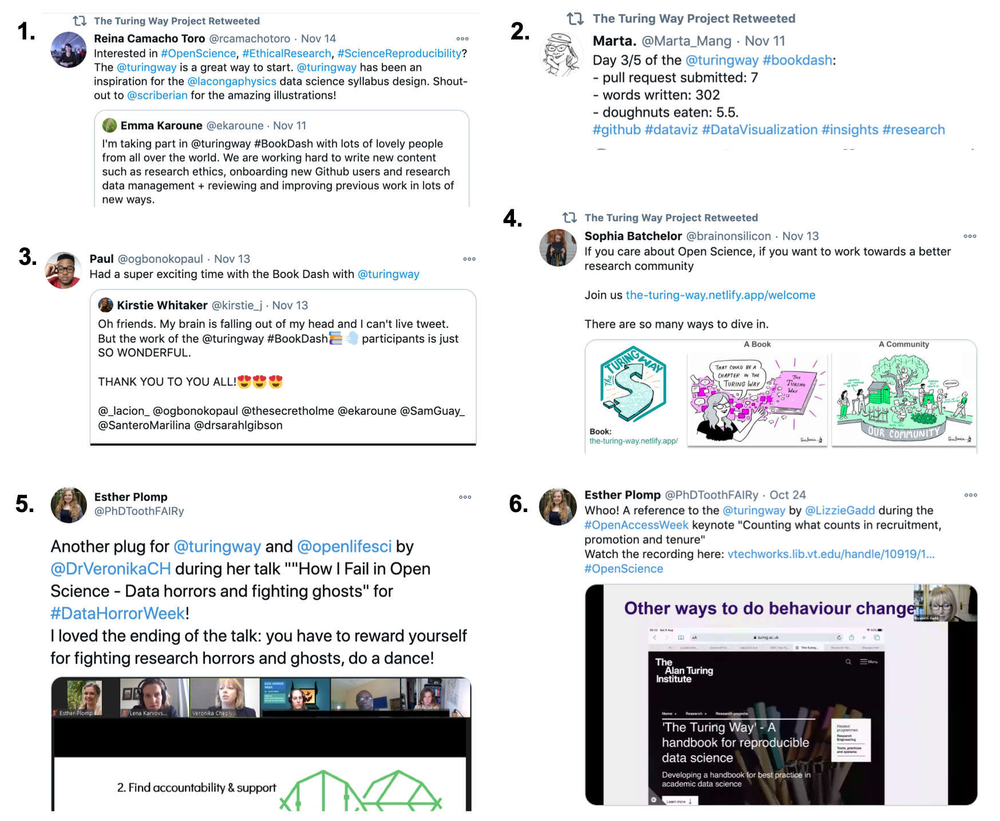

The Turing Way Newsletter: 30 November 2020

# Meet our Book Dash attendees, read new chapters and join the holiday-themed Collaboration Café!

_Hello Turing Way friends!_
This month, we hosted our fourth Book Dash event, worked on the accessibility aspects of our book and we're preparing to celebrate your contributions to the project in the year 2020. 
Here is a sneak-peek of what we have for you in this newsletter:

* 💐 We highlight the [20 contributors](https://github.com/alan-turing-institute/the-turing-way/issues/1584) who participated in the virtual Book Dash event from 9 to 13 November 2020 and collaborated to work on different aspects of the project. 
* 🎄 Join the next Collaboration Café on 2 December 2020 ([see our community calendar](https://arewemeetingyet.com/London/2020-12-02/15:00)). The last one of this year will take place on 16 December 2020, which will be holiday-themed - we look forward to seeing you there! 🎁
* 📢 We are completing two years of The Turing Way and request you to share how this project and community has impacted your work - comment under [issue #1659](https://github.com/alan-turing-institute/the-turing-way/issues/1659). 
* 🔍 As we conclude the year, we invite you to explore our new chapters, reuse community resources and help tidy-up our [GitHub repository](https://github.com/alan-turing-institute/the-turing-way/issues) by reviewing open issues and Pull Requests. 

Find more details on these topics below!👇

_Thank you Paul Owoicho for reviewing this month's newsletter._

## Community meetings

### Collaboration Café
The last two Collaboration Cafés will take place in the first and third week of December 2020. 
Please save the date and sign up on this shared HackMD to indicate your participation: [https://hackmd.io/@turingway/collaboration-cafe](https://hackmd.io/@turingway/collaboration-cafe).
*  02 December 2020, 15:00 - 17:00 2020 ([see in your local time](https://arewemeetingyet.com/London/2020-12-02/15:00))
*  16 December 2020, 15:00 - 17:00 2020 ([see in your local time](https://arewemeetingyet.com/London/2020-12-16/17:00)) - This will be **holiday-themed**!

### Weekly Coworking calls
Our coworking calls for the rest of this year will take place on 3, 7, 10, 14, and 17 December 2020 (Mondays and Thursdays) from 11:00 - 12:00 UTC ([see in your local time](https://arewemeetingyet.com/London/2020-12-03/11:00)). 
If this time does not fit your schedule, please ping us on [Slack in the #community channel](https://join.slack.com/t/theturingway/shared_invite/zt-fn608gvb-h_ZSpoA29cCdUwR~TIqpBw) to suggest an extra coworking slot.

## We invite your review and response

### What impact The Turing Way has on your work?

As a community-driven project, we are not always aware of who our users are (if not already engaged in the community), who benefits from the project and what impact we have had in the data science community and research culture so far. 
To capture these, we invite you to comment under issue [#1659](https://github.com/alan-turing-institute/the-turing-way/issues/1659). You can also directly reply to [Kirstie’s tweet](https://twitter.com/kirstie_j/status/1326126705270984710?s=20).

_[Kirstie’s Tweet](https://twitter.com/kirstie_j/status/1326126705270984710?s=20) inviting contribution to the impact report of The Turing Way._

### Review README.md’s translated files

Thanks to the Hacktoberfest contributors, our README.md file has been [translated into several languages](https://github.com/alan-turing-institute/the-turing-way/tree/main/README-translated). 
We invite reviews on the latest Pull Requests (PR) by members who are proficient in Korean ([PR #1650](https://github.com/alan-turing-institute/the-turing-way/pull/1650)), Arabic ([PR #1586](https://app.tinyletter.com/(https://github.com/alan-turing-institute/the-turing-way/pull/1586)), Polish ([PR #1470](https://github.com/alan-turing-institute/the-turing-way/pull/1470)) or Indonesian ([PR #1354](https://github.com/alan-turing-institute/the-turing-way/pull/1354)). 
You are also welcome to translate this file into a language that is currently missing, which can help your community members to learn about The Turing Way._

### Review PRs on new chapters

The following drafts for the new chapters are open for reviews from anyone who may find these topics interesting and would like to help in improving them:
*  The easy way to work with Github: [PR #1559](https://github.com/alan-turing-institute/the-turing-way/pull/1559)
*  Leadership in Data Science: [PR #1553](https://github.com/alan-turing-institute/the-turing-way/pull/1553)
*  Introduction to Guide for Ethical Research: [PR #1228](https://github.com/alan-turing-institute/the-turing-way/pull/1228)
*  BinderHub workshop (training material): [PR #1552](https://github.com/alan-turing-institute/the-turing-way/pull/1552)

### Review minor updates in the existing chapters

Based on this [checklist for maintaining consistency](https://book.the-turing-way.org/community-handbook/consistency.html#consistency-checklist), Paul Owoicho has opened a few PR’s fixing consistency issues in some existing chapters. 
Help us test this consistency checklist by reviewing [these PRs](https://github.com/alan-turing-institute/the-turing-way/pulls?q=is%3Apr+is%3Aopen+label%3A%22good+first+PR+review%22).
We also have [Good first issues for new contributors](https://github.com/alan-turing-institute/the-turing-way/issues?q=is%3Aissue+is%3Aopen+label%3A%22good+first+issue%22) that you can address by opening new PRs.

_In The Turing Way, we promote good ideas over perfection and consider small errors an opportunity for new contributors to participate in the project.  Illustration by Scriberia and The Turing way._

## Contributors in focus: Book Dash November 2020 Attendees

From 9 to 13 November 2020, we hosted the fourth Book Dash event of The Turing Way, which took place entirely online across multiple time zones. 
From a pool of excellent applicants, 20 participants were selected to join us during development and social sessions throughout the week. 
We were delighted to get to know them, as they collaborated with each other to contribute to diverse aspects of The Turing Way.

_Zoom screenshot of our community share-out event on 13 November 2020 at the Book Dash._
Here are some highlights from the event:
* The ethics team members, **Ismael Kherroubi Garcia, Laura Carter and Sophia Batchelor (UK)** were joined by **Irene Komal P. (India) and Asha Susan Titus (UK)** who managed to work on multiple chapters that will be hosted in the Guide for Ethical Research.
* **Laura Ación (Argentina) and Lupe Canaviri Maydana (Bolivia)** mainly worked on the chapter on Leadership in data science.
* **Batool Almarzouq (Saudi Arabia) and Brigitta Sipőcz (USA)** together designed a chapter of GitHub actions. Batool also managed to translate the README file in Arabic.
* **Samuel Guay (Canada)** started to work on different aspects of French translation and Marilina Santero (Spain) translated our promotional materials in Spanish.
*  **Veronika Cheplygina (The Netherlands)** started a chapter on project workflow that will be hosted in the Guide for Project Design.
*  **Carlos Martinez-Ortiz (The Netherlands)** managed community contributions from his team members from Netherlands eScience Centre.
*  **Paul Owoicho, Neha Moopen and Emma Karoune (UK)** worked on book’s accessibility aspects such as a chapter on maintaining consistency, a chapter on GitHub for beginners, creating glossary and template to facilitate future contributions.
*  **Marta Mangiarulo (UK)** worked on a chapter on data visualisation and pre-registration.
*  **Sangram Keshari Sahu (India)** worked on creating a case study for reproducibility in bioinformatics.
Two core contributors **Martina G. Vilas and Sarah Gibson** also participated in the Book Dash to facilitate mentored contributions, especially by supporting participants who were new to the projects. 
Additionally, several participants from Biohackathon-EU 2020, which was running in parallel to the Book Dash, also joined us in multiple development and informal sessions. 
Special thanks to **Kim De Ruyck, Albert Hornos, Jose Maria Fernandez, Philippe Rocca-Serra and Wolmar Nyberg Åkerström**. 
Read more about them in [issue #1584](https://github.com/alan-turing-institute/the-turing-way/issues/1584). 
The full report will be shared in the next newsletter.

## News from the community

### Guides and templates to assist new contributors

Our [GSoD](https://github.com/alan-turing-institute/the-turing-way/issues/1075) intern, Paul Owoicho has been working tirelessly to improve the project’s accessibility for our users and contributors. 
With the support of his Open Life Science (OLS-2) team member, Neha Moopen, he has published a chapter in our community handbook on [Maintaining Consistency](https://book.the-turing-way.org/community-handbook/consistency.html). 
This chapter is a valuable resource to bring cohesiveness and a standard structure across the entire book through retrospective editing of existing chapters and development of new chapters through future contributions.
Additionally, he has co-developed a set of templates for writing new chapters, creating case studies, and adding personal stories. 
Check them out in our [GitHub repository](https://github.com/alan-turing-institute/the-turing-way/tree/main/book/templates).

### Web Annotation by hypothes.is

 showing an annotation added through hypothes.is](./images/2020-11-annotate-4.png)
_Screenshot of our [welcome page](https://book.the-turing-way.org/welcome.html) showing an annotation added through hypothes.is._
Using [Commenting and annotating](https://jupyterbook.org/interactive/comments.html) feature of the Jupyter Book, Martina G. Vilas and Batool Almarzouq have integrated [web.hypothes.is](https://web.hypothes.is/) in The Turing Way book. 
This will enable our readers to comment on and highlight different parts of the book to share their thoughts, raise errors or create notes.

### New subchapters on Remote Collaboration and Research Data Management Toolkits

After several months of wrangling contributions and compiling resources, we have finally merged our chapter on [Remote Collaboration](https://book.the-turing-way.org/collaboration/remote-collab.html). 
This chapter consists of 10 subchapters, which largely aims to provide an action-oriented resource to users who are organising, hosting, chairing and attending virtual events such as team meetings, conferences, sprints, coworking and informal coffee-chats.

A research data management (RDM) toolkit provides information and advice about the data management activities in the whole data lifecycle. 
Thanks to Kim De Ruyck and Albert Hornos, we have a new subchapter on [RDM Toolkit](https://book.the-turing-way.org/reproducible-research/rdm/rdm-toolkits.html). 
Read and share these resources, and help us enhance them by adding examples from your work.

## Relevant resources

_The Turing Way poster designed by Esther Plomp._

*  **The Turing Way: Reproducible, inclusive, collaborative data science - Poster** (Version 1). Esther Plomp, Malvika Sharan, & Kirstie Whitaker. (2020). Zenodo. [http://doi.org/10.5281/zenodo.4263403](http://doi.org/10.5281/zenodo.4263403)
*  **Enhancing the inclusivity and accessibility of your online calls**. Yo Yehudi, K. S. Whitney, Malvika Sharan. (2020, November 24). Enhancing the inclusivity and accessibility of your online calls. [https://doi.org/10.31219/osf.io/k3bfn](https://doi.org/10.31219/osf.io/k3bfn)
*  **Collaborative work in a pandemic - The Turing Way Bookdash November 2020**, [Blog post by Emma Karoune](https://ekaroune.github.io/The-Open-Archaeobotanist/2020-11-23-Collaborative_work_in_a_pandemic/)

## Acknowledgements and celebrations

Kirstie gave a talk at the University of York on 27 October 2020 under the title “The Turing Way: Making Reproducible Research Too Easy Not To Do”. 
This seminar engaged early career researchers in discussions around reproducible and collaborative research. 
See her slides on Zenodo: [http://doi.org/10.5281/zenodo.4139831](http://doi.org/10.5281/zenodo.4139831).

On 12 November 2020, Martina G. Vilas gave a talk at the Brainhack Donostia 2020 on Computational Reproducibility. 
Under the title “A How-To Guide Based on The Turing Way”, she shared useful tips and tools for computational reproducibility! 
Her talk is also available on Zenodo: [http://doi.org/10.5281/zenodo.4269795](http://doi.org/10.5281/zenodo.4269795).

_[Eneko Urunuela’s Tweet](https://twitter.com/eurunuela/status/1326899135354707972?s=20) highlighting Martina’s talk on computational reproducibility based on The Turing Way._

On 24 November 2020, Emma Karoune presented a talk titled "Open Science Practices in Phytolith Research and Beyond" at PaleoPERC seminar series. 
She shared her research workflow through which she aims to promote open science culture. 
She also talked about her participation in The Turing Way and Open Life Science communities.

### Twitter mentions

_1 [Raina Quote Tweeting](https://twitter.com/rcamachotoro/status/1327576424279138305?s=20) [Emma’s Tweet](https://twitter.com/ekaroune/status/1326540656060235780?s=20) that highlights the efforts made by the Book Dash attendees and demonstrates a new illustration that will be published soon. 2 [Marta’s Tweet](https://twitter.com/Marta_Mang/status/1326630793985335296?s=20) from the Book Dash week. 3 [Paul Quote Tweeting](https://twitter.com/ogbonokopaul/status/1327227399608602628?s=20) [Kirstie’s Tweet](https://twitter.com/kirstie_j/status/1327217750037716997?s=20) about the community share-out event where our book dash attendees demonstrated their work. 4 [Sophia’s Tweet](https://twitter.com/brainonsilicon/status/1327329625467445251?s=20) inviting contributors interested in Open Science to engage with The Turing Way. 5 & 6 Esther’s Tweets [from Data horror Story event](https://twitter.com/PhDToothFAIRy/status/1321427571767205890) and [from Open Access Week event](https://twitter.com/PhDToothFAIRy/status/1320022230919749632?s=20) sharing slides about The Turing Way in the presentation by Veronika Cheplygina and Lizzi Gadd._

## Connect with us!

*  [About the project](https://www.turing.ac.uk/research/research-projects/turing-way-handbook-reproducible-data-science)_
*  [The Turing Way book](https://book.the-turing-way.org/)
*  [GitHub repository](https://github.com/alan-turing-institute/the-turing-way)
*  [Gitter chat room](https://gitter.im/alan-turing-institute/the-turing-way)
*  [YouTube Videos](https://www.youtube.com/channel/UCPDxZv5BMzAw0mPobCbMNuA)
*  [Twitter Channel](https://twitter.com/turingway)

You are welcome to contribute content for the next newsletter by emailing [theturingway@gmail.com](mailto:theturingway@gmail.com).
_Did you miss the last newsletters? Check them out [here](https://tinyletter.com/TuringWay/archive)._
