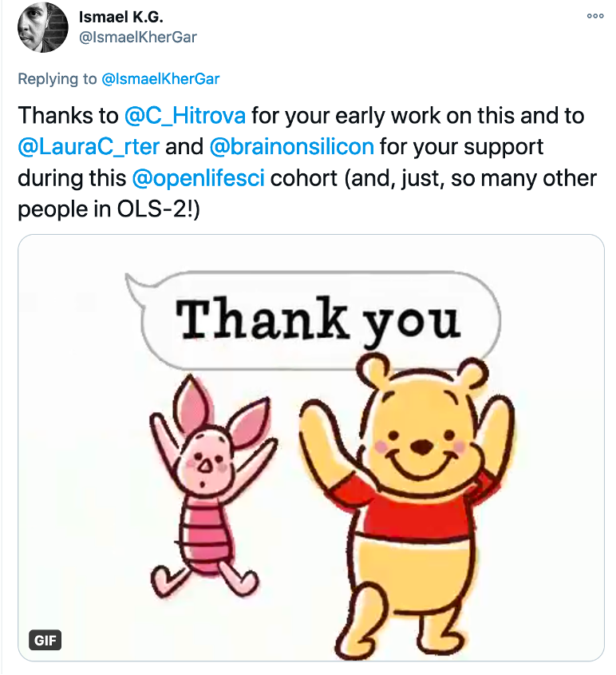
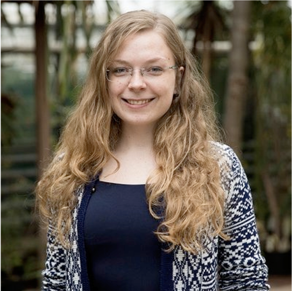
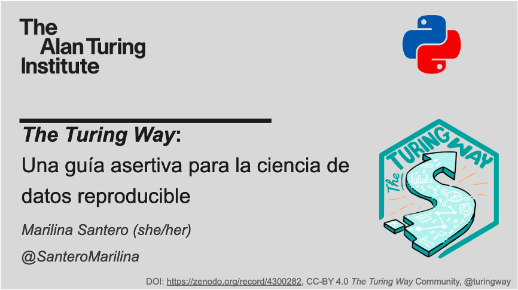
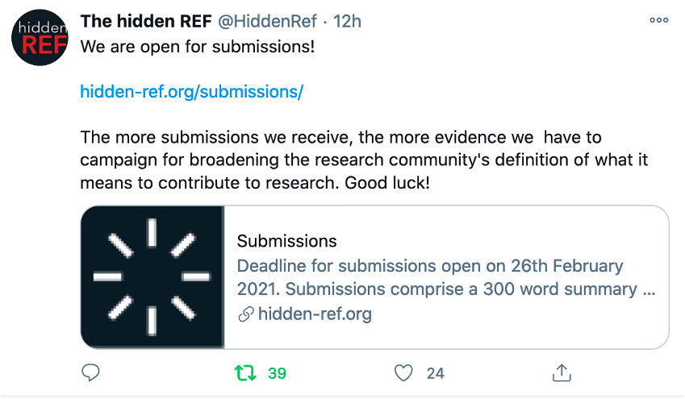
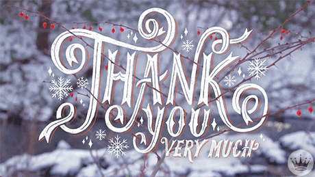

The Turing Way Newsletter: 15 December 2020

# Two years of The Turing Way project, highlights from our community and holiday wishes!

Hello Turing Way friends!

This month: 
- 👋 Attend our end of the year - **holiday-themed Collaboration Café on 16 December** and the very last coworking call of 2020 on 17 December.
- 🎓 Aided by the Turing Online Training grant, we will continue the **OLS for Turing** Collaboration in 2021 with Open Life Science. Call for application for OLS-3 is open until 11 January 2021. Join the *OLS-2 graduation calls this week*.
- ✨ Check out **new resources**, illustrations, presentations and reports developed and shared by _The Turing Way_ members.
- 🏆 Learn what we have been able to achieve this year. We are very grateful for your important work and contributions to the project.

**Thank you so much for your love, support and positive engagements** in _The Turing Way_. We wish you all a wonderful end of the year! 🌺

Find more details on these topics below 👇

## Community Meetings and Events

- **Collaboration Cafés**: We will be hosting a Holiday Themed Collaboration Cafe on 16 December 2020 from 15:00 to 17:00 GMT ([see in your time zone](https://arewemeetingyet.com/London/2020-12-16/15:00)). 
Please sign up on this shared document: [https://hackmd.io/@turingway/collaboration-cafe](https://hackmd.io/@turingway/collaboration-cafe).
We will restart these calls in 2021 from 20 January, which will be hosted every 2nd and 3rd Wednesdays of each month.

- **Coworking Calls**: The very last coworking call of the year will take place on 17 December 2020 from 11:00 to 12:00 GMT ([see in your time zone](https://arewemeetingyet.com/London/2020-12-17/11:00)).
Please find more details here: [https://hackmd.io/@turingway/coworking-call](https://hackmd.io/@turingway/coworking-call).
In 2021, we will continue hosting them every week starting from 1 February 2021.

Please subscribe to our [community calendar](https://calendar.google.com/calendar/embed?src=theturingway%40gmail.com&ctz=Europe%2FLondon) for updates on Book Dash and Training Workshops for 2021.

## News from the community

*Open Life Science Flyer for the OLS-3 call for application*

### We received the Turing Online Training Grant
We are excited to share that our application with [Open Life Science (OLS)](https://openlifesci.org/) has been successful for the [Turing Online Training Grant](https://www.applieddatascience.qmul.ac.uk/news/3817/the-turing-online-training-call-funding-opportunity).
This will allow us to continue our collaboration with Open Life Science in 2021 and offer its training and mentoring program to the Turing and _The Turing Way_ community members.

### OLS-2 Graduation and OLS-3 call for application!
Graduations for the second round of OLS participants (OLS-2) are taking place this week.
12 project leads who joined the program under [OLS-2 for Turing](https://openlifesci.org/ols-2#collaborators) will be graduating with their cohort members who together led over 30 projects in OLS-2.
You can join these graduation calls (see [this blog](https://openlifesci.org/posts/2020/11/26/announcing-applications-for-ols-3/) for details) or watch them online on [YouTube](https://www.youtube.com/openlifesci) to learn more about the projects and the OLS program.

The call for application for the third round (OLS-3) is open until 11 January, please find more details about the call on their website: [https://openlifesci.org/](https://openlifesci.org/).
We welcome you to apply individually or with a project relevant for _The Turing Way_ collaboration [OLS-3 for Turing](https://openlifesci.org/ols-3#collaborators).
Please contact Malvika Sharan (email: msharan@turing.ac.uk) to discuss your ideas and receive 1:1 support.
Feel free to pass on this information to anyone who may find this opportunity useful.
Please see this [promotion pack](https://docs.google.com/document/d/e/2PACX-1vREI-wJwUvinrmxbVK33w8kfFRpa6iqXtvFELiG3_HfhJl99LaHrFv1QYme_7lwTo1Uyigx9ByXL-WW/pub) for detail.

## Useful Resources

### The Book Dash Report and New Illustrations by Scriberia

*One of the illustrations from Scriberia that was developed in November’s Book Dash*

We ran the third Book Dash event from 9 to 13 November completely online with 20 participants.
In the last newsletter, we highlighted the impressive work carried out by our attendees.
In this newsletter, we are happy to share the full report that can be read [here](https://hackmd.io/@turingway/bookdash-nov2020-report).

In the previous Book Dash events, illustrations by Scriberia artists had added enormously to the productivity, enthusiasm and outcome of the events.
We continued this tradition by inviting a Scriberia artist, Jem Milton, who spent 3 days during the Book Dash interacting with the participants and developing new sets of illustration for _The Turing Way_ community.
The artwork has been shared on Zenodo: <zenodo link> under CC-BY license and will be added in the book going forward.
You are welcome to share, reuse and distribute them by attributing "The Turing Way Community, & Scriberia. (2020, December 15). Illustrations from the Turing Way book dashes. Zenodo. <DOI>".

### New Resources in _The Turing Way_

- **The Turing Way - GSoD 2020**: We thank Paul Owoicho for providing editorial support while working during his Google Season of Doc (GSoD) technical writing period in _The Turing Way_.
Paul has done extremely valuable work to ensure accessibility in our online resources by co-authoring chapters on [Maintaining Consistency](https://book.the-turing-way.org/community-handbook/consistency.html), integrating [videos to demonstrate editing work](https://book.the-turing-way.org/community-handbook/consistency/consistency-formatting.html#demo), adding [new subchapters in the Style guide](https://book.the-turing-way.org/community-handbook/style/style-more-styling.html), creating a [series of templates](https://book.the-turing-way.org/community-handbook/contributing.html) for developing new content and [improving the default style of the book](https://book.the-turing-way.org/community-handbook/style/style-custom-styling.html) to make it more accessible for screen reader apps.
We are extremely grateful for his work and excited to see him move on to pursue his PhD in Glasgow.
We are also very proud to see him graduate from Open Life Science this week along with Neha Moopen who supported his accessibility project that was mentored by Samuel Guay.
You can read a complete report from his engagement [here](https://github.com/alan-turing-institute/the-turing-way/blob/main/communications/GSOD-applications/GSoD-2020-Project-Report.md).

*[Tweet by Ismael](https://twitter.com/IsmaelKherGar/status/1337116565184143360?s=20) announcing the release of the Introduction to Research Ethics Chapter*

- **A new set of chapters and subchapters**:
  - The [Introduction to Research Ethics](https://book.the-turing-way.org/ethical-research/ethics-intro.html) chapter has been written by the Ethics team members, Ismael Kherroubi Garcia, Laura Carter and Sophia Batchelor. 
Thanks to Christina Hithrova and Laura Acion for further comments and review. 
  - The Ethics team members are also graduating from OLS this week for working on the Guide for Ethical Research that was mentored by Jez Cope and Anjali Mazumdar.
  - Emma Karoune wrote a chapter for [getting started with GitHub](https://book.the-turing-way.org/collaboration/github-novice.html).
Thanks to Kirstie Whitaker, Laura Carter and Paul Owoicho for reviewing and contributing to this chapter. 
  - Carlos Martinez and Sarah Alidoost from the Netherlands eScience Center have updated the [Code Reviewing](https://book.the-turing-way.org/reproducible-research/reviewing.html) chapter. 
Thanks, José Maria Fernandez and Sarah Gibson for reviewing them.
  - One of the oldest pending PR on the [Code styling and linting](https://book.the-turing-way.org/project-design/code-styling.html) have finally been merged. 
Thanks to Oliver Clark, Yo Yehudi and Nathan Begbie for editing and reviewing the chapter.

## Acknowledgements and celebrations

### Contributor in Focus: Esther Plomp

[EstherPlomp](https://github.com/estherplomp) is a Data Steward at Delft University of Technology in the Netherlands, where she supports researchers with their data management and open science practices.
As a co-chair of the Research Data Alliance group [Physical Samples and Collections in the Research Data Ecosystem IG](https://www.rd-alliance.org/groups/physical-samples-and-collections-research-data-ecosystem-ig), she hopes to bring together specialists from my research field to establish guidelines for isotopic data from human remains and guidelines for how to handle and document physical samples.
She is a regular contributor of _The Turing Way_ ever since her participation in the Book Dash event in February 2020.

In her words:
> Thanks to the Turing Way I really learned how to work collaboratively using GitHub.
> The book dash was a great kick start to actually practise and directly apply these skills, which now allows me to contribute more confidently to other projects as well!
> I primarily contributed to the Reproducible Research Chapter, to the Research Data Management section. I reviewed existing content and I'm working on adding a section on Data Management Plans and how to handle personal data.
> I also made a [The Turing Way poster](https://doi.org/10.5281/zenodo.4263403) that I presented during a conference.
> I hope to pay it forward and facilitate others in learning how to work with GitHub through The Turing Way or Carpentry workshops.

### Share your impact story

Kirstie Whitaker, the lead of _The Turing Way_ is writing an impact report where she would like to capture who is using and benefiting from the book and our community.
We would love to hear from you, especially if you're not already involved in the community as contributors and you've used, shared or built upon the project, book or community in any way!
For example, many people used the online repository structure, used its resources for developing the reproducibility plan, adapted the Code of Conduct for their projects, cited _The Turing Way_ in their manuscripts or grant proposals, and reused the community practices.
You can see more responses to Kirstie's [Tweet](https://twitter.com/kirstie_j/status/1326126705270984710?s=20) and share your story with us under [issue #1659](https://github.com/alan-turing-institute/the-turing-way/issues/1659). 

All our contributors are invited to add their personal highlights and impact stories in the [Contributors’ file](https://github.com/alan-turing-institute/the-turing-way/blob/main/contributors.md) so that we can update our [Contributors Record](https://book.the-turing-way.org/afterword/contributors-record.html#personal-highlights-from-the-turing-way-contributors) to openly and fairly acknowledge their work.

### Presentations

**Kirstie Whitaker** joined the panel and gave a presentation for the NeurIPS 2020 workshop (The pre-registration experiment: an alternative publication model for machine learning research (https://preregister.science)) under the title: “The Turing Way: Transparent research through the scientific lifecycle” on 11 December 2020. 
You can find her talk on Zenodo: [DOI:10.5281/zenodo.4274314](https://zenodo.org/record/4274314).
Here is [a Twitter thread](https://twitter.com/kirstie_j/status/1337497307969884162) about her talk.

**Emma Karoune** presented a talk about _The Turing Way_ under the title “Reproducibility and Collaborative working” at BrainHack Padova event on 14 Dec 2020.
You can find her talk online on OSF Home ([DOI: 10.17605/OSF.IO/VPUKZ](https://osf.io/vpukz)).

**Marilina Santero**, one of our book Dash attendees, translated _The Turing Way_ slide deck into Spanish and gave a presentation at the first [PyDay Chile 2020](https://pyday.cl/) on 1 December 2020.
Under the title “The Turing Way: Una guía asertiva para la ciencia de datos reproducible”, her talk is available on Zenodo” [DOI:10.5281/zenodo.4300282](https://zenodo.org/record/4300282).
You can watch the video on [YouTube](https://www.youtube.com/watch?v=fIG2O38Wg7U).

*A screenshot from Marilina’s presentation on The Turing Way, presented at the PyDay Chile 2020*

Nadia Soliman referenced _The Turing Way_ illustrations in her talk [Crowd Science for Collecting Data in Preclinical Systematic Reviews](https://evidencesynthesisireland.ie/wp-content/uploads/2020/10/nadia-soliman-slides.pdf).
The [Open Research: a Practical Guide](https://subjectguides.york.ac.uk/openresearch), that offers support and information on open research methods has cited _The Turing Way_ along with other references that it is built upon.
Similarly, [Open Research Handbook: Reproducibility](https://libguides.reading.ac.uk/open-research/reproducibility) has listed _The Turing Way_ as one of its primary recommendations for reproducible research.

### Conferences to Attend in 2021

- **Collaborations Workshop: CW21**: The Software Sustainability Institute’s (SSI) Collaborations Workshop series brings together researchers, developers, innovators, managers, funders, publishers, policymakers, leaders and educators to explore best practices and the future of research software. 
Collaborations Workshop 2021 (CW21) will take place online from Tuesday, 30 March to Thursday, 1 April 2021 and registration is now open! 
The themes of the CW21 keynote presentations, discussion groups, mini-workshops, collaborative ideas, and hack day will be around the following areas of research software: FAIR Research Software, Diversity & Inclusion and Software Sustainability. 
To find out more information including registration, agenda, call for submissions and how to sponsor the unconference, please visit the CW21 website: [http://bit.ly/ssi-cw21](http://bit.ly/ssi-cw21)

- **FOSS-Backstage 2021**: We are delighted to share that Malvika will be presenting a talk about _The Turing Way_ at the [FOSS-Backstage](https://foss-backstage.de) event.
The conference will take place from 10 to 12 February 2021 covering different topics on governance, collaboration, legal and economics within the scope of Free and Open Source Software. 
[Register](https://foss-backstage.de/tickets) to hear about open source project leadership best practices, community management, open source project metrics, strategy for the enterprise, adopting open source collaboration in corporations, legal matters when dealing with open source and many more.

### Call for applications

- **SSI Fellowship 2021**: The call for applications to the SSI’s Fellowship Programme 2021 is now open! 
The Fellowship Programme provides funding for individuals who want to improve how research software is done in their domains and/or area of work. 
Being a Fellow also helps individuals develop skills and knowledge in their area around software sustainability, empowers them to speak about software sustainability issues and network with like-minded individuals from a wide variety of research areas. 
The Institute will be running a Fellows 2021 Launch Webinar on Thursday, 14 January 2021 to explain the programme in more detail and answer your questions. 
The deadline for applications is Friday, 5 February 2021. 
To find out more information including how to apply, schedule, example applications from successful Fellows, and words of encouragement, please visit the programme website: http://bit.ly/ssi-fellows2021

- **HiddenRef Submissions are Open**: The hidden REF is a competition that recognises all research outputs and every role that makes research possible. 
If you would like to enter your work or nominate a person who has been vital to your research, please [complete a submission (300 words)](https://hidden-ref.org/submissions/) by 26th February 2021. 
Submissions will be reviewed by panels drawn from across the research community and winners will be announced in April 2021.

*[Tweet by Hiddenref](https://twitter.com/HiddenRef/status/1338426180035338241?s=20) about their call for submission.*

## Highlights from 2020 & Happy New Year 2021

### 2020: Year in Review

As we complete the second year of _The Turing Way_, we review the year 2020 month-by-month to highlight some of the important milestones we have achieved in the project together with our community members.

* **January**: Translation efforts started with Chinese and Spanish translation of _The Turing Way_ chapters on [Transifex system](https://github.com/alan-turing-institute/the-turing-way/blob/translation/translation_guide.md) set up and used by several community members.
* **February**: The third Book Dash took place in person in London on 11-12 February 2020. Conducted over 1.5 days, this event was attended by 15 new participants and 3 helpers. We also launched our [Twitter account](https://twitter.com/turingway).
* **March**: As the world wide lockdown started due to the COVID-19 pandemic, we created more ways to stay connected with our members by hosting coworking calls weekly and Collaboration Cafes twice every month.
* **April**: The community grew to 120 members and in addition to the Guide for Reproducible Research, _The Turing Way_ book was upgraded to include the guides for Project Design, Communication, Collaboration and Ethics.
* **May**: Collaboration between Open Life Science and _The Turing Way_ was formally established (OLS-2 for Turing) to offer mentorship to its community members in developing Open Science projects.
* **June**: The Turing Way members delivered several online workshops and participated in conferences relevant for Open Science, reproducibility and Data Science.
* **July**: The community Slack space was created to facilitate structured discussions online, which was not effective on Gitter. 12 members joined OLS-2 with 6 projects from Turing and _The Turing Way_.
* **August**: To allow a proper break for our community and team members amidst this busy year, we declared a break in the project August.
* **September**: The [community handbook](https://book.the-turing-way.org/community-handbook/community-handbook) started to expand by including chapters on concepts, practices and workflow used by the community members. Particularly, we shared a document detailing how we acknowledge everyone in _The Turing Way_. We also hosted a technical writer upon the successful selection of our Google Season of Doc application.
* **October**: We hosted the HacktoberFest and facilitated the translation of the READMEmd file in multiple languages. The first good first label was used to onboard members new to Open Source projects,
* **November**: Malvika and Kirstie hosted the fourth Book Dash event from 9-13 November and connected with 18 new members who worked collaboratively on the project and 2 core members who provided mentorship support. We also received the Turing online Training grant to continue our collaboration with the OLS mentoring program in 2021.
* **December**: We are ending the year with over 235 contributors, 500 subscribers of our monthly newsletters and 1500 followers on Twitter. So far they all have together developed 30 chapters, 134 subchapters and several supporting resources within our 5 guides and a community handbook.

### Thank you! & News year wishes

We want to express our gratitude towards all of you - our community members. 
Thank you for collaborating on GitHub and contributing to _The Turing Way_ book by thoughtfully developing, reviewing and maintaining its chapters and infrastructure that are used by researchers globally. 
Your participation in the online Collaboration Cafés, coworking calls, Book Dash events and community discussions on Slack this year have made _The Turing Way_ even more, vibrant and welcoming for new members. 

2020 has not been an easy year for most and therefore it is even more important for us to acknowledge that we value your participation in the projects immensely. 
It is only by involving the diverse community of individuals from different backgrounds, domain knowledge, skill levels and experiences from all around the world, can we make “reproducibility too easy not to do”.
We hope that you can take a break and enjoy the end of the year. We wish you a happy new year 2021!

Malvika, Kirstie and all the team! 💙

## Connect with us!

- [About the project](https://www.turing.ac.uk/research/research-projects/turing-way-handbook-reproducible-data-science)
- [_The Turing Way_ book](https://book.the-turing-way.org)
- [GitHub repository](https://github.com/alan-turing-institute/the-turing-way)
- [Gitter chat room](https://gitter.im/alan-turing-institute/the-turing-way)
- [YouTube Videos](https://www.youtube.com/channel/UCPDxZv5BMzAw0mPobCbMNuA)
- [Twitter Channel](https://twitter.com/turingway)

You are welcome to contribute content for the next newsletter by
emailing [Malvika Sharan](mailto:msharan@turing.ac.uk).

*Did you miss the last newsletters?*
*Check them out [here](https://tinyletter.com/TuringWay/archive).*
