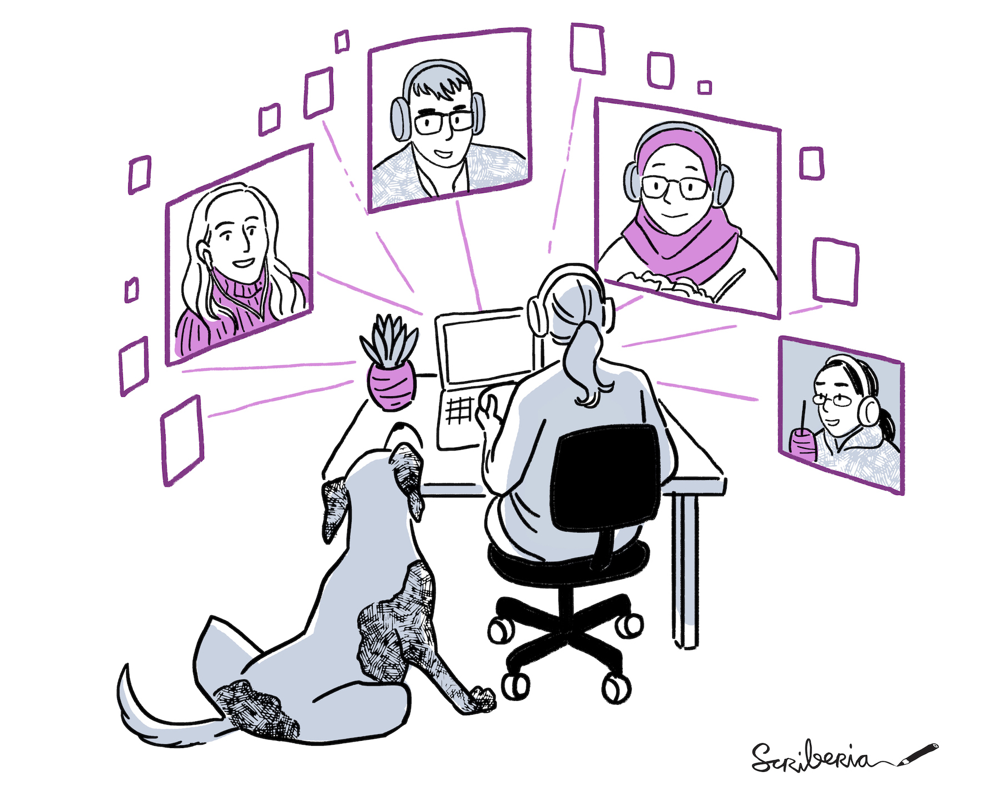
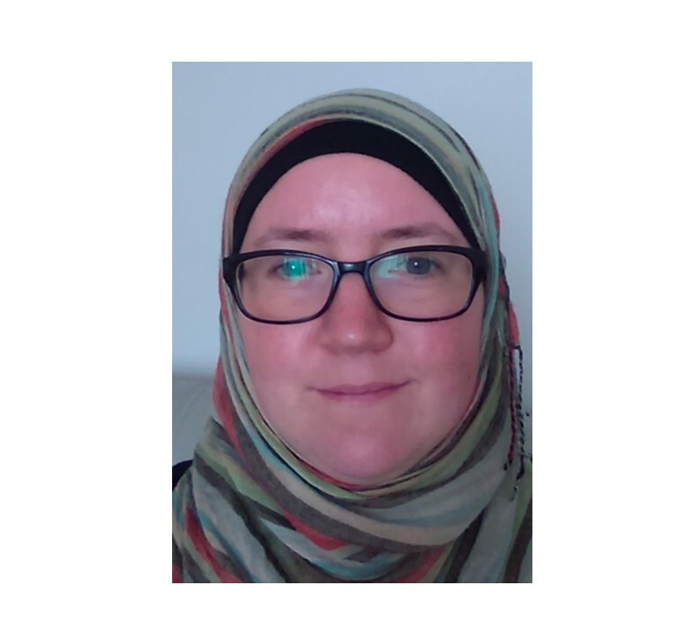
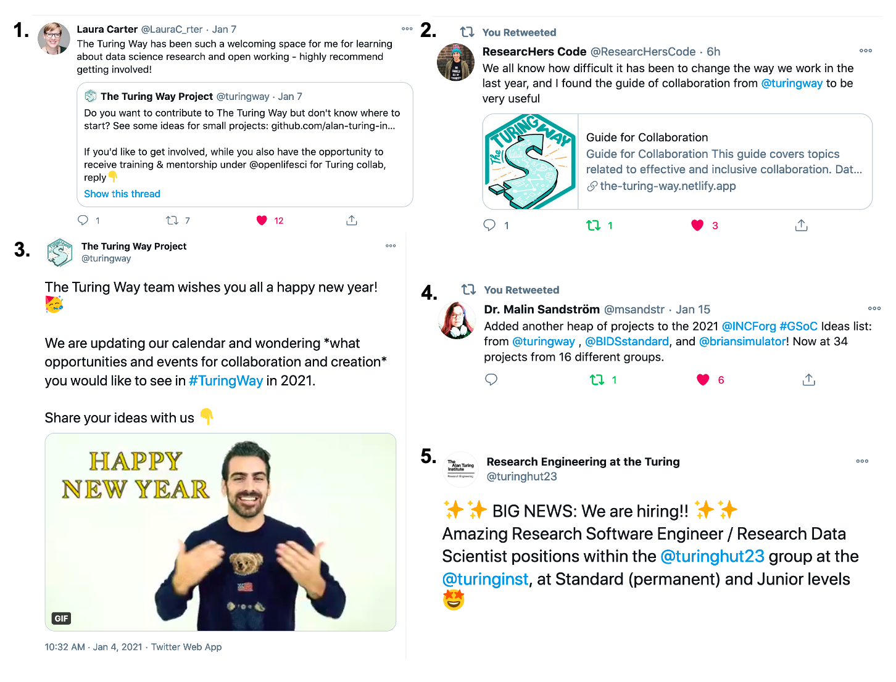

The Turing Way Newsletter: 21 January 2021

# New year wishes from The Turing Way and plans for 2021!

Happy New Year Turing Way friends!  

Needless to say that 2020 was a tough year and did not exactly go as we had planned. But, that should not stop us from planning (hoping and dreaming) for 2021. 🌻

This year, as most of us continue to work from home during the pandemic, we want to:

-   🌍 **Strengthen and provide additional support** for our network of contributors.
-   ☕️ **Facilitate collaborative efforts** in the community by hosting coworking calls and events.
-   🏆 Support you in representing _The Turing Way_ to **highlight your work and resources**.
-   🌸 **Welcome your thoughts and ideas** on how we as a community project can support you.
-   🗣 **Create more opportunities to listen** to new voices and bring in their perspectives.

We look forward to seeing and welcoming you to our community spaces and events.
You can reach out to the team by emailing [theturingway@gmail.com](mailto:theturingway@gmail.com), open an [issue on GitHub](https://github.com/alan-turing-institute/the-turing-way/issues), or directly contact Malvika Sharan and Kirstie Whitaker on [Slack](https://join.slack.com/t/theturingway/shared_invite/zt-fn608gvb-h_ZSpoA29cCdUwR~TIqpBw). 

Read more details on these topics below! 👇

*Thanks to Arielle Bennett and Emma Karoune for reviewing the earlier draft of this month's newsletter.* 💪

## Community Meetings

*The Turing Way Community, & Scriberia. (2020, November). Illustrations from The Turing Way book dashes. Zenodo. http://doi.org/10.5281/zenodo.4323154*

### Bimonthly Collaboration Cafes
The first Collaboration Cafe of this year took place on 20 January 2021. 
The next one will be on 3 February 2021 from 15:00 - 17:00 UTC ([see in your local time zone](https://arewemeetingyet.com/London/2021-02-03/15:00)). 
Like last year, we will continue hosting these calls every first and third Wednesday of every month, unless updated differently in [our calendar](https://arewemeetingyet.com/London/2020-12-02/15:00). 
Find more details on this shared notes: [https://hackmd.io/@turingway/collaboration-cafe](https://hackmd.io/@turingway/collaboration-cafe). 

### Weekly Coworking Calls
We have also been hosting Coworking Calls every Monday and Thursday from 11:00 - 12:00 UTC. 
To stay connected with people in Eastern Time Zones, we have added one more session on Wednesdays from 15:00 - 16:00 UTC, except when Collaboration Cafes are planned.
Find the dates for the upcoming coworking calls on this shared note: [https://hackmd.io/@turingway/coworking-call](https://hackmd.io/@turingway/coworking-call). 

### Join the Spanish Translation Team on Mondays
Camila Rangel-Smith and Raina Camacho Toro are hosting coworking sessions every Monday at 17:00 UTC to work on the [Spanish translation of the book](https://www.transifex.com/theturingway/theturingway/).
Connect with them on the Slack channel #traducción-español ([Slack invitation link](https://join.slack.com/t/theturingway/shared_invite/zt-fn608gvb-h_ZSpoA29cCdUwR~TIqpBw)) to receive rolling invites to join in their effort.

## News from the community

### Support for Representing _The Turing Way_ at Conferences

Thanks to Emma Karoune, Esther Plomp, Ismael Kherroubi-Garcia, Laura Ación, Laura Carter, Marilina Santero, Martina Vilas, Paul Owoicho, Sarah Gibson and Sophia Batchelor for representing _The Turing Way_ in 2020 through talks and presentations! 
To keep this tradition going and further build a sense of ‘shared ownership', we welcome you to suggest 2021 events that you would like to attend and where you can share about your work in _The Turing Way_.

You can reply in the GitHub [issue #1717](https://github.com/alan-turing-institute/the-turing-way/issues/1717) or reach out to Malvika by emailing [msharan@turing.ac.uk](mailto:msharan@turing.ac.uk).
We have created a [promotion pack](https://github.com/alan-turing-institute/the-turing-way/tree/main/communications/promotion-pack) linked with frequently asked questions and presentations that you can adapt for your use (and in your preferred language). 
We would be happy to give 1:1 feedback on your talk and will be able to provide support towards paying the conference registration fee.

### Opportunities to Lead Small Projects Within the Community

We have collected a set of project ideas beyond co-authoring chapters in the book that new and existing contributors can lead in _The Turing Way_. 
These ideas include small-scale tasks such as guest-authoring newsletters or assessing _The Turing Way_’s community health and topics that are at the meta-study level such bringing Data Feminism Perspective to the project or creating reproducible translation pipeline to support community’s translation efforts.

We have proposed these projects to provide leadership opportunities that our community members can use while developing a new skill or idea that they haven't yet had a chance to explore.
Even though these projects can be carried out independently, we encourage and promote collaboration with other members and connect with ongoing projects in the community.
Please see [issue #1712](https://github.com/alan-turing-institute/the-turing-way/issues/1712) for details and add more ideas.

*The Turing Way Community, & Scriberia. (2020, November). Illustrations from The Turing Way book dashes. Zenodo. http://doi.org/10.5281/zenodo.4323154*

### A GitHub Action for Contributors Record
_The Turing Way_ maintains a contributors record in the [book’s Afterword](https://book.the-turing-way.org/afterword/contributors-record.html). 
This record combines the contributors' table and the personal impact statements of our contributors as described in the [acknowledgement chapter](https://book.the-turing-way.org/community-handbook/acknowledgement.html).
We have now added a [GitHub Action](https://github.com/features/actions) in our workflow that automatically updates this record every week (see [the workflow](https://github.com/alan-turing-institute/the-turing-way/blob/main/.github/workflows/contributors-record.yml)).
Thanks to Martina G. Vilas and Sarah  Gibson for their support in setting this up.

*This is a good chance to remind you to add your bio and impact statement in the [contributors.md](https://github.com/alan-turing-institute/the-turing-way/blob/main/contributors.md) file if you have not done that already.
We would be delighted if you can pass this information to previous contributors in your network who might want to share their personal highlights in the project.*

## Relevant Resources

### Contribute to Writing and Reviewing Chapters
We have a few chapters currently being written or waiting to be reviewed that can use some extra support.
Particularly we invite you to review subchapters on scientific outreach ([PR #1709](https://github.com/alan-turing-institute/the-turing-way/pull/1709), preview [on Netlify](https://deploy-preview-1709--book.the-turing-way.org)), contribute to the leadership chapter ([PR #1553](https://github.com/alan-turing-institute/the-turing-way/pull/1709), preview [on Netlify](https://deploy-preview-1553--book.the-turing-way.org)) or review the translated versions of README file (see PRs [#1586 for Arabic](https://github.com/alan-turing-institute/the-turing-way/pull/1586) and [#1470 for Polish](https://github.com/alan-turing-institute/the-turing-way/pull/1470) translations).
If you are new to the project and don’t know where to start, have a look at the [issue section](https://github.com/alan-turing-institute/the-turing-way/issues) for 'Good first issue' labels.

### Publications, Books and Blog Posts

- Katz DS, Chue Hong NP, Clark T et al. Recognizing the value of software: a software citation guide [version 2; peer review: 2 approved]. F1000Research 2021, 9:1257, (2021). (https://doi.org/10.12688/f1000research.26932.2) 
- D'Ignazio, C., & F. Klein, L. Seven intersectional feminist principles for equitable and actionable COVID-19 data. Big Data & Society, 7(2), 2053951720942544, (2020). [doi: 10.1177/2053951720942544](https://journals.sagepub.com/doi/10.1177/2053951720942544)
- Kraemer-Mbula E, Tijssen R, Wallace ML & McLean R, Transforming Research Excellence: New Ideas from the Global South – African Minds, (2020). [Book](https://www.africanminds.co.za/transforming-research-excellence-new-ideas-from-the-global-south).
- 2020 in review: DORA's list of new developments in research assessment | DORA, (2020). [Blog post](https://sfdora.org/2020/12/18/2020-in-review-doras-list-of-new-developments-in-research-assessment)
- Sharan M., Ten arguments against Open Science that you can win | Software Sustainability Institute, (2020). [Blog Post](https://www.software.ac.uk/blog/2020-12-17-ten-arguments-against-open-science-you-can-win).

### Events and Calls for Submissions

*Taken from SSI’s [promotional Tweet](https://twitter.com/SoftwareSaved/status/1348638346650726401)*

- **Apply for SSI Fellowship Program**: The SSI Fellowship Programme funds researchers, software engineers and advocates who want to improve computational practice in their areas of work. 
This year’s launch Webinar was hosted by Rachael Ainsworth on 14 January 2021 that provided an opportunity to present more about the Institute, the programme and the application process and hear from the existing Fellows about their experiences. 
The deadline for application is on 5 February 2020. 
You can read [this blog](https://www.software.ac.uk/blog/2021-01-21-highlights-fellowship-programme-2021-launch-webinar) for details.

- **Collaboration Workshop 2020 - Call for abstract and application for financial aid**: Software Sustainability Institute’s Collaborations Workshop 2021 (CW21) will take place online from Tuesday, 30 March to Thursday, 1 April 2021.
The themes of CW21 are FAIR Research Software, Diversity and Inclusion. 
The deadline for proposals for participant-led mini-workshops and social activities at Collaborations Workshop 2021 (CW21) is 23:59 GMT on 31 January. 
Financial assistance is available for members of underrepresented groups, students/early career stages, and others who may not be able to attend or fully participate in the event otherwise.

- **LifeSciTrainers Global Trainers Survey**: The goal of the LifeSciTrainers community is to accelerate science by accelerating scientists. 
The next major step for this community is to better understand the needs and practices of life science trainers across the globe. 
If you have instructed life scientists using any format of training such as workshops, bootcamps, and short courses in the life sciences (research, medicine, pharma, etc.), please take this first-ever global survey: [https://lifescitrainers.org/2021/01/18/global-trainers-survey](https://lifescitrainers.org/2021/01/18/global-trainers-survey). 
This survey is available in languages other than English as well.
It will be open for response until March 20, 2021.

- **16th International Digital Curation Conference**: The 16th edition of IDCC will take place on 19 April 2021 online or hybrid format if the situation allows. 
The theme of the event is “data quality and its impact on research output”. 
Suggested topics include transparency in all aspects of data collection and assessment, data sovereignty, promoting diversity and inclusion in digital skills programmes, and the curation of misinformation.
You are invited to submit proposals for papers, lightning talks and posters. 
You are also invited to submit topics for discussion at the Unconference. 
Find more details on their website: https://www.dcc.ac.uk/events/idcc2021.

- **Hidden REF Call for Submission is Extended**: The Hidden REF committee wants to encourage debate about how research is evaluated, about the people who contribute to research, and the outputs they produce. 
To avoid adding significant extra work to people’s workloads during the latest UK lockdown, the committee has decided to extend the Hidden REF submission deadline to 14th May 2021.
They hope that the new deadline will allow people the time needed to deal with their commitments under lockdown, to take part in the vitally important REF exercise in March 2021 and then to contribute their equally important submissions to the Hidden REF in May! 
See more details on their website: [https://hidden-ref.org/timeline/](https://hidden-ref.org/timeline/).

## Acknowledgements and Celebrations

### Contributor in Focus: Emma Karoune

[Emma Karoune](https://book.the-turing-way.org/afterword/contributors-record.html#emma-karoune) is an independent post-doctoral researcher working in the field of Environmental Archaeology and Palaeoecology. 
She has a PhD in Palaeoecology from the Institute of Archaeology, University College London.
She is currently working on a project with Historic England concerning the development of novel methodologies in phytolith research for application to British Archaeological remains. 
She is also working on a project to improve the FAIRness of phytolith data.
In her words:
> I try to work as openly as possible and a large part of my current research is developing easy and accessible to all collaborative and open ways of working. I am also working hard to bring together specialists in my field into a working group for Open Science so that we can work collaboratively towards subject-specific FAIR guidelines for phytolith data. 

> I have really enjoyed working in such a collaborative way [in _The Turing Way_] during the November 2020 Book Dash. I have had interesting discussions concerning the accessibility of this project and research in general with other contributors. 
>I have further developed my Github skills by working in collaboration with others while drafting a chapter on [Getting Started with GitHub](https://book.the-turing-way.org/collaboration/github-novice.html) and enhance the [online Glossary](https://book.the-turing-way.org/afterword/glossary.html) that now maintains a list of all definitions in Afterword.

### Talks and Presentations

- Hosted by Basque Center On Cognition, Brain and Language, **Martina Vilas** had presented a talk at BrainHack Donostia on 12 November 2020 under the title “Computational reproducibility: A how-to guide based on _The Turing Way_” ([slides on Zeondo](http://doi.org/10.5281/zenodo.4269795)). 
You can now watch the talk on YouTube ([link to the video](https://www.youtube.com/watch?v=BQh0A1raBI8)).
- Watch this 6 minutes [video on YouTube](https://www.youtube.com/watch?v=etHzozIhPNY) to get an update on _The Turing Way_.
This talk was recorded by **Malvika Sharan** as a part of a report for the Tools, Practices and System Research Programme at The Alan Turing Institute.

### Tweets and Online Mentions

*1. [Tweet by Laura Carter](https://twitter.com/LauraC_rter/status/1347183419906785282) inviting new members to participate.
2. [Tweet by Camila Rangel-Smith](https://twitter.com/ResearcHersCode/status/1351514662454571009) about her involvement in the project. Learn more about her on [ResearcHersCode](https://twitter.com/ResearcHersCode) Twitter account this week.
3. [_The Turing Way_ Tweet](https://twitter.com/turingway/status/1346041839162433538) wishing all of you a happy new year and inviting you to share ideas for 2021.
4. [Tweet by Malin Sanfstörm](https://twitter.com/msandstr/status/1350081612713758722) announcing INCF’s Google Summer of Code projects including _The Turing Way_.
5. The Alan Turing Institute is hiring Research Software Engineers. Find details in [this Twitter thread](https://twitter.com/turinghut23/status/1339511543046746112)*

## Connect with us!

- [About the project](https://www.turing.ac.uk/research/research-projects/turing-way-handbook-reproducible-data-science)
- [_The Turing Way_ book](https://book.the-turing-way.org)
- [GitHub repository](https://github.com/alan-turing-institute/the-turing-way)
- [Gitter chat room](https://gitter.im/alan-turing-institute/the-turing-way)
- [YouTube Videos](https://www.youtube.com/channel/UCPDxZv5BMzAw0mPobCbMNuA)
- [Twitter Channel](https://twitter.com/turingway)

You are welcome to contribute content for the next newsletter by
emailing [Malvika Sharan](mailto:msharan@turing.ac.uk).

*Did you miss the last newsletters?*
*Check them out [here](https://tinyletter.com/TuringWay/archive).*
