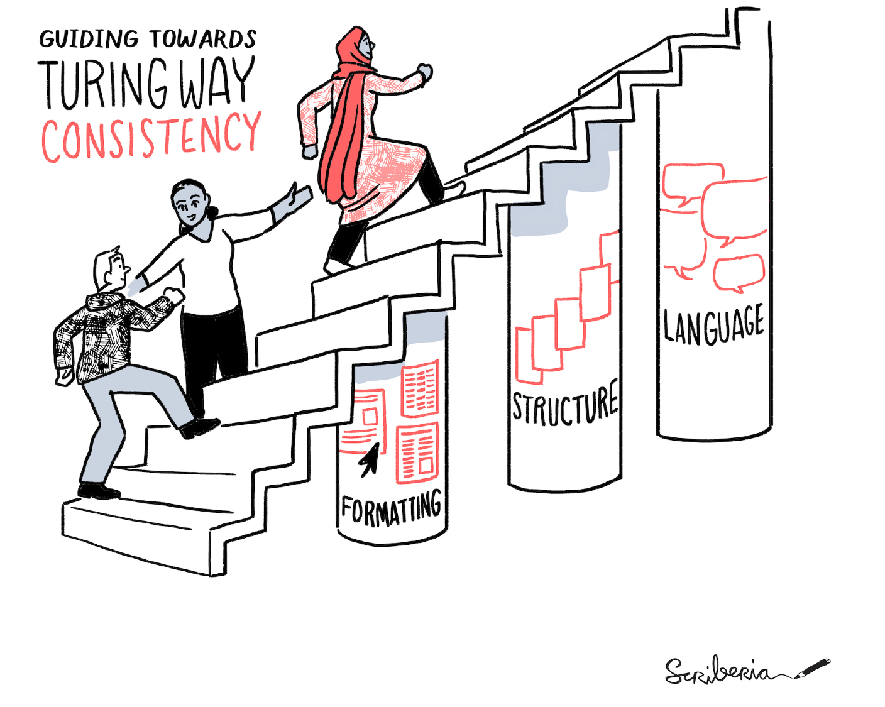
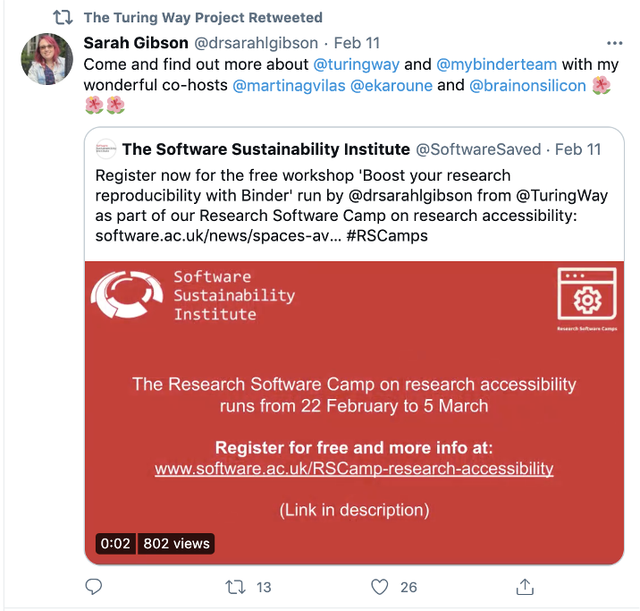
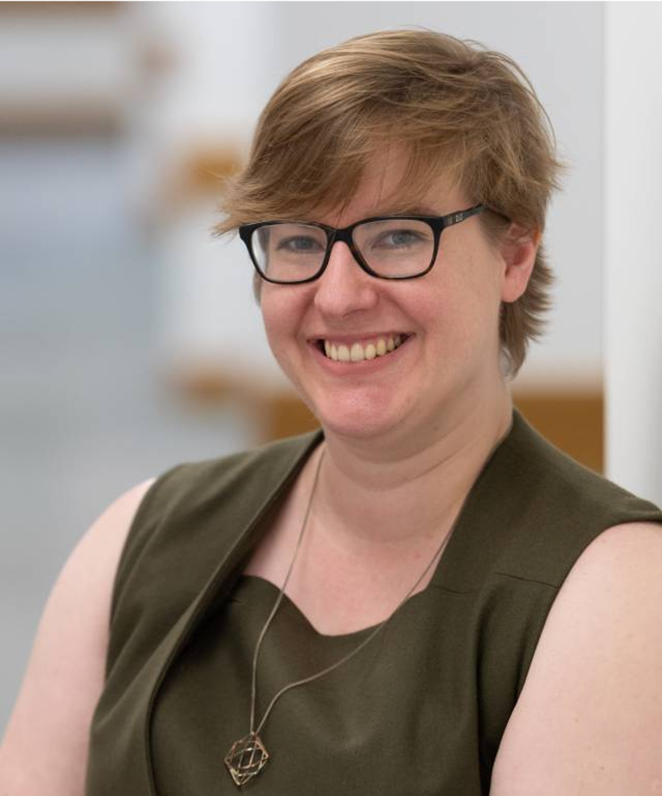
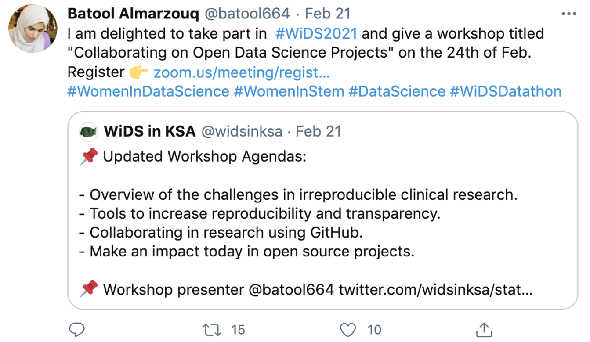
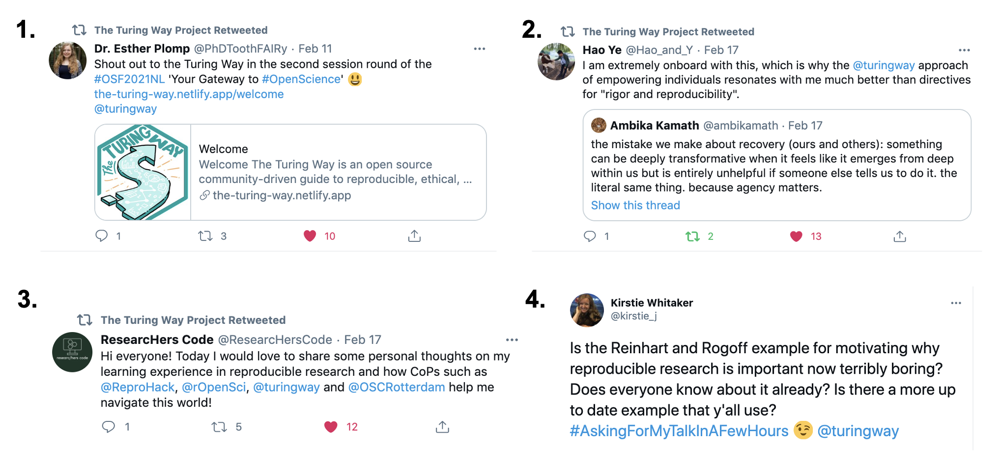

*The Turing Way* Newsletter: 24 February 2021

# Next Book Dash event, weekly onboarding calls & preparation for a new release on Zenodo

Hello Turing Way friends!

This month, we are delighted to share some new opportunities for onboarding, upskilling and networking for *The Turing Way* community members.

* 👋 Every Friday from 15:00 - 16:00 UTC ([see in your local time](http://time.unitarium.com/utc/15)), we will host onboarding calls for new contributors and community members ([shared notes](https://hackmd.io/@turingway/chat-onboard)).
* 📚 The next Book Dash event will take place from 17 to 24 May 2021. [Apply here](https://forms.gle/tsMuQSZMp4tKc3uz5). The deadline is 15 April 2021.
* 🆕 We are preparing to make a new release of _The Turing Way_ book and project repository on [Zenodo](https://zenodo.org/communities/the-turing-way). If you have contributed to the project, please add your details to the [Contributors Record](https://book.the-turing-way.org/afterword/contributors-record.html). 

In addition to The Turing Way updates, we are sharing relevant announcements and calls for action from other open-source projects in this newsletter.

Find more details on these topics below!👇

## Upcoming Events

*The Turing Way Community, & Scriberia. (2020, November). Illustrations from The Turing Way book dashes. Zenodo. http://doi.org/10.5281/zenodo.4323154*

**New addition - Onboarding Calls**: Thanks to many of you who suggested scheduling separate onboarding calls that could be useful for many new and existing members. We will host these calls every Friday from [15:00 - 16:00 UTC](http://time.unitarium.com/utc/15).
Find dates and joining details on this HackMD: [https://hackmd.io/@turingway/chat-onboard](https://hackmd.io/@turingway/chat-onboard).

**Collaboration Cafe**: Collaboration Cafes in March are scheduled on 3 March and 17 March from [15:00 - 17:00 UTC](http://time.unitarium.com/utc/15). 
Find more details here: [https://hackmd.io/@turingway/collaboration-cafe](https://hackmd.io/@turingway/collaboration-cafe).

**Weekly Coworking Calls**: The weekly coworking calls will take place every Monday from [11:00 - 12:00 UTC](http://time.unitarium.com/utc/11) (Western Time Zones) and Wednesdays on weeks when Collaboration Cafe is not scheduled from [15:00 - 16:00 UTC](http://time.unitarium.com/utc/15) (Eastern Time Zones). 
Find dates and joining details on this HackMD: [https://hackmd.io/@turingway/coworking-call](https://hackmd.io/@turingway/coworking-call).

## News from the Community

### Call for Application to Participate in the Book Dash, 17 - 24 May 2021
We are inviting applications to participate in the next Book Dash event taking place from 17-21 May 2021.
Applications can be submitted via [this Google Form](https://forms.gle/tsMuQSZMp4tKc3uz5). 
The deadline for submission is **15 April 2021**.

The [Book Dash events](https://book.the-turing-way.org/community-handbook/bookdash.html) bring together participants to work on *The Turing Way* book synchronously either in person or online. 
The upcoming book dash will be organised for online participation using the format we developed last year (see an overview [here](https://github.com/alan-turing-institute/the-turing-way/blob/main/workshops/book-dash/book-dash-nov20-report.md)).
You can find more details in the application form, which will take up to 30 minutes to complete.
If you are not sure if your idea fits the event, you are welcome to contact Malvika Sharan to discuss it further by emailing [msharan@turing.ac.uk](mailto:msharan@turing.ac.uk).

### Boost your Research Reproducibility with Binder Workshop

Sarah Gibson will lead the workshop “Boost your research reproducibility with Binder” as part of SSI’s [Research Software Camp on Research Accessibility](https://www.software.ac.uk/news/sarah-gibson-host-workshop-boost-your-research-reproducibility-binder-research-software-camp). 
Supported by Sophia Batchelor, Martina G. Vilas and Emma Karoune, the session will take place on [3 March 2021](https://www.software.ac.uk/RSCamp-research-accessibility-programme).
Registration is open (and free) via  [this Eventbrite link](https://www.eventbrite.co.uk/e/research-software-camp-boost-your-research-reproducibility-with-binder-tickets-138852787425).

*[Tweet by Sarah Gibson](https://twitter.com/drsarahlgibson/status/1359784963785297921?s=20
) sharing registration information about her workshop*

### Preparation to Make a New Release on Zenodo

We are preparing to publish a new release of *The Turing Way* book with the complete GitHub repository on Zenodo.
One of the most exciting and challenging parts of this process will be to create a list of co-authors out of 241 listed contributors.
We will be closely following the process as described in the [Acknowledgement](https://book.the-turing-way.org/community-handbook/acknowledgement.html) chapter.
Please add your profile and personal highlights to our [Contributors Record](https://book.the-turing-way.org/afterword/contributors-record.html), if you have not yet done that already.
This will allow us to acknowledge your work and include ORCID identifier for co-authors when publishing on Zenodo.
Since this will be a major release, we invite your help and welcome any feedback to enhance the workflow for making new releases.
Please use [issue #1751](https://github.com/alan-turing-institute/the-turing-way/issues/1751) to share your thoughts and ideas.

### An Emerging Technology Charter for London References *The Turing Way*

*The Turing Way* was listed as one of the selected references in the Charter draft developed to guide emerging technology in London. 
The Mayor of London had tasked the Chief Digital Officer for London and the Smart London Board to develop this Charter which is based on three key principles to guide discussions between makers and buyers, (1) Establish common, open and trusted ways of working between innovators, public services and Londoners when trialling and deploying new technologies, (2) Respect equality, diversity and human rights and act lawfully in the design and use of emerging technology, (3) Collect, manage, use and share data legally, ethically and securely.
*The Turing Way* was referenced in the recommendations for principle 1:
> When designing, developing, trialling and deploying emerging technologies, we aspire to work in the open wherever we can, sharing our plans and experience, working collaboratively with other organisations and reusing good practice.
> Use of open, robust and reproducible approaches and standards, as illustrated, for example, by *The Turing Way* community materials.

## Acknowledgements and celebrations

### Contributor in Focus: Laura Carter

Laura Carter is a PhD candidate in the Human Rights Centre at the University of Essex, UK. She is researching the human rights implications of the use of data-driven technologies in the UK public sector, focusing on gender stereotyping and gender discrimination. She brings her experience from working as a human rights researcher for almost a decade, specialising in gender, sexual orientation and gender identity. She has been contributing to the development of *The Turing Way* Guide for Ethical Research and has co-authored chapters including the introduction to ethical research and activism in data science.
In her words:
> I’m not from a tech field but I’ve learned so much about GitHub as a tool for collaborative working: thanks so much to everyone who was part of the November 2020 book dash for all your useful advice!

You can read more about it here on the [Contributors Record page](https://book.the-turing-way.org/afterword/contributors-record.html#laura-carter).

### Talks and Presentations

- Kirstie Whitaker gave a talk on 11 February for the Rigor and Reproducibility Seminar Series hosted by the [UF Movement Disorders and Neurorestoration Program](https://movementdisorders.ufhealth.org/) and the [UF Health Science Center Libraries](https://library.health.ufl.edu/). 
Under the title “The Turing Way: Empowering researchers in reproducible, ethical, inclusive and collaborative science”, you can find this talk on Zenodo, [http://doi.org/10.5281/zenodo.4537451](http://doi.org/10.5281/zenodo.4537451).

- On 11 February, Malvika Sharan gave a talk at FOSS Backstage 2021 on “Building a Culture of Collaboration in Open Source Communities with The Turing Way” (Zenodo link: [http://doi.org/10.5281/zenodo.4537702](http://doi.org/10.5281/zenodo.4537702)).
On 18 February, she also gave a talk “The Turing Way: Open Source and reproducibility aspects of data science” at the EMBL-EBI training workshop on Next Generation Sequencing data analysis.
She had a chance to build her slide decks upon the previous talks delivered by Martina G.  Vilas and Kirstie Whitaker (Zenodo link: [http://doi.org/10.5281/zenodo.4549447](http://doi.org/10.5281/zenodo.4549447)).

- Batool Almarzouq gave a talk in Saudi Data Community on February 17. Under the title "An Open Science Approach to Machine Learning in Biomedical Research", she gave an overview of how ML is used in life sciences with an introduction to Open Sciences. 
Her presentation is [available online](https://saudi-data-community.netlify.app/#1), source code for which is available on [her GitHub repository](https://github.com/BatoolMM/An-Open-Science-Approach-to-Machine-Learning).
You can cite her talk using the Zenodo DOI [10.5281/zenodo.4557636](https://zenodo.org/record/4557637). She also gave a workshop as a part of Women in Data Science (WiDS Saudi Arabia) on February 24 on "Collaborating on Open Data Science Projects". In the workshop, she introduced open science practices to data scientists with emphasis on git and version control. You can find the workshop [online](https://batoolmm.github.io/Collaborating-on-Open-Data-Science-Projects/) (Zenodo link: [doi.org/10.5281/zenodo.4561139](https://zenodo.org/badge/latestdoi/337206479)).

-   Batool Almarzouq gave a [talk](https://saudi-data-community.netlify.app/#1) and a [workshop](https://batoolmm.github.io/Collaborating-on-Open-Data-Science-Projects/) this month at the R-Ladies Dammam and Women in Data Science (WiDS) Saudi Arabia respectively. 
On 17 February, under the title “An Open Science Approach to Machine Learning in Biomedical Research”, she gave an overview of how ML is used in life sciences with an introduction to Open Sciences (DOI: [10.5281/zenodo.4557637)](https://zenodo.org/record/4557637). 
On 24 February, she introduced open science practices to data scientists with emphasis on git and version control in her workshop titled "Collaborating on Open Data Science Projects"  at WiDS Saudi Arabia (DOI: [10.5281/zenodo.4561139](https://zenodo.org/record/4561139)).

*[Tweet by Batool](https://twitter.com/batool664/status/1363550278214160385?s=20) about her workshop at Women in Data Science Saudi Arabia.*

## Relevant Resources

### Publications, Books and Posts

- Wong, D., & Palmer, E. (2021). [Reproducibility and transparency in anaesthesiology research](https://bjanaesthesia.org/article/S0007-0912(20)31022-9/fulltext). Comment on Br J Anaesth 2020; 125: 835–42. British Journal Of Anaesthesia, 126(3), e104-e105. DOI: 10.1016/j.bja.2020.12.024
- Karoune E. (2021). [What a data paper could do for you some great reasons to make an extra effort](https://ekaroune.github.io/The-Open-Archaeobotanist/2021-01-30-what_a_data_paper_could_do_for_you/), Personal Blog Post
- Studios, A. (2021). [Connecting the dots between research methods, academic cultures and technical solutions](https://www.knowledge-exchange.info/news/articles/29-01-2021): Three reflections on publishing reproducible research outputs, News - Knowledge Exchange.
- Knight, H., Deeny, S., Dreyer, K., Engmann, J., Mackintosh, M., & Raza, S. et al. (2021). [Challenging racism in the use of health data](https://www.thelancet.com/journals/landig/article/PIIS2589-7500(21)00019-4/fulltext). Lancet Digital Health. DOI: 10.1016/s2589-7500(21)00019-4
- SciGen.Report (2021). [Research Reproducibility For All](https://scigen.report/info/reproducibility).

*SciGen expansion of The Turing Way definitions.*

### Releavnt Opportunities & Announcements

- [Software Sustainability Institute](https://www.software.ac.uk/) (SSI) hosted Collaboration Workshop 2021 (CW21) will be featuring _The Turing Way_ workshop, [Good Practices for Designing Software Development Projects (The Turing Way)](https://software.ac.uk/cw21/mini-workshops-and-demo-sessions#2.2), on 31 March 2021. Find out more about the calls for proposal and registration on the [CW21 webpage](https://www.software.ac.uk/cw21). SSI has also launched the Lesson Study Groups in collaboration with The Carpentries and members of the Carpentry community. This is a new programme to support community members wishing to develop new lessons in The Carpentries Incubator. Find more details in [this post](https://www.software.ac.uk/news/launch-new-lesson-study-groups-programme)

- [Open Science Stories](https://anchor.fm/opensciencestories) is a new podcast series hosted by Heidi Seibold that features Open Science concepts or ideas as part of a story (3-10 minutes). 
She invites more contributors from the Turing Way community to share about the projects or other relevant concepts such as reproducible data science, collaborative book writing and open licensing.
If you are interested, comment under [issue #1706](https://github.com/alan-turing-institute/the-turing-way/issues/1706) or email [opensciencestories@gmail.com](maileto:opensciencestories@gmail.com).
Heidi is also a contributor to The Turing Way and she had recently given a talk [Practical Steps towards Open and Reproducible Research](https://docs.google.com/presentation/d/1eVcmuqAUCkd9mP2XnD89XIMlu6YhYE-fBqIriag1fqk/edit#slide=id.g9af0d2f885_0_283), where she had launched her podcast.

- [UK Reproducibility Network (UKRN)](https://www.ukrn.org) has recently produced a series of Primers on Open Research that is being developed into 2-3 minute animated videos to engage a wider audience.
We invite researchers with experience in several areas to help draft the scripts based on the [primer documents](https://www.ukrn.org/primers/). 
Interested researchers can contact us by replying to Matt Jaquiery (email: matt.jaquiery@psy.ox.ac.uk).
The topics they are looking to cover are preregistration and registered reports, preprints and Open Access.

- [Code for Science & Society](https://eventfund.codeforscience.org) has just released its second request for proposals to support research-driven open data science events. 
Applicants can ask for up to $20K to support virtual events held between July 2021 and January 2022. 
Submissions can be made till 29 March 2021 by 11:59 PM in the Pacific time zone. 
Grant notification will be made by 15 June 2021.
International applicants welcome! 
To learn more, read [this post](https://eventfund.codeforscience.org/request-for-proposals/).

- [The Open Bioinformatics Foundation](https://www.open-bio.org) Event Fellowship 2021 - round 1 call for application is now open.
The Open Bioinformatics Foundation (OBF) offers the OBF Event Fellowship program aimed at increasing diverse participation at events promoting open science practices such as source bioinformatics resource development and dissemination in the biological research community. 
We are inviting applications from individuals seeking financial support to attend or host virtual events. 
The deadline for this round is 1 April 2021. 
Find more details in [this blog post](https://www.open-bio.org/2021/02/19/obf-event-fellowship-round-1-2021/). 
Applications should be submitted via [this Google Form](https://forms.gle/ppExEeJpx8UDMWQB6).

- [UseR! 2021](https://twitter.com/_useRconf/status/1354352011978956806?s=09) conference will take place online from 5 to 9 July 2021.  
Abstract for talks, elevator pitches, panels and incubators can be submitted until 15 March 2021 and the deadline for videos, blogs and scripts submission is 20 June 2021.
Registration will open on 15 April 2021.
See details on the call for abstracts [here](https://user2021.r-project.org/participation/call-for-abstracts/).

### Tweet Mentions

**1**. [Paloma Rojas-Saunero’s Tweet](https://twitter.com/ResearcHersCode/status/1362003985486536711?s=20) about her learning experience from being part of many Community of Practice on reproducible research including The Turing Way.
**2**. [Hao Ye](https://twitter.com/Hao_and_Y/status/1362078062842695683?s=20) quote Tweeting Ambika Kamath’s Tweet promoting empowering individuals over directing them in the context of ‘reproducibility and rigour’. 
**3**. [Esther Plomp’s Tweet](https://twitter.com/PhDToothFAIRy/status/1359869384072773633?s=20) mentioning The Turing Way as a gateway to Open Science.
**4**. [Kirstie Whitaker’s Tweet](https://twitter.com/kirstie_j/status/1360172705933365248?s=20) highlighting the [Reinhart and Rogoff and Herndon](https://www.bbc.co.uk/news/magazine-22223190) example that she uses to talk about the real-world impact of research.

## Connect with us!

- [About the project](https://www.turing.ac.uk/research/research-projects/turing-way-handbook-reproducible-data-science)
- [_The Turing Way_ book](https://book.the-turing-way.org)
- [GitHub repository](https://github.com/alan-turing-institute/the-turing-way)
- [Slack Workspace](https://join.slack.com/t/theturingway/shared_invite/zt-fn608gvb-h_ZSpoA29cCdUwR~TIqpBw)
- [YouTube Videos](https://www.youtube.com/channel/UCPDxZv5BMzAw0mPobCbMNuA)
- [Twitter Channel](https://twitter.com/turingway)

You are welcome to contribute content for the next newsletter by
emailing [Malvika Sharan](mailto:msharan@turing.ac.uk).

*Did you miss the last newsletters?*
*Check them out [here](https://tinyletter.com/TuringWay/archive).*
