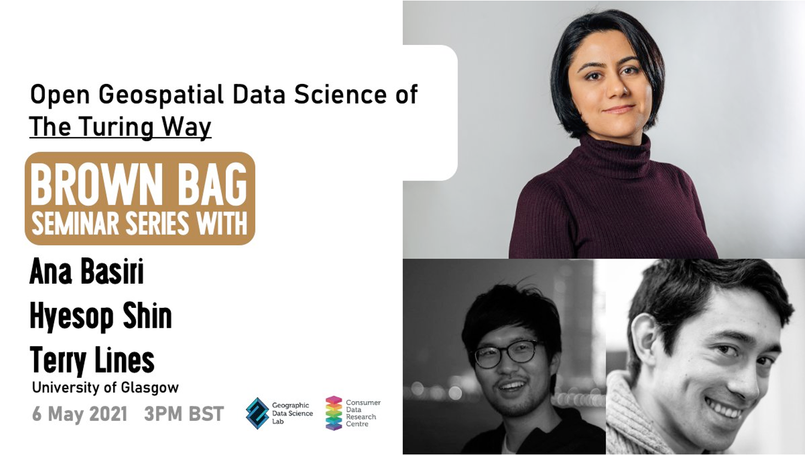
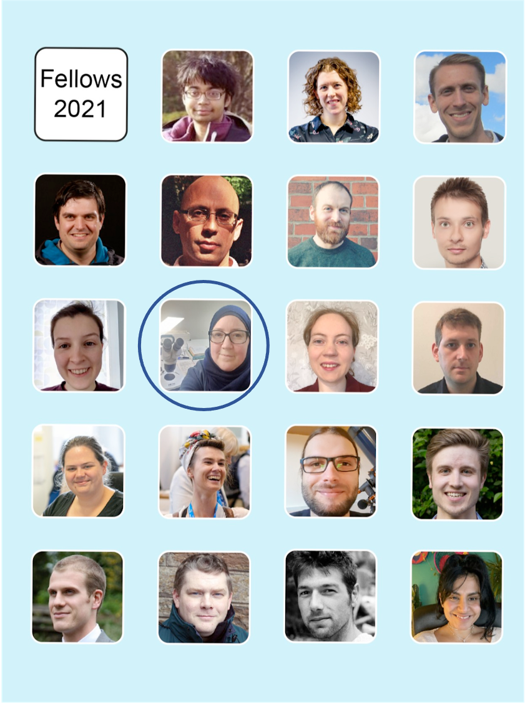
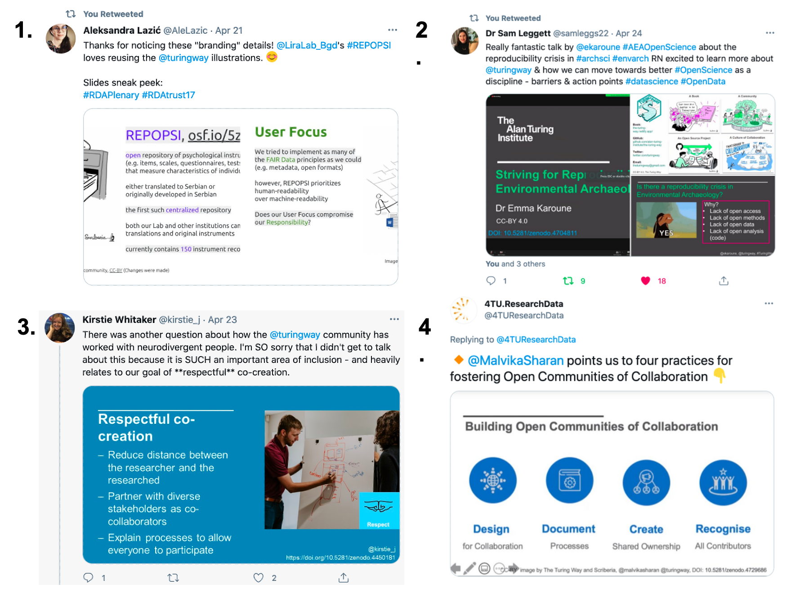

The Turing Way Newsletter: 30 April 2021

# Join the Community Share-out  event, meet the Book Dash Planning Committee and find more updates

Hello Turing Way friends!

The COVID-19 pandemic has impacted our lives in one way or another. 
*Make sure you extend your kindness to yourself too. It’s a difficult time, so remember to cut yourself some slack!‍* 🌸 (as quoted in [ZOE COVID Symptom Study](https://covid.joinzoe.com/post/covid-anxiety-tips))

In this newsletter we highlight:

* 📚 Community Share-out and Contributor Celebration events on 21 May 2021 ([Register](https://www.eventbrite.co.uk/e/the-turing-way-community-share-out-and-contributor-celebration-tickets-152668512631?ref=estw)).
* 🎊 The newly formed Book Dash Planning Committee members who are helping organise the upcoming Book Dash in May.
* 🛠 GitHub session for beginners on 13 May 2021 is open for registration ([Sign up](https://hackmd.io/-3_C0USqRLe-ReQEdBaX3Q?both#Sign-up-below-by-adding-your-name)).
* Community calls like co-working and onboarding sessions are being held weekly - attend a call of your choice ([see details](https://hackmd.io/@turingway/demo-intro)).

Find more details on these topics and more updates from the community below! 👇

## Community meetings

*The Turing Way Community, & Scriberia. (2020, November). Illustrations from the Turing Way book dashes. Zenodo. http://doi.org/10.5281/zenodo.4323154*

### Community Share-out and Contributor Celebration on 21 May: Sign up!

On 21 May 2021, *The Turing Way* team is hosting two Community Share-out and Contributor Celebration sessions at [11:00 London time (UTC+1)](https://arewemeetingyet.com/London/2021-05-21/11:00) and [14:00 London time (UTC+1)](https://arewemeetingyet.com/London/2021-05-21/14:00). 
Everyone interested in the project is invited - please sign up to attend one or both sessions via [this Eventbrite page](https://www.eventbrite.co.uk/e/the-turing-way-community-share-out-and-contributor-celebration-tickets-152668512631?ref=estw).

At these online calls, members of our community like the participants attending the Book Dash event from 17-20 May, will showcase their contributions to the book, share what they are working on and invite collaborations. 
This event will be ideal for anyone interested to learn about *The Turing Way*, see what recent updates have made in the project and celebrate the incredible work of our contributors. 
In the registration form, you can indicate if you would like to showcase your contributions to the project.

### GitHub Session for Beginners on 13 May 2021: Sign up!

We will be hosting a 1-hour GitHub session for beginners or new users of GitHub for collaborative projects like *The Turing Way* on 13 May 2021 from [16:00 - 17:00 London time (UTC+1)](https://arewemeetingyet.com/London/2021-05-12/16:00).
You can [sign up on this HackMD](https://hackmd.io/-3_C0USqRLe-ReQEdBaX3Q?both#Sign-up-below-by-adding-your-name) (you can directly add your name on the left panel).

This event is being organised in preparation for the upcoming Book Dash to ensure that our contributors feel confident about using GitHub.
Particularly, we want to:
* enhance the understanding of Open Source projects, 
* highlight the importance of version control for reproducibility, and
* promote collaborative practices as we build *The Turing Way* together.

### Regular community calls

**Collaboration Cafe** this month will take place on 05 May (first Wednesday) from 15:00 - 17:00 London time (UTC+1) ([See in your timezone](https://arewemeetingyet.com/London/2021-05-05/15:00)). 
You can find more details in this shared document: [https://hackmd.io/@turingway/collaboration-cafe](https://hackmd.io/@turingway/collaboration-cafe). 
Please note that the Collaboration Cafe on 19 May has been cancelled due to the Book Dash that is taking place during the week.
You are welcome to join the [Community Share-out & Contributor Celebration](https://www.eventbrite.co.uk/e/the-turing-way-community-share-out-and-contributor-celebration-tickets-152668512631?ref=estw) sessions being organised as a part of the Book Dash.

**Co-working Calls** are organised on Mondays (East time zones) from 11:00 to 12:00 London time (UTC+1) (next calls are on 3, 10, 24 and 31 May, no call on 17 May) and on Wednesdays (West time zones) from 15:00 to 16:00 GMT (next calls are on 12 and 26 May, when Collaboration Cafés are not scheduled). 
Please sign up for the upcoming calls: [https://hackmd.io/@turingway/coworking-call](https://hackmd.io/@turingway/coworking-call). 

**The weekly Onboarding call** will continue to take place on Fridays from 15:00 to 16:00 GMT ([next call in your timezone](https://arewemeetingyet.com/London/2021-04-09/15:00)). 
Please read more details on this shared HackMD: [https://hackmd.io/@turingway/chat-onboard](https://hackmd.io/@turingway/chat-onboard) and sign-up to join one of the upcoming calls.

If you would like to lead one of these calls (which we highly encourage), please get in touch with the team members to express your interest (email: theturingway@gmail.com) or ping Malvika Sharan on [Slack](https://join.slack.com/t/theturingway/shared_invite/zt-fn608gvb-h_ZSpoA29cCdUwR~TIqpBw).

## News from the community

### Meet the  Book Dash Planning Committee 

We are excited to share that **Arielle Bennett, Batool Almarzouq, Brigitta Sipocz, Emma Karoune, Esther Plomp and Laura Carter** have joined the Book Dash Planning Committee as the core contributors and returning members of *The Turing Way*.
**Carlos Martinez and Pablo Rodriguez-Sanchez** will also represent the interest and vision of the Netherlands eScience Center in the committee and run an event in parallel to the Book Dash (17-21 May 2021) to engage their team members in contributing to *The Turing Way*.

These members bring multiple perspectives and interests that are essential for building an equitable and supportive environment for our Book Dash attendees.
They have already reviewed the Book Dash applications and are helping finalise logistics ensuring fairness and accessibility before, during and after the event.
You can read about the Book Dash online in [*The Turing Way* book](https://book.the-turing-way.org/community-handbook/bookdash.html).

## Relevant Resources and Announcements

### Open Geospatial Data Science of *The Turing Way* - Brown Bag Seminar

*Announcement of the Brown Bag Seminar by the Geographic Data Science Lab Organizer*

On 6 May 2021, the Geographic Data Science Lab  Organizer will host a Brown Bag seminar under the title: Open Geospatial Data Science of *The Turing Way*. 
The event will start with an introduction to *The Turing Way* and Responsible Data Science Special Interest group by Ana Basiri, a Professor in Geospatial Data Science and a UK Research and Innovation Future Leaders Fellow at the University of Glasgow.
Together with Hyesop Shin and Terry Lines (researchers at the University of Glasgow), Ana will talk about the Indicative Data Science project that considers biases and missingness of data as useful data. 
They will also discuss how missing geospatial data such as blocked GPS signals can be used to create 3D maps and how to develop an inclusive crowdsourcing platform for Volunteering Geographic Information data collection. 
You can register to attend this event online: [https://tinyurl.com/gdsluog](https://tinyurl.com/gdsluog).

### Open Research Calendar

The [Open Research Calendar Events](https://openresearchcalendar.org) project has recently launched its newsletter to allow users to receive an automated newsletter summarising events that have been submitted to the Open Research Calendar. 
[Subscribe to their newsletter](https://openresearchcalendar.org/email-subscribe).
The project is led by Alexandra Lautarescu, Bradley J Kennedy, Cassandra D Gould van Praag,  and Esther Plomp, and they invite anyone interested to add details about their open science event via their [webpage](https://openresearchcalendar.org).

### hidden REF: Nominate someone for their hidden labour in research

The hidden REF is a friendly competition that recognises all research outputs and every role that makes research possible.
You can enter the competition by nominating yourself or someone vital to carry out your research: [https://hidden-ref.org/submissions/](https://hidden-ref.org/submissions/).
The [submission categories](https://hidden-ref.org/categories/) are crowdsourced to construct a broad set of categories that will recognise everyone who contributes to the success of the research.
Submissions will close on 14th May 2021. 
They will be reviewed by panels drawn from across the research community and winners will be announced in June 2021.

*Tweet by [hidden REF](https://twitter.com/HiddenRef/status/1387429727506423813?s=20) requesting submission outlining the contribution to research. There are 21 categories to choose from.*

### Talks and Presentations

On 23 April 2021, Kirstie Whitaker joined Dario Taraborelli and Melissa Weber Mendonça at a Chan Zuckerberg Essential Open Source Software for Science (CZI - EOSS) session on the [Tidelift podcast](https://www.twitch.tv/tidelift). 
Luis Villa and Josh Simmons hosted the session under the topic “Making Open Source Work Better - for everyone” and discussed the current status of open source infrastructure, elements of collaboration and investing in community development.
You can read Kirstie’s thoughts on this [Twitter thread](https://twitter.com/kirstie_j/status/1385707607671857155?s=20).

On 24 April 2021, Emma Karoune gave a talk “Striving for reproducibility in Environmental Archaeology” at the Association of Environmental Archaeology Spring Conference on Open Science.
Her talk explores reproducibility in terms of what reproducible research is in Environmental Archaeology, what the barriers are, and how we can do reproducible research.
Zenodo link: [http://doi.org/10.5281/zenodo.4704811](http://doi.org/10.5281/zenodo.4704811). 

On 27 April 2021, she also gave a talk for ReproducibiliTea at the University of Portsmouth. 
She introduced *The Turing Way* and described how people can start to do reproducible research by working transparently and collaboratively using Github. 
It also explores the community, open-source and collaborative nature of the project.
Zenodo link: [http://doi.org/10.5281/zenodo.4719847](http://doi.org/10.5281/zenodo.4719847).

If you are interested in understanding community management, check out the talk “Introduction to Scientific Community Managers: Culture, Groundskeeping & Glue” by Arielle Bennett that she presented at Kirstie’s lab meeting on 29 April 2021.
Zenodo link: [https://zenodo.org/record/4727345](https://zenodo.org/record/4727345)

On 30 April 2021, Malvika Sharan gave a talk “Building Open Community of Collaboration” at the [4TU Research Data](https://data.4tu.nl/info/)’s first community call.
She discussed the different elements of community building for open source community projects, drawing examples from her work in *The Turing Way*.
Zenodo link: [https://zenodo.org/record/4729686](https://zenodo.org/record/4729686).

## Acknowledgements and celebrations

### Congratulations to the new Software Sustainability Institute Fellows

*[The 2021 Fellows](https://www.software.ac.uk/news/announcing-2021-software-sustainability-institute-fellows) are Abhishek Dasgupta, Alison Clarke, Chris Jochem, Colin Sauze, Daniele Procida, Dave Horsfall, Dominik Krzemiński, Eli Chadwick, **Emma Karoune** (highlighted with a blue circle), Hannah Williams, Iain Barrass, Katy Brown, Leontien Talboom, Mateusz Malenta, Matthew Bluteau, Michael Berks, Simon Waldman, Thibault Lestang and Yadira Sánchez.*

We congratulate the 19 new Software Sustainability Institute (SSI) Fellows for 2021! 
These new research software ambassadors represent some of the best people working in – and advocating for – better research software. 

We particularly want to highlight Emma Karoune, a community manager for the DECOVID project at The Alan Turing Institute and a core contributor of *The Turing Way* for being named a 2021 fellow!
In Emma’s words:
> I am passionate about applying open science approaches for greater research sustainability. 
> I have a particular interest in developing reproducible research workflows and enabling a more equitable, diverse and inclusive research culture.
> I have given talks, written blogs, and formed a working group for open science in phytolith research. 
> I am an active member of *The Turing Way* Community and have recently run workshops on Zero to Binder and Project design. 
> I am also working on several chapters for *The Turing Way* book as part of the Guide for Communication.

You can read about the fellowship [here](https://www.software.ac.uk/news/announcing-2021-software-sustainability-institute-fellows) and more about Emma on her [profile page](https://software.ac.uk/about/fellows/emma-karoune)

### Twitter Mentions

- **1** [Aleksandra Lazic tweeted](https://twitter.com/AleLazic/status/1384899325352980480?s=20) a sneak peek of her RDA plenary talk, sharing that she loves reusing *The Turing Way* illustrations. 
Her project resources “Repository of psychological instruments in Serbian” are available online: https://osf.io/5zb8p/.
- **2** [Sam Leggett tweeted](https://twitter.com/samleggs22/status/1385974288428195842?s=20) some slides from  Emma’s talk on 24 April under the title “Striving for reproducibility in Environmental Archaeology”.
- **3** [Tweet by Kirstie](https://twitter.com/kirstie_j/status/1385714991618211841?s=20) highlighting that respectful co-creation is important to work with neurodivergent people and heavily related to our goal in *The Turing Way*.
- **4** [Tweet by 4TU ResearchData](https://twitter.com/4TUResearchData/status/1388057147259371523?s=20) highlighting four principles described by Malvika on building open communities of collaboration as: (1) design for collaboration, (2) document processes, (3) create shared ownership and (4) recognise all contributions.

## Connect with us!

- [About the project](https://www.turing.ac.uk/research/research-projects/turing-way-handbook-reproducible-data-science)
- [_The Turing Way_ book](https://book.the-turing-way.org)
- [GitHub repository](https://github.com/alan-turing-institute/the-turing-way)
- [Slack Workspace](https://join.slack.com/t/theturingway/shared_invite/zt-fn608gvb-h_ZSpoA29cCdUwR~TIqpBw)
- [YouTube Videos](https://www.youtube.com/channel/UCPDxZv5BMzAw0mPobCbMNuA)
- [Twitter Channel](https://twitter.com/turingway)

You are welcome to contribute content for the next newsletter by
emailing [Malvika Sharan](mailto:msharan@turing.ac.uk).

*Did you miss the last newsletters?*
*Check them out [here](https://tinyletter.com/TuringWay/archive).*
