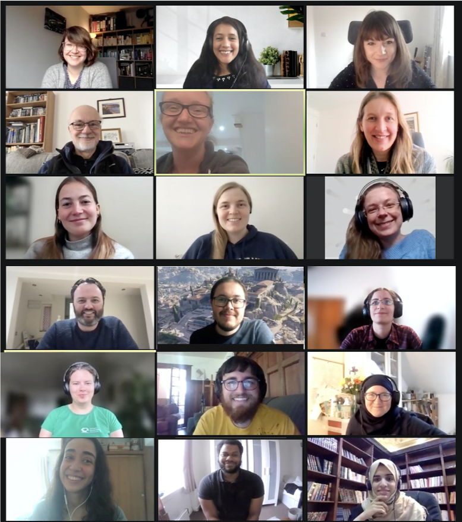
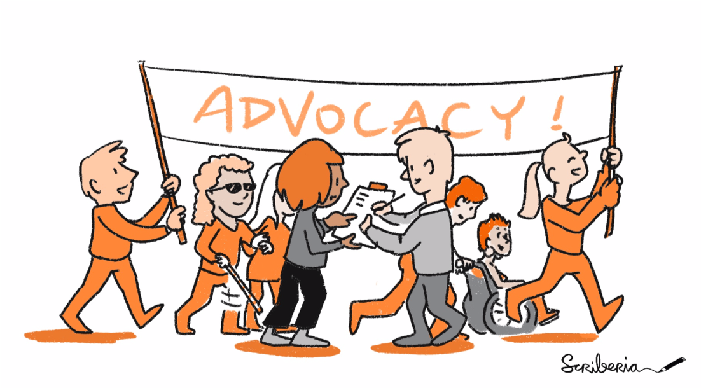

The Turing Way Newsletter: 31 May 2021

# Book Dash Report, Job Announcements, New Illustrations and Community Updates

Hello Turing Way friends!

This month:
* 📚 We hosted the fifth edition of the Book Dash event from 17 - 21 May. Read about out participants and what they worked on.
* ✍️ There are two job openings at The Alan Turing Institute for the Research Application Manager positions who will work closely with The Turing Way team. The application deadline is 20 June 2021.
* 🎨 We are releasing a new set of illustrations that are available with a version that can be easily translated into other languages.

Find more details on these topics and more updates from the community below 👇

## Community meetings

*This image was created by Scriberia for The Turing Way community and is used under a CC-BY licence. DOI [10.5281/zenodo.3332807](10.5281/zenodo.3332807).*

### Getting Started with *The Turing Way*

 *The Turing Way* offers multiple ways to get involved or use the project.
Although this is useful for many people who want to choose different pathways to enter and contribute to the project, it can be confusing for some people who don’t know where to start.
To address this, we host onboarding calls every Friday from 15:00 - 16:00 London time ([see in your time](http://time.unitarium.com/utc/14)).
Come along with your coffee and questions to these calls and our core contributors will help you get started with *The Turing Way*.

### Community calls for Co-Working and Discussion 

This month’s Collaboration Cafes are taking place on 02 June and 16 June 2021 from 15:00 - 17:00 London Time ([see in your time](http://time.unitarium.com/utc/14)).
If you have not had a chance to attend one of these calls yet, find out what you can expect from the discussions and co-working sessions in these calls in [this chapter](https://book.the-turing-way.org/community-handbook/coworking/coworking-collabcafe.html).
Please sign up for the upcoming call, which will be hosted by Emma Karoune: [https://hackmd.io/@turingway/collaboration-cafe](https://hackmd.io/@turingway/collaboration-cafe). 

Weekly co-working calls in Western Time Zone slots take place on Mondays.
This June, we will host these calls on 07, 14, 21 and 28 June 2021 from 11:00 to 12:00 London times ([see in your time](http://time.unitarium.com/utc/10)).
Please note that due to a bank holiday in the UK, we will not be hosting a call on 31 May 2021.

Co-working calls in the Eastern Time Zone slot will take place from 15:00 to 16:00 London time on Wednesdays ([see in your time](http://time.unitarium.com/utc/14)) when a Collaboration Cafe is not already taking place. 
In June these calls are scheduled on  09, 23 and 30 June 2021.
Please see details here and join in: [https://hackmd.io/@turingway/coworking-call](https://hackmd.io/@turingway/coworking-call). 

## News from the community

### Job Announcement: Research Application Manager Roles

Two Research Application Managers positions have opened at the Alan Turing Institute who will work to embed the expertise in the Tools, Practices and Systems,  *The Turing Way*, and broader open source and modelling communities across AI for Science and Government projects. 
RAMs work in a dedicated team focused on ensuring that research outputs are used successfully and sustainably by external stakeholders (such as open source tools, protocols, and modelling frameworks ). 
There is significant scope for the postholder to develop new skills and grow in the role. 
We are also enthusiastic about people who have a background as community managers as they are experts in distributed, decentralised collaboration.
Please share this link with potential applicants: https://cezanneondemand.intervieweb.it/turing/jobs/research_application_manager_x2_14360/en/

*[Aida Mehonic quote tweeting](https://twitter.com/amehonic/status/1397169406904569858?s=20) The Turing Way tweet inviting applications to the two Research Application Manager positions at The Alan Turing Institute.*

### Open Life Science Cohort 3 Graduates from  *The Turing Way* Community

Under the ‘OLS for Turing’ collaboration with Open Life Science, 6 members graduated from the third cohort of OLS-3.
We send our heartiest congratulations to the following members:
* Martina Vilas, project name: Open Source Project for Evaluating Reproducibility Trends in AI Research Projects, mentored by Anna Krystalli.
* Batool Almarzouq, project name: Open Science Community in Saudi Arabia, mentored by Anelda van der Walt.
* Aida Mehonic, project name: Developing and embedding open science practices within the Research Application Management team at Turing, mentored by Malvika and Kirstie.
* Mishka Nemes, project name: Towards an infrastructure for open-source (online) training in data science and AI, mentored by Jez Cope.
* Sarah Gibson, project name: An Open Source Service Area for Turing research projects, mentored by Meag Doherty.
* Ali Humayun, project name: Developing a community health report and assessing its impact on the wider data science community, mentored by Malvika.

Learn more about these and other OLS-3 projects [here](https://openlifesci.org/ols-3/projects-participants/).
A call for application for the fourth cohort will be open between 15 June and 15 July.
You can find more information on the website: [https://openlifesci.org/](https://openlifesci.org/).

### Book Dash May 2021 Reports and Resources

From 17 to 21 May 2021, we hosted our fifth Book Dash event. 
During this week, we hosted 13 development sessions, four open discussion sessions and a show and tell social call. On 21 May, the last day of the event, we also hosted two Community Share-outs to celebrate the work of our contributors, which was opened to the public. 
This event was attended by 20 participants who collaborated on [39 Pull Requests (PRs) and 31 issues](https://github.com/alan-turing-institute/the-turing-way/pulls?q=label%3A0-book-dash-may21+) covering various topics and chapters across the five guides in the book.
We share more about our attendees and their contributions to the project below.

## Acknowledgements and celebrations

### Contributor in focus: Book Dash May 2021 Attendees

We are very excited to introduce you to our Book Dash participant!.

*Book Dash attendees in the first row: Nina di Cara (panel 1), Malvika Sharan (panel 2), Becki Green (panel 3), second row: Kirstie Whitaker (panel 2), Aida Mehonic (panel 3), third row: Lotty Coupat (panel 1), Hannah Nicholls (panel 2), Esther Plomp (panel 3), fourth row: Maria Cristina Nanton (panel 3), fifth row: Brigitta Sipőcz (panel 1), Emma Karoune (panel 3), sixth row: Mariana Vivas (panel 1) and Batool Almarzouz (panel 3). In this picture, we also have several attendees from our share-outs including Martin O’Reilly, Ismael Kherroubi-Garcia, Danny Garside and Paul Owoicho who are involved in the project. Book Dash attendees who are not in the picture are Ali Humayun, Andreea Avramescu, Andrei Alexandru, Marta Mangiarulo, Arielle Bennett, Carlos Martinez-Ortiz and Laura Carter.*

### Book Dash Planning Committee

This event could not have happened without the valuable work of our Planning Committee members: Arielle Bennett, Batool Almarzouq, Brigitta Sipőcz, Carlos Martinez-Ortiz, Emma Karoune, Esther Plomp and Laura Carter. These members had attended previous Book Dash events and had sent their applications expressing their interests to mentor new contributors. They provided useful input during the planning, mentored new contributors, hosted the development during the Book Dash week and led and discussion sessions.
Malvika Sharan and Kirstie Whitaker were involved to ensure that resources required for committee members to lead sessions and run this event were in place. 

### Resources from the Book Dash May 2021

Our Book Dash attendees worked on multiple chapters and project ideas that we have summarised below:

* Overview of new chapters:
  * “[Legal Disclaimer](https://book.the-turing-way.org/afterword/legal-disclaimer.html)” by Laura Carter explaining where can readers find legal advice so that they do not consider any part of *The Turing Way* book as a legal guide. 
  * Malvika and Esther reorganised a chapter “[Making Research Objects Citable](https://book.the-turing-way.org/communication/citable.html#)”,  previously listed under the Guide for Reproducible Research.
  * Kirstie Whitaker wrote a chapter on “[Barriers to Reproducibility](https://book.the-turing-way.org/reproducible-research/overview/overview-barriers.html)” describing what challenges researchers face in their research when planning to apply practices for reproducibility.
  * Batool and Brigitta collaborated on the chapters and illustrations for the [Continuous Integration chapter](https://book.the-turing-way.org/reproducible-research/ci.html) that they started working on during the previous Book Dash event.
  * Arielle Bennett updated the chapter “[Activism for Researchers](https://book.the-turing-way.org/ethical-research/activism.html)” with the contributions of Bruno Camino. 

*This image was created by Scriberia for The Turing Way community and is used under a CC-BY licence. DOI [10.5281/zenodo.3332807](10.5281/zenodo.3332807).*

* Draft for chapters inviting contributions and reviews:
  * Maria, Marta and Emma collaborated on the chapter “Communicating with wider audiences” [PR #1929](https://github.com/alan-turing-institute/the-turing-way/pull/1929).
This is a comprehensive chapter describing different ways for ensuring scientific communication is accessible to a wider audience.
  * Andreea, Hannah and Becki collaborated on the chapter describing file organising template for research compendia.
See [PR #1930](https://github.com/alan-turing-institute/the-turing-way/pull/1930).
  * Kirstie is restructuring the Guide for Collaboration to ensure that the chapters are organised based on the types of collaboration and are easy to find.
See [PR #1935](https://github.com/alan-turing-institute/the-turing-way/pull/1935).
  * Martina Vivas and Malvika co-wrote a chapter to provide an overview of project design.
This chapter provides a curated collection of The Turing Way chapters that are useful for planning project design for a new project.
See [PR #1936](https://github.com/alan-turing-institute/the-turing-way/pull/1936).
  * Lotty Coupat, community manager of AutSPACEs, added a case study from her project to the subchapter on project road mapping.
See [PR #1941](https://github.com/alan-turing-institute/the-turing-way/pull/1941). 
  * Esther wrote a chapter on linking code and data to publication in [PR #1942](https://github.com/alan-turing-institute/the-turing-way/pull/1942/files).
  * Andrei is revising the chapter on risk assessment to make sure that it is relatable for researchers beyond software engineers.
See [PR #1928](https://github.com/alan-turing-institute/the-turing-way/pull/1928).
 * Prompted by the discussions in the Community Share-outs, Danny Garside is suggesting changes in the landing page to help ensure that the readers can use the book as a knowledge base and not attempt to read it from beginning to end.
See [issue #1955](https://github.com/alan-turing-institute/the-turing-way/issues/1955).
  * Nina worked on developing a chapter describing ways to develop skills for self-reflection in data science to maintain ethical integrity in our work.
See [issue #1919](https://github.com/alan-turing-institute/the-turing-way/issues/1919).

*[Tweet by Nina di Cara](https://twitter.com/ninadicara/status/1394931465205518336?s=20) about self-reflection guide to ethics.*

* Find an overview from the event and links to different resources in this [shared HackMD](https://hackmd.io/@turingway/bookdash-may2021-index).
*  *The Turing Way* the introduction presentation for the Book Dash contributors is available on Zenodo under the DOI [10.5281/zenodo.4766318](https://zenodo.org/record/4766318).
* Recordings from the Community Share Out is available on our [YouTube channel](https://www.youtube.com/channel/UCPDxZv5BMzAw0mPobCbMNuA/featured) ([shared HackMD](https://hackmd.io/@turingway/bookdash-may2021-day5)).
* A complete report will be added to the GitHub repository and made available via this HackMD: [hackmd.io/@turingway/bookdash-may2021](https://hackmd.io/@turingway/bookdash-may2021)

### New Illustrations by Scriberia for  *The Turing Way* Community

Illustrations from the event have been made available online, which can be reused using DOI: 10.5281/zenodo.4836940 and cited as described [on Zenodo](https://zenodo.org/record/4836940).
This latest release contains a version of images without the (English) text that can be easily adapted to different languages (see [this example by Canva](https://www.canva.com/features/add-text-to-photo/)). 
We encourage our readers and community members to reuse these images in different languages and contribute them back to  *The Turing Way*. 
Please reach out to  *The Turing Way* team by emailing [theturingway@gmail.com](mailto:theturingway@gmail.com) for more information.

*This image was created by Scriberia for The Turing Way community and is used under a CC-BY licence. DOI [10.5281/zenodo.3332807](10.5281/zenodo.3332807).*

## Talks and Workshops

On 6 May, Ana Basiri and Hyesop Shin gave a talk about Open Geospatial Data Science and  *The Turing Way* at the [Brown Bag Seminar](https://www.eventbrite.com/e/gdsl-brown-bag-with-ana-basiri-hyesop-shin-and-terry-lines-tickets-152637361457) organised by Geographic Data Science Lab. 
You can watch the [talk on YouTube](https://www.youtube.com/watch?v=64IPCiEZBjQ).
Ana introduced  *The Turing Way* (start at min 4') followed by their work on missing data as data. Hyesop discussed the benefits of  *The Turing Way* to our projects (minutes 25 onwards). 
They showed a great example of how researchers can use various components of  *The Turing Way* in their work, independent of their research domain.

On 13 May, Esther Plomp and Malvika hosted a short GitHub session for the contributors who are new to GitHub.
They covered basic steps to make contributions on GitHub repositories and facilitated creating a Pull Request on  *The Turing Way*repository.
You can see details from the event including links to the teaching materials in this [shared HackMD](https://hackmd.io/@turingway/bookdash-may2021-github).

On 26 May, the Tools Practices and Systems hosted a talk by Kaitlin Thaney, Executive Director of [Invest in Open Infrastructure](https://investinopen.org) (IOI).
IOI is an initiative dedicated to improving funding and resourcing for open technologies and systems supporting research and scholarship. 
She gave an overview of the work IOI is doing to support open, community-owned infrastructure.
You can see her slides [here](https://docs.google.com/presentation/d/1h-zII8RSQ6Pib5WV8Cv-0AG6BTCTbSkkRa0glTa1Hj8/edit?usp=sharing).

On 27 May, Malvika presented a talk at the [Omics data generation and analysis interest group meeting](https://eventbrite.co.uk/e/omics-data-generation-and-analysis-group-tickets-145274753699).
This event was organised by Andrew Holding and Ben MacArthur to bring together Turing Fellows who have a research interest in genomics, proteomics, transcriptomic, metabolomic technologies.
She talked about The Turing Way highlighting open source and reproducibility best practices in data science.
See her slides on [Zenodo](https://zenodo.org/record/4818126).

Malvika also participated in an [ASAPbio panel](https://asapbio.org/event/asapbio-community-call-may-2021) ‘Bringing culture change to science communication’ on 24 May. 
Along with the panellists, Clarissa Carneiro and Brian Nosek, Malvika presented her view on culture change as a process "Diversity - Recognition - Amplification" drawing from her discussion with  *The Turing Way* and Open Life Science community members ([see this Tweet](https://twitter.com/MalvikaSharan/status/1398039165837656070)).

![This screenshot of a slide describes: (1) The Turing Way, which is a guide to reproducible, ethical and collaborative research and led by Kirstie Whitaker. (2) Open Life Science, which is a training and mentoring for community-led projects, co-led by Malvika, Yo Yehudi, Berenice Batut and Emmy Tsang. It has two Scriberia images, one showing how hidden labour can be made visible with recognition, opportunity, visibility and rewards and the other showing three groups of people discussing different issues and making decisions in a decentralised manner](images/2021-05-culturepanel-8.png)

*[Malvika tweeted](https://twitter.com/MalvikaSharan/status/1398039165837656070?s=20) her slide summarising her notes for the culture change as a process that will need efforts to make hidden labour visible and decentralised decision making in research.
Illustrations used in this slide were created by Scriberia for The Turing Way community and are used under a CC-BY licence. DOI [10.5281/zenodo.3332807](10.5281/zenodo.3332807).**

## Relevant Announcements

### Upcoming events

* **Scoping Workshop by the Turing Ethics Team**: As part of 'Learning at Turing' at The Alan Turing Institute, the Ethics Team (Public Policy Programme) are running scoping workshops to get feedback and co-design upcoming courses on AI Ethics & Governance, Responsible Research and Innovation, and Public Communication of Science.
Three scoping workshops will run from 23rd–24th June for which attendees will be reimbursed for their time. 
Registration is open for a limited number of seats that are open for early career researchers and PhD students.
Please register your interest via [this form](https://forms.office.com/r/n8QdXTUUtm).

* **Research Software Camp by Software Sustainability Institute**: The Software Sustainability Institute runs the second online Research Software Camps from 1 to 12 November 2021.
See [details here](https://www.software.ac.uk/research-software-camps).
This event will introduce and explore topics around research software, thus starting discussions among various research communities. 
A variety of online resources will be collated, ranging from discussion forums to blog posts and guides discussing different aspects of the chosen topic.
All sessions and resources can be accessed freely and they’ll be aimed at anyone who’s working in research and research software. 
The first Research Software Camp on research accessibility took place in February - March 2021.

### Resources

F1000 have curated links and resources covering all aspects of open data - from the FAIR Data Guiding Principles, to community projects like  *The Turing Way*.
You can explore these resources [online](https://think.f1000research.com/open-data/toolkit/).

### Updates from Community Members

*[Sarah tweeted](https://twitter.com/drsarahlgibson/status/1398348235333382144?s=20) about her work in The Turing Way and the impact it had on her work.*

Sarah Gibson is off to a new start as the Open Source Infrastructure Engineers at [2i2c](https://2i2c.org/) where she will focus her efforts on JupyterHub development and operations for the Pangeo community.
Over the last 2.5 years at The Turing Institute, Sarah worked as a Research Software Engineer, supported The Turing Way project as a core member and worked with the BinderHub team.

In June, Sarah will also be joined by several members of Kirstie's research group (all Turing Way members!) to walk for [Crohn's and Colitis UK](https://www.crohnsandcolitis.org.uk/) that **you can support by donating any small amount via their [My Walk It page](https://www.mywalkit.org.uk/teams/whitaker-lab-walks-it)**.

Isabel Birds, an ‘Engage @ Turing’ student and DECOVID member at The Alan Turing Institute recently shared that after learning about  *The Turing Way* in a workshop, she has been working on a project using Jupyter Book.
This project will compile resources that she has gathered for mentoring students who transitioned from wet lab to computational projects due to the COVID pandemic situations.
Isabel is a PhD Candidate the University of Leeds and works as an analyst in the COPD Analytics Team in DECOVID.
Her work is focused on investigating the translation and conservation of lncRNA in Human neuronal cells, and D.melanogaster.

Martina Vilas, one of  *The Turing Way* core contributors, has been named an open science fellow for this year's Organization for Human Brain Mapping (OHB)M hackathon.
She will guide participants through machine learning topics at TrainTrack.
You can find more details [here](https://ohbm.github.io/hackathon2021/traintrack/).
Martina is a PhD candidate at Max Planck Institute for Empirical Aesthetics in Germany currently working on a project investigating how the brain represents abstract information using computational models. 
She enjoys talking about computational reproducibility and contributing to open-source projects and has given many talks about  *The Turing Way*.

Our best wishes to these members as they promote open science and reproducibility practices through their work.

## Connect with us!

- [About the project](https://www.turing.ac.uk/research/research-projects/turing-way-handbook-reproducible-data-science)
- [_The Turing Way_ book](https://book.the-turing-way.org)
- [GitHub repository](https://github.com/alan-turing-institute/the-turing-way)
- [Slack Workspace](https://join.slack.com/t/theturingway/shared_invite/zt-fn608gvb-h_ZSpoA29cCdUwR~TIqpBw)
- [YouTube Videos](https://www.youtube.com/channel/UCPDxZv5BMzAw0mPobCbMNuA)
- [Twitter Channel](https://twitter.com/turingway)

You are welcome to contribute content for the next newsletter by
emailing [Malvika Sharan](mailto:msharan@turing.ac.uk).

*Did you miss the last newsletters?*
*Check them out [here](https://tinyletter.com/TuringWay/archive).*
