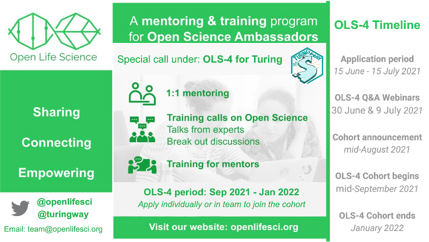

The Turing Way Newsletter: 30 June 2021

# Success Stories from Book Dash Collaborations, Videos from Past Events & More Community Updates

Hello Turing Way friends!

In June, amidst the pandemic and lockdowns, our incredible Book Dash contributors and reviewers continued to collaborate and work on their contributions over the last month.🙏

Thanks to them (you!):
- 🎊 we published 8 chapters (with 20 subchapters) across guides for communication, collaboration and ethical research! 
- 📹 we also published videos from the Community Share out events that include stories and ideas behind the illustrations we recently released on [Zenodo](https://zenodo.org/record/3332807).

If you are wondering where to start, [email Malvika](mailto:msharan@turing.ac.uk) who would love to chat about your work and find the right starting point for you in _The Turing Way_.

Find more details on these topics (and more) below 👇

*Thanks to Emma Karoune for reviewing this month's newsletter.* 🌷

## Community Meetings

*An illustration of a group coworking. [Royalty-free image from Many Pixels](https://www.manypixels.co/gallery/)*

You are invited to attend one or multiple of our online community calls listed below (also [subscribe to our calendar](https://calendar.google.com/calendar?cid=dGhldHVyaW5nd2F5QGdtYWlsLmNvbQ)).

**Onboarding and Catch-up** calls are hosted from 15:00 to 16:00 London time ([see in your local time](http://time.unitarium.com/utc/14)) on 2, 9, 16, 23 and 30 July.
 on 2, 9, 16, 23 and 30 July.
* These calls feature open discussions with new and existing community members and onboard them in The Turing Way project. 

**Collaboration Cafes** will be hosted on 7 and 21 July from 15:00 - 17:00 London time ([see in your local time](http://time.unitarium.com/utc/14)). 
* These are 2-hour long calls that feature discussions on topics of shared interest in _The Turing Way_ and several short quiet working sessions (see [the chapter](https://book.the-turing-way.org/community-handbook/coworking.html)).

**Weekly Coworking** calls are 1-hour long calls where you can catch up with _The Turing Way_ team members and other contributors and get some of your tasks done that need focused time or feedback.
* Join us from 11:00 - 12:00 ([see in your local time](http://time.unitarium.com/utc/10)) London time on 5, 12, 19 and 26 July 2021 (compatible with Western Time Zones).
* Join us from 15:00 - 16:00 ([see in your local time](http://time.unitarium.com/utc/14)) London time on 14 and 28 July 2021 (compatible with Eastern Time Zones).

## News from the Community

A month after the Book Dash (May 2021), several of our participants have merged the first versions of their chapters into _The Turing Way_ guides.
We are really happy to share these chapters with you and invite you to read, review and share them in your network.

*_The Turing Way_ project illustration about human rights, law and policies by Scriberia. Used under a CC-BY 4.0 licence. DOI: 10.5281/zenodo.3332807.*

### [Law, policy and human rights in ethics](https://book.the-turing-way.org/ethical-research/law-policy.html)

This chapter is edited by Laura Carter and reviewed by Laura Acion and Ismael Kherroubi-Garcia.
She writes “Knowing the law, policy, and human rights that underpin research ethics will give you a deeper understanding of how to conduct ethical research. It can also help you to advocate for ethical work with colleagues and collaborators.”

### [Setting up a project repository](https://book.the-turing-way.org/project-design/project-repo.html)

This is an extended draft of an earlier chapter that describes what key documents should be added to a project repository.
It now features examples from _The Turing Way_ repository and resources from the Open Life Science training program.
-  Thanks to Lotty Coupat for writing [a case study from the AutSpaces project](https://book.the-turing-way.org/project-design/project-repo/project-repo-roadmapping.html) that describes how to set a roadmap for your project. 
- Thanks to Andreea Avramescu, Helen Nicholls and Becki Green from the ‘Engage @ Turing ’ graduate programme for providing examples to [set up repositories for a software project](https://book.the-turing-way.org/project-design/project-repo/project-repo-advanced.html).

### [6 new chapters in the Guide for Communication](https://book.the-turing-way.org/communication)

*Tweet by [Maria Nanton](https://twitter.com/bynans1/status/1408568198002364429?s=20)*

Emma Karoune, Maria Nanton and Marta Mangiarulo began their collaboration at the Book Dash and ended up writing six chapters in the guide for communication that features personal stories from Veronika Cheplygina, Yanina Bellini, Emma Harris and Zoe Ingram.
These chapters are edited by the authors along with Malvika and Esther Plomp.
Read the following chapters to learn how to communicate your work with a wider audience:
- [Overview of Guide for Communication](https://book.the-turing-way.org/communication/comms-overview.html)
- [Blogs for Research Communication](https://book.the-turing-way.org/communication/blogs.html)
- [Lay Summaries](https://book.the-turing-way.org/communication/lay-summaries.html)
- [Podcasts for Research Communication](https://book.the-turing-way.org/communication/podcasts.html)
- [Presenting Posters and Conference Talks](https://book.the-turing-way.org/communication/presentations.html)
- [Social Media for Research Communications](https://book.the-turing-way.org/communication/social-media.html)

## Contributor in Focus: Marta Mangiarulo

![Picture of Marta. She is a white woman, with light brown hair. She is wearing a black sleeveless top and sunglasses. She is holding a red bottle with the soap solution and blowing soap bubbles]images/2021-06-marta.png)

[Marta Mangiarulo](https://book.the-turing-way.org/afterword/contributors-record.html#marta-mangiarulo) is a Research Assistant and Teaching Fellow in Psychology at the University of Leicester. 
Her research interests involve probabilistic inference, social hypothesis testing, and reasoning biases. 
She is also passionate about science communication and research dissemination and interested in replicability, open science issues, and the interface between cognitive and social aspects in social psychology. As a two times Book Dash attendee, Marta reflects on her participation:
> In the **November 2020 book dash**, I used GitHub for the first time! I started familiarising myself with the GitHub environment and learned how to collaborate through it to provide valuable contributions to the project. 
> My work during this book dash had mostly been individual, but in the **May 2021 book dash**, I was very happy to start where I had left off. 
> I collaborated with others, made relevant contributions and I have a clear idea of where I would like to go next which is much more than what I was hoping for! 
> I loved taking part in the Book Dash, it is such a rewarding experience above and beyond its material outputs.

## Relevant news and Resources

### Open Life Science Application Call is Open!

[Open Life Science](https://openlifesci.org/) (OLS) is a **16-week mentoring and training program** that upskills researchers in open and reproducible research and empowers them to become open science ambassadors in their communities. 
We have opened a call for applications for the next cohort, OLS-4, which will take place from September 2021 to January 2022. The deadline to submit your application is **15 July 2021**. Visit https://openlifesci.org for details.
OLS has received the [Turing Online Training Grant](https://www.applieddatascience.qmul.ac.uk/news/3817/the-turing-online-training-call-funding-opportunity), to specifically train and mentor the Turing and The Turing Way members under the collaboration name **OLS for Turing** (see [promotion pack](https://docs.google.com/document/d/e/2PACX-1vTH0hdIN8EeWdH_v-_LW0Yiy5cLD9BeATLwvzBuUrlooFqZxJ_DIX7tIcA1H2WfXR3j3RJ34wgxnfzs/pub)). We will also offer microgrants to our participants to ensure that they can equitably participate in the program.

*OLS-4 for Turing Call for Application for the fourth cohort.*

### Videos from Previous Events

- Kirstie Whitaker chaired the panel [Breaking the code: Alan Turing’s legacy in 2021](https://www.turing.ac.uk/events/breaking-code-alan-turings-legacy-2021).
Ahead of the new Turing £50 banknote and his 109th birthday, The Alan Turing Institute hosted a virtual lunchtime panel discussion exploring the life and legacy of Alan Turing.
Speakers shared their personal stories as well as Turing’s scientific legacy as one of the founding fathers of artificial intelligence and modern computing. 
Video recording from the session is available to watch online.

- On 21 May 2021, we hosted two community share-outs demonstrating chapter ideas, drafts and illustrations our Book Dash participants generated within four days of the event.
You can watch the recordings [on YouTube](https://www.youtube.com/playlist?list=PLBxcQEfGu3DlHhbBk3Aa8KzaOEUc8dEic).

Videos from different sessions at Collaboration Workshop 2021 have been made available on the [Software Sustainability Institute’s YouTube channel](https://www.youtube.com/softwaresaved).
Here are the links to _The Turing Way_ related videos.
- [Lightning talk on Activism](https://www.youtube.com/watch?v=udv0z-_80zo) by Arielle Bennett. 
A [chapter on activism](https://book.the-turing-way.org/ethical-research/activism.html) can be read in our Guide for Ethics.
- [Mini-workshop](https://www.youtube.com/watch?v=Xv1jCOskkgM) by Batool Almarzouq, Emma Karoune and Malvika Sharan.
Notes from this workshop have been summarised as a subchapter in [Pull Request #1936](https://github.com/alan-turing-institute/the-turing-way/pull/1936), which invites reviews and suggestions.

*_The Turing Way_ project illustration on Project Design by Scriberia. Used under a CC-BY 4.0 licence. DOI: 10.5281/zenodo.3332807.*

### Talks from Previous Events

On 9 June 2021 at the RightsCon, Laura Carter and Malvika Sharan presented a tech demo and short talk “Building a collaborative guide to ethical data science”.
Slides on Zenodo: [10.5281/zenodo.4742232](https://zenodo.org/record/4742232).
A video of their recorded talk is available on [YouTube](https://www.youtube.com/watch?v=4_UrmiVv4bI&t=3s).
Laura was also a panellist in the session “Impact of gender diversity on the use of digital technologies within human rights sectors”.

On 14 June 2021, Kirstie gave a talk “Empowering researchers in reproducible, ethical, inclusive and collaborative science” at Coding in the Open hosted by EdinbR and PyData Edinburgh. 
Slides on Zenodo: [10.5281/zenodo.4944375](https://zenodo.org/record/4944375).
On 29 June, she also gave a talk “Continuous Integration for Ethical, Collaborative Data Science” at the University of Exeter Institute for Data Science and Artificial Intelligence (IDSAI) Data Science Week on 29 June 2021.
Slides on Zenodo: [10.5281/zenodo.5041133](https://zenodo.org/record/5041133).

On 15 June 2021, Malvika presented a seminar on remote and distributed collaboration at the Turing lunch and learn series. 
Slides on Zenodo: [10.5281/zenodo.4955465](https://zenodo.org/record/4955465).
She gave a talk “The Turing Way: Building a Guide to Reproducible, Ethical and Collaborative Research” at the Inclusive Data Science seminar series on 17 June 2021. 
Slides on Zenodo: [10.5281/zenodo.4969380](https://zenodo.org/record/4969380).
On 23 June 2021 she talked about “Exchanging Research Practices through Open Source Communities of Practice” at the BERG Seminar 8: Open science and transparency in modelling.
Slides on Zenodo: [10.5281/zenodo.5017713](https://zenodo.org/record/5017713).

*_The Turing Way_ project illustration on Open Science by Scriberia. Used under a CC-BY 4.0 licence. DOI: 10.5281/zenodo.3332807.**

### Relevant Articles and Materials

- Danchev, V. [Reproducible Data Science with Python on the Cloud](https://valdanchev.github.io/reproducible-data-science-python/intro.html). Jupyter Book.
- Birds, I. [Remote Computational Project Resource](https://isabelbirds.github.io/Remote-Computational-Project-Resource/welcome.html). (2021, June 10). Jupyter Book.
- Hardin, M. Ç.-R. a. J. (2021, June 29). [Introduction to Modern Statistics](https://openintro-ims.netlify.app). Book.
- Woolston, C. (2021). [Impact factor abandoned by Dutch university in hiring and promotion decisions](https://www.nature.com/articles/d41586-021-01759-5). Nature. DOI: 10.1038/d41586-021-01759-5, Career News.
- Vilas, M. V.. [ML-Vis-BrainHack-2021](https://github.com/martinagvilas/ML-Vis-BrainHack-2021), Tutorial.
- Gibson, S. [Blogging with Hugo and GitHub Pages](https://sgibson91.github.io/blogging-with-hugo-and-github-pages). (2021, June 24). Tutorial.
- Nordmann, E., McAleer, P., Toivo, W., Paterson, H., & DeBruine, L. (2021). [Data visualisation using R, for researchers who don't use R](https://psyarxiv.com/4huvw/). PsyArXiv. DOI: 10.31234/osf.io/4huvw. Preprint.
- Sharan, M., Brown, A., Ball, W., Krikler, B. [Nudging towards a better default for open source project ownership](https://www.software.ac.uk/blog/2021-06-09-nudging-towards-better-default-open-source-project-ownership). Blog.
- Harihareshwara, S. [Monday (18 June) Will Be Volunteer Responsibility Amnesty Day](https://www.harihareswara.net/sumana/2021/06/18/0). (2021, June). Blog.
- Hulagabali, H. C, [Should We Mandate a Course in Ethics for All Research-Based PhD Candidates?](https://www.socialsciencespace.com/2021/06/should-we-mandate-a-course-in-ethics-for-all-research-based-phd-candidates) - Social Science Space. (2021, June 11). Blog.
- Nüst, D. [AGILE Conference Reproducibility Review 2021](http://doi.org/10.5281/zenodo.4926269) (Version 1). Zenodo. (2021, June). Presentation.
- Rachael, A. [Reproducibility and Open Science](https://doi.org/10.6084/m9.figshare.14710110.v1). figshare. (2021, June). Presentation.

### Tweet Mentions

***1.** Tweet by [Liza Bolton](https://twitter.com/Liza_Bolton/status/1403786581052428291?s=20), who discovered [The Turing Way illustrations](https://zenodo.org/record/3332807) through Chris Holdgraf’s talk.*

***2** Tweet by [Dirk Slater](https://twitter.com/FabRider/status/1402618095089459201?s=20) sharing the co-creation process of The Turing Way with lots of touchpoints, credits and attribution to build a guide to ethical data science.*

***3.** Tweet by the [Research Engineering a Turing](https://twitter.com/turinghut23/status/1407660004489011205?s=20) sharing a thread that Louise Bowler, one of the previous core contributors of The Turing Way, wrote about her workday.*

***4** Tweet by [Kirstie Whitaker](https://twitter.com/kirstie_j/status/1402671774526054402?s=20) sharing her favourite tip to write each sentence in new lines to make it easy to review The Turing Way contribution. She is Quote-Tweeting Tiffany Timbers, who had pointed out that this practice is called ‘Semantic line breaks’.*

***5** Tweet by [Eirini Malliaraki](https://twitter.com/irinimalliaraki/status/1404771952296960005?s=20) sharing that The Turing Way guide for collaboration is useful for Research and Development teams.*

## Connect with us!

- [About the project](https://www.turing.ac.uk/research/research-projects/turing-way-handbook-reproducible-data-science)
- [_The Turing Way_ book](https://book.the-turing-way.org)
- [GitHub repository](https://github.com/alan-turing-institute/the-turing-way)
- [Slack Workspace](https://join.slack.com/t/theturingway/shared_invite/zt-fn608gvb-h_ZSpoA29cCdUwR~TIqpBw)
- [YouTube Videos](https://www.youtube.com/channel/UCPDxZv5BMzAw0mPobCbMNuA)
- [Twitter Channel](https://twitter.com/turingway)

You are welcome to contribute content for the next newsletter by
emailing [Malvika Sharan](mailto:msharan@turing.ac.uk).

*Did you miss the last newsletters?*
*Check them out [here](https://tinyletter.com/TuringWay/archive).*
